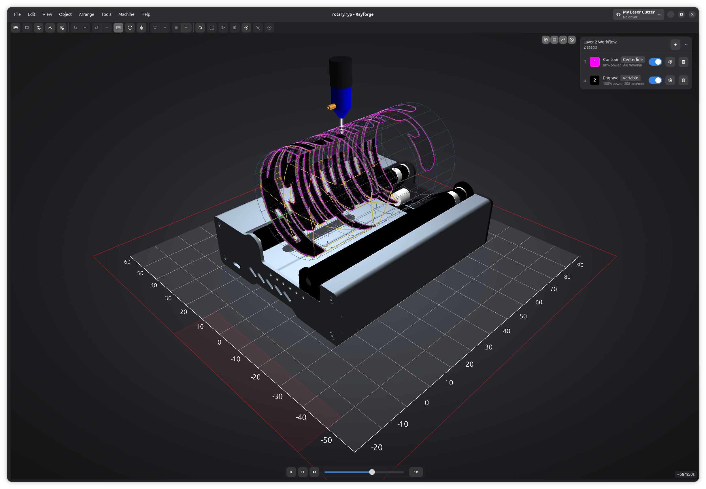

# Rayforge

Rayforge is a modern, cross-platform 2D CAD, G-code sender and control software for GRBL-based laser cutters and engravers.
Built with Gtk4 and Libadwaita, it provides a clean, native interface for Linux, MacOS and Windows, offering a full suite of tools
for both hobbyists and professionals.

You can also check the [official Rayforge homepage](https://rayforge.org).
We also have a [Discord](https://discord.gg/sTHNdTtpQJ).

## Key Features

### Design & Editing

| Feature                      | Description                                                                             |
| :--------------------------- | :-------------------------------------------------------------------------------------- |
| **Parametric Sketch Editor** | Create precise, constraint-based 2D designs with geometric and dimensional constraints. |
| **Comprehensive 2D Canvas**  | Full suite of tools: alignment, transformation, measurement, zoom, pan, and more.       |
| **Multi-Layer Operations**   | Assign different operations (e.g., engrave then cut) to layers in your design.          |
| **Stock Material System**    | Document-level stock with geometry, thickness, and material assignment.                 |
| **Undo/Redo**                | Full undo/redo support across all document operations.                                  |
| **Broad File Support**       | Import from SVG, DXF, PDF, JPEG, PNG, BMP, and Ruida (`.rd`). Export to SVG and DXF.    |
| **Project Files (.ryp)**     | Compressed project format preserving all assets, layers, and configurations.            |

### Operations & Toolpaths

| Feature                      | Description                                                                                          |
| :--------------------------- | :--------------------------------------------------------------------------------------------------- |
| **Versatile Operations**     | Supports Contour, Raster Engraving (with cross-hatch fill), Shrink Wrap, Depth Engraving, and Frame. |
| **2.5D Cutting**             | Multi-pass cuts with configurable step-down for thick materials.                                     |
| **True 4th Axis Support**    | Full rotary axis support - as 4th axis, or axis replacement mode for hobby machines.                 |
| **Animated 3D Simulation**   | Simulate toolpaths in 3D with animated playback, scrubber, and speed control.                        |
| **Holding Tabs**             | Add tabs to contour cuts. Supports manual and automatic placement.                                   |
| **Overscan & Kerf Comp.**    | Improve engraving quality with overscan; ensure dimensional accuracy with kerf compensation.         |
| **Dithering Algorithms**     | Floyd-Steinberg and Bayer ordered dithering for high-quality raster engraving.                       |
| **Post-Processors**          | Lead-in/lead-out, merge overlapping lines, and crop toolpaths to stock boundary.                     |
| **Advanced Path Generation** | Image tracing, travel time optimization, path smoothing, and spot size interpolation.                |

### Machine Control

| Feature                         | Description                                                                                    |
| :------------------------------ | :--------------------------------------------------------------------------------------------- |
| **Multi-Machine Profiles**      | Configure and instantly switch between multiple machine profiles.                              |
| **Device Profiles**             | Declarative device packages with import/export for sharing configurations.                     |
| **Work Coordinate Systems**     | 6 WCS (G54-G59) with per-layer assignment for cutting at different offsets.                    |
| **No-Go Zones**                 | Define restricted areas with collision detection before sending G-code.                        |
| **Machine Hours & Maintenance** | Track operating hours with configurable maintenance counters and notification thresholds.      |
| **GRBL Firmware Settings**      | Read and write firmware parameters (`$$`) directly from the UI.                                |
| **Arc & Bezier Curves**         | Native G2/G3 arc and G5 bezier curve support with automatic linearization.                     |
| **Multi-Laser Operations**      | Choose different lasers for each operation in a job.                                           |
| **G-code Dialects**             | Supports GRBL, Smoothieware, Marlin, LinuxCNC, Mach4, and custom dialects via built-in editor. |
| **G-code Macros & Hooks**       | Run custom G-code snippets before/after jobs. Supports variable substitution.                  |
| **Pre-flight Checks**           | Validates bounds, work area, and no-go zone collisions before sending a job.                   |
| **G-code Console**              | Interactive console with syntax highlighting and search.                                       |

### Materials & Presets

| Feature                  | Description                                                                                     |
| :----------------------- | :---------------------------------------------------------------------------------------------- |
| **Material Library**     | 60+ built-in materials across categories with search and user-created material libraries.       |
| **Recipe/Preset System** | Auto-matching presets by material, thickness, machine, and laser head with specificity scoring. |
| **Material Test Grid**   | Generate power/speed test grids to find optimal laser settings for a given material.            |

### Workflow & Automation

| Feature                     | Description                                                                                   |
| :-------------------------- | :-------------------------------------------------------------------------------------------- |
| **Camera Integration**      | USB camera for workpiece alignment, positioning, background tracing, and fisheye calibration. |
| **AI Workpiece Generation** | Generate SVG workpieces from text prompts using OpenAI-compatible AI providers.               |
| **Print & Cut Alignment**   | Align cuts to printed material using registration marks with a guided wizard.                 |
| **Headless/CLI Mode**       | Worker-only mode without UI for batch processing and automation.                              |
| **Projector Mode**          | Project toolpaths onto your machine bed for alignment.                                        |

### Platform & Extensibility

| Feature            | Description                                                                                              |
| :----------------- | :------------------------------------------------------------------------------------------------------- |
| **Modern UI**      | Polished UI built with Gtk4 and Libadwaita. Supports system, light, and dark themes.                     |
| **Addon System**   | Built-in addon manager for installing and managing community extensions.                                 |
| **Extensible**     | Open development model makes it easy to [add support for new devices](website/docs/developer/driver.md). |
| **Cross-Platform** | Native builds for Linux, Mac and Windows.                                                                |
| **Multi-Language** | Available in English, Portuguese, Spanish, German, French, Ukrainian, and Chinese.                       |
| **Update Checker** | Automatic background check for new versions via the GitHub Releases API.                                 |

### Device Support

| Device Type      | Connection Method       | Notes                                                          |
| :--------------- | :---------------------- | :------------------------------------------------------------- |
| **GRBL**         | Serial Port             | Supported since version 0.13. The most common connection type. |
| **GRBL**         | Telnet                  | Supported since version 0.16.                                  |
| **GRBL**         | Network (WiFi/Ethernet) | Connect to any GRBL device on your network.                    |
| **Smoothieware** | Telnet                  | Supported since version 0.15.                                  |
| **Ruida**        | Network (UDP)           | Connect to Ruida-based controllers via UDP.                    |
| **OctoPrint**    | Network (HTTP API)      | Connect through an OctoPrint server.                           |

## Installation

For installation instructions [refer to our homepage](https://rayforge.org/docs/getting-started/installation).

## Development

For detailed information about developing for Rayforge, including setup instructions,
testing, and contribution guidelines, please see the
[Developer Documentation](https://rayforge.org/docs/latest/developer/getting-started/).

## License

This project is licensed under the **MIT License**. See the `LICENSE` file for details.
