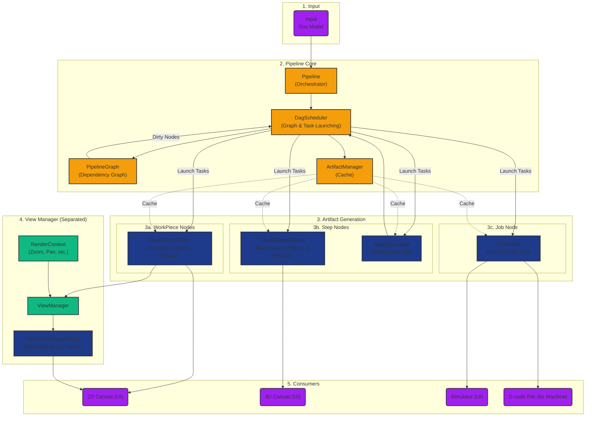

# **Pipeline Architecture**

This document describes the pipeline architecture, which uses a Directed Acyclic
Graph (DAG) to orchestrate artifact generation. The pipeline transforms raw
design data into final outputs for visualization and manufacturing, with
dependency-aware scheduling and efficient artifact caching.

# **Core Concepts**

## **1. Artifact Nodes and the Dependency Graph**

The pipeline uses a **Directed Acyclic Graph (DAG)** to model artifacts and
their dependencies. Each artifact is represented as an `ArtifactNode` in the
graph.

### **ArtifactNode**

Each node contains:

- **ArtifactKey**: A unique identifier consisting of an ID and a group type
  (`workpiece`, `step`, `job`, or `view`)
- **State**: The current lifecycle state of the node
- **Dependencies**: List of nodes this node depends on (children)
- **Dependents**: List of nodes that depend on this node (parents)

### **Node States**

Nodes progress through four states:

| State        | Description                                 |
| ------------ | ------------------------------------------- |
| `DIRTY`      | The artifact needs to be regenerated        |
| `PROCESSING` | A task is currently generating the artifact |
| `VALID`      | The artifact is ready and up-to-date        |
| `ERROR`      | Generation failed                           |

When a node is marked as dirty, all its dependents are also marked dirty,
propagating invalidation up the graph.

### **PipelineGraph**

The `PipelineGraph` is built from the Doc model and contains:

- One node for each `(WorkPiece, Step)` pair
- One node for each Step
- One node for the Job

Dependencies are established:

- Steps depend on their `(WorkPiece, Step)` pair nodes
- Job depends on all Steps

## **2. DagScheduler**

The `DagScheduler` is the central orchestrator of the pipeline. It owns the
`PipelineGraph` and is responsible for:

1. **Building the graph** from the Doc model
2. **Identifying ready nodes** (DIRTY with all VALID dependencies)
3. **Launching tasks** to generate artifacts
4. **Tracking state** through the generation process
5. **Notifying consumers** when artifacts are ready

The scheduler works with generation IDs to track which artifacts belong to
which document version, allowing reuse of valid artifacts across generations.

Key behaviors:

- When the graph is built, the scheduler syncs node states with the
  artifact manager to identify cached artifacts that can be reused
- Artifacts from the previous generation can be reused if they remain valid
- The scheduler tracks which generation IDs have running tasks to preserve
  artifacts during generation transitions
- Invalidations are tracked even before graph rebuild and re-applied after

## **3. ArtifactManager**

The `ArtifactManager` is a pure cache manager for artifact handles. It:

- Stores and retrieves artifact handles
- Manages reference counting for cleanup
- Handles lifecycle (creation, retention, release)
- Does NOT track state (state is managed by the DAG scheduler)

## **4. Pipeline Stages**

The pipeline stages (`WorkPiecePipelineStage`, `StepPipelineStage`,
`JobPipelineStage`) now serve as interfaces rather than task launchers:

- They handle invalidation requests from the UI
- They delegate task launching to the DagScheduler
- They provide access to cached artifacts
- They forward signals from the scheduler to the UI

## **5. InvalidationScope**

The `InvalidationScope` enum defines the scope of invalidation for downstream
artifacts:

| Scope               | Description                                                                                                                                                    |
| ------------------- | -------------------------------------------------------------------------------------------------------------------------------------------------------------- |
| `FULL_REPRODUCTION` | Invalidates workpieces, which cascades to steps and then to the job. Used for changes that require artifact regeneration (geometry, parameters, size changes). |
| `STEP_ONLY`         | Invalidates steps directly, which cascades to the job. Used for position/rotation-only transform changes where workpiece geometry remains unchanged.           |

# **Detailed Breakdown**

## **1. Input**

The process begins with the **Doc Model**, which contains:

- **WorkPieces:** Individual design elements (SVGs, images) placed on canvas
- **Steps:** Processing instructions (Contour, Raster) with settings

## **2. Pipeline Core**

### **Pipeline (Orchestrator)**

The `Pipeline` class is the high-level conductor that:

- Listens to the Doc model for changes
- Coordinates with the DagScheduler to trigger regeneration
- Manages the overall processing state
- Connects signals between components

### **DagScheduler**

The `DagScheduler`:

- Builds and maintains the `PipelineGraph`
- Identifies nodes ready for processing
- Launches tasks via the TaskManager
- Tracks node state transitions
- Emits signals when artifacts are ready

### **ArtifactManager**

The `ArtifactManager`:

- Caches artifact handles in shared memory
- Manages reference counting for cleanup
- Provides lookup by ArtifactKey and generation ID

## **3. Artifact Generation**

### **WorkPieceArtifacts**

Generated for each `(WorkPiece, Step)` combination, containing:

- Toolpaths (`Ops`) in local coordinate system
- Vertex data for lines
- Texture data for raster fills

Processing sequence:

1. **Modifiers:** (Optional) Image conditioning (grayscale, etc.)
2. **Producer:** Creates raw toolpaths (`Ops`)
3. **Transformers:** Per-workpiece modifications (Tabs, Smooth)
4. **Vertex Encoder:** Creates GPU-friendly data

### **StepArtifacts**

Generated for each Step, consuming all related WorkPieceArtifacts:

**StepRenderArtifact:**

- Combined vertex and texture data for all workpieces
- Transformed to world-space coordinates
- Optimized for 3D canvas rendering

**StepOpsArtifact:**

- Combined Ops for all workpieces
- Transformed to world-space coordinates
- Includes per-step transformers (Optimize, Multi-Pass)

### **JobArtifact**

Generated on demand when G-code is needed, consuming all StepOpsArtifacts:

- Final G-code for the entire job
- Complete vertex data for simulation
- High-fidelity time estimate

## **4. ViewManager (Separated)**

The `ViewManager` is **decoupled** from the data pipeline. It handles rendering
for the 2D canvas based on UI state:

### **RenderContext**

Contains the current view parameters:

- Pixels per millimeter (zoom level)
- Viewport offset (pan)
- Display options (show travel moves, etc.)

### **WorkPieceViewArtifacts**

The ViewManager creates `WorkPieceViewArtifacts` that:

- Rasterize WorkPieceArtifacts to screen space
- Apply the current RenderContext
- Are cached and updated when context or source changes

### **Lifecycle**

1. ViewManager tracks source `WorkPieceArtifact` handles
2. When render context changes, ViewManager triggers re-rendering
3. When source artifact changes, ViewManager triggers re-rendering
4. Throttling prevents excessive updates during continuous changes

The ViewManager indexes views by `(workpiece_uid, step_uid)` to support
visualizing intermediate states of a workpiece across multiple steps.

## **5. Consumers**

| Consumer  | Uses                   | Purpose                             |
| --------- | ---------------------- | ----------------------------------- |
| 2D Canvas | WorkPieceViewArtifacts | Renders workpieces in screen space  |
| 3D Canvas | StepRenderArtifacts    | Renders full step in world space    |
| Simulator | JobArtifact            | Accurate simulation of machine path |
| Machine   | JobArtifact G-code     | Manufacturing output                |

# **Key Differences from Previous Architecture**

1. **DAG-based Scheduling:** Instead of sequential stages, artifacts are
   generated as their dependencies become available.

2. **State Management:** Node state is tracked in the DAG graph, not in
   individual components.

3. **ViewManager Separation:** Rendering for the 2D canvas is now handled
   by a separate ViewManager, not as part of the data pipeline.

4. **Generation IDs:** Artifacts are tracked with generation IDs, allowing
   efficient reuse across document versions.

5. **Centralized Orchestration:** The DagScheduler is the single point of
   control for task launching and state tracking.

6. **Pure Cache Manager:** The ArtifactManager is now a simple cache,
   delegating all state management to the DAG scheduler.

7. **Invalidation Tracking:** Keys marked dirty before graph rebuild are
   preserved and re-applied after rebuild.

8. **Pending Work Detection:** Only `PROCESSING` nodes count as pending work;
   `DIRTY` nodes may have unsatisfied dependencies (e.g., no view context).
