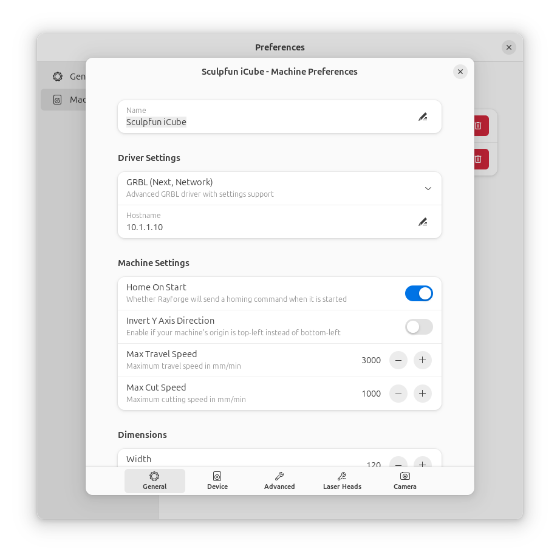
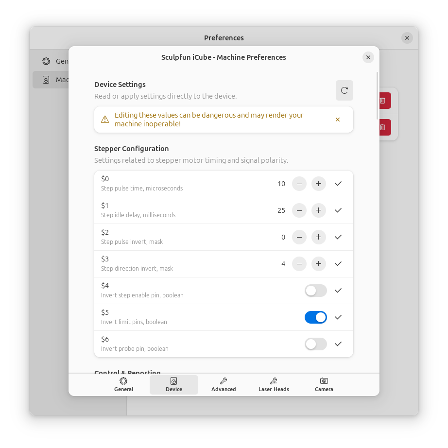
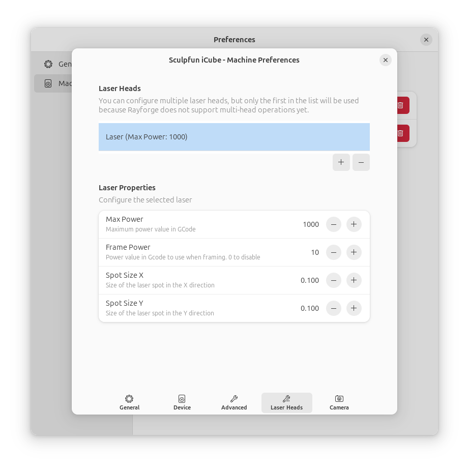
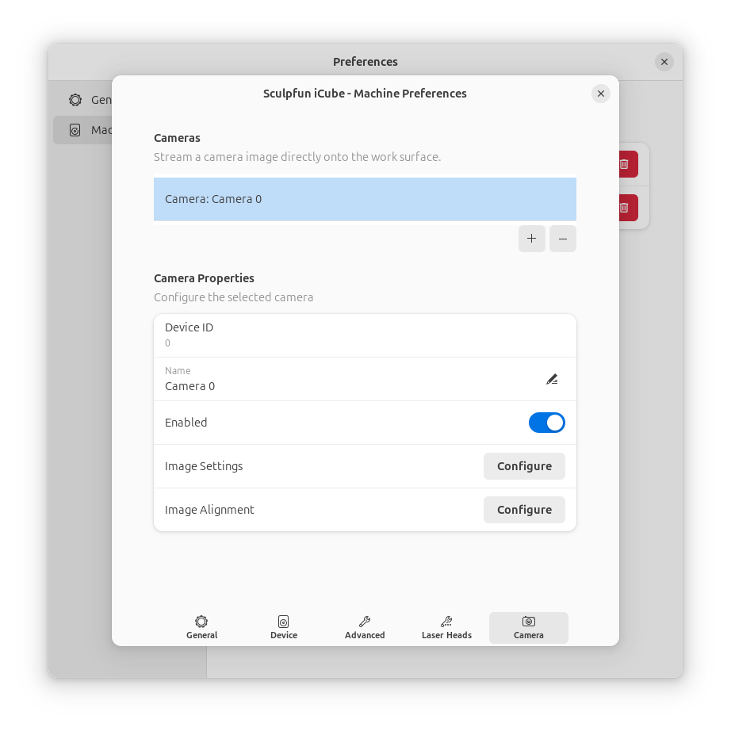

# First Time Setup

After installing Rayforge, you'll need to configure your laser cutter or engraver. This guide will walk you through creating your first machine profile and establishing a connection.

## Step 1: Launch Rayforge

Start Rayforge from your application menu or by running `rayforge` in a terminal. You should see the main interface with an empty canvas.

## Step 2: Open Machine Settings

Navigate to **Settings → Machine Settings** or press ++ctrl+comma++ to open the machine configuration dialog.



## Step 3: Create a Machine Profile

Rayforge supports multiple machine profiles, allowing you to switch between different laser cutters quickly.

### General Settings


1. **Machine Name**: Give your machine a descriptive name (e.g., "K40 Laser", "Ortur LM2")
2. **Driver Settings**: Select and configure the machine driver (GRBL, Smoothieware, etc.)
3. **Speeds & Acceleration**:
   - **Max Travel Speed**: Maximum rapid movement speed
   - **Max Cut Speed**: Maximum cutting speed
   - **Acceleration**: Used for time estimations

### Hardware Settings


4. **Dimensions**:
   - **Width**: Enter the maximum width of your working area in millimeters
   - **Height**: Enter the maximum height of your working area in millimeters
5. **Axes**:
   - **Coordinate Origin (0,0)**: Select where your machine's origin is located:
      - Bottom Left (most common for GRBL)
      - Top Left
      - Top Right
      - Bottom Right

### Laser Configuration

6. **Laser Heads**: Configure your laser module properties:
   - **Tool number**: Tool number for the laser head
   - **Maximum power**: Maximum laser power percentage
   - **Spot size**: Laser spot size (X and Y dimensions)

!!! tip "Power Calibration"
    Start with conservative power settings. You can always increase power later after testing.

## Step 4: Configure Device Connection

Switch to the **Device** tab to configure how Rayforge connects to your machine.



### Connection Types

=== "Serial Port (USB)"

    The most common connection type for GRBL devices.

    1. **Connection Type**: Select "Serial Port"
    2. **Port**: Choose your device from the dropdown (e.g., `/dev/ttyUSB0` on Linux, `COM3` on Windows)
    3. **Baud Rate**: Select `115200` (standard for most GRBL devices)
    4. **Flow Control**: Leave as "None" unless your device requires it

    !!! info
        If your device doesn't appear in the list, check that it's connected and that you have the necessary permissions. On Linux, you may need to add your user to the `dialout` group.

=== "Network (WiFi/Ethernet)"

    For GRBL devices with network connectivity.

    1. **Connection Type**: Select "Network"
    2. **Host**: Enter the IP address of your device (e.g., `192.168.1.100`)
    3. **Port**: Enter the port number (typically `23` or `8080`)

=== "Telnet (Smoothieware)"

    For Smoothieware-based devices.

    1. **Connection Type**: Select "Telnet"
    2. **Host**: Enter the IP address of your Smoothieware device
    3. **Port**: Enter the Telnet port (typically `23`)

### Firmware Settings

1. **Firmware Type**: Select your device's firmware:
   - **GRBL** (most common)
   - **Smoothieware**
   - **GRBL-compatible**

## Step 5: Test Connection

1. Click the **Connect** button in the device settings or use the connect button in the main toolbar
2. You should see a "Connected" status indicator
3. Try sending a simple command:
   - Go to **Machine → Home** (or press ++ctrl+h++)
   - Your machine should perform a homing cycle


!!! success "Connected!"
    If your machine responds correctly, you're ready to start using Rayforge!

## Step 6: Save Your Profile

1. Click **Save** or **OK** to save your machine profile
2. Your settings will be remembered for future sessions

## Optional: Advanced Configuration

### Multiple Lasers

If your machine has multiple laser modules (e.g., diode and CO2), you can configure them in the **Lasers** tab.



See [Multiple Lasers](../machine/multi-laser.md) for details.

### Camera Setup

If you have a USB camera for alignment and positioning, configure it in the **Camera** tab.



See [Camera Integration](../features/camera.md) for details.

---

## Troubleshooting Connection Issues

### Device Not Found

- **Linux (Serial)**: Add your user to the `dialout` group:
  ```bash
  sudo usermod -a -G dialout $USER
  ```
  Log out and back in for changes to take effect.

- **Snap Package**: Ensure you've granted serial port permissions:
  ```bash
  sudo snap connect rayforge:serial-port
  ```

- **Windows**: Check Device Manager to confirm the device is recognized and note the COM port number.

### Connection Refused

- Verify the IP address and port number are correct
- Ensure your machine is powered on and connected to the network
- Check firewall settings if using network connection

### Machine Not Responding

- Try a different baud rate (some devices use `9600` or `57600`)
- Check for loose cables or poor connections
- Power cycle your laser cutter and try again

For more help, see [Connection Issues](../troubleshooting/connection.md).

---

**Next:** [Quick Start Guide →](quick-start.md)
