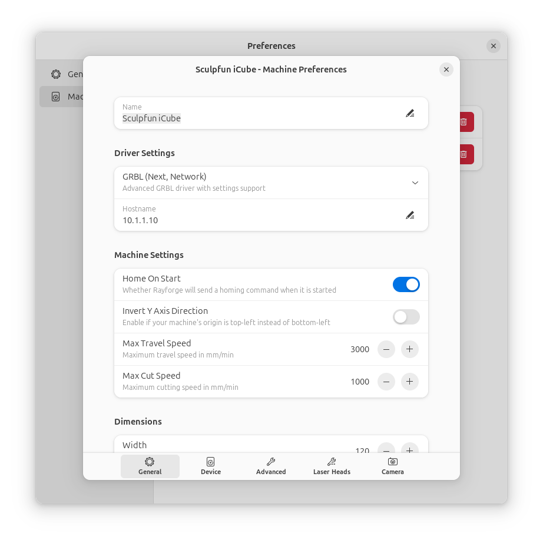
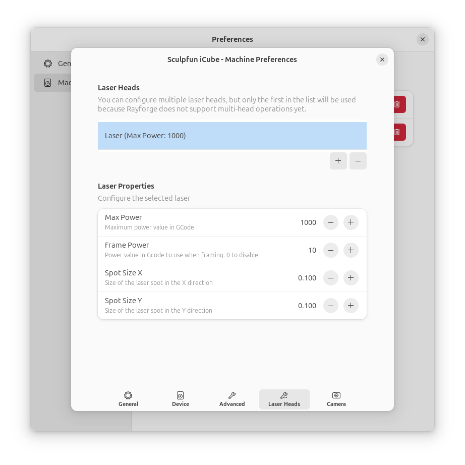

# Settings & Preferences

Customize Rayforge to match your workflow and preferences.

## Accessing Settings

- **Menu**: Edit → Preferences
- **Keyboard**: ++ctrl+comma++

## General Settings

### Appearance

- **Theme**: Choose between System, Light, or Dark theme

### Units

Configure display units for various values throughout the application:

- **Length**: Millimeters, inches, and other length units
- **Speed**: mm/min, mm/sec, inches/min, and other speed units
- **Acceleration**: mm/s² and other acceleration units

### Startup

Configure what happens when you start the application. Files specified on
the command line will always override these settings.

- **Startup behavior**:
  - Open nothing
  - Open last project
  - Open specific project
- **Project path**: Path to the specific project to open on startup
  (only visible when "Open specific project" is selected)

## Machines

Manage your machine configurations. See [Machine Setup](../machine/index.md)
for detailed information on machine configuration.

- **Configured Machines**: Add, edit, or remove machines from your list
- **Active Machine**: The machine currently selected for use
- **Machine Status**: Visual indicators show if a machine has an invalid
  configuration

### Machine Settings Dialog

Each machine has its own detailed settings dialog with the following pages:

#### General

- **Machine Name**: Display name for the machine
- **Driver Settings**: Select and configure the machine driver
- **Speeds & Acceleration**:
  - Max Travel Speed: Maximum rapid movement speed
  - Max Cut Speed: Maximum cutting speed
  - Acceleration: Used for time estimations and calculating the default
    overscan distance

#### Hardware

- **Dimensions**:
  - Width: Width of the machine work area in mm
  - Height: Height of the machine work area in mm
- **Axes**:
  - Coordinate Origin (0,0): The physical corner where coordinates are
    zero after homing (Bottom Left, Top Left, Top Right, Bottom Right)
  - Reverse X-Axis Direction: Makes coordinate values negative
  - Reverse Y-Axis Direction: Makes coordinate values negative
  - Reverse Z-Axis Direction: Enable if a positive Z command (e.g., G0 Z10)
    moves the head down
  - X Offset: Offset to add to each gcode command on X axis
  - Y Offset: Offset to add to each gcode command on Y axis

#### Advanced

- **Path Processing**:
  - Support Arcs: Generate arc commands for smoother paths. Disable if your
    machine does not support arcs
  - Arc Tolerance: Maximum deviation from original path when fitting arcs
    (in mm). Lower values drastically increase processing time and job size
- **Homing and Startup**:
  - Home On Start: Send a homing command when the application starts
  - Allow Single Axis Homing: Enable individual axis homing controls in the
    jog dialog
  - Clear Alarm On Connect: Automatically send an unlock command if
    connected in an ALARM state

#### G-code

- **Precision**:
  - G-code Precision: Number of decimal places for coordinates
- **Dialect**:
  - Select, create and manage G-code dialect definitions

#### Hooks & Macros

- **Hooks**: Configure custom hooks for machine events
- **Macros**: Create and manage reusable G-code snippets

#### Device

Read or apply settings directly to the connected device.

- **Read from Device**: Fetch current settings from the machine
- **Device Settings**: Edit device-specific configuration parameters

!!! warning "Device Settings"
    Editing these values can be dangerous and may render your machine
    inoperable! The device may restart or temporarily disconnect after a
    setting is changed.

#### Laser

- **Laser Heads**: Manage multiple laser heads with their properties:
  - Tool number
  - Maximum power
  - Spot size (X and Y dimensions)

#### Camera

- **Cameras**: Configure cameras for machine monitoring and alignment

#### Maintenance

Track and manage machine usage:

- **Total Hours**:
  - Total Operating Hours: Cumulative machine operating time
  - Reset Total Hours: Reset the total cumulative operating hours to zero
- **Maintenance Counters**:
  - Track maintenance intervals with resettable counters. Use for laser
    tubes, lubrication, etc.
  - Add Counter: Create a new maintenance counter
  - Reset Counter: Reset accumulated hours to zero
  - Edit Counter: Modify counter settings including notification thresholds
  - Remove Counter: Delete a counter from the list

## Materials

Manage your material libraries and materials.

- **Material Libraries**: Create and manage collections of materials
- **Materials**: View and edit materials in the selected library

See [Material Libraries](../features/material-libraries.md) for comprehensive
coverage of the material system.

## Recipes

Manage your saved recipes for different materials and processes.

- **Recipe Library**: Access and manage your recipe collection
- **Material-Based Matching**: Automatic recipe suggestions based on stock
  material
- **Step-Level Application**: Apply and fine-tune recipes for individual
  operations

See [Recipes](../features/recipes.md) for comprehensive coverage of the
recipe system.

## Packages

Manage installed packages and plugins.

- **Installed Packages**: View all installed packages
- **Install**: Add new packages from the registry
- **Update**: Keep packages up to date
- **Remove**: Uninstall packages that are no longer needed

## Keyboard Shortcuts

Customize keyboard shortcuts for common actions. See
[Keyboard Shortcuts](../reference/shortcuts.md) for the complete list.

- **Reset to Defaults**: Restore all shortcuts to default bindings
- **Import/Export**: Share shortcut configurations

---

**Next**: [Features Overview →](../features/index.md)
