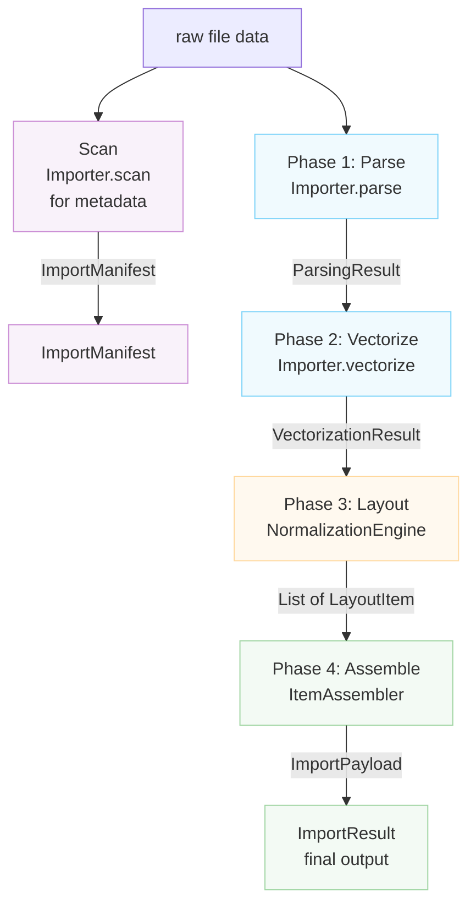

# Importer Architecture

This document describes the architecture of Rayforge's file import system,
which handles converting various file formats (SVG, DXF, PNG, PDF, etc.) into
Rayforge's document model.

## Table of Contents

- [Overview](#overview)
- [Import Pipeline](#import-pipeline)
- [Scan Method](#scan-method)
- [Coordinate Systems](#coordinate-systems)
- [Key Classes](#key-classes)
- [Creating a New Importer](#creating-a-new-importer)

---

## Overview

The import system is built around a four-phase pipeline that transforms raw file
data into fully-positioned document objects. Each phase has a specific
responsibility and produces well-defined data structures.



---

## Import Pipeline

### Phase 1: Parse

**Method:** `Importer.parse()`

Extracts geometric facts from the file including bounds, coordinate system
details, and layer information.

**Output:** `ParsingResult`

- `document_bounds`: Total canvas size in Native Coordinates
- `native_unit_to_mm`: Conversion factor to millimeters
- `is_y_down`: Y-axis orientation flag
- `layers`: List of `LayerGeometry`
- `world_frame_of_reference`: World Coordinates (mm, Y-Up)
- `background_world_transform`: Matrix for background positioning
- `untrimmed_document_bounds`: Reference for Y-inversion

**Coordinate System:**

- `document_bounds`: Native Coordinates (file-specific)
- `world_frame_of_reference`: World Coordinates (mm, Y-Up)

---

### Phase 2: Vectorize

**Method:** `Importer.vectorize()`

Converts parsed data into vector `Geometry` objects according to the
`VectorizationSpec`.

**Output:** `VectorizationResult`

- `geometries_by_layer`: Vector geometry per layer (Native Coordinates)
- `source_parse_result`: Reference to original ParsingResult
- `fills_by_layer`: Optional fill geometry (Sketch importer)

**Coordinate System:** Native Coordinates (file-specific)

---

### Phase 3: Layout

**Class:** `NormalizationEngine`

Calculates transformation matrices to map Native Coordinates to World
Coordinates based on user intent.

**Output:** `List[LayoutItem]`

Each `LayoutItem` contains:

- `world_matrix`: Normalized (0-1, Y-Up) → World (mm, Y-Up)
- `normalization_matrix`: Native → Normalized (0-1, Y-Up)
- `crop_window`: Subset of original file in Native Coordinates
- `layer_id`, `layer_name`: Layer identification

**Coordinate System:**

- Input: Native Coordinates
- Output: World Coordinates (mm, Y-Up) via intermediate Normalized space

---

### Phase 4: Assemble

**Class:** `ItemAssembler`

Instantiates Rayforge domain objects (`WorkPiece`, `Layer`) based on the
layout plan.

**Output:** `ImportPayload`

- `source`: The `SourceAsset`
- `items`: List of `DocItem` ready for insertion
- `sketches`: Optional list of `Sketch` objects

**Coordinate System:** All DocItems in World Coordinates (mm, Y-Up)

---

## Scan Method

**Method:** `Importer.scan()`

A lightweight scan that extracts metadata without full processing. Used for
building the UI for an importer, including layer selection list.
This is NOT part of the main import pipeline executed by `get_doc_items()`.

**Output:** `ImportManifest`

- `layers`: List of `LayerInfo` objects
- `natural_size_mm`: Physical dimensions in millimeters (Y-Up)
- `title`: Optional document title
- `warnings`, `errors`: Non-critical issues discovered

**Coordinate System:** World Coordinates (mm, Y-Up) for `natural_size_mm`

---

## Coordinate Systems

The import pipeline handles multiple coordinate systems through careful
transformation:

### Native Coordinates (Input)

- File-specific coordinate system (SVG user units, DXF units, pixels)
- Y-axis orientation varies by format
- Bounds are absolute within the document's coordinate space
- Units converted to mm via `native_unit_to_mm` factor

### Normalized Coordinates (Intermediate)

- Unit square from (0,0) to (1,1)
- Y-axis points UP (Y-Up convention)
- Used as intermediate representation between native and world

### World Coordinates (Output)

- Physical world coordinates in millimeters (mm)
- Y-axis points UP (Y-Up convention)
- Origin (0,0) is at the bottom-left of the workpiece
- All positions are absolute in the world coordinate system

### Y-Axis Orientation

- **Y-Down formats** (SVG, images): Origin at top-left, Y increases downward
- **Y-Up formats** (DXF): Origin at bottom-left, Y increases upward
- Importers must set `is_y_down` flag correctly in `ParsingResult`
- `NormalizationEngine` handles Y-inversion for Y-Down sources

---

## Key Classes

### Importer (Base Class)

Abstract base class defining the interface for all importers. Subclasses must
implement the pipeline methods and declare their capabilities via the
`features` attribute.

**Features:**

- `BITMAP_TRACING`: Can trace raster images to vectors
- `DIRECT_VECTOR`: Can extract vector geometry directly
- `LAYER_SELECTION`: Supports layer-based imports
- `PROCEDURAL_GENERATION`: Generates content programmatically

### Data Structures

| Class                 | Phase     | Purpose                    |
| --------------------- | --------- | -------------------------- |
| `LayerInfo`           | Scan      | Lightweight layer metadata |
| `ImportManifest`      | Scan      | Scan phase result          |
| `LayerGeometry`       | Parse     | Geometric layer info       |
| `ParsingResult`       | Parse     | Geometric facts            |
| `VectorizationResult` | Vectorize | Vector geometry            |
| `LayoutItem`          | Layout    | Transformation config      |
| `ImportPayload`       | Assemble  | Final output               |
| `ImportResult`        | Final     | Complete result wrapper    |

### Supporting Components

- `NormalizationEngine`: Phase 3 layout calculations
- `ItemAssembler`: Phase 4 object creation

---

## Creating a New Importer

To add support for a new file format:

1. **Create a new importer class** that inherits from `Importer`
2. **Declare supported features** via the `features` class attribute
3. **Implement the required methods**:
   - `scan()`: Extract metadata quickly (for UI previews)
   - `parse()`: Extract geometric facts
   - `vectorize()`: Convert to vector geometry
   - `create_source_asset()`: Create the source asset
4. **Register the importer** in `rayforge/image/__init__.py`
5. **Add MIME type and extension mappings**

**Example:**

```python
from rayforge.image.base_importer import Importer, ImporterFeature
from rayforge.image.structures import (
    ImportManifest,
    ParsingResult,
    VectorizationResult,
)
from rayforge.core.source_asset import SourceAsset

class MyFormatImporter(Importer):
    label = "My Format"
    mime_types = ("application/x-myformat",)
    extensions = (".myf",)
    features = {ImporterFeature.DIRECT_VECTOR}

    def scan(self) -> ImportManifest:
        # Extract metadata without full processing
        return ImportManifest(
            layers=[],
            natural_size_mm=(100.0, 100.0),
        )

    def parse(self) -> Optional[ParsingResult]:
        # Extract geometric facts
        return ParsingResult(
            document_bounds=(0, 0, 100, 100),
            native_unit_to_mm=1.0,
            is_y_down=False,
            layers=[],
            world_frame_of_reference=(0, 0, 100, 100),
            background_world_transform=Matrix.identity(),
        )

    def vectorize(
        self, parse_result: ParsingResult, spec: VectorizationSpec
    ) -> VectorizationResult:
        # Convert to vector geometry
        return VectorizationResult(
            geometries_by_layer={None: Geometry()},
            source_parse_result=parse_result,
        )

    def create_source_asset(
        self, parse_result: ParsingResult
    ) -> SourceAsset:
        # Create the source asset
        return SourceAsset(
            original_data=self.raw_data,
            metadata={},
        )
```
