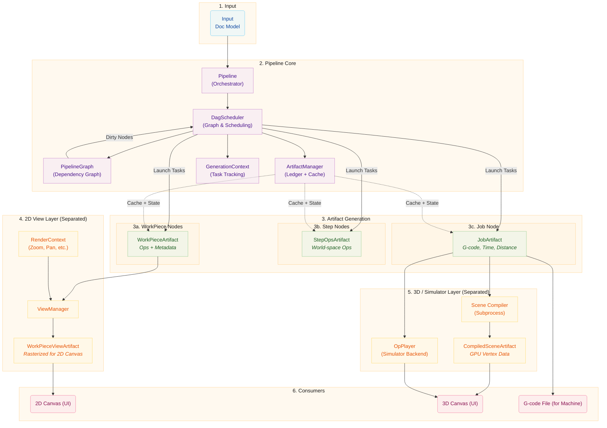

# Pipeline Architecture

This document describes the pipeline architecture, which uses a Directed Acyclic
Graph (DAG) to orchestrate artifact generation. The pipeline transforms raw
design data into final outputs for visualization and manufacturing, with
dependency-aware scheduling and efficient artifact caching.

# Core Concepts

## Artifact Nodes and the Dependency Graph

The pipeline uses a **Directed Acyclic Graph (DAG)** to model artifacts and
their dependencies. Each artifact is represented as an `ArtifactNode` in the
graph.

### ArtifactNode

Each node contains:

- **ArtifactKey**: A unique identifier consisting of an ID and a group type
  (`workpiece`, `step`, `job`, or `view`)
- **Dependencies**: List of nodes this node depends on (children)
- **Dependents**: List of nodes that depend on this node (parents)

Nodes do not store state directly. Instead, they delegate state reads and
writes to the `ArtifactManager`, which maintains a ledger of all artifacts
and their states.

### Node States

Nodes progress through five states:

| State        | Description                                               |
| ------------ | --------------------------------------------------------- |
| `DIRTY`      | The artifact needs to be (re)generated                    |
| `PROCESSING` | A task is currently generating the artifact               |
| `VALID`      | The artifact is ready and up-to-date                      |
| `ERROR`      | Generation failed                                         |
| `CANCELLED`  | Generation was cancelled; will be retried if still needed |

When a node is marked as dirty, all its dependents are also marked dirty,
propagating invalidation up the graph.

### PipelineGraph

The `PipelineGraph` is built from the Doc model and contains:

- One node for each `(WorkPiece, Step)` pair
- One node for each Step
- One node for the Job

Dependencies are established:

- Steps depend on their `(WorkPiece, Step)` pair nodes
- Job depends on all Steps

## DagScheduler

The `DagScheduler` is the central orchestrator of the pipeline. It owns the
`PipelineGraph` and is responsible for:

1. **Building the graph** from the Doc model
2. **Identifying ready nodes** (DIRTY with all VALID dependencies)
3. **Triggering task launches** via the appropriate pipeline stages
4. **Tracking state** through the generation process
5. **Notifying consumers** when artifacts are ready

The scheduler works with generation IDs to track which artifacts belong to
which document version, allowing reuse of valid artifacts across generations.

Key behaviors:

- When the graph is built, the scheduler syncs node states with the
  artifact manager to identify cached artifacts that can be reused
- Artifacts from the previous generation can be reused if they remain valid
- Invalidations are tracked even before graph rebuild and re-applied after
- The scheduler delegates actual task creation to stages but controls
  **when** tasks are launched based on dependency readiness

## ArtifactManager

The `ArtifactManager` serves as both a cache and the single source of truth
for artifact state. It:

- Stores and retrieves artifact handles via a **ledger** (keyed by
  `ArtifactKey` + generation ID)
- Tracks state (`DIRTY`, `VALID`, `ERROR`, etc.) in ledger entries
- Manages reference counting for shared memory cleanup
- Handles lifecycle (creation, retention, release, pruning)
- Provides context managers for safe artifact adoption, completion,
  failure, and cancellation reporting

## GenerationContext

Each reconciliation cycle creates a `GenerationContext` that tracks all
active tasks for that generation. It ensures that shared memory resources
remain valid until all in-flight tasks for a generation have completed,
even if a newer generation has already started. When a context is
superseded and all its tasks finish, it automatically releases its
resources.

## Shared Memory Lifecycle

Artifacts are stored in shared memory (`multiprocessing.shared_memory`) for
efficient inter-process communication between worker processes and the main
process. The `ArtifactStore` manages the lifecycle of these memory blocks.

### Ownership Patterns

**Local Ownership:** The creating process owns the handle and releases it
when done. This is the simplest pattern.

**Inter-Process Handoff:** A worker creates an artifact, sends it to the
main process via IPC, and transfers ownership. The worker "forgets" the
handle (closes its file descriptor without unlinking the memory), while
the main process "adopts" it and becomes responsible for eventual release.

### Stale Artifact Detection

The `StaleGenerationError` mechanism prevents artifacts from superseded
generations from being adopted. When a newer generation has started, the
manager detects stale artifacts during adoption and silently discards them.

## Pipeline Stages

The pipeline stages (`WorkPiecePipelineStage`, `StepPipelineStage`,
`JobPipelineStage`) are responsible for the **mechanics** of task execution:

- They create and register subprocess tasks via the `TaskManager`
- They handle task events (progressive chunks, intermediate results)
- They manage artifact adoption and caching upon task completion
- They emit signals to notify the pipeline of state changes

The **DagScheduler** decides **when** to trigger each stage, but the
stages handle the actual subprocess spawning, event handling, and
result adoption.

## Invalidation Strategy

Invalidation is triggered by changes to the Doc model, with different
strategies depending on what changed:

| Change Type         | Behavior                                                                                    |
| ------------------- | ------------------------------------------------------------------------------------------- |
| Geometry/parameters | Workpiece-step pairs invalidated, cascading to steps and job                                |
| Position/rotation   | Steps invalidated directly (cascading to job); workpieces skipped unless position-sensitive |
| Size change         | Same as geometry: full cascade from workpiece-step pairs upward                             |
| Machine config      | All artifacts force-invalidated across all generations                                      |

Position-sensitive steps (e.g., those with crop-to-stock enabled) trigger
workpiece invalidation even for pure position changes.

# Detailed Breakdown

## Input

The process begins with the **Doc Model**, which contains:

- **WorkPieces:** Individual design elements (SVGs, images) placed on canvas
- **Steps:** Processing instructions (Contour, Raster, etc.) with settings
- **Layers:** Grouping of workpieces, each with its own workflow

## Pipeline Core

### Pipeline (Orchestrator)

The `Pipeline` class is the high-level conductor that:

- Listens to the Doc model for changes via signals
- **Debounces** changes (200ms reconciliation delay, 50ms removal delay)
- Coordinates with the DagScheduler to trigger regeneration
- Manages the overall processing state and busy detection
- Supports **pause/resume** for batch operations
- Supports **manual mode** (`auto_pipeline=False`) where recalculation
  is triggered explicitly rather than automatically
- Connects signals between components and relays them to consumers

### DagScheduler

The `DagScheduler`:

- Builds and maintains the `PipelineGraph`
- Identifies nodes ready for processing
- Triggers task launches via stage `launch_task()` methods
- Tracks node state transitions through the ledger
- Emits signals when artifacts are ready

### ArtifactManager

The `ArtifactManager`:

- Maintains a **ledger** of `LedgerEntry` objects, each tracking a handle,
  generation ID, and node state
- Caches artifact handles in shared memory
- Manages reference counting for cleanup
- Provides lookup by ArtifactKey and generation ID
- Prunes obsolete generations to keep the ledger clean

### GenerationContext

Each reconciliation creates a new `GenerationContext` that:

- Tracks active tasks via reference-counted keys
- Owns shared memory resources for its generation
- Auto-shuts down when superseded and all tasks complete

## Artifact Generation

### WorkPieceArtifacts

Generated for each `(WorkPiece, Step)` combination. Contains:

- Toolpaths (`Ops`) in the workpiece's local coordinate system
- Scalability flag and source dimensions for resolution-independent ops
- Coordinate system and generation metadata

Processing sequence:

1. **Producer:** Creates raw toolpaths (`Ops`) from the workpiece data
2. **Transformers:** Per-workpiece modifications applied in ordered phases
   (Geometry Refinement → Path Interruption → Post Processing)

Large raster workpieces are processed incrementally in chunks, enabling
progressive visual feedback during generation.

### StepOpsArtifacts

Generated for each Step, consuming all related WorkPieceArtifacts:

- Combined Ops for all workpieces in world-space coordinates
- Per-step transformers applied (Optimize, Multi-Pass, etc.)

### JobArtifact

Generated on demand when G-code is needed, consuming all StepOpsArtifacts:

- Final machine code (G-code or driver-specific format)
- Complete ops for simulation and playback
- High-fidelity time estimate and total distance
- Rotary-mapped ops for 3D preview

## 2D View Layer (Separated)

The `ViewManager` is **decoupled** from the data pipeline. It handles
rendering for the 2D canvas based on UI state:

### RenderContext

Contains the current view parameters:

- Pixels per millimeter (zoom level)
- Viewport offset (pan)
- Display options (show travel moves, etc.)

### WorkPieceViewArtifacts

The ViewManager creates `WorkPieceViewArtifacts` that:

- Rasterize WorkPieceArtifacts to screen space
- Apply the current RenderContext
- Are cached and updated when context or source changes

### Lifecycle

1. ViewManager tracks source `WorkPieceArtifact` handles
2. When render context changes, ViewManager triggers re-rendering
3. When source artifact changes, ViewManager triggers re-rendering
4. Re-rendering is throttled (33ms interval) and concurrency-limited
5. Progressive chunk stitching provides incremental visual updates

The ViewManager indexes views by `(workpiece_uid, step_uid)` to support
visualizing intermediate states of a workpiece across multiple steps.

## 3D / Simulator Layer (Separated)

The 3D visualization and simulation system is **decoupled** from the data
pipeline, following a similar pattern to the ViewManager. It consists of:

- A **Scene Compiler** that runs in a subprocess to convert `JobArtifact`
  ops into GPU-ready vertex data
- An **OpPlayer** that replays the job's ops for real-time machine
  simulation with playback controls

Both consume the `JobArtifact` produced by the pipeline's job stage.

### CompiledSceneArtifact

The Scene Compiler produces a `CompiledSceneArtifact` containing:

- **Vertex layers:** Powered/travel/zero-power vertex buffers with
  per-command offsets for progressive reveal
- **Texture layers:** Rasterized scanline power maps for engraving preview
- **Overlay layers:** Scanline power segments for real-time highlight
- Support for rotary (cylinder-wrapped) geometry

### Compilation Pipeline

1. Canvas3D listens for `job_generation_finished` signals
2. When a new job is ready, it schedules scene compilation in a subprocess
3. The subprocess reads the `JobArtifact` from shared memory and compiles
   ops into GPU vertex data
4. The compiled scene is adopted back into shared memory and uploaded to
   GPU renderers

### OpPlayer (Simulator Backend)

The `OpPlayer` walks through the job's ops command-by-command, maintaining
a `MachineState` that tracks position, laser state, and auxiliary axes.
This drives:

- The 3D canvas playback (progressive reveal of the toolpath)
- Machine head position and laser beam visualization
- Per-command stepping for the playback slider

## Consumers

| Consumer  | Uses                       | Purpose                              |
| --------- | -------------------------- | ------------------------------------ |
| 2D Canvas | WorkPieceViewArtifacts     | Renders workpieces in screen space   |
| 3D Canvas | CompiledSceneArtifact      | Renders full job in 3D with playback |
| Machine   | JobArtifact (machine code) | Manufacturing output                 |

# Key Architectural Decisions

1. **DAG-based Scheduling:** Instead of sequential stages, artifacts are
   generated as their dependencies become available, enabling parallelism.

2. **Ledger-based State:** Node state is tracked in the ArtifactManager's
   ledger entries rather than in the graph nodes themselves, providing a
   single source of truth for both state and handle storage.

3. **View Layer Separation:** Both the 2D canvas (ViewManager) and 3D
   canvas (Scene Compiler) are decoupled from the data pipeline. Each
   runs its own subprocess-based rendering and is driven by pipeline
   signals rather than being part of the DAG.

4. **Generation IDs:** Artifacts are tracked with generation IDs, allowing
   efficient reuse across document versions and stale artifact detection.

5. **Centralized Orchestration:** The DagScheduler is the single point of
   control for task scheduling; stages handle the mechanics of execution.

6. **GenerationContext Isolation:** Each generation has its own context,
   ensuring resources stay alive until all in-flight tasks complete.

7. **Invalidation Tracking:** Keys marked dirty before graph rebuild are
   preserved and re-applied after rebuild.

8. **Debounced Reconciliation:** Changes are batched with configurable
   delays to avoid excessive pipeline cycles during rapid edits.
