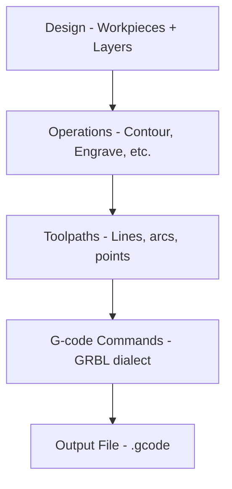

# G-code Basics

Understanding G-code helps you troubleshoot issues and customize Rayforge output.

## High-Level Process

Rayforge converts your designs into G-code through a multi-step process:



**What Rayforge does:**

1. **Analyzes your design** - Extracts geometry from workpieces
2. **Applies operations** - Determines cut/engrave paths
3. **Optimizes toolpaths** - Reorders paths, minimizes travel
4. **Generates commands** - Converts paths to G-code
5. **Injects hooks** - Adds user-defined macros at specified points
6. **Writes file** - Outputs complete G-code ready for machine

## Simple Example

Here's a basic G-code file structure showing a square cut:

```gcode
G21 ;Set units to mm
G90 ;Absolute positioning
G54
T0
G0 X95.049 Y104.951 Z0.000
M4 S500
G1 X104.951 Y104.951 Z0.000 F3000
G1 X104.951 Y95.049 Z0.000 F3000
G1 X95.049 Y95.049 Z0.000 F3000
G1 X95.049 Y104.951 Z0.000 F3000
M5
G0 X95.000 Y105.000 Z0.000
M4 S500
G1 X95.000 Y95.000 Z0.000 F3000
G1 X105.000 Y95.000 Z0.000 F3000
G1 X105.000 Y105.000 Z0.000 F3000
G1 X95.000 Y105.000 Z0.000 F3000
M5
M5 ;Ensure laser is off
G0 X0 Y0 ;Return to origin
```

**Key commands:**

| Command | Description |
| ------- | ----------- |
| `G21` | Millimeters mode |
| `G90` | Absolute positioning |
| `G54` | Select work coordinate system 1 |
| `T0` | Select tool 0 (laser head) |
| `G0` | Rapid move (laser off) |
| `G1` | Cut move (laser on) |
| `M4` | Laser on (dynamic power mode) |
| `M5` | Laser off |
| `S500` | Set laser power to 500 (50% for 0-1000 range) |
| `F3000` | Set feed rate to 3000 mm/min |

---

## Related Pages

- [G-code Dialects](../reference/gcode-dialects) - Firmware differences
- [Exporting G-code](../files/exporting) - Export settings and options
- [Hooks & Macros](../machine/hooks-macros) - Custom G-code injection
