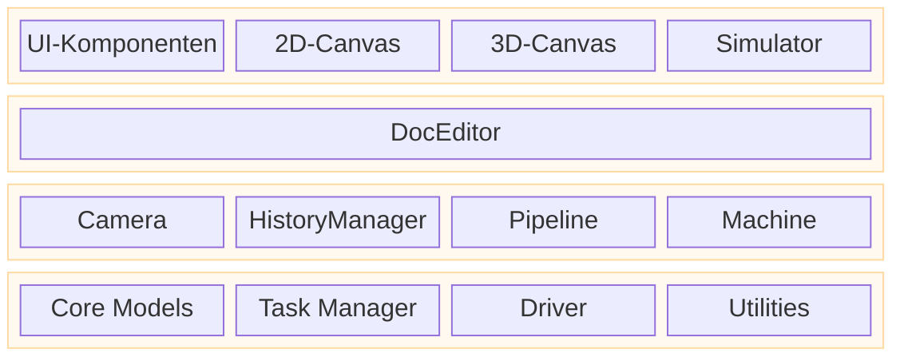

# Rayforge-Architektur

Dieses Dokument bietet einen architektonischen Überblick über Rayforge auf hoher Ebene und erklärt, wie die Hauptkomponenten miteinander zusammenhängen. Für tiefe Einblicke in spezifische Bereiche siehe bitte die verlinkten Dokumente.

## Inhaltsverzeichnis

- [Geschichtete Anwendungsarchitektur](#geschichtete-anwendungsarchitektur)
- [Code-Architektur](#code-architektur)
- [Dokumentenmodell-Architektur](#dokumentenmodell-architektur)
- [Pipeline-Architektur](#pipeline-architektur)

---

## Geschichtete Anwendungsarchitektur

Die Anwendung ist in logischen Schichten strukturiert, die die Benutzeroberfläche, Anwendungslogik und Kerndienste trennen. Dies fördert eine saubere Trennung der Zuständigkeiten und klärt den Kontrollfluss.

- **UI-Schicht (View)**: Enthält alle benutzerseitigen Elemente. Die `Workbench` ist der Haupt-Canvas-Bereich, der die 2D- und 3D-Ansichten hostet.
- **Editor/Controller-Schicht**: Der `DocEditor` fungiert als zentraler Controller, der auf UI-Ereignisse reagiert und die Kernmodelle manipuliert.
- **Core/Services-Schicht**: Stellt grundlegende Dienste und Zustand bereit. `Core Models` repräsentieren das Dokument, `Tasker` verwaltet Hintergrundjobs, `Machine` kümmert sich um Gerätekommunikation, und `Camera` verwaltet Viewports.

---

## Code-Architektur

Rayforge ist eine GTK4/Libadwaita-Anwendung mit einer modularen, pipeline-getriebenen Architektur.

- **`rayforge/core/`**: Dokumentenmodell und Geometrieverarbeitung.
- **`rayforge/pipeline/`**: Die Kern-Verarbeitungspipeline zum Generieren von Maschinenoperationen aus dem Dokumentenmodell.
- **`rayforge/machine/`**: Hardware-Schnittstellenschicht, einschließlich Gerätetreiber, Transportprotokolle und Maschinenmodelle.
- **`rayforge/doceditor/`**: Der Haupt-Dokumenteneditor-Controller und seine UI.
- **`rayforge/workbench/`**: Die 2D/3D-Canvas und Visualisierungssysteme.
- **`rayforge/image/`**: Importer für verschiedene Dateiformate (SVG, DXF usw.).
- **`rayforge/shared/`**: Gemeinsame Dienstprogramme, einschließlich des `tasker` für Hintergrundjob-Verwaltung.

---

## Dokumentenmodell-Architektur

Das Dokumentenmodell ist ein hierarchischer Objektbaum basierend auf dem **Composite Pattern**. Diese Struktur repräsentiert das gesamte Projekt des Benutzers, vom Wurzel-`Doc`-Objekt bis zu einzelnen `WorkPiece`s. Es ist reaktiv und serialisierbar konzipiert.

**[Siehe Dokumentenmodell-Architektur für Details](./docmodel.md)**

---

## Pipeline-Architektur

Die Pipeline konvertiert das Dokumentenmodell in maschinenausführbaren G-Code. Sie läuft asynchron im Hintergrund und verwendet ein Shared-Memory-`Artifact`-System für hochperformante Datenübertragung zwischen Prozessen. Die Pipeline besteht aus Stufen: **Modifizierer → Produzenten → Transformatoren → Encoder**.

**[Siehe Pipeline-Architektur für Details](./pipeline.md)**
