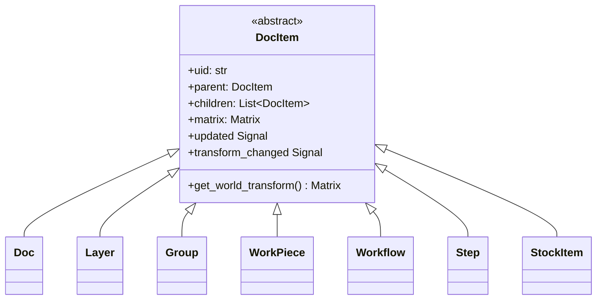
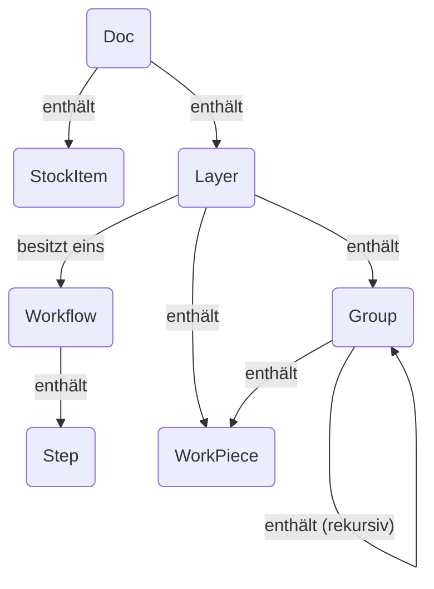

# Dokumentenmodell-Architektur

Das Dokumentenmodell ist das Rückgrat der Anwendung und repräsentiert das
gesamte Benutzerprojekt als hierarchischen Objektbaum. Es ist reaktiv,
serialisierbar und leicht durchquerbar konzipiert.

## Übersicht

Die Architektur basiert auf dem **Composite-Entwurfsmuster**. Eine einzelne
abstrakte Basisklasse, `DocItem`, definiert die gemeinsame Schnittstelle für alle
Objekte, die im Dokumentenbaum existieren können (z.B. Ebenen, Workpieces,
Gruppen). Dies ermöglicht es, komplexe, verschachtelte Strukturen einheitlich zu behandeln.

Wichtige Prinzipien des Modells sind:

- **Baumstruktur:** Das `Doc`-Objekt dient als Wurzel des Baums. Jedes
  Element (außer der Wurzel) hat ein einzelnes `parent` und kann mehrere
  `children` haben.
- **Reaktivität:** Das Modell verwendet ein Signal/Slot-System (`blinker`). Wenn ein
  Element geändert wird, emittiert es ein Signal. Elternelemente hören auf die
  Signale ihrer Kinder und "blubbern sie hoch" durch den Baum. Dies ermöglicht
  High-Level-Komponenten wie der `Pipeline`, auf jede
  Änderung im Dokument zu hören, indem sie sich mit einem einzigen Signal am Wurzel-
  `Doc`-Objekt verbinden. Das System verfolgt sowohl Inhaltsänderungen als auch Transformations-
  änderungen getrennt für effiziente Updates.
- **Transformationshierarchie:** Jedes `DocItem` hat eine lokale Transformation
  `Matrix`. Die finale Position, Skalierung und Rotation eines Elements in der "Welt"
  (dem Haupt-Canvas) ist das Produkt seiner eigenen lokalen Matrix und der
  Weltmatrizen aller seiner Vorfahren.
- **Daten-Entkopplung:** Die visuellen oder Rohdaten für ein `WorkPiece` werden nicht
  direkt darin gespeichert. Stattdessen hält das `WorkPiece` eine UID, die
  ein `ImportSource`-Objekt in einer zentralen Registry auf dem `Doc`
  referenziert. Dies entkoppelt die Dokumentenstruktur vom Datenmanagement,
  was das Modell leichter und flexibler macht.

---

## Klassenvererbung

Dieses Diagramm zeigt die Klassenhierarchie. Jedes Objekt, das Teil des
räumlichen Baums des Dokuments ist, erbt von der abstrakten Basisklasse `DocItem`
und erhält Kernfunktionalitäten wie Parenting, Transformationen und Signal-
Blubbern.

- **`DocItem`**: Die abstrakte Grundlage, die die Composite-Pattern-
  Implementierung bereitstellt.
- Alle anderen Klassen sind konkrete Implementierungen von `DocItem`, jede mit einer
  spezialisierten Rolle in der Dokumentenstruktur.

---

## Objektzusammensetzung

Dieses Diagramm veranschaulicht, wie Instanzen der Klassen zusammengesetzt werden, um ein
vollständiges Dokument zu bilden. Es zeigt die Eltern-Kind-Beziehungen und
Referenzen zwischen Objekten.

- Ein `Doc` ist das Top-Level-Objekt. Es **enthält** eine oder mehrere `Layer` und
  `StockItem`s. Es **verwaltet** auch eine Registry aller `ImportSource`s im
  Projekt.
- Jede `Layer` **enthält** den Inhalt des Benutzers: `WorkPiece`s und `Group`s.
  Entscheidend ist, dass eine `Layer` auch **ein** `Workflow` **besitzt**.
- Ein `Workflow` **enthält** eine geordnete Liste von `Step`s, die den
  Fertigungsprozess für diese Ebene definieren.
- Eine `Group` ist ein Container, der `WorkPiece`s und andere `Group`s halten kann,
  was verschachtelte Transformationen ermöglicht.
- Ein `WorkPiece` ist ein grundlegendes Design-Element. Es speichert seine
  Rohdaten nicht direkt. Stattdessen **referenziert** es eine `ImportSource` über eine
  UID. Es **hat** auch seine eigene `Geometry` (Vektordaten) und kann eine
  Liste von `Tab`s haben.

---

## DocItem-Beschreibungen

- **`DocItem` (Abstrakt)**

  - **Rolle:** Die abstrakte Basis für alle Baumknoten.
  - **Wichtige Eigenschaften:** `uid`, `parent`, `children`, `matrix`, `updated`-
    Signal, `transform_changed`-Signal. Stellt die Kern-Composite-Pattern-Logik bereit.

- **`Doc`**

  - **Rolle:** Die Wurzel des Dokumentenbaums.
  - **Wichtige Eigenschaften:** `children` (Layers, StockItems), `import_sources`
    (ein Wörterbuch, das UIDs `ImportSource`-Objekten zuordnet), `active_layer`.

- **`Layer`**

  - **Rolle:** Die primäre Organisationseinheit für Inhalt. Eine Ebene
    verknüpft eine Gruppe von Workpieces mit einem einzigen Fertigungs-
    workflow.
  - **Wichtige Eigenschaften:** `children` (WorkPieces, Groups, ein Workflow),
    `visible`, `stock_item_uid`.

- **`Group`**

  - **Rolle:** Ein Container für andere `DocItem`s (`WorkPiece`, `Group`).
    Ermöglicht, dass eine Sammlung von Elementen als eine Einheit transformiert wird.

- **`WorkPiece`**

  - **Rolle:** Repräsentiert ein einzelnes, greifbares Design-Element auf der Canvas
    (z.B. ein importiertes SVG).
  - **Wichtige Eigenschaften:** `vectors` (ein `Geometry`-Objekt),
    `import_source_uid`,
    `tabs`, `tabs_enabled`. Seine `vectors` sind auf eine 1x1-Box normalisiert,
    wobei alle Skalierung und Positionierung durch seine Transformations-
    `matrix` gehandhabt wird.

- **`Workflow`**

  - **Rolle:** Eine geordnete Sequenz von Verarbeitungsanweisungen. Besessen von einer
    `Layer`.
  - **Wichtige Eigenschaften:** `children` (eine geordnete Liste von `Step`s).

- **`Step`**

  - **Rolle:** Eine einzelne Verarbeitungsanweisung innerhalb eines `Workflow` (z.B.,
    "Konturschnitt" oder "Rastergravur"). Es ist ein Konfigurationsobjekt,
    das Wörterbücher hält, die den zu verwendenden Produzenten, Modifizierer und
    Transformatoren definieren.

- **`StockItem`**
  - **Rolle:** Repräsentiert ein Stück physisches Material im Dokument,
    definiert durch seine eigene Vektor-`geometry`. `Layer`s können einem
    spezifischen Stock-Item zugewiesen werden.
