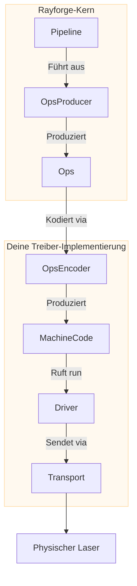

# Treiber-Entwicklungsleitfaden

Dieser Leitfaden bietet einen Überblick auf hoher Ebene, wie man einen Treiber in Rayforge erstellt, um Unterstützung für deinen Laserschneider oder dein Gravurgerät hinzuzufügen. Durch Erstellen eines Treibers integrierst du das einzigartige Kommunikationsprotokoll und die Befehlssprache deiner Maschine in das Rayforge-Ökosystem.

## Treiber-Übersicht

Ein Treiber ist die Brücke zwischen Rayforge's Kernlogik und deiner physischen Hardware.
Er ist für drei Hauptaufgaben verantwortlich:

1.  **Verbindungsverwaltung:** Behandlung des Low-Level-Kommunikationsprotokolls
    (Seriell, WebSocket, HTTP, etc.).
2.  **Auftragsausführung:** Senden von vorkodiertem Maschinencode (z.B. G-Code) an das
    Gerät und Verfolgung des Ausführungsfortschritts.
3.  **Statusberichterstattung:** Emittieren von Signalen, um die UI mit der
    Echtzeitposition, dem Status (`IDLE`, `RUN`) und Protokollnachrichten des Lasers zu aktualisieren.

Um dies zu vereinfachen, bietet Rayforge eine Architektur basierend auf zusammensetzbaren Teilen:



- **`OpsEncoder`:** Übersetzt `Ops` in eine spezifische Befehlssprache
  (z.B. G-Code). Verwendet von sowohl der Pipeline (für Auftragskodierung) als auch dem
  Treiber (für einzelne Befehle wie move_to, home, etc.).
- **`Pipeline`:** Orchestriert Kodierung und produziert finalen Maschinencode.
- **`Transport`:** Verwaltet die Verbindung und Datenübertragung.
- **`Driver`:** Führt Maschinencode aus, behandelt Gerätezustand und kommuniziert
  mit der UI.

Alle Treiber-Operationen sind **asynchron**, um sicherzustellen, dass die Benutzeroberfläche reaktionsfähig bleibt.

## Die `Ops`-Sprache

Rayforge beschreibt einen Laserauftrag als Sequenz von High-Level-Operationen, gespeichert in
einem `Ops`-Objekt. Dies ist die universelle Sprache innerhalb von Rayforge zur Beschreibung
von Maschinenbewegungen, unabhängig von spezifischer Hardware.

| `Ops`-Methode        | Signatur                      | Beschreibung                           |
| :------------------- | :---------------------------- | :------------------------------------ |
| `move_to`            | `(x, y, z=0.0)`               | Schnelle Bewegung (kein Schneiden)    |
| `line_to`            | `(x, y, z=0.0)`               | Schneid-/Gravurbewegung               |
| `arc_to`             | `(x, y, i, j, cw=True, z=0.0)`| Schneid-/Gravur-Bogenbewegung         |
| `set_power`          | `(power)`                     | Laserleistung setzen (0-100%)         |
| `set_cut_speed`      | `(speed)`                     | Geschwindigkeit für Schnittbewegungen (mm/min) |
| `set_travel_speed`   | `(speed)`                     | Geschwindigkeit für schnelle Bewegungen (mm/min) |
| `enable_air_assist`  | `()`                          | Luftunterstützung einschalten         |
| `disable_air_assist` | `()`                          | Luftunterstützung ausschalten         |

Dein Treiber empfängt vorkodierten Maschinencode (z.B. einen G-Code-String) und eine
Operations-Map, die verfolgt, welche Maschinencode-Befehle welchen
Operationen entsprechen. Die Pipeline kümmert sich um die Kodierung von `Ops` zu Maschinencode, bevor sie die `run()`-Methode des Treibers aufruft.

```python
# Beispiel, wie Rayforge ein Ops-Objekt erstellt
ops = Ops()
ops.set_travel_speed(3000)
ops.set_cut_speed(800)
ops.set_power(80)

ops.move_to(10, 10)       # Schnelle Bewegung zum Startpunkt
ops.enable_air_assist()
ops.line_to(50, 10)       # Eine Linie mit Luftunterstützung schneiden
ops.disable_air_assist()
ops.line_to(50, 50)       # Eine Linie ohne Luftunterstützung schneiden
```

## Treiber-Implementierung

Alle Treiber MÜSSEN von `rayforge.machine.drivers.Driver` erben.

```python
from rayforge.machine.driver.driver import Driver

class YourDriver(Driver):
    label = "Ihr Gerät"  # Anzeigename in der UI
    subtitle = "Beschreibung für Benutzer"
    supports_settings = False # Auf True setzen, wenn der Treiber Firmware-Einstellungen lesen/schreiben kann
```

### Erforderliche Eigenschaften

- `label`: Ein menschenlesbarer Name, der in der UI angezeigt wird.
- `subtitle`: Eine kurze Beschreibung, die unter dem Namen angezeigt wird.
- `supports_settings`: Ein Boolean, der angibt, ob der Treiber Geräte- 
  einstellungen (wie GRBL's `$$`) lesen/schreiben kann.

### Erforderliche Methoden

Deine Treiberklasse **MUSS** die folgenden Methoden implementieren. Beachte, dass die meisten **asynchron** sind und mit `async def` definiert werden müssen.

#### Konfiguration und Lebenszyklus

- `get_setup_vars() -> VarSet`: **(Klassenmethode)** Gibt ein `VarSet`-Objekt
  zurück, das die für die Verbindung benötigten Parameter definiert (z.B. IP-Adresse, serieller Port).
  Rayforge verwendet dies, um automatisch das Einrichtungsformular in der UI zu generieren.
- `precheck(**kwargs)`: **(Klassenmethode)** Ein nicht-blockierender, statischer Check der
  Konfiguration, der vor Treiber-Instanziierung ausgeführt werden kann. Sollte bei Fehlschlag
  `DriverPrecheckError` werfen.
- `setup(**kwargs)`: Wird einmal mit den Werten aus dem Einrichtungsformular aufgerufen. Verwende dies
  um deine Transports und internen Zustände zu initialisieren.
- `async def connect()`: Stellt eine persistente Verbindung zum
  Gerät her und hält sie aufrecht. Diese Methode sollte Auto-Wiederverbindungs-Logik enthalten.
- `async def cleanup()`: Wird beim Trennen aufgerufen. Sollte alle
  Verbindungen schließen und Ressourcen freigeben.

#### Gerätesteuerung

- `async def run(machine_code: Any, op_map: MachineCodeOpMap, doc: Doc,
  on_command_done: Optional[Callable[[int], Union[None, Awaitable[None]]]]
  = None)`: Die Kernmethode zur Ausführung eines Auftrags. Empfängt vorkodierten Maschinen-
  code (z.B. G-Code-String) und ein Mapping zwischen Operationsindizes und
  Maschinencode. Der `on_command_done`-Callback wird mit dem op_index
  aufgerufen, wenn jeder Befehl abgeschlossen ist.
- `async def home(axes: Optional[Axis] = None)`: Referenziert die Maschine. Kann spezifische
  Achsen oder alle Achsen referenzieren.
- `async def move_to(pos_x: float, pos_y: float)`: Bewegt den Laserkopf
  manuell zu einer spezifischen XY-Koordinate.
- `async def set_hold(hold: bool = True)`: Pausiert oder setzt den aktuellen Job fort.
- `async def cancel()`: Stoppt den aktuellen Job.
- `async def jog(axis: Axis, distance: float, speed: int)`: Joggt die Maschine
  entlang einer spezifischen Achse.
- `async def select_tool(tool_number: int)`: Wählt ein neues Werkzeug/Laserkopf nach
  seiner Nummer aus.
- `async def clear_alarm()`: Löscht jeden aktiven Alarmzustand.

#### Firmware-Einstellungen (wenn `supports_settings` `True` ist)

- `get_setting_vars() -> List[VarSet]`: Gibt `VarSet`-Objekte zurück, die
  die Struktur der Geräteeinstellungsseite definieren.
- `async def read_settings()`: Liest alle Einstellungen vom Gerät und ruft
  `_on_settings_read()` mit dem Ergebnis auf.
- `async def write_setting(key: str, value: Any)`: Schreibt eine einzelne Einstellung auf das
  Gerät.

### Signale emittieren

Um mit der UI zu kommunizieren, muss dein Treiber Signale emittieren. Um ordnungsgemäße
Protokollierung und Thread-Sicherheit zu gewährleisten, **darfst du Signale nicht direkt emittieren.** Stattdessen
rufst du die geschützten Hilfsmethoden aus der Basis-`Driver`-Klasse auf.

- `self._log(message)`: Sendet eine Protokollnachricht an die Konsole.
- `self._on_state_changed()`: Rufe dies auf, wann immer du `self.state` aktualisierst, um
  die UI über eine Status- oder Positionsänderung zu benachrichtigen.
- `self._on_connection_status_changed(status, message)`: Informiert die UI über
  den Verbindungsstatus (`CONNECTING`, `CONNECTED`, `ERROR`, etc.).
- `self._on_command_status_changed(status, message)`: Meldet den Status eines
  gesendeten Befehls.
- `self._on_settings_read(settings)`: Sendet die gelesenen Geräteeinstellungen
  zurück an die UI.

## Hast du Fragen?

Der beste Weg zu lernen ist, sich die bestehenden Treiber in
`rayforge/machine/driver/` anzusehen, wie:

- `grbl.py` - GRBL-basierte Maschinen
- `grbl_serial.py` - Serielle GRBL-Kommunikation
- `smoothie.py` - Smoothieboard-basierte Maschinen
- `dummy.py` - Ein Test-Treiber für die Entwicklung

Wenn du steckenbleibst, zögere bitte nicht, ein Issue auf GitHub zu eröffnen! Wir helfen gerne.
