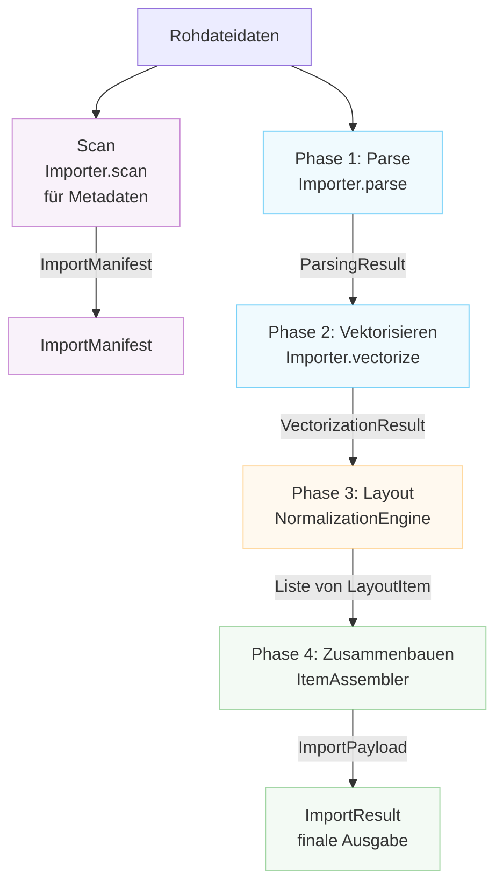

# Importer-Architektur

Dieses Dokument beschreibt die Architektur von Rayforge's Datei-Import-System,
das die Konvertierung verschiedener Dateiformate (SVG, DXF, PNG, PDF, etc.) in
Rayforge's Dokumentenmodell behandelt.

## Inhaltsverzeichnis

- [Übersicht](#übersicht)
- [Import-Pipeline](#import-pipeline)
- [Scan-Methode](#scan-methode)
- [Koordinatensysteme](#koordinatensysteme)
- [Wichtige Klassen](#wichtige-klassen)
- [Erstellen eines neuen Importers](#erstellen-eines-neuen-importers)

---

## Übersicht

Das Import-System ist um eine vierphasige Pipeline herum aufgebaut, die Rohdatei-
daten in vollständig positionierte Dokumentenobjekte transformiert. Jede Phase hat eine spezifische
Verantwortung und produziert wohldefinierte Datenstrukturen.



---

## Import-Pipeline

### Phase 1: Parse

**Methode:** `Importer.parse()`

Extrahiert geometrische Fakten aus der Datei, einschließlich Begrenzungen, Koordinatensystem-
details und Ebeneninformationen.

**Ausgabe:** `ParsingResult`

- `document_bounds`: Gesamte Canvas-Größe in nativen Koordinaten
- `native_unit_to_mm`: Umrechnungsfaktor zu Millimetern
- `is_y_down`: Y-Achsen-Orientierungsflag
- `layers`: Liste von `LayerGeometry`
- `world_frame_of_reference`: Weltkoordinaten (mm, Y-hoch)
- `background_world_transform`: Matrix für Hintergrund-Positionierung
- `untrimmed_document_bounds`: Referenz für Y-Invertierung

**Koordinatensystem:**

- `document_bounds`: Native Koordinaten (dateispezifisch)
- `world_frame_of_reference`: Weltkoordinaten (mm, Y-hoch)

---

### Phase 2: Vektorisieren

**Methode:** `Importer.vectorize()`

Konvertiert geparste Daten in Vektor-`Geometry`-Objekte gemäß der
`VectorizationSpec`.

**Ausgabe:** `VectorizationResult`

- `geometries_by_layer`: Vektorgeometrie pro Ebene (native Koordinaten)
- `source_parse_result`: Referenz zum ursprünglichen ParsingResult
- `fills_by_layer`: Optionale Füllgeometrie (Sketch-Importer)

**Koordinatensystem:** Native Koordinaten (dateispezifisch)

---

### Phase 3: Layout

**Klasse:** `NormalizationEngine`

Berechnet Transformationsmatrizen, um native Koordinaten auf Welt-
koordinaten basierend auf Benutzerabsicht abzubilden.

**Ausgabe:** `List[LayoutItem]`

Jedes `LayoutItem` enthält:

- `world_matrix`: Normalisiert (0-1, Y-hoch) → Welt (mm, Y-hoch)
- `normalization_matrix`: Nativ → Normalisiert (0-1, Y-hoch)
- `crop_window`: Teilmenge der Originaldatei in nativen Koordinaten
- `layer_id`, `layer_name`: Ebenen-Identifikation

**Koordinatensystem:**

- Eingabe: Native Koordinaten
- Ausgabe: Weltkoordinaten (mm, Y-hoch) über Zwischenraum normalisiert

---

### Phase 4: Zusammenbauen

**Klasse:** `ItemAssembler`

Instanziiert Rayforge-Domänenobjekte (`WorkPiece`, `Layer`) basierend auf dem
Layout-Plan.

**Ausgabe:** `ImportPayload`

- `source`: Das `SourceAsset`
- `items`: Liste von `DocItem`, bereit zum Einfügen
- `sketches`: Optionale Liste von `Sketch`-Objekten

**Koordinatensystem:** Alle DocItems in Weltkoordinaten (mm, Y-hoch)

---

## Scan-Methode

**Methode:** `Importer.scan()`

Ein leichtgewichtiger Scan, der Metadaten ohne volle Verarbeitung extrahiert. Verwendet für
den Aufbau der UI für einen Importer, einschließlich Ebenenauswahlliste.
Dies ist NICht Teil der Haupt-Import-Pipeline, die von `get_doc_items()` ausgeführt wird.

**Ausgabe:** `ImportManifest`

- `layers`: Liste von `LayerInfo`-Objekten
- `natural_size_mm`: Physische Abmessungen in Millimetern (Y-hoch)
- `title`: Optionaler Dokumententitel
- `warnings`, `errors`: Entdeckte nicht-kritische Probleme

**Koordinatensystem:** Weltkoordinaten (mm, Y-hoch) für `natural_size_mm`

---

## Koordinatensysteme

Die Import-Pipeline behandelt mehrere Koordinatensysteme durch sorgfältige
Transformation:

### Native Koordinaten (Eingabe)

- Dateispezifisches Koordinatensystem (SVG-Benutzereinheiten, DXF-Einheiten, Pixel)
- Y-Achsen-Orientierung variiert nach Format
- Begrenzungen sind absolut innerhalb des Koordinatenraums des Dokuments
- Einheiten werden via `native_unit_to_mm`-Faktor zu mm konvertiert

### Normalisierte Koordinaten (Zwischenraum)

- Einheitsquadrat von (0,0) bis (1,1)
- Y-Achse zeigt NACH OBEN (Y-hoch-Konvention)
- Verwendet als Zwischenrepräsentation zwischen nativen und Weltkoordinaten

### Weltkoordinaten (Ausgabe)

- Physische Weltkoordinaten in Millimetern (mm)
- Y-Achse zeigt NACH OBEN (Y-hoch-Konvention)
- Ursprung (0,0) ist unten-links vom Werkstück
- Alle Positionen sind absolut im Weltkoordinatensystem

### Y-Achsen-Orientierung

- **Y-runter-Formate** (SVG, Bilder): Ursprung oben-links, Y nimmt nach unten zu
- **Y-hoch-Formate** (DXF): Ursprung unten-links, Y nimmt nach oben zu
- Importer müssen das `is_y_down`-Flag in `ParsingResult` korrekt setzen
- `NormalizationEngine` behandelt Y-Invertierung für Y-runter-Quellen

---

## Wichtige Klassen

### Importer (Basisklasse)

Abstrakte Basisklasse, die die Schnittstelle für alle Importer definiert. Unterklassen müssen
die Pipeline-Methoden implementieren und ihre Fähigkeiten über das
`features`-Attribut deklarieren.

**Features:**

- `BITMAP_TRACING`: Kann Rasterbilder zu Vektoren nachverfolgen
- `DIRECT_VECTOR`: Kann Vektorgeometrie direkt extrahieren
- `LAYER_SELECTION`: Unterstützt ebenenbasierte Importe
- `PROCEDURAL_GENERATION`: Generiert Inhalte programmatisch

### Datenstrukturen

| Klasse                | Phase       | Zweck                      |
| --------------------- | ----------- | -------------------------- |
| `LayerInfo`           | Scan        | Leichtgewichtige Ebenenmetadaten |
| `ImportManifest`      | Scan        | Scan-Phasen-Ergebnis       |
| `LayerGeometry`       | Parse       | Geometrische Ebeneninfo    |
| `ParsingResult`       | Parse       | Geometrische Fakten        |
| `VectorizationResult` | Vektorisieren | Vektorgeometrie          |
| `LayoutItem`          | Layout      | Transformationskonfiguration|
| `ImportPayload`       | Zusammenbauen | Finale Ausgabe           |
| `ImportResult`        | Final       | Vollständiger Ergebnis-Wrapper |

### Unterstützende Komponenten

- `NormalizationEngine`: Phase 3 Layout-Berechnungen
- `ItemAssembler`: Phase 4 Objekterstellung

---

## Erstellen eines neuen Importers

Um Unterstützung für ein neues Dateiformat hinzuzufügen:

1. **Erstelle eine neue Importer-Klasse**, die von `Importer` erbt
2. **Deklariere unterstützte Features** über das `features`-Klassenattribut
3. **Implementiere die erforderlichen Methoden**:
   - `scan()`: Metadaten schnell extrahieren (für UI-Vorschauen)
   - `parse()`: Geometrische Fakten extrahieren
   - `vectorize()`: Zu Vektorgeometrie konvertieren
   - `create_source_asset()`: Das Quell-Asset erstellen
4. **Registriere den Importer** in `rayforge/image/__init__.py`
5. **Füge MIME-Typ und Erweiterungs-Mappings hinzu**

**Beispiel:**

```python
from rayforge.image.base_importer import Importer, ImporterFeature
from rayforge.image.structures import (
    ImportManifest,
    ParsingResult,
    VectorizationResult,
)
from rayforge.core.source_asset import SourceAsset

class MyFormatImporter(Importer):
    label = "Mein Format"
    mime_types = ("application/x-myformat",)
    extensions = (".myf",)
    features = {ImporterFeature.DIRECT_VECTOR}

    def scan(self) -> ImportManifest:
        # Metadaten ohne volle Verarbeitung extrahieren
        return ImportManifest(
            layers=[],
            natural_size_mm=(100.0, 100.0),
        )

    def parse(self) -> Optional[ParsingResult]:
        # Geometrische Fakten extrahieren
        return ParsingResult(
            document_bounds=(0, 0, 100, 100),
            native_unit_to_mm=1.0,
            is_y_down=False,
            layers=[],
            world_frame_of_reference=(0, 0, 100, 100),
            background_world_transform=Matrix.identity(),
        )

    def vectorize(
        self, parse_result: ParsingResult, spec: VectorizationSpec
    ) -> VectorizationResult:
        # Zu Vektorgeometrie konvertieren
        return VectorizationResult(
            geometries_by_layer={None: Geometry()},
            source_parse_result=parse_result,
        )

    def create_source_asset(
        self, parse_result: ParsingResult
    ) -> SourceAsset:
        # Das Quell-Asset erstellen
        return SourceAsset(
            original_data=self.raw_data,
            metadata={},
        )
```
