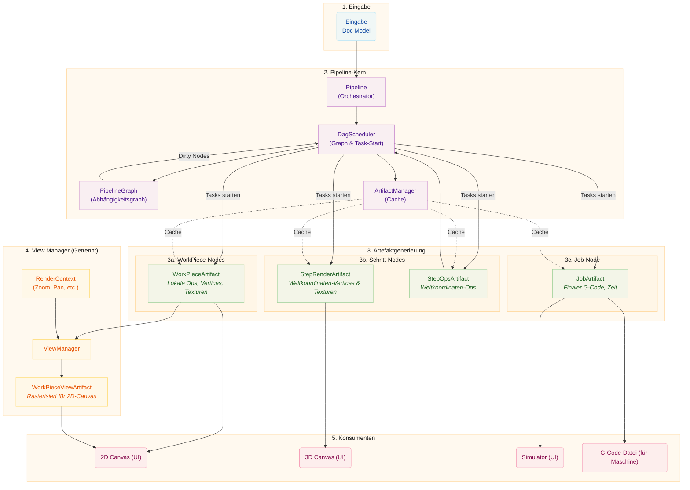

# Pipeline-Architektur

Dieses Dokument beschreibt die Pipeline-Architektur, die einen Gerichteten Azyklischen Graphen (DAG) verwendet, um die Artefaktgenerierung zu orchestrieren. Die Pipeline transformiert Roh-Designdaten in finale Ausgaben für Visualisierung und Fertigung, mit abhängigkeitsbewusster Planung und effizientem Artefakt-Caching.

# Kernkonzepte

## Artefakt-Nodes und der Abhängigkeitsgraph

Die Pipeline verwendet einen **Gerichteten Azyklischen Graphen (DAG)**, um Artefakte und ihre Abhängigkeiten zu modellieren. Jedes Artefakt wird als `ArtifactNode` im Graphen repräsentiert.

### ArtifactNode

Jeder Node enthält:

- **ArtifactKey**: Ein eindeutiger Bezeichner, bestehend aus einer ID und einem Gruppentyp
  (`workpiece`, `step`, `job`, oder `view`)
- **State**: Der aktuelle Lebenszyklus-Zustand des Nodes
- **Dependencies**: Liste von Nodes, von denen dieser Node abhängt (Kinder)
- **Dependents**: Liste von Nodes, die von diesem Node abhängen (Eltern)

### Node-Zustände

Nodes durchlaufen vier Zustände:

| Zustand       | Beschreibung                                  |
| ------------- | --------------------------------------------- |
| `DIRTY`       | Das Artefakt muss neu generiert werden        |
| `PROCESSING`  | Eine Task generiert gerade das Artefakt       |
| `VALID`       | Das Artefakt ist bereit und aktuell           |
| `ERROR`       | Generierung fehlgeschlagen                    |

Wenn ein Node als dirty markiert wird, werden auch alle seine Dependents als dirty markiert,
was die Invalidierung den Graph hinauf propagiert.

### PipelineGraph

Der `PipelineGraph` wird aus dem Doc-Modell erstellt und enthält:

- Einen Node für jedes `(WorkPiece, Step)`-Paar
- Einen Node für jeden Step
- Einen Node für den Job

Abhängigkeiten werden hergestellt:

- Steps hängen von ihren `(WorkPiece, Step)`-Paar-Nodes ab
- Job hängt von allen Steps ab

## DagScheduler

Der `DagScheduler` ist der zentrale Orchestrator der Pipeline. Er besitzt den
`PipelineGraph` und ist verantwortlich für:

1. **Aufbau des Graphen** aus dem Doc-Modell
2. **Identifizierung bereiter Nodes** (DIRTY mit allen VALIDEN Abhängigkeiten)
3. **Starten von Tasks** zur Artefaktgenerierung
4. **Zustandsverfolgung** während des Generierungsprozesses
5. **Benachrichtigung von Konsumenten** wenn Artefakte bereit sind

Der Scheduler arbeitet mit Generierungs-IDs, um zu verfolgen, welche Artefakte zu
welcher Dokumentversion gehören, was die Wiederverwendung gültiger Artefakte über Generationen hinweg ermöglicht.

Wichtige Verhaltensweisen:

- Wenn der Graph aufgebaut wird, synchronisiert der Scheduler Node-Zustände mit dem
  Artefakt-Manager, um zwischengespeicherte Artefakte zu identifizieren, die wiederverwendet werden können
- Artefakte aus der vorherigen Generation können wiederverwendet werden, wenn sie gültig bleiben
- Der Scheduler verfolgt, welche Generierungs-IDs laufende Tasks haben, um
  Artefakte während Generierungsübergängen zu bewahren
- Invalidierungen werden sogar vor Graph-Neuaufbau verfolgt und danach erneut angewendet

## ArtifactManager

Der `ArtifactManager` ist ein reiner Cache-Manager für Artefakt-Handles. Er:

- Speichert und ruft Artefakt-Handles ab
- Verwaltet Referenzzählung für Cleanup
- Behandelt Lebenszyklus (Erstellung, Zurückhaltung, Freigabe)
- Verfolgt KEINEN Zustand (Zustand wird vom DAG-Scheduler verwaltet)

## Shared-Memory-Lebenszyklus

Artefakte werden in Shared Memory (`multiprocessing.shared_memory`) gespeichert für
effiziente Inter-Prozess-Kommunikation zwischen Arbeitsprozessen und dem Hauptprozess. Der `ArtifactStore` verwaltet den Lebenszyklus dieser Speicherblöcke.

### Eigentumsmuster

**Lokales Eigentum:** Der erstellende Prozess besitzt den Handle und gibt ihn frei, wenn er fertig ist. Dies ist das einfachste Muster.

**Inter-Prozess-Übergabe:** Ein Worker erstellt ein Artefakt, sendet es an den
Hauptprozess via IPC und überträgt das Eigentum. Der Worker "vergisst" den
Handle (schließt seinen Dateideskriptor ohne den Speicher zu unlinken), während
der Hauptprozess ihn "adoptiert" und für die eventuelle Freigabe verantwortlich wird.

### Referenzzählung

Der `ArtifactStore` verwaltet Referenzzähler für jeden Shared-Memory-Block.
Mehrere Aufrufer können einen Handle `retain()`, und der Block wird erst unlinkiert,
wenn der Zähler Null erreicht. Dies wird vom `ViewManager` für
progressives Rendering verwendet, bei dem mehrere Callbacks auf dasselbe Artefakt zugreifen können.

## Pipeline-Stufen

Die Pipeline-Stufen (`WorkPiecePipelineStage`, `StepPipelineStage`,
`JobPipelineStage`) dienen jetzt als Schnittstellen statt als Task-Starter:

- Sie behandeln Invalidierungsanfragen von der UI
- Sie delegieren Task-Starten an den DagScheduler
- Sie bieten Zugriff auf zwischengespeicherte Artefakte
- Sie leiten Signale vom Scheduler an die UI weiter

## InvalidationScope

Das `InvalidationScope`-Enum definiert den Umfang der Invalidierung für nachgelagerte
Artefakte:

| Umfang               | Beschreibung                                                                                                                                                    |
| -------------------- | --------------------------------------------------------------------------------------------------------------------------------------------------------------- |
| `FULL_REPRODUCTION`  | Invalidiert Workpieces, was auf Steps und dann auf den Job kaskadiert. Verwendet für Änderungen, die Artefakt-Neugenerierung erfordern (Geometrie, Parameter, Größenänderungen). |
| `STEP_ONLY`          | Invalidiert Steps direkt, was auf den Job kaskadiert. Verwendet für Nur-Position/Drehung-Transformationsänderungen, bei denen die Workpiece-Geometrie unverändert bleibt.           |

# Detaillierte Aufschlüsselung

## Eingabe

Der Prozess beginnt mit dem **Doc Model**, das enthält:

- **WorkPieces:** Einzelne Design-Elemente (SVGs, Bilder), die auf der Canvas platziert sind
- **Steps:** Verarbeitungsanweisungen (Kontur, Raster) mit Einstellungen

## Pipeline-Kern

### Pipeline (Orchestrator)

Die `Pipeline`-Klasse ist der übergeordnete Dirigent, der:

- Auf Doc-Modell-Änderungen hört
- Mit dem DagScheduler koordiniert, um Neugenerierung auszulösen
- Den gesamten Verarbeitungsstatus verwaltet
- Signale zwischen Komponenten verbindet

### DagScheduler

Der `DagScheduler`:

- Baut und wartet den `PipelineGraph`
- Identifiziert zur Verarbeitung bereite Nodes
- Startet Tasks über den TaskManager
- Verfolgt Node-Zustandsübergänge
- Emittiert Signale, wenn Artefakte bereit sind

### ArtifactManager

Der `ArtifactManager`:

- Cacht Artefakt-Handles in Shared Memory
- Verwaltet Referenzzählung für Cleanup
- Bietet Lookup nach ArtifactKey und Generierungs-ID

## Artefaktgenerierung

### WorkPieceArtifacts

Generiert für jede `(WorkPiece, Step)`-Kombination, enthaltend:

- Werkzeugwege (`Ops`) im lokalen Koordinatensystem
- Vertex-Daten für Linien
- Textur-Daten für Rasterfüllungen

Verarbeitungssequenz:

1. **Modifizierer:** (Optional) Bildkonditionierung (Graustufen, etc.)
2. **Produzent:** Erstellt rohe Werkzeugwege (`Ops`)
3. **Transformatoren:** Pro-Workpiece-Modifikationen (Tabs, Glätten)
4. **Vertex-Encoder:** Erstellt GPU-freundliche Daten

### StepArtifacts

Generiert für jeden Step, konsumiert alle zugehörigen WorkPieceArtifacts:

**StepRenderArtifact:**

- Kombinierte Vertex- und Texturdaten für alle Workpieces
- Transformiert in Weltkoordinaten
- Optimiert für 3D-Canvas-Rendering

**StepOpsArtifact:**

- Kombinierte Ops für alle Workpieces
- Transformiert in Weltkoordinaten
- Enthält Pro-Step-Transformatoren (Optimieren, Mehrfach-Durchgang)

### JobArtifact

Generiert auf Anfrage, wenn G-Code benötigt wird, konsumiert alle StepOpsArtifacts:

- Finaler G-Code für den gesamten Job
- Vollständige Vertex-Daten für Simulation
- Hochpräzise Zeitschätzung

## ViewManager (Getrennt)

Der `ViewManager` ist **entkoppelt** von der Daten-Pipeline. Er behandelt Rendering
für die 2D-Canvas basierend auf UI-Status:

### RenderContext

Enthält die aktuellen Ansichtsparameter:

- Pixel pro Millimeter (Zoom-Stufe)
- Viewport-Offset (Pan)
- Anzeigeoptionen (Positionierbewegungen anzeigen, etc.)

### WorkPieceViewArtifacts

Der ViewManager erstellt `WorkPieceViewArtifacts`, die:

- WorkPieceArtifacts in Bildschirmraum rastern
- Den aktuellen RenderContext anwenden
- Zwischengespeichert werden und aktualisiert werden, wenn sich Kontext oder Quelle ändern

### Lebenszyklus

1. ViewManager verfolgt Quell-`WorkPieceArtifact`-Handles
2. Wenn sich der Renderkontext ändert, löst ViewManager Neu-Rendering aus
3. Wenn sich das Quellartefakt ändert, löst ViewManager Neu-Rendering aus
4. Drosselung verhindert übermäßige Updates während kontinuierlicher Änderungen

Der ViewManager indiziert Views nach `(workpiece_uid, step_uid)`, um die
Visualisierung von Zwischenzuständen eines Workpieces über mehrere Steps hinweg zu unterstützen.

## Konsumenten

| Konsument  | Verwendet                   | Zweck                                    |
| ---------- | --------------------------- | ---------------------------------------- |
| 2D Canvas  | WorkPieceViewArtifacts      | Rendert Workpieces im Bildschirmraum     |
| 3D Canvas  | StepRenderArtifacts         | Rendert vollständigen Step im Weltraum   |
| Simulator  | JobArtifact                 | Genaue Simulation des Maschinenpfads     |
| Maschine   | JobArtifact G-Code          | Fertigungsausgabe                        |

# Wichtige Unterschiede zur vorherigen Architektur

1. **DAG-basierte Planung:** Statt sequenzieller Stufen werden Artefakte generiert, wenn ihre Abhängigkeiten verfügbar werden.

2. **Zustandsverwaltung:** Node-Zustand wird im DAG-Graphen verfolgt, nicht in einzelnen Komponenten.

3. **ViewManager-Trennung:** Rendering für die 2D-Canvas wird jetzt von einem separaten ViewManager behandelt, nicht als Teil der Daten-Pipeline.

4. **Generierungs-IDs:** Artefakte werden mit Generierungs-IDs verfolgt, was effiziente Wiederverwendung über Dokumentversionen ermöglicht.

5. **Zentralisierte Orchestrierung:** Der DagScheduler ist der einzelne Kontrollpunkt für Task-Start und Zustandsverfolgung.

6. **Reiner Cache-Manager:** Der ArtifactManager ist jetzt ein einfacher Cache und delegiert alle Zustandsverwaltung an den DAG-Scheduler.

7. **Invalidierungs-Tracking:** Als dirty markierte Schlüssel vor Graph-Neuaufbau werden bewahrt und nach Neuaufbau erneut angewendet.

8. **Ausstehende Arbeitserkennung:** Nur `PROCESSING`-Nodes zählen als ausstehende Arbeit; `DIRTY`-Nodes können unerfüllte Abhängigkeiten haben (z.B. kein View-Kontext).
