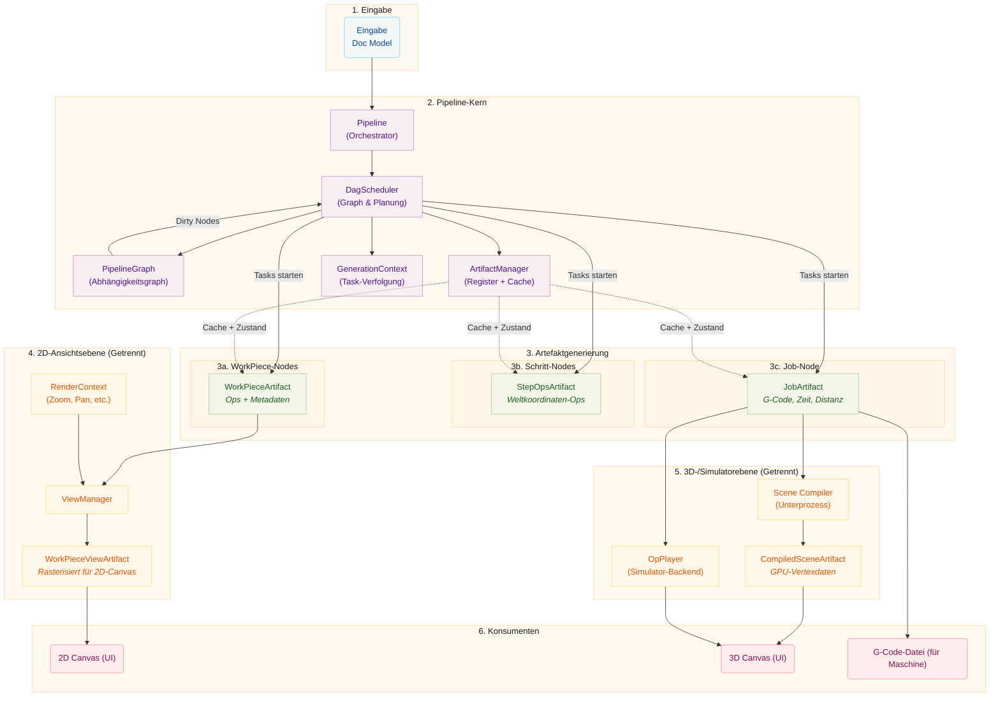

# Pipeline-Architektur

Dieses Dokument beschreibt die Pipeline-Architektur, die einen Gerichteten Azyklischen
Graphen (DAG) verwendet, um die Artefaktgenerierung zu orchestrieren. Die Pipeline transformiert Roh-Designdaten in finale Ausgaben für Visualisierung und Fertigung, mit abhängigkeitsbewusster Planung und effizientem Artefakt-Caching.

```mermaid
graph TD
    subgraph Input["1. Eingabe"]
        InputNode("Eingabe<br/>Doc Model")
    end

    subgraph PipelineCore["2. Pipeline-Kern"]
        Pipeline["Pipeline<br/>(Orchestrator)"]
        DAG["DagScheduler<br/>(Graph & Planung)"]
        Graph["PipelineGraph<br/>(Abhängigkeitsgraph)"]
        AM["ArtifactManager<br/>(Register + Cache)"]
        GC["GenerationContext<br/>(Task-Verfolgung)"]
    end

    subgraph ArtifactGen["3. Artefaktgenerierung"]
        subgraph WorkPieceNodes["3a. WorkPiece-Nodes"]
            WP["WorkPieceArtifact<br/><i>Ops + Metadaten</i>"]
        end

        subgraph StepNodes["3b. Schritt-Nodes"]
            SO["StepOpsArtifact<br/><i>Weltkoordinaten-Ops</i>"]
        end

        subgraph JobNode["3c. Job-Node"]
            JA["JobArtifact<br/><i>G-Code, Zeit, Distanz</i>"]
        end
    end

    subgraph View2D["4. 2D-Ansichtsebene (Getrennt)"]
        VM["ViewManager"]
        RC["RenderContext<br/>(Zoom, Pan, etc.)"]
        WV["WorkPieceViewArtifact<br/><i>Rasterisiert für 2D-Canvas</i>"]
    end

    subgraph View3D["5. 3D-/Simulatorebene (Getrennt)"]
        SC["Scene Compiler<br/>(Unterprozess)"]
        CS["CompiledSceneArtifact<br/><i>GPU-Vertexdaten</i>"]
        OP["OpPlayer<br/>(Simulator-Backend)"]
    end

    subgraph Consumers["6. Konsumenten"]
        Vis2D("2D Canvas (UI)")
        Vis3D("3D Canvas (UI)")
        File("G-Code-Datei (für Maschine)")
    end

    InputNode --> Pipeline
    Pipeline --> DAG
    DAG --> Graph
    DAG --> AM
    DAG --> GC

    Graph -->|"Dirty Nodes"| DAG
    DAG -->|"Tasks starten"| WP
    DAG -->|"Tasks starten"| SO
    DAG -->|"Tasks starten"| JA

    AM -.->|"Cache + Zustand"| WP
    AM -.->|"Cache + Zustand"| SO
    AM -.->|"Cache + Zustand"| JA

    WP --> VM
    JA --> SC
    JA --> OP
    JA --> File

    RC --> VM
    VM --> WV
    WV --> Vis2D

    SC --> CS
    CS --> Vis3D
    OP --> Vis3D

    classDef clusterBox fill:#fff3e080,stroke:#ffb74d80,stroke-width:1px,color:#1a1a1a
    classDef inputNode fill:#e1f5fe80,stroke:#03a9f480,color:#0d47a1
    classDef coreNode fill:#f3e5f580,stroke:#9c27b080,color:#4a148c
    classDef artifactNode fill:#e8f5e980,stroke:#4caf5080,color:#1b5e20
    classDef viewNode fill:#fff8e180,stroke:#ffc10780,color:#e65100
    classDef consumerNode fill:#fce4ec80,stroke:#e91e6380,color:#880e4f
    class Input,PipelineCore,ArtifactGen,WorkPieceNodes,StepNodes,JobNode,View2D,View3D,Consumers clusterBox
    class InputNode inputNode
    class Pipeline,DAG,Graph,AM,GC coreNode
    class WP,SO,JA artifactNode
    class VM,RC,WV,SC,CS,OP viewNode
    class Vis2D,Vis3D,File consumerNode
```

# Kernkonzepte

## Artefakt-Nodes und der Abhängigkeitsgraph

Die Pipeline verwendet einen **Gerichteten Azyklischen Graphen (DAG)**, um Artefakte und
ihre Abhängigkeiten zu modellieren. Jedes Artefakt wird als `ArtifactNode` im
Graphen repräsentiert.

### ArtifactNode

Jeder Node enthält:

- **ArtifactKey**: Ein eindeutiger Bezeichner, bestehend aus einer ID und einem Gruppentyp
  (`workpiece`, `step`, `job` oder `view`)
- **Dependencies**: Liste von Nodes, von denen dieser Node abhängt (Kinder)
- **Dependents**: Liste von Nodes, die von diesem Node abhängen (Eltern)

Nodes speichern keinen Zustand direkt. Stattdessen delegieren sie Lese- und
Schreibzugriffe auf den Zustand an den `ArtifactManager`, der ein Register aller Artefakte
und ihrer Zustände verwaltet.

### Node-Zustände

Nodes durchlaufen fünf Zustände:

| Zustand       | Beschreibung                                                |
| ------------- | ----------------------------------------------------------- |
| `DIRTY`       | Das Artefakt muss (neu) generiert werden                    |
| `PROCESSING`  | Eine Task generiert gerade das Artefakt                     |
| `VALID`       | Das Artefakt ist bereit und aktuell                         |
| `ERROR`       | Generierung fehlgeschlagen                                  |
| `CANCELLED`   | Generierung wurde abgebrochen; wird bei Bedarf erneut versucht |

Wenn ein Node als dirty markiert wird, werden auch alle seine Dependents als dirty markiert,
was die Invalidierung den Graph hinauf propagiert.

### PipelineGraph

Der `PipelineGraph` wird aus dem Doc-Modell erstellt und enthält:

- Einen Node für jedes `(WorkPiece, Step)`-Paar
- Einen Node für jeden Step
- Einen Node für den Job

Abhängigkeiten werden hergestellt:

- Steps hängen von ihren `(WorkPiece, Step)`-Paar-Nodes ab
- Job hängt von allen Steps ab

## DagScheduler

Der `DagScheduler` ist der zentrale Orchestrator der Pipeline. Er besitzt den
`PipelineGraph` und ist verantwortlich für:

1. **Aufbau des Graphen** aus dem Doc-Modell
2. **Identifizierung bereiter Nodes** (DIRTY mit allen VALIDEN Abhängigkeiten)
3. **Starten von Tasks** über die entsprechenden Pipeline-Stufen
4. **Zustandsverfolgung** während des Generierungsprozesses
5. **Benachrichtigung von Konsumenten**, wenn Artefakte bereit sind

Der Scheduler arbeitet mit Generierungs-IDs, um zu verfolgen, welche Artefakte zu
welcher Dokumentversion gehören, was die Wiederverwendung gültiger Artefakte über Generationen hinweg ermöglicht.

Wichtige Verhaltensweisen:

- Wenn der Graph aufgebaut wird, synchronisiert der Scheduler Node-Zustände mit dem
  Artefakt-Manager, um zwischengespeicherte Artefakte zu identifizieren, die wiederverwendet werden können
- Artefakte aus der vorherigen Generation können wiederverwendet werden, wenn sie gültig bleiben
- Invalidierungen werden sogar vor Graph-Neuaufbau verfolgt und danach erneut angewendet
- Der Scheduler delegiert die tatsächliche Task-Erstellung an die Stufen, kontrolliert aber
  **wann** Tasks gestartet werden, basierend auf der Bereitschaft der Abhängigkeiten

## ArtifactManager

Der `ArtifactManager` dient sowohl als Cache als auch als einzige Wahrheitsquelle
für den Artefaktzustand. Er:

- Speichert und ruft Artefakt-Handles über ein **Register** ab (indiziert durch
  `ArtifactKey` + Generierungs-ID)
- Verfolgt Zustände (`DIRTY`, `VALID`, `ERROR`, usw.) in Registereinträgen
- Verwaltet Referenzzählung für Shared-Memory-Cleanup
- Behandelt Lebenszyklus (Erstellung, Zurückhaltung, Freigabe, Bereinigung)
- Bietet Kontextmanager für sichere Artefaktadoption, Abschluss,
  Fehler- und Abbruchmeldung

## GenerationContext

Jeder Abgleichszyklus erstellt einen `GenerationContext`, der alle
aktiven Tasks für diese Generation verfolgt. Er stellt sicher, dass Shared-Memory-Ressourcen
gültig bleiben, bis alle laufenden Tasks einer Generation abgeschlossen sind,
auch wenn bereits eine neuere Generation gestartet wurde. Wenn ein Kontext
abgelöst wird und alle seine Tasks beendet sind, gibt er seine
Ressourcen automatisch frei.

## Shared-Memory-Lebenszyklus

Artefakte werden in Shared Memory (`multiprocessing.shared_memory`) gespeichert für
effiziente Inter-Prozess-Kommunikation zwischen Arbeitsprozessen und dem Hauptprozess. Der `ArtifactStore` verwaltet den Lebenszyklus dieser Speicherblöcke.

### Eigentumsmuster

**Lokales Eigentum:** Der erstellende Prozess besitzt den Handle und gibt ihn
frei, wenn er fertig ist. Dies ist das einfachste Muster.

**Inter-Prozess-Übergabe:** Ein Worker erstellt ein Artefakt, sendet es an den
Hauptprozess via IPC und überträgt das Eigentum. Der Worker "vergisst" den
Handle (schließt seinen Dateideskriptor ohne den Speicher zu unlinken), während
der Hauptprozess ihn "adoptiert" und für die eventuelle Freigabe verantwortlich wird.

### Erkennung veralteter Artefakte

Der `StaleGenerationError`-Mechanismus verhindert, dass Artefakte aus abgelösten
Generationen adoptiert werden. Wenn eine neuere Generation gestartet wurde, erkennt
der Manager veraltete Artefakte während der Adoption und verwirft sie stillschweigend.

## Pipeline-Stufen

Die Pipeline-Stufen (`WorkPiecePipelineStage`, `StepPipelineStage`,
`JobPipelineStage`) sind für die **Mechanik** der Task-Ausführung verantwortlich:

- Sie erstellen und registrieren Unterprozess-Tasks über den `TaskManager`
- Sie behandeln Task-Ereignisse (progressive Chunks, Zwischenergebnisse)
- Sie verwalten Artefaktadoption und Caching nach Task-Abschluss
- Sie emittieren Signale, um die Pipeline über Zustandsänderungen zu benachrichtigen

Der **DagScheduler** entscheidet, **wann** jede Stufe ausgelöst wird, aber die
Stufen behandeln das tatsächliche Spawnen von Unterprozessen, die Ereignisbehandlung und
die Ergebnisadoption.

## Invalidierungsstrategie

Invalidierung wird durch Änderungen am Doc-Modell ausgelöst, mit verschiedenen
Strategien je nachdem, was sich geändert hat:

| Änderungstyp           | Verhalten                                                                                       |
| ---------------------- | ----------------------------------------------------------------------------------------------- |
| Geometrie/Parameter    | Workpiece-Step-Paare invalidiert, kaskadiert zu Steps und Job                                   |
| Position/Drehung       | Steps direkt invalidiert (kaskadiert zu Job); Workpieces übersprungen außer positionsempfindlich |
| Größenänderung         | Wie Geometrie: vollständige Kaskade von Workpiece-Step-Paaren aufwärts                          |
| Maschinenkonfiguration | Alle Artefakte force-invalidiert über alle Generationen                                         |

Positionsempfindliche Steps (z.B. solche mit aktiviertem Crop-to-Stock) lösen
Workpiece-Invalidierung sogar bei reinen Positionsänderungen aus.

# Detaillierte Aufschlüsselung

## Eingabe

Der Prozess beginnt mit dem **Doc Model**, das enthält:

- **WorkPieces:** Einzelne Design-Elemente (SVGs, Bilder), die auf der Canvas platziert sind
- **Steps:** Verarbeitungsanweisungen (Kontur, Raster, usw.) mit Einstellungen
- **Layers:** Gruppierung von Workpieces, jede mit eigenem Workflow

## Pipeline-Kern

### Pipeline (Orchestrator)

Die `Pipeline`-Klasse ist der übergeordnete Dirigent, der:

- Hört über Signale auf Änderungen am Doc-Modell
- **Entprellt** Änderungen (200ms Abgleichsverzögerung, 50ms Entfernungsverzögerung)
- Koordiniert mit dem DagScheduler, um Neugenerierung auszulösen
- Verwaltet den gesamten Verarbeitungsstatus und Beschäftigt-Erkennung
- Unterstützt **Pause/Fortsetzen** für Stapelverarbeitungen
- Unterstützt **Manuellen Modus** (`auto_pipeline=False`), bei dem Neuberechnung
  explizit statt automatisch ausgelöst wird
- Verbindet Signale zwischen Komponenten und leitet sie an Konsumenten weiter

### DagScheduler

Der `DagScheduler`:

- Baut und wartet den `PipelineGraph`
- Identifiziert zur Verarbeitung bereite Nodes
- Startet Tasks über die `launch_task()`-Methoden der Stufen
- Verfolgt Node-Zustandsübergänge über das Register
- Emittiert Signale, wenn Artefakte bereit sind

### ArtifactManager

Der `ArtifactManager`:

- Verwaltet ein **Register** aus `LedgerEntry`-Objekten, die jeweils einen Handle,
  Generierungs-ID und Node-Zustand verfolgen
- Cacht Artefakt-Handles in Shared Memory
- Verwaltet Referenzzählung für Cleanup
- Bietet Lookup nach ArtifactKey und Generierungs-ID
- Bereinigt veraltete Generationen, um das Register sauber zu halten

### GenerationContext

Jeder Abgleich erstellt einen neuen `GenerationContext`, der:

- Aktive Tasks über referenzzählende Schlüssel verfolgt
- Shared-Memory-Ressourcen für seine Generation besitzt
- Sich automatisch herunterfährt, wenn abgelöst und alle Tasks abgeschlossen sind

## Artefaktgenerierung

### WorkPieceArtifacts

Generiert für jede `(WorkPiece, Step)`-Kombination. Enthält:

- Werkzeugwege (`Ops`) im lokalen Koordinatensystem des Workpieces
- Skalierbarkeits-Flag und Quelldimensionen für auflösungsunabhängige Ops
- Koordinatensystem und Generierungsmetadaten

Verarbeitungssequenz:

1. **Produzent:** Erstellt rohe Werkzeugwege (`Ops`) aus den Workpiece-Daten
2. **Transformatoren:** Pro-Workpiece-Modifikationen, angewendet in geordneten Phasen
   (Geometrieverfeinerung → Pfadunterbrechung → Nachbearbeitung)

Große Raster-Workpieces werden inkrementell in Chunks verarbeitet, was
progressives visuelles Feedback während der Generierung ermöglicht.

### StepOpsArtifacts

Generiert für jeden Step, konsumiert alle zugehörigen WorkPieceArtifacts:

- Kombinierte Ops für alle Workpieces in Weltkoordinaten
- Pro-Step-Transformatoren angewendet (Optimieren, Mehrfach-Durchgang, usw.)

### JobArtifact

Generiert auf Anfrage, wenn G-Code benötigt wird, konsumiert alle StepOpsArtifacts:

- Finaler Maschinencode (G-Code oder treiberspezifisches Format)
- Vollständige Ops für Simulation und Wiedergabe
- Hochpräzise Zeitschätzung und Gesamtdistanz
- Rotary-abbildende Ops für 3D-Vorschau

## 2D-Ansichtsebene (Getrennt)

Der `ViewManager` ist **entkoppelt** von der Daten-Pipeline. Er behandelt
Rendering für die 2D-Canvas basierend auf dem UI-Zustand:

### RenderContext

Enthält die aktuellen Ansichtsparameter:

- Pixel pro Millimeter (Zoom-Stufe)
- Viewport-Offset (Pan)
- Anzeigeoptionen (Positionierbewegungen anzeigen, usw.)

### WorkPieceViewArtifacts

Der ViewManager erstellt `WorkPieceViewArtifacts`, die:

- WorkPieceArtifacts in den Bildschirmraum rastern
- Den aktuellen RenderContext anwenden
- Zwischengespeichert und aktualisiert werden, wenn sich Kontext oder Quelle ändern

### Lebenszyklus

1. ViewManager verfolgt Quell-`WorkPieceArtifact`-Handles
2. Wenn sich der Renderkontext ändert, löst ViewManager Neu-Rendering aus
3. Wenn sich das Quellartefakt ändert, löst ViewManager Neu-Rendering aus
4. Neu-Rendering ist gedrosselt (33ms-Intervall) und parallelitätsbeschränkt
5. Progressives Chunk-Zusammensetzen bietet inkrementelle visuelle Aktualisierungen

Der ViewManager indiziert Views nach `(workpiece_uid, step_uid)`, um die
Visualisierung von Zwischenzuständen eines Workpieces über mehrere Steps hinweg zu unterstützen.

## 3D-/Simulatorebene (Getrennt)

Das 3D-Visualisierungs- und Simulationssystem ist **entkoppelt** von der Daten-Pipeline
und folgt einem ähnlichen Muster wie der ViewManager. Es besteht aus:

- Einem **Scene Compiler**, der in einem Unterprozess läuft, um `JobArtifact`-Ops
  in GPU-fertige Vertexdaten umzuwandeln
- Einem **OpPlayer**, der die Ops des Jobs für eine Echtzeit-Maschinen-
  simulation mit Wiedergabesteuerung abspielt

Beide konsumieren das `JobArtifact`, das von der Job-Stufe der Pipeline erzeugt wird.

### CompiledSceneArtifact

Der Scene Compiler erzeugt ein `CompiledSceneArtifact`, das enthält:

- **Vertex-Ebenen:** Powered/Travel/Zero-Power-Vertexpuffer mit
  pro-Befehl-Offsets für progressive Enthüllung
- **Textur-Ebenen:** Rasterisierte Scanline-Leistungskarten für Gravur-Vorschau
- **Overlay-Ebenen:** Scanline-Leistungssegmente für Echtzeit-Hervorhebung
- Unterstützung für Rotary-Geometrie (zylindergewickelt)

### Kompilierungs-Pipeline

1. Canvas3D hört auf `job_generation_finished`-Signale
2. Wenn ein neuer Job bereit ist, plant es die Szenenkompilierung in einem Unterprozess
3. Der Unterprozess liest das `JobArtifact` aus dem Shared Memory und kompiliert
   Ops in GPU-Vertexdaten
4. Die kompilierte Szene wird zurück in den Shared Memory adoptiert und auf
   GPU-Renderer hochgeladen

### OpPlayer (Simulator-Backend)

Der `OpPlayer` durchläuft die Ops des Jobs Befehl für Befehl und pflegt
einen `MachineState`, der Position, Laserzustand und Hilfsachsen verfolgt.
Dies steuert:

- Die 3D-Canvas-Wiedergabe (progressive Enthüllung des Werkzeugwegs)
- Maschinenkopfposition und Laserstrahl-Visualisierung
- Pro-Befehl-Schrittweite für den Wiedergabe-Slider

## Konsumenten

| Konsument  | Verwendet                    | Zweck                                            |
| ---------- | ---------------------------- | ------------------------------------------------ |
| 2D Canvas  | WorkPieceViewArtifacts       | Rendert Workpieces im Bildschirmraum             |
| 3D Canvas  | CompiledSceneArtifact        | Rendert vollständigen Job in 3D mit Wiedergabe   |
| Maschine   | JobArtifact (Maschinencode)  | Fertigungsausgabe                                |

# Wichtige Architekturentscheidungen

1. **DAG-basierte Planung:** Statt sequenzieller Stufen werden Artefakte
   generiert, sobald ihre Abhängigkeiten verfügbar werden, was Parallelität ermöglicht.

2. **Register-basierter Zustand:** Node-Zustand wird in den Registereinträgen
   des ArtifactManagers statt in den Graph-Nodes selbst verfolgt, was eine
   einzige Wahrheitsquelle für sowohl Zustand als auch Handle-Speicherung bietet.

3. **Ansichtsebenen-Trennung:** Sowohl die 2D-Canvas (ViewManager) als auch die
   3D-Canvas (Scene Compiler) sind von der Daten-Pipeline entkoppelt. Jede
   betreibt ihr eigenes unterprozessbasiertes Rendering und wird durch Pipeline-
   Signale gesteuert, anstatt Teil des DAG zu sein.

4. **Generierungs-IDs:** Artefakte werden mit Generierungs-IDs verfolgt, was
   effiziente Wiederverwendung über Dokumentversionen und Erkennung veralteter Artefakte ermöglicht.

5. **Zentralisierte Orchestrierung:** Der DagScheduler ist der einzelne
   Kontrollpunkt für Task-Planung; Stufen behandeln die Mechanik der Ausführung.

6. **GenerationContext-Isolation:** Jede Generation hat ihren eigenen Kontext,
   was sicherstellt, dass Ressourcen lebendig bleiben, bis alle laufenden Tasks abgeschlossen sind.

7. **Invalidierungs-Tracking:** Als dirty markierte Schlüssel vor Graph-Neuaufbau werden
   bewahrt und nach Neuaufbau erneut angewendet.

8. **Entprellter Abgleich:** Änderungen werden mit konfigurierbaren
   Verzögerungen gebündelt, um übermäßige Pipeline-Zyklen bei schnellen Bearbeitungen zu vermeiden.
