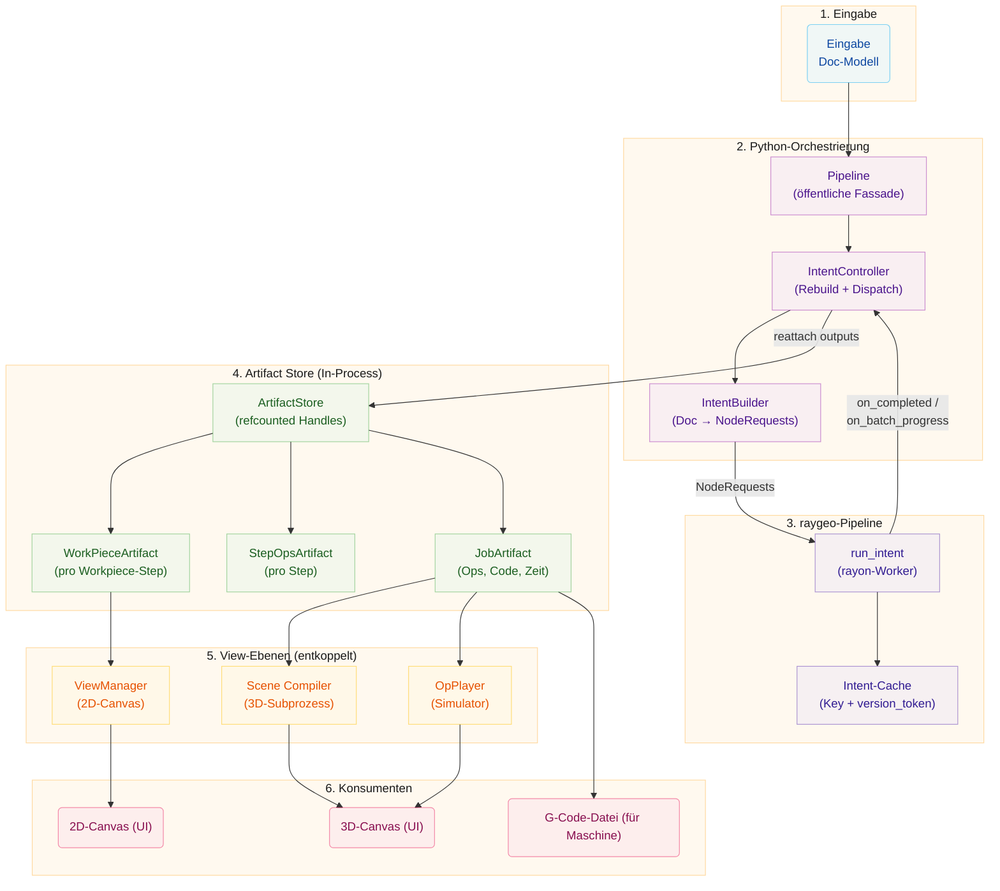

# Pipeline-Architektur

Dieses Dokument beschreibt die Pipeline, die ein `Doc`-Modell in
maschinenausführbaren G-Code umwandelt. Seit dem 1.9.0-Rewrite basiert
die Pipeline auf **raygeo-Intents**: einer deklarativen Beschreibung
der Arbeit, die die Rust-Seite ausführen soll, gekoppelt mit einer
dünnen Python-Orchestrierungsschicht und einem referenzgezählten
In-Process-Artifact-Store.

Der vorherige Multiprozess-DAG (`DagScheduler`, `PipelineGraph`,
`ArtifactManager`, `GenerationContext`, `WorkPiecePipelineStage`)
wurde entfernt. Dieses Dokument beschreibt nur die aktive Architektur.

```mermaid
graph TD
    subgraph Input["1. Eingabe"]
        InputNode("Eingabe<br/>Doc-Modell")
    end

    subgraph PythonOrchestrator["2. Python-Orchestrierung"]
        Pipeline["Pipeline<br/>(öffentliche Fassade)"]
        IC["IntentController<br/>(Rebuild + Dispatch)"]
        IB["IntentBuilder<br/>(Doc &rarr; NodeRequests)"]
    end

    subgraph Raygeo["3. raygeo-Pipeline"]
        RI["run_intent<br/>(rayon-Worker)"]
        Cache["Intent-Cache<br/>(Key + version_token)"]
    end

    subgraph Artifacts["4. Artifact Store (In-Process)"]
        Store["ArtifactStore<br/>(refcounted Handles)"]
        WP["WorkPieceArtifact<br/>(pro Workpiece-Step)"]
        SO["StepOpsArtifact<br/>(pro Step)"]
        JA["JobArtifact<br/>(Ops, Code, Zeit)"]
    end

    subgraph View["5. View-Ebenen (entkoppelt)"]
        VM["ViewManager<br/>(2D-Canvas)"]
        SC["Scene Compiler<br/>(3D-Subprozess)"]
        OP["OpPlayer<br/>(Simulator)"]
    end

    subgraph Consumers["6. Konsumenten"]
        Vis2D("2D-Canvas (UI)")
        Vis3D("3D-Canvas (UI)")
        File("G-Code-Datei (für Maschine)")
    end

    InputNode --> Pipeline
    Pipeline --> IC
    IC --> IB
    IB -->|"NodeRequests"| RI
    RI -->|"on_completed /<br/>on_batch_progress"| IC
    RI --> Cache
    IC -->|"reattach outputs"| Store
    Store --> WP
    Store --> SO
    Store --> JA

    WP --> VM
    JA --> SC
    JA --> OP
    JA --> File

    VM --> Vis2D
    SC --> Vis3D
    OP --> Vis3D

    classDef clusterBox fill:#fff3e080,stroke:#ffb74d80,stroke-width:1px,color:#1a1a1a
    classDef inputNode fill:#e1f5fe80,stroke:#03a9f480,color:#0d47a1
    classDef pyNode fill:#f3e5f580,stroke:#9c27b080,color:#4a148c
    classDef raygeoNode fill:#ede7f680,stroke:#5e35b180,color:#311b92
    classDef artifactNode fill:#e8f5e980,stroke:#4caf5080,color:#1b5e20
    classDef viewNode fill:#fff8e180,stroke:#ffc10780,color:#e65100
    classDef consumerNode fill:#fce4ec80,stroke:#e91e6380,color:#880e4f
    class Input,PythonOrchestrator,Raygeo,Artifacts,View,Consumers clusterBox
    class InputNode inputNode
    class Pipeline,IC,IB pyNode
    class RI,Cache raygeoNode
    class Store,WP,SO,JA artifactNode
    class VM,SC,OP viewNode
    class Vis2D,Vis3D,File consumerNode
```

# Kernkonzepte

## Pipeline (öffentliche Fassade)

`rayforge/pipeline/pipeline.py:40` — die Klasse, mit der der Rest der
Anwendung kommuniziert. `DocEditor`, `ViewManager`, UI-Widgets und
Testcode sollten nur von `Pipeline` abhängen. `IntentController` und
`IntentBuilder` sind Implementierungsdetails der Fassade und können
sich ohne Vorankündigung ändern.

`Pipeline` besitzt die `ArtifactStore`-Integration: Sie übersetzt die
rohen raygeo-Ausgaben ihres internen `IntentController` in
referenzgezählte Artifact-Handles, die die UI und Exportpfade
konsumieren, und stellt die Signal-/Property-Oberfläche bereit, die
der Rest der Anwendung erwartet (Busy-Status, Pause/Resume,
Neuberechnung, Maschinenwechsel).

Wichtige Signale der Fassade:

| Signal                     | Bedeutung                                                  |
| -------------------------- | ---------------------------------------------------------- |
| `processing_state_changed` | Busy/Idle-Übergänge                                        |
| `workpiece_artifact_ready` | Ein `WorkPieceArtifact`-Handle wurde veröffentlicht        |
| `job_generation_finished`  | Ein `JobArtifact`-Handle (G-Code + Ops + Schätzung) bereit |
| `job_time_updated`         | Aggregierte Zeitschätzung während eines Rebuilds geändert  |
| `data_stale`               | Rebuild angefordert, aber pausiert oder manueller Modus    |
| `visual_chunk_available`   | Progressiver Raster-Chunk für inkrementelle UI-Updates     |

## IntentController

`rayforge/pipeline/intent_controller.py:108` — besitzt einen raygeo
`Intent` und den umgebenden Rebuild-Lifecycle. Er hört auf dieselben
gebubbelten Doc-Signale wie die Legacy-Pipeline (`descendant_updated`,
`descendant_transform_changed`, `descendant_added`,
`descendant_removed`, `job_assembly_invalidated`) und baut bei jeder
Dokumentänderung einen raygeo `Intent` neu auf.

Bei jedem entprellten Rebuild (200 ms `REBUILD_DEBOUNCE_MS`):

1. `IntentBuilder` wird aufgerufen, um eine frische Liste von
   `NodeRequest`-Objekten aus dem aktuellen `Doc` zu erzeugen.
2. Die neue Liste wird via `create_intent_from_nodes` in einen raygeo
   `Intent` verpackt.
3. `Intent.update` vergleicht den vorherigen Intent mit dem neuen
   anhand des `version_token` pro Knoten und entfernt veraltete
   Cache-Einträge auf der gemeinsamen raygeo `Pipeline`.
4. Wenn `dispatch=True` ist, wird der neue Intent auch via
   `run_intent` ausgeführt; der `on_completed`-Callback führt den
   Epochenfilter aus (verwirft Ergebnisse, deren `generation_id`
   älter als die aktuelle Generation des Controllers ist) und
   marschalliert ein DOM-Reattachment zurück auf den Haupt-Thread
   über den gemeinsamen Task-Manager.
5. Der `on_batch_progress`-Callback leitet den aggregierten
   Fortschritt an Listener via `progress_changed` weiter (auf den
   Haupt-Thread marschalliert, sodass Signalhandler nie auf einem
   rayon-Worker laufen).

Die `_key_to_item`-Map des Controllers (bei jedem erfolgreichen
`IntentBuilder.build`-Aufruf neu aufgebaut) erlaubt es dem
`on_completed`-Epochenfilter-Callback, Ausgaben ohne erneutes
Durchlaufen des Docs auf das ursprüngliche `WorkPiece` oder `Step`
zu beziehen. Knotenschlüssel werden nach Form dispatchet:

| Knotenschlüssel                 | Bezug zu                   | Ausgelöstes Signal         |
| ------------------------------- | -------------------------- | -------------------------- |
| `workpiece:{wp_uid}:{step_uid}` | Das besitzende `WorkPiece` | `workpiece_artifact_ready` |
| `step:{step_uid}`               | Das besitzende `Step`      | `step_artifact_ready`      |
| `job`                           | Das `Doc`                  | `job_aggregate_ready`      |
| `job:encode`                    | Das `Doc`                  | `job_generation_finished`  |

## IntentBuilder

`rayforge/pipeline/intent_builder.py:133` — durchläuft ein `Doc` und
produziert eine flache Liste von `NodeRequest`-Objekten mit **stabilen
Schlüsseln** und **deterministischen Versionstoken**. Der Builder ist
zustandslos: Jeder Aufruf von `build` erzeugt eine frische,
in sich geschlossene Liste, die zum Verpacken in einen raygeo
`Intent` geeignet ist.

### Stabile Schlüssel

- `workpiece:{wp_uid}:{step_uid}` — ein Compute-Knoten pro
  Workpiece/Step-Paar.
- `step:{step_uid}` — ein Aggregatknoten pro Step, der die
  Workpiece-Compute-Ausgaben konkateniert und Pro-Step-Transformer
  anwendet.
- `job` — ein finaler Aggregatknoten, der alle Step-Ausgaben mit
  Job-Level-Markern und Maschinenparametern verknüpft.
- `job:machinexform` — Machine-Transform-Compute-Knoten, der die
  Weltraum-Ops des Job-Aggregats konsumiert und maschinenraum-Ops
  produziert (Kurvenlinearisierung, Rotationsachsen-Mapping,
  Welt&rarr;Maschine, WCS-Offsets, Z-Flip, AXIS_REPLACEMENT).
- `job:encode` — Encoder-Compute-Knoten, der die Ops des
  Machine-Transform-Knotens konsumiert und den Maschinencode
  (G-Code / Vertex / Textur) produziert.

Die Schlüsselformate sind in `intent_builder.py` zentralisiert, sodass
der Produzent und die `IntentController`-Reattachment-Map immer
übereinstimmen.

### Versionstoken

Der raygeo-Cache wird nur nach Knotenschlüssel indiziert; der
`version_token` ist das alleinige Invalidierungssignal. Token sind
SHA-1-Parameter einer kanonischen Repräsentation der Eingaben, die
die Ausgabe eines Knotens beeinflussen (siehe `_hash_int`,
`intent_builder.py:1066`):

- **Compute-Token** hashen
  `(geometry_revision, wp_size, step_params, assembler_params,
per_workpiece_transformers)`. Bei Step-Bereichen, die einen
  positionsempfindlichen Transformer deklarieren (siehe
  `Step.is_position_sensitive`), werden `transform_revision` des
  Workpieces und die Stock-Revision in den Token einbezogen;
  andernfalls werden sie weggelassen, sodass reine Bewegungen keine
  Workpiece-Compute-Ergebnisse invalidieren.
- **Step-Aggregat-Token** hashen
  `(upstream compute tokens, placements, step_params,
per_step/per_workpiece transformers, position_sensitive())`, plus
  `stock_rev` wenn der Step positionsempfindlich ist.
- **Job-Token** faltet alle Pro-Step-Aggregat-Token ein, sodass jede
  vorgelagerte Änderung (Workpiece-Verschiebung,
  Transformer-Bearbeitung, Step-Parameter-Änderung) bis zum
  Job/Encode-Cache propagiert.
- **Machine-Transform-Token** faltet den Job-Token plus die
  Maschinenidentität ein (`supports_curves`, `reverse_z_axis`,
  WCS-Konfiguration, Rotationsmodul-Konfiguration pro Layer).
- **Encode-Token** faltet den Machine-Transform-Token plus die
  Encoder-Identität ein (`driver_name`, `gcode_precision`,
  Achsausdehnungen, ...).

### Stufenkonstruktion

Jeder `NodeRequest` trägt eine `StageSpec`, die die Arbeit
beschreibt, die raygeo für diesen Knoten ausführen soll. Der Builder
produziert:

- `StageSpec.Compute` für jedes Workpiece/Step-Paar via
  `Step.build_compute_payload(machine_defaults, workpiece)`, das ein
  `Part` (Vektorgeometrie oder Bildquelle) plus ein `ComputePayload`
  (Assembler-Spezifikation) zurückgibt. Pro-Workpiece-Transformer
  (`OverscanTransformer`, `BidirScanOffsetTransformer`, ...) werden
  via `transformer_registry` in getypte Rust `*Spec`-Pyclasses
  aufgelöst und an das Payload angehängt, sodass die Rust-Compute-Stufe
  sie nach der Assembly anwendet.
- `StageSpec.Aggregate` für jeden Step: eine `AggregateGroup` pro
  vorgelagertem Workpiece-Compute-Knoten, umschlossen von
  `WorkpieceStart`/`WorkpieceEnd`-Markern, wobei jeder Input die
  Welt-Platzierungsmatrix und physische Größe des Workpieces als
  `target_dimensions` trägt. Pro-Step-Transformer
  (`MultiPassTransformer`, `Optimize`, ...) werden an
  `AggregateSpec.transformers` angehängt, sodass die Rust-Aggregat-Stufe
  sie nach der Konkatenation anwendet. `MachineParams` wird von der
  aufgelösten Maschine befüllt, sodass die Zeitschätzung des Aggregats
  korrekt ist.
- `StageSpec.Aggregate` für den `job`-Knoten: eine `AggregateGroup`
  pro Layer, umschlossen von `LayerStart`/`LayerEnd`-Markern, jede
  mit einem `AggregateInput` pro sichtbarem Step; das gesamte Aggregat
  ist von `JobStart`/`JobEnd` umschlossen.
- `MachineTransformSpec` für `job:machinexform`: die Welt&rarr;Maschine
  4&times;4-Matrix, Standard- und Pro-Layer-WCS-Offsets,
  Pro-Layer-`RotaryMappingSpec`-Einträge,
  Kurvenlinearisierungs-Flag und Z-Reverse-Flag, verpackt in eine
  serialisierbare Spezifikation, die die Rust-`MachineTransformCompute`-
  Stufe konsumiert.
- `EncodeSpec` für `job:encode`: leitet Grbl-Maschinen an die native
  Rust-`GcodeSpec` weiter (direkt auf einem rayon-Thread ohne GIL)
  und alle anderen Maschinen an einen `PythonEncoder`, der die
  treiberspezifische Encoder-Callable umschließt. Der Encoder liest
  Maschinenraum-Ops vom vorgelagerten `job:machinexform`-Knoten.

### Stock-Auflösung

`_resolve_stock_geometries` (einmal pro `build` aufgerufen und auf
dem Builder gecached) gibt die Weltraum-Stock-Grenzgeometrien zurück,
die Transformer wie `CropTransformer` verwenden, um
Pro-Workpiece-Ops auf den Arbeitsbereich der Maschine oder explizite
`StockItem`s zuzuschneiden. Vom Doc besessene `StockItem`-Einträge
haben Vorrang; das Maschinenarbeitsbereich-Rechteck wird nur als
Fallback verwendet, wenn kein Doc-Stock existiert.

## raygeo-Pipeline & `run_intent`

raygeos `Pipeline` (`raygeo.pipeline.execute.Pipeline`) besitzt den
Cache, den `Intent.update` invalidieren kann. `run_intent` plant die
Knoten des Intents auf rayon-Worker-Threads unter der GIL und ruft den
`on_completed`-Callback pro Knoten und `on_batch_progress` für den
aggregierten Fortschritt auf. Schwere Arbeit (Compute, Raster,
Aggregat, Maschinentransformationen, Codierung) läuft in
raygeo-Threads statt in Subprozessen – die wichtigste Änderung, die
im CHANGELOG 1.9.0 genannt wird.

## ArtifactStore & Artifact-Handles

Der alte Shared-Memory-`ArtifactStore` wurde durch einen
In-Process-, referenzgezählten Store ersetzt
(`rayforge/pipeline/artifact/store.py:29`). Alle Artifacts leben als
einfache Python-Objekte in einem Dict, das nach UUID keyed ist;
Handles tragen die UUID in ihrem `key`-Feld plus alle Metadaten, die
der Artifact-Typ benötigt. Der Lebenszyklus wird durch Referenzzählung
via `ArtifactStore.retain`/`release` verwaltet.

Die `Pipeline`-Fassade übersetzt raygeo-Ausgaben auf dem Haupt-Thread
in Artifact-Handles:

| Ausgabe (raygeo)         | Artifact            | Gespeichert unter Tag |
| ------------------------ | ------------------- | --------------------- |
| Pro Workpiece-Step-Ops   | `WorkPieceArtifact` | `wp`                  |
| Pro Step aggregierte Ops | `StepOpsArtifact`   | `step`                |
| Job-Aggregat + Encode    | `JobArtifact`       | `job`                 |

`JobArtifact` trägt die Weltraum-`Ops`, Gesamtdistanz,
Zeitschätzung, die `EncodedOutput` (Text plus Op&rarr;Maschinencode-
Map) und – wenn Rotationsmodule konfiguriert sind – kinematisch
gemappte Ops für die 3D-Vorschau.

## Generations-IDs & Epochenfilterung

Jeder Rebuild erhöht `IntentController.generation_id`. Jeder
abgeschlossene Knoten trägt die Generation, aus der er stammt. Der
`on_completed`-Callback vergleicht die `generation_id` des Knotens
mit der aktuellen Generation des Controllers und verwirft stumm
überholte Ergebnisse, sodass veraltete Ausgaben eines vorherigen
Rebuilds nie an das DOM angehängt werden.

## Pause, Resume & Manueller Modus

- `Pipeline.pause()`/`resume()` erhöht/verringert einen Pause-Zähler
  auf dem Controller. Während Pause setzen Doc-Änderungen ein
  `data_stale`-Flag (und senden `data_stale`) statt einen Rebuild zu
  planen; bei Resume wird das Flag gelöscht und ein Rebuild geplant,
  wenn `auto_rebuild` aktiviert ist.
- `Pipeline.auto_pipeline=False` (manueller Modus): Neuberechnung
  wird explizit via `Pipeline.recalculate()` ausgelöst statt
  automatisch bei jeder Doc-Änderung.

## Invalidierungsstrategie

Invalidierung ist implizit und token-getrieben: Jede Änderung, die
die Eingaben eines Knotens beeinflusst, veranlasst den Builder, einen
anderen `version_token` für den Schlüssel dieses Knotens zu
produzieren. `Intent.update` entfernt den veralteten Cache-Eintrag
und raygeo führt nur diesen Knoten (und seine nachgelagerten
Konsumenten) erneut aus.

| Änderungstyp                                | Auswirkung auf Token                                                                                                                                                                                    |
| ------------------------------------------- | ------------------------------------------------------------------------------------------------------------------------------------------------------------------------------------------------------- |
| Geometrie / Parameter                       | Neue Workpiece-Compute-Token kaskadieren zu Step, Job, MachineXform, Encode                                                                                                                             |
| Position / Rotation                         | Workpiece-Compute-Token unverändert, außer Step ist positionsempfindlich; Step-Aggregat-Token ändern sich immer durch gefaltete Platzierungen, was zu Job/Encode kaskadiert                             |
| Größenänderung                              | Wie Geometrie: Token kaskadieren von Workpiece-Step-Paaren aufwärts                                                                                                                                     |
| Stock-Items sichtbar/verschoben/hinzugefügt | Beeinflusst `stock_rev` (eingefaltet in Compute- & Aggregat-Token positionsempfindlicher Steps)                                                                                                         |
| Maschinenkonfiguration                      | Alle `job:machinexform`- und `job:encode`-Token ändern sich; Step-Compute/Aggregat-Token ändern sich, wenn `kerf_mm`/`cut_speed`/Laser-Kopf/Bogentoleranz/`supports_curves`/`supports_arcs` sich ändern |

# Detaillierte Aufschlüsselung

## Eingabe

Der Prozess beginnt mit dem **Doc-Modell**, das enthält:

- **WorkPieces:** Einzelne Designelemente (SVGs, Bilder) auf der
  Leinwand platziert
- **Steps:** Verarbeitungsanweisungen (Kontur, Raster usw.) mit
  Einstellungen, organisiert in einem Pro-Layer-`Workflow`
- **Layers:** Gruppierung von Workpieces, jeder mit eigenem Workflow,
  WCS und Rotationskonfiguration
- **StockItems:** Optionale explizite Stock-Grenzen, die von
  positionsempfindlichen Transformatoren (z. B. CropTransformer)
  verwendet werden

## Python-Orchestrierung

### Pipeline (Fassade)

Die `Pipeline`-Klasse:

- Hört auf Doc-Änderungen via Signale (weitergeleitet durch den
  `IntentController`)
- **Entprellt** Änderungen (200 ms Verzögerung)
- Koordiniert mit dem `IntentController` die Auslösung der
  Regenerierung
- Verwaltet den Gesamtverarbeitungsstatus und die Busy-Erkennung
- Unterstützt **Pause/Resume** für Batch-Operationen
- Unterstützt **manuellen Modus** (`auto_pipeline=False`), bei dem
  die Neuberechnung explizit ausgelöst wird
- Verbindet Signale zwischen Komponenten und leitet sie an
  Konsumenten weiter
- Veröffentlicht referenzgezählte Artifact-Handles in den
  `ArtifactStore`

### IntentController

Der `IntentController`:

- Besitzt einen raygeo `Intent` und den umgebenden Rebuild-Lifecycle
- Baut bei jeder entprellten Doc-Änderung einen frischen Intent auf
- Führt den Intent via `run_intent` aus, wenn `dispatch=True`
- Filtert überholte Ergebnisse nach `generation_id` (Epochenfilter)
- Marschalliert DOM-Reattachments auf den Haupt-Thread über den
  gemeinsamen Task-Manager

### IntentBuilder

Der `IntentBuilder` ist zustandslos; jeder `build`-Aufruf durchläuft
das `Doc` und produziert einen `NodeRequest` pro Workpiece/Step-Paar,
ein Aggregat pro Step und die Knoten `job`, `job:machinexform` und
`job:encode`. Siehe [Stabile Schlüssel](#stabile-schlüssel),
[Versionstoken](#versionstoken) und
[Stufenkonstruktion](#stufenkonstruktion) oben.

## raygeo-Pipeline

`run_intent` plant die Knotenausführung auf rayon-Worker-Threads
unter der GIL. Die gemeinsame `RaygeoPipeline`-Instanz hält den
Knoten-Cache, keyed nach Knotenschlüssel; `Intent.update` ist der
einzige Invalidierungseinstiegspunkt. Compute, Raster, Shrinkwrap,
Wavefront, Kontur, View-Rendering und Maschinentransformation/
Codierung laufen alle in raygeo-Threads.

## Artifact-Generierung

### WorkPieceArtifacts

Generiert für jede `(WorkPiece, Step)`-Kombination. Enthält:

- Toolpaths (`Ops`) im lokalen Koordinatensystem des Workpieces
- Skalierbarkeitsflag und Quelldimensionen für
  auflösungsunabhängige Ops
- Generations-ID

Große Raster-Workpieces werden inkrementell in Blöcken verarbeitet
(weitergegeben via `visual_chunk_available`), was progressives
visuelles Feedback während der Generierung ermöglicht.

### StepOpsArtifacts

Generiert für jeden Step, konsumiert alle zugehörigen
WorkPieceArtifacts:

- Kombinierte `Ops` für alle Workpieces in Weltkoordinaten
- Angewandte Pro-Step-Transformer (`Optimize`, `MultiPass`, ...)

### JobArtifact

Generiert, wenn G-Code benötigt wird, konsumiert das `job`-Aggregat
und den `job:encode`-Knoten:

- Finaler Maschinencode (G-Code oder treiberspezifisches Format) via
  `EncodedOutput` (Text + Op&rarr;Maschinencode-Map)
- Weltraum-`Ops` für Simulation und Wiedergabe
- Hochpräzise Zeitschätzung und Gesamtdistanz
- Rotationsgemappte Ops für 3D-Vorschau, wenn Rotationsmodule
  konfiguriert sind

## 2D-View-Ebene (entkoppelt)

Der `ViewManager` ist von der Datenpipeline entkoppelt. Er
übernimmt das Rendern für die 2D-Leinwand basierend auf dem UI-Zustand.

### RenderContext

Enthält die aktuellen View-Parameter (Pixel pro Millimeter,
Viewport-Offset, Anzeigeoptionen).

### WorkPieceViewArtifacts

Der `ViewManager` erstellt `WorkPieceViewArtifacts`, die
`WorkPieceArtifacts` in den Bildschirmraum rastern, den aktuellen
`RenderContext` anwenden und bei Kontext- oder Quelländerungen
gecached und aktualisiert werden. Neu-Rendering wird gedrosselt
(33 ms Intervall) und nebenläufigkeitsbegrenzt; progressives
Zusammenfügen von Blöcken liefert inkrementelle visuelle Updates.
Der `ViewManager` indiziert Ansichten nach
`(workpiece_uid, step_uid)`, um die Visualisierung von
Zwischenzuständen eines Workpieces über mehrere Steps zu
unterstützen.

## 3D-/Simulator-Ebene (entkoppelt)

Das 3D-Visualisierungs- und Simulationssystem ist von der
Datenpipeline entkoppelt, ähnlich wie der `ViewManager`. Es besteht
aus:

- Einem **Scene Compiler**, der in einem Subprozess läuft, um
  `JobArtifact`-Ops in GPU-fähige Vertex-Daten umzuwandeln
- Einem **OpPlayer**, der die Job-Ops für eine Echtzeit-Maschinen-
  simulation mit Wiedergabesteuerung abspielt

Beide konsumieren das von der Pipeline produzierte `JobArtifact`.

### CompiledSceneArtifact

Der Scene Compiler produziert ein `CompiledSceneArtifact` mit:

- **Vertex-Ebenen:** Powered/Travel/Zero-Power-Vertex-Puffer mit
  Pro-Befehl-Offsets für progressive Enthüllung
- **Texture-Ebenen:** Rasterisierte Scanlinien-Leistungskarten für
  Gravurvorschau
- **Overlay-Ebenen:** Scanlinien-Leistungssegmente für Echtzeit-
  Hervorhebung
- Unterstützung für rotative (zylindergewickelte) Geometrie

### Kompilierungspipeline

1. Canvas3D hört auf `job_generation_finished`-Signale
2. Wenn ein neuer Job bereit ist, plant es die Szenenkompilierung in
   einem Subprozess
3. Der Subprozess liest das `JobArtifact` aus dem Store und kompiliert
   Ops in GPU-Vertex-Daten
4. Die kompilierte Szene wird zurück übernommen und an GPU-Renderer
   hochgeladen

### OpPlayer (Simulator-Backend)

Der `OpPlayer` durchläuft die Job-Ops Befehl für Befehl und
unterhält einen `MachineState`, der Position, Laserzustand und
Hilfsachsen verfolgt. Dies steuert die 3D-Canvas-Wiedergabe
(progressive Enthüllung des Toolpaths), die Maschinenkopfposition und
Laserstrahlvisualisierung sowie die Einzelbefehl-Schrittsteuerung für
den Wiedergabe-Schieberegler.

## Konsumenten

| Konsument | Verwendet                   | Zweck                                     |
| --------- | --------------------------- | ----------------------------------------- |
| 2D-Canvas | WorkPieceViewArtifacts      | Rendert Workpieces im Bildschirmraum      |
| 3D-Canvas | CompiledSceneArtifact       | Rendert gesamten Job in 3D mit Wiedergabe |
| Maschine  | JobArtifact (Maschinencode) | Fertigungsausgabe                         |

# Wichtige Architekturentscheidungen

1. **Intent-basierte Planung:** Statt eines expliziten Python-DAGs mit
   Python-residenten Planern deklariert die Pipeline _was_ zu
   berechnen ist (ein `Intent` von `NodeRequest`s mit stabilen
   Schlüsseln und Versionstoken) und lässt raygeos `run_intent` die
   Arbeit auf rayon-Threads planen. Cache-Invalidierung ist rein
   token-getrieben via `Intent.update`.

2. **Fassade + interner Controller:** `Pipeline` ist die einzige
   öffentliche Oberfläche; `IntentController` und `IntentBuilder` sind
   Implementierungsdetails. Dies hält den öffentlichen
   Signal/Property-Vertrag stabil, während die Orchestrierungsinterna
   weiterentwickelt werden können.

3. **In-Process-Artifact-Store:** Der Ersatz des
   Multiprozess-Shared-Memory-Stores durch einen referenzgezählten
   In-Process-Dict entfernt die IPC- und
   Ownership-Übergabe-Komplexität, während der Handle/Lifecycle-
   Vertrag, auf den UI- und Exportpfade angewiesen sind, erhalten
   bleibt.

4. **Generations-IDs:** Jeder Rebuild erhöht eine Generations-ID;
   jeder abgeschlossene Knoten trägt seine Erzeugergeneration. Der
   `on_completed`-Epochenfilter verwirft stumm überholte Ergebnisse,
   sodass veraltete Ausgaben nie an das DOM angehängt werden.

5. **Haupt-Thread-Reattachment:** raygeo-Callbacks (`on_completed`,
   `on_batch_progress`) feuern auf rayon-Worker-Threads unter der GIL;
   der Controller marschalliert jeden DOM-berührenden Callback auf
   den Haupt-Thread der Anwendung über den gemeinsamen Task-Manager,
   sodass Signalhandler nie auf einem Worker laufen.

6. **View-Ebenen-Trennung:** Sowohl die 2D-Leinwand (`ViewManager`)
   als auch die 3D-Leinwand (Scene Compiler / OpPlayer) sind von der
   Datenpipeline entkoppelt. Jede wird von Pipeline-Signalen
   gesteuert, nicht als Teil des Intents.

7. **Token-getriebene Invalidierung:** Es gibt keine explizite
   Invalidierungstabelle. Der Builder produziert kanonische
   SHA-1-Versionstoken; jede Eingabeänderung produziert einen anderen
   Token, den `Intent.update` verwendet, um genau die betroffenen
   Cache-Einträge zu entfernen.

8. **Entprellte Abgleichung:** Doc-Änderungen werden mit einem 200 ms
   Debounce (`REBUILD_DEBOUNCE_MS`) gebündelt, um übermäßige
   Pipeline-Zyklen bei schnellen Bearbeitungen zu vermeiden.
