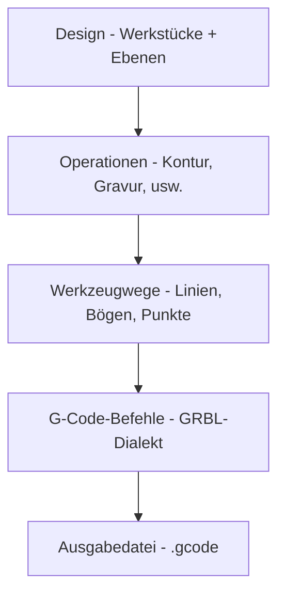

# G-Code-Grundlagen

Das Verständnis von G-Code hilft Ihnen, Probleme zu beheben und die Rayforge-Ausgabe anzupassen.

## Allgemeiner Prozess

Rayforge konvertiert deine Designs durch einen mehrstufigen Prozess in G-Code:



**Was Rayforge macht:**

1. **Analysiert dein Design** - Extrahiert Geometrie aus Werkstücken
2. **Wendet Operationen an** - Bestimmt Schneide-/Gravurpfade
3. **Optimiert Werkzeugwege** - Ordnet Pfade neu, minimiert Verfahren
4. **Generiert Befehle** - Konvertiert Pfade in G-Code
5. **Fügt Hooks ein** - Fügt benutzerdefinierte Makros an angegebenen Punkten hinzu
6. **Schreibt Datei** - Gibt vollständigen G-Code aus, bereit für die Maschine

## Einfaches Beispiel

Hier ist eine grundlegende G-Code-Dateistruktur, die einen quadratischen Schnitt zeigt:

```gcode
G21 ;Einheiten auf mm setzen
G90 ;Absolute Positionierung
G54
T0
G0 X95.049 Y104.951 Z0.000
M4 S500
G1 X104.951 Y104.951 Z0.000 F3000
G1 X104.951 Y95.049 Z0.000 F3000
G1 X95.049 Y95.049 Z0.000 F3000
G1 X95.049 Y104.951 Z0.000 F3000
M5
G0 X95.000 Y105.000 Z0.000
M4 S500
G1 X95.000 Y95.000 Z0.000 F3000
G1 X105.000 Y95.000 Z0.000 F3000
G1 X105.000 Y105.000 Z0.000 F3000
G1 X95.000 Y105.000 Z0.000 F3000
M5
M5 ;Sicherstellen, dass Laser aus ist
G0 X0 Y0 ;Zum Ursprung zurückkehren
```

**Schlüsselbefehle:**

| Befehl | Beschreibung |
| ------- | ------------ |
| `G21`   | Millimeter-Modus |
| `G90`   | Absolute Positionierung |
| `G54`   | Arbeitskoordinatensystem 1 auswählen |
| `T0`    | Werkzeug 0 auswählen (Laserkopf) |
| `G0`    | Eilgang (Laser aus) |
| `G1`    | Schneidgang (Laser an) |
| `M4`    | Laser an (dynamischer Leistungsmodus) |
| `M5`    | Laser aus |
| `S500`  | Laserleistung auf 500 setzen (50% für 0-1000 Bereich) |
| `F3000` | Vorschubrate auf 3000 mm/min setzen |

---

## Verwandte Seiten

- [G-Code-Dialekte](../reference/gcode-dialects) - Firmware-Unterschiede
- [G-Code exportieren](../files/exporting) - Export-Einstellungen und Optionen
- [Hooks & Makros](../machine/hooks-macros) - Benutzerdefinierte G-Code-Einschleusung
