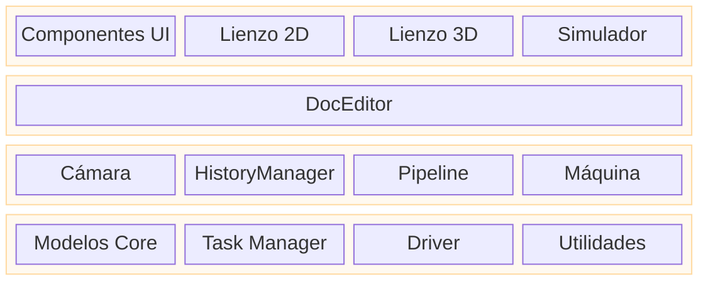

# Arquitectura de Rayforge

Este documento proporciona una visión general arquitectónica de alto nivel de Rayforge, explicando cómo se relacionan los componentes principales entre sí. Para profundizar en áreas específicas, consulta los documentos enlazados.

## Tabla de Contenidos

- [Arquitectura de Aplicación en Capas](#arquitectura-de-aplicación-en-capas)
- [Arquitectura de Código](#arquitectura-de-código)
- [Arquitectura del Modelo de Documento](#arquitectura-del-modelo-de-documento)
- [Arquitectura del Pipeline](#arquitectura-del-pipeline)

---

## Arquitectura de Aplicación en Capas

La aplicación está estructurada en capas lógicas, separando la interfaz de usuario, la lógica de aplicación y los servicios principales. Esto promueve una separación limpia de responsabilidades y aclara el flujo de control

- **Capa UI (Vista)**: Contiene todos los elementos orientados al usuario. El `Workbench` es el área principal del lienzo que aloja las vistas 2D y 3D.
- **Capa Editor/Controlador**: El `DocEditor` actúa como controlador central, respondiendo a eventos UI y manipulando los modelos principales.
- **Capa Core / Servicios**: Proporciona servicios y estado fundamentales. `Core Models` representan el documento, `Tasker` gestiona trabajos en segundo plano, `Machine` maneja comunicación con dispositivos, y `Camera` gestiona viewports.

---

## Arquitectura de Código

Rayforge es una aplicación GTK4/Libadwaita con una arquitectura modular basada en pipeline.

- **`rayforge/core/`**: Modelo de documento y manejo de geometría.
- **`rayforge/pipeline/`**: El pipeline de procesamiento principal para generar operaciones de máquina desde el modelo de documento.
- **`rayforge/machine/`**: Capa de interfaz de hardware, incluyendo drivers de dispositivo, protocolos de transporte y modelos de máquina.
- **`rayforge/doceditor/`**: El controlador principal del editor de documentos y su UI.
- **`rayforge/workbench/`**: El lienzo 2D/3D y sistemas de visualización.
- **`rayforge/image/`**: Importadores para varios formatos de archivo (SVG, DXF, etc.).
- **`rayforge/shared/`**: Utilidades comunes, incluyendo el `tasker` para gestión de trabajos en segundo plano.

---

## Arquitectura del Modelo de Documento

El modelo de documento es un árbol jerárquico de objetos basado en el **Patrón Composite**. Esta estructura representa todo el proyecto del usuario, desde el objeto raíz `Doc` hasta las `WorkPiece`s individuales. Está diseñado para ser reactivo y serializable.

**[Ver Arquitectura del Modelo de Documento para detalles](./docmodel.md)**

---

## Arquitectura del Pipeline

El pipeline convierte el modelo de documento en G-code ejecutable por máquina. Se ejecuta de forma asíncrona en segundo plano y usa un sistema de `Artifact` de memoria compartida para transferencia de datos de alto rendimiento entre procesos. El pipeline se compone de etapas: **Modificadores → Productores → Transformadores → Codificadores**.

**[Ver Arquitectura del Pipeline para detalles](./pipeline.md)**
