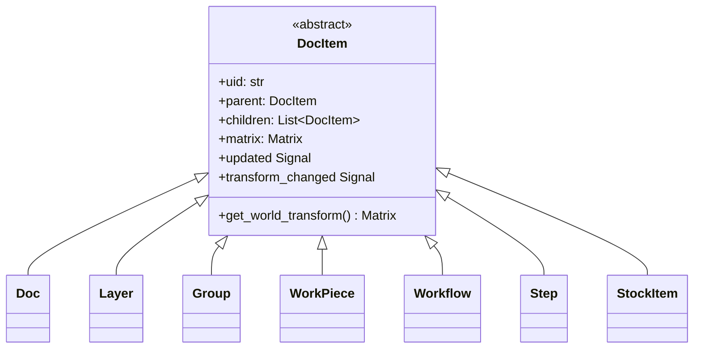
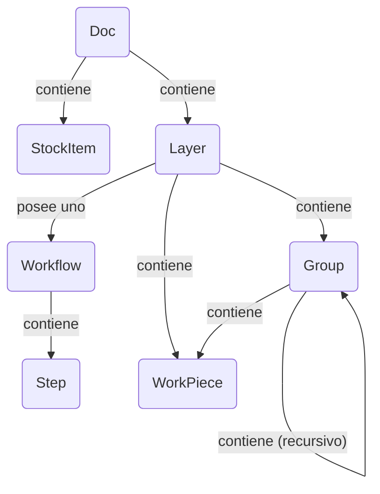

# Arquitectura del Modelo de Documento

El modelo de documento es la columna vertebral de la aplicación, representando todo el proyecto del usuario como un árbol jerárquico de objetos. Está diseñado para ser reactivo, serializable y fácilmente recorrible.

## Resumen

La arquitectura está construida sobre el **patrón de diseño Composite**. Una sola clase base abstracta, `DocItem`, define la interfaz común para todos los objetos que pueden existir en el árbol del documento (ej., capas, workpieces, grupos). Esto permite que estructuras complejas y anidadas sean tratadas uniformemente.

Los principios clave del modelo incluyen:

- **Estructura de Árbol:** El objeto `Doc` sirve como raíz del árbol. Cada elemento (excepto la raíz) tiene un solo `parent` y puede tener múltiples `children`.
- **Reactividad:** El modelo usa un sistema de señal/slot (`blinker`). Cuando un elemento cambia, emite una señal. Los elementos padres escuchan las señales de sus hijos y las "propagan hacia arriba" en el árbol. Esto permite que componentes de alto nivel como el `Pipeline` escuchen cualquier cambio en el documento conectándose a una sola señal en el objeto raíz `Doc`. El sistema rastrea tanto cambios de contenido como cambios de transformación separadamente para actualizaciones eficientes.
- **Jerarquía de Transformación:** Cada `DocItem` tiene una `Matrix` de transformación local. La posición final, escala y rotación de un elemento en el "mundo" (el lienzo principal) es el producto de su propia matriz local y las matrices mundo de todos sus ancestros.
- **Desacoplamiento de Datos:** Los datos visuales o crudos para un `WorkPiece` no se almacenan directamente dentro de él. En su lugar, el `WorkPiece` contiene un UID que referencia un objeto `ImportSource` en un registro central en el `Doc`. Esto desacopla la estructura del documento de la gestión de datos, haciendo el modelo más ligero y flexible.

---

## Herencia de Clases

Este diagrama muestra la jerarquía de clases. Cada objeto que es parte del árbol espacial del documento hereda de la clase base abstracta `DocItem`, ganando funcionalidades core como parentesco, transformaciones y propagación de señales.

- **`DocItem`**: La fundación abstracta que proporciona la implementación del patrón composite.
- Todas las otras clases son implementaciones concretas de `DocItem`, cada una con un rol especializado en la estructura del documento.

---

## Composición de Objetos

Este diagrama ilustra cómo las instancias de las clases se ensamblan para formar un documento completo. Muestra las relaciones padre-hijo y referencias entre objetos.

- Un `Doc` es el objeto de nivel superior. **Contiene** uno o más `Layer`s y `StockItem`s. También **gestiona** un registro de todos los `ImportSource`s en el proyecto.
- Cada `Layer` **contiene** el contenido del usuario: `WorkPiece`s y `Group`s. Crucialmente, un `Layer` también **posee uno** `Workflow`.
- Un `Workflow` **contiene** una lista ordenada de `Step`s, que definen el proceso de manufactura para esa capa.
- Un `Group` es un contenedor que puede contener `WorkPiece`s y otros `Group`s, permitiendo transformaciones anidadas.
- Un `WorkPiece` es un elemento de diseño fundamental. No almacena sus datos crudos directamente. En su lugar, **referencia** un `ImportSource` via un UID. También **tiene** su propia `Geometry` (datos vectoriales) y puede tener una lista de `Tab`s.

---

## Descripciones de DocItem

- **`DocItem` (Abstracto)**

  - **Rol:** La base abstracta para todos los nodos del árbol.
  - **Propiedades Clave:** `uid`, `parent`, `children`, `matrix`, señal `updated`, señal `transform_changed`. Proporciona la lógica core del patrón composite.

- **`Doc`**

  - **Rol:** La raíz del árbol del documento.
  - **Propiedades Clave:** `children` (Layers, StockItems), `import_sources` (un diccionario mapeando UIDs a objetos `ImportSource`), `active_layer`.

- **`Layer`**

  - **Rol:** La unidad organizacional principal para contenido. Una capa asocia un grupo de workpieces con un solo flujo de trabajo de manufactura.
  - **Propiedades Clave:** `children` (WorkPieces, Groups, un Workflow), `visible`, `stock_item_uid`.

- **`Group`**

  - **Rol:** Un contenedor para otros `DocItem`s (`WorkPiece`, `Group`). Permite que una colección de elementos sea transformada como una sola unidad.

- **`WorkPiece`**

  - **Rol:** Representa un solo elemento de diseño tangible en el lienzo (ej., un SVG importado).
  - **Propiedades Clave:** `vectors` (un objeto `Geometry`), `import_source_uid`, `tabs`, `tabs_enabled`. Sus `vectors` están normalizados a una caja de 1x1, con todo el escalado y posicionamiento manejado por su `matrix` de transformación.

- **`Workflow`**

  - **Rol:** Una secuencia ordenada de instrucciones de procesamiento. Propiedad de un `Layer`.
  - **Propiedades Clave:** `children` (una lista ordenada de `Step`s).

- **`Step`**

  - **Rol:** Una sola instrucción de procesamiento dentro de un `Workflow` (ej., "Corte de Contorno" o "Grabado Raster"). Es un objeto de configuración que contiene diccionarios que definen el productor, modificadores y transformadores a usar.

- **`StockItem`**
  - **Rol:** Representa una pieza de material físico en el documento, definida por su propia `geometry` vectorial. Los `Layer`s pueden asignarse a un item de stock específico.
