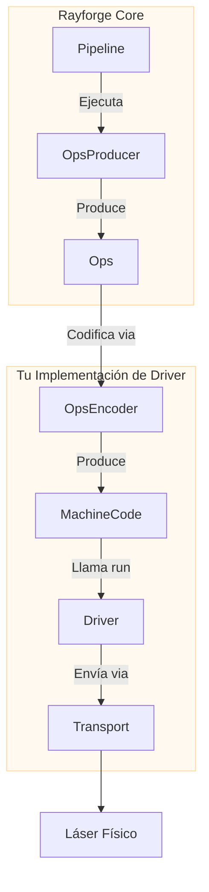

# Guía de Desarrollo de Drivers

Esta guía proporciona una visión general de alto nivel de cómo crear un driver en Rayforge para añadir soporte para tu cortadora o grabadora láser. Al crear un driver, integras el protocolo de comunicación único y el lenguaje de comandos de tu máquina en el ecosistema Rayforge.

## Resumen del Driver

Un driver es el puente entre la lógica core de Rayforge y tu hardware físico. Es responsable de tres tareas principales:

1.  **Gestionar Conectividad:** Manejar el protocolo de comunicación de bajo nivel (Serial, WebSocket, HTTP, etc.).
2.  **Ejecutar Trabajos:** Enviar código de máquina pre-codificado (ej., G-code) al dispositivo y rastrear el progreso de ejecución.
3.  **Reportar Estado:** Emitir señales para actualizar la UI con la posición en tiempo real del láser, estado (`IDLE`, `RUN`), y mensajes de log.

Para simplificar esto, Rayforge proporciona una arquitectura basada en partes componibles:



- **`OpsEncoder`:** Traduce `Ops` a un lenguaje de comandos específico (ej., G-code). Usado tanto por el Pipeline (para codificación de trabajos) como por el Driver (para comandos individuales como move_to, home, etc.).
- **`Pipeline`:** Orquesta la codificación y produce código de máquina final.
- **`Transport`:** Gestiona la conexión y transferencia de datos.
- **`Driver`:** Ejecuta código de máquina, maneja estado del dispositivo y se comunica con la UI.

Todas las operaciones del driver son **asíncronas** para asegurar que la interfaz de usuario permanezca responsiva.

## El Lenguaje `Ops`

Rayforge describe un trabajo láser como una secuencia de operaciones de alto nivel, almacenadas en un objeto `Ops`. Este es el lenguaje universal dentro de Rayforge para describir movimientos de máquina, independiente de cualquier hardware específico.

| Método `Ops`         | Firma                         | Descripción                          |
| :------------------- | :---------------------------- | :----------------------------------- |
| `move_to`            | `(x, y, z=0.0)`               | Movimiento rápido (sin corte)        |
| `line_to`            | `(x, y, z=0.0)`               | Movimiento de Corte/Grabado          |
| `arc_to`             | `(x, y, i, j, cw=True, z=0.0)`| Movimiento de arco de Corte/Grabado  |
| `set_power`          | `(power)`                     | Establecer potencia láser (0-100%)   |
| `set_cut_speed`      | `(speed)`                     | Establecer velocidad para movimientos de corte (mm/min) |
| `set_travel_speed`   | `(speed)`                     | Establecer velocidad para movimientos rápidos (mm/min) |
| `enable_air_assist`  | `()`                          | Encender asistencia de aire          |
| `disable_air_assist` | `()`                          | Apagar asistencia de aire            |

Tu driver recibe código de máquina pre-codificado (ej., una cadena G-code) y un mapa de operaciones que rastrea qué comandos de código de máquina corresponden a qué operaciones. El pipeline maneja la codificación de `Ops` a código de máquina antes de llamar al método `run()` del driver.

```python
# Ejemplo de cómo Rayforge construye un objeto Ops
ops = Ops()
ops.set_travel_speed(3000)
ops.set_cut_speed(800)
ops.set_power(80)

ops.move_to(10, 10)       # Movimiento rápido al punto de inicio
ops.enable_air_assist()
ops.line_to(50, 10)       # Cortar una línea con asistencia de aire
ops.disable_air_assist()
ops.line_to(50, 50)       # Cortar una línea sin asistencia de aire
```

## Implementación del Driver

Todos los drivers DEBEN heredar de `rayforge.machine.drivers.Driver`.

```python
from rayforge.machine.driver.driver import Driver

class YourDriver(Driver):
    label = "Tu Dispositivo"  # Nombre para mostrar en la UI
    subtitle = "Descripción para usuarios"
    supports_settings = False # Establece True si el driver puede leer/escribir ajustes de firmware
```

### Propiedades Requeridas

- `label`: Un nombre legible por humanos mostrado en la UI.
- `subtitle`: Una breve descripción mostrada debajo del nombre.
- `supports_settings`: Un booleano indicando si el driver puede leer/escribir ajustes del dispositivo (como `$$` de GRBL).

### Métodos Requeridos

Tu clase driver **DEBE** implementar los siguientes métodos. Nota que la mayoría son **asíncronos** y deben definirse con `async def`.

#### Configuración y Ciclo de Vida

- `get_setup_vars() -> VarSet`: **(Método de Clase)** Devuelve un objeto `VarSet` definiendo los parámetros necesarios para la conexión (ej., dirección IP, puerto serial). Rayforge usa esto para generar automáticamente el formulario de configuración en la UI.
- `precheck(**kwargs)`: **(Método de Clase)** Una verificación estática y sin bloqueo de la configuración que puede ejecutarse antes de la instanciación del driver. Debería lanzar `DriverPrecheckError` en caso de fallo.
- `setup(**kwargs)`: Llamado una vez con los valores del formulario de configuración. Úsalo para inicializar tus transports y estado interno.
- `async def connect()`: Establece y mantiene una conexión persistente con el dispositivo. Este método debería contener lógica de auto-reconexión.
- `async def cleanup()`: Llamado al desconectar. Debería cerrar todas las conexiones y liberar recursos.

#### Control de Dispositivo

- `async def run(machine_code: Any, op_map: MachineCodeOpMap, doc: Doc, on_command_done: Optional[Callable[[int], Union[None, Awaitable[None]]]] = None)`: El método core para ejecutar un trabajo. Recibe código de máquina pre-codificado (ej., cadena G-code) y un mapeo entre índices de operación y código de máquina. El callback `on_command_done` se llama con el op_index cuando cada comando completa.
- `async def home(axes: Optional[Axis] = None)`: Lleva la máquina al origen. Puede llevar al origen ejes específicos o todos los ejes.
- `async def move_to(pos_x: float, pos_y: float)`: Mueve manualmente el cabezal láser a una coordenada XY específica.
- `async def set_hold(hold: bool = True)`: Pausa o reanuda el trabajo actual.
- `async def cancel()`: Detiene el trabajo actual.
- `async def jog(axis: Axis, distance: float, speed: int)`: Mueve la máquina a lo largo de un eje específico.
- `async def select_tool(tool_number: int)`: Selecciona una nueva herramienta/cabezal láser por su número.
- `async def clear_alarm()`: Limpia cualquier estado de alarma activo.

#### Ajustes de Firmware (si `supports_settings` es `True`)

- `get_setting_vars() -> List[VarSet]`: Devuelve objetos `VarSet` que definen la estructura de la página de ajustes del dispositivo.
- `async def read_settings()`: Lee todos los ajustes del dispositivo y llama a `_on_settings_read()` con el resultado.
- `async def write_setting(key: str, value: Any)`: Escribe un solo ajuste al dispositivo.

### Emitir Señales

Para comunicarse con la UI, tu driver debe emitir señales. Para asegurar logging apropiado y seguridad de hilos, **no debes emitir señales directamente.** En su lugar, llama a los métodos helper protegidos desde la clase base `Driver`.

- `self._log(message)`: Envía un mensaje de log a la consola.
- `self._on_state_changed()`: Llama a esto cuando actualices `self.state` para notificar a la UI de un cambio de estado o posición.
- `self._on_connection_status_changed(status, message)`: Informa a la UI sobre el estado de conexión (`CONNECTING`, `CONNECTED`, `ERROR`, etc.).
- `self._on_command_status_changed(status, message)`: Reporta el estado de un comando enviado.
- `self._on_settings_read(settings)`: Envía los ajustes del dispositivo que has leído de vuelta a la UI.

## ¿Tienes Preguntas?

La mejor forma de aprender es mirar los drivers existentes en `rayforge/machine/driver/`, como:

- `grbl.py` - Máquinas basadas en GRBL
- `grbl_serial.py` - Comunicación GRBL basada en serial
- `smoothie.py` - Máquinas basadas en Smoothieboard
- `dummy.py` - Un driver de prueba para desarrollo

Si te quedas atascado, ¡no dudes en abrir un issue en GitHub! Estamos felices de ayudar.
