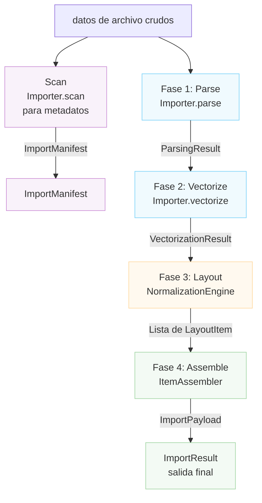

# Arquitectura del Importador

Este documento describe la arquitectura del sistema de importación de archivos de Rayforge, que maneja la conversión de varios formatos de archivo (SVG, DXF, PNG, PDF, etc.) al modelo de documento de Rayforge.

## Tabla de Contenidos

- [Resumen](#resumen)
- [Pipeline de Importación](#pipeline-de-importación)
- [Método Scan](#método-scan)
- [Sistemas de Coordenadas](#sistemas-de-coordenadas)
- [Claves Principales](#claves-principales)
- [Crear un Nuevo Importador](#crear-un-nuevo-importador)

---

## Resumen

El sistema de importación está construido alrededor de un pipeline de cuatro fases que transforma datos de archivo crudos en objetos de documento completamente posicionados. Cada fase tiene una responsabilidad específica y produce estructuras de datos bien definidas.



---

## Pipeline de Importación

### Fase 1: Parse

**Método:** `Importer.parse()`

Extrae hechos geométricos del archivo incluyendo límites, detalles del sistema de coordenadas e información de capas.

**Salida:** `ParsingResult`

- `document_bounds`: Tamaño total del lienzo en Coordenadas Nativas
- `native_unit_to_mm`: Factor de conversión a milímetros
- `is_y_down`: Bandera de orientación del eje Y
- `layers`: Lista de `LayerGeometry`
- `world_frame_of_reference`: Coordenadas Mundo (mm, Y-Arriba)
- `background_world_transform`: Matriz para posicionamiento de fondo
- `untrimmed_document_bounds`: Referencia para inversión Y

**Sistema de Coordenadas:**

- `document_bounds`: Coordenadas Nativas (específicas del archivo)
- `world_frame_of_reference`: Coordenadas Mundo (mm, Y-Arriba)

---

### Fase 2: Vectorize

**Método:** `Importer.vectorize()`

Convierte datos parseados en objetos `Geometry` vectoriales según el `VectorizationSpec`.

**Salida:** `VectorizationResult`

- `geometries_by_layer`: Geometría vectorial por capa (Coordenadas Nativas)
- `source_parse_result`: Referencia al ParsingResult original
- `fills_by_layer`: Geometría de relleno opcional (importador Sketch)

**Sistema de Coordenadas:** Coordenadas Nativas (específicas del archivo)

---

### Fase 3: Layout

**Clase:** `NormalizationEngine`

Calcula matrices de transformación para mapear Coordenadas Nativas a Coordenadas Mundo basándose en la intención del usuario.

**Salida:** `List[LayoutItem]`

Cada `LayoutItem` contiene:

- `world_matrix`: Normalizado (0-1, Y-Arriba) → Mundo (mm, Y-Arriba)
- `normalization_matrix`: Nativo → Normalizado (0-1, Y-Arriba)
- `crop_window`: Subconjunto del archivo original en Coordenadas Nativas
- `layer_id`, `layer_name`: Identificación de capa

**Sistema de Coordenadas:**

- Entrada: Coordenadas Nativas
- Salida: Coordenadas Mundo (mm, Y-Arriba) via espacio Normalizado intermedio

---

### Fase 4: Assemble

**Clase:** `ItemAssembler`

Instancia objetos de dominio Rayforge (`WorkPiece`, `Layer`) basándose en el plan de layout.

**Salida:** `ImportPayload`

- `source`: El `SourceAsset`
- `items`: Lista de `DocItem` listos para inserción
- `sketches`: Lista opcional de objetos `Sketch`

**Sistema de Coordenadas:** Todos los DocItems en Coordenadas Mundo (mm, Y-Arriba)

---

## Método Scan

**Método:** `Importer.scan()`

Un escaneo ligero que extrae metadatos sin procesamiento completo. Usado para construir la UI para un importador, incluyendo lista de selección de capas. Esto NO es parte del pipeline de importación principal ejecutado por `get_doc_items()`.

**Salida:** `ImportManifest`

- `layers`: Lista de objetos `LayerInfo`
- `natural_size_mm`: Dimensiones físicas en milímetros (Y-Arriba)
- `title`: Título opcional del documento
- `warnings`, `errors`: Problemas no críticos descubiertos

**Sistema de Coordenadas:** Coordenadas Mundo (mm, Y-Arriba) para `natural_size_mm`

---

## Sistemas de Coordenadas

El pipeline de importación maneja múltiples sistemas de coordenadas a través de transformación cuidadosa:

### Coordenadas Nativas (Entrada)

- Sistema de coordenadas específico del archivo (unidades de usuario SVG, unidades DXF, píxeles)
- La orientación del eje Y varía por formato
- Los límites son absolutos dentro del espacio de coordenadas del documento
- Unidades convertidas a mm via factor `native_unit_to_mm`

### Coordenadas Normalizadas (Intermedio)

- Cuadrado unitario de (0,0) a (1,1)
- El eje Y apunta hacia ARRIBA (convención Y-Arriba)
- Usado como representación intermedia entre nativo y mundo

### Coordenadas Mundo (Salida)

- Coordenadas de mundo físico en milímetros (mm)
- El eje Y apunta hacia ARRIBA (convención Y-Arriba)
- El origen (0,0) está en la parte inferior-izquierda del workpiece
- Todas las posiciones son absolutas en el sistema de coordenadas mundo

### Orientación del Eje Y

- **Formatos Y-Abajo** (SVG, imágenes): Origen en parte superior-izquierda, Y aumenta hacia abajo
- **Formatos Y-Arriba** (DXF): Origen en parte inferior-izquierda, Y aumenta hacia arriba
- Los importadores deben configurar la bandera `is_y_down` correctamente en `ParsingResult`
- `NormalizationEngine` maneja la inversión Y para fuentes Y-Abajo

---

## Claves Principales

### Importer (Clase Base)

Clase base abstracta que define la interfaz para todos los importadores. Las subclases deben implementar los métodos del pipeline y declarar sus capacidades via el atributo `features`.

**Características:**

- `BITMAP_TRACING`: Puede trazar imágenes raster a vectores
- `DIRECT_VECTOR`: Puede extraer geometría vectorial directamente
- `LAYER_SELECTION`: Soporta importaciones basadas en capas
- `PROCEDURAL_GENERATION`: Genera contenido programáticamente

### Estructuras de Datos

| Clase                 | Fase     | Propósito                    |
| --------------------- | --------- | -------------------------- |
| `LayerInfo`           | Scan      | Metadatos de capa ligeros   |
| `ImportManifest`      | Scan      | Resultado de fase de escaneo |
| `LayerGeometry`       | Parse     | Información de capa geométrica |
| `ParsingResult`       | Parse     | Hechos geométricos          |
| `VectorizationResult` | Vectorize | Geometría vectorial         |
| `LayoutItem`          | Layout    | Configuración de transformación |
| `ImportPayload`       | Assemble  | Salida final               |
| `ImportResult`        | Final     | Wrapper de resultado completo |

### Componentes de Soporte

- `NormalizationEngine`: Cálculos de layout de Fase 3
- `ItemAssembler`: Creación de objetos de Fase 4

---

## Crear un Nuevo Importador

Para añadir soporte para un nuevo formato de archivo:

1. **Crea una nueva clase importadora** que herede de `Importer`
2. **Declara características soportadas** via el atributo de clase `features`
3. **Implementa los métodos requeridos**:
   - `scan()`: Extraer metadatos rápidamente (para previsualizaciones UI)
   - `parse()`: Extraer hechos geométricos
   - `vectorize()`: Convertir a geometría vectorial
   - `create_source_asset()`: Crear el asset fuente
4. **Registra el importador** en `rayforge/image/__init__.py`
5. **Añade mapeos de tipo MIME y extensión**

**Ejemplo:**

```python
from rayforge.image.base_importer import Importer, ImporterFeature
from rayforge.image.structures import (
    ImportManifest,
    ParsingResult,
    VectorizationResult,
)
from rayforge.core.source_asset import SourceAsset

class MyFormatImporter(Importer):
    label = "Mi Formato"
    mime_types = ("application/x-myformat",)
    extensions = (".myf",)
    features = {ImporterFeature.DIRECT_VECTOR}

    def scan(self) -> ImportManifest:
        # Extraer metadatos sin procesamiento completo
        return ImportManifest(
            layers=[],
            natural_size_mm=(100.0, 100.0),
        )

    def parse(self) -> Optional[ParsingResult]:
        # Extraer hechos geométricos
        return ParsingResult(
            document_bounds=(0, 0, 100, 100),
            native_unit_to_mm=1.0,
            is_y_down=False,
            layers=[],
            world_frame_of_reference=(0, 0, 100, 100),
            background_world_transform=Matrix.identity(),
        )

    def vectorize(
        self, parse_result: ParsingResult, spec: VectorizationSpec
    ) -> VectorizationResult:
        # Convertir a geometría vectorial
        return VectorizationResult(
            geometries_by_layer={None: Geometry()},
            source_parse_result=parse_result,
        )

    def create_source_asset(
        self, parse_result: ParsingResult
    ) -> SourceAsset:
        # Crear el asset fuente
        return SourceAsset(
            original_data=self.raw_data,
            metadata={},
        )
```
