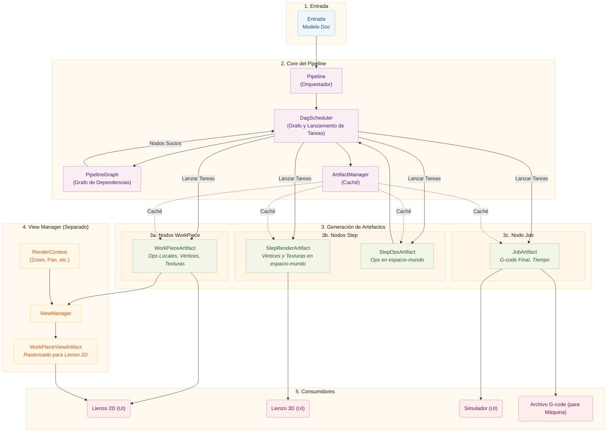

# Arquitectura del Pipeline

Este documento describe la arquitectura del pipeline, que usa un Grafo Acíclico Dirigido (DAG) para orquestar la generación de artefactos. El pipeline transforma datos de diseño crudos en salidas finales para visualización y manufactura, con programación consciente de dependencias y caché eficiente de artefactos.

# Conceptos Core

## Nodos de Artefacto y el Grafo de Dependencias

El pipeline usa un **Grafo Acíclico Dirigido (DAG)** para modelar artefactos y sus dependencias. Cada artefacto se representa como un `ArtifactNode` en el grafo.

### ArtifactNode

Cada nodo contiene:

- **ArtifactKey**: Un identificador único que consiste en un ID y un tipo de grupo (`workpiece`, `step`, `job`, o `view`)
- **Estado**: El estado actual del ciclo de vida del nodo
- **Dependencias**: Lista de nodos de los que este nodo depende (hijos)
- **Dependientes**: Lista de nodos que dependen de este nodo (padres)

### Estados de Nodo

Los nodos progresan a través de cuatro estados:

| Estado        | Descripción                                 |
| ------------- | ------------------------------------------- |
| `DIRTY`       | El artefacto necesita ser regenerado        |
| `PROCESSING`  | Una tarea está generando actualmente el artefacto |
| `VALID`       | El artefacto está listo y actualizado       |
| `ERROR`       | La generación falló                         |

Cuando un nodo se marca como sucio, todos sus dependientes también se marcan como sucios, propagando la invalidación hacia arriba en el grafo.

### PipelineGraph

El `PipelineGraph` se construye desde el modelo Doc y contiene:

- Un nodo para cada par `(WorkPiece, Step)`
- Un nodo para cada Step
- Un nodo para el Job

Las dependencias se establecen:

- Los Steps dependen de sus nodos de par `(WorkPiece, Step)`
- El Job depende de todos los Steps

## DagScheduler

El `DagScheduler` es el orquestador central del pipeline. Es dueño del `PipelineGraph` y es responsable de:

1. **Construir el grafo** desde el modelo Doc
2. **Identificar nodos listos** (DIRTY con todas las dependencias VALID)
3. **Lanzar tareas** para generar artefactos
4. **Rastrear estado** a través del proceso de generación
5. **Notificar consumidores** cuando los artefactos están listos

El scheduler trabaja con IDs de generación para rastrear qué artefactos pertenecen a qué versión del documento, permitiendo reuso de artefactos válidos a través de generaciones.

Comportamientos clave:

- Cuando el grafo se construye, el scheduler sincroniza estados de nodo con el artifact manager para identificar artefactos cacheados que pueden reusarse
- Los artefactos de la generación anterior pueden reusarse si permanecen válidos
- El scheduler rastrea qué IDs de generación tienen tareas ejecutándose para preservar artefactos durante transiciones de generación
- Las invalidaciones se rastrean incluso antes de reconstruir el grafo y se vuelven a aplicar después

## ArtifactManager

El `ArtifactManager` es un gestor de caché puro para handles de artefactos. Este:

- Almacena y recupera handles de artefactos
- Gestiona conteo de referencias para limpieza
- Maneja ciclo de vida (creación, retención, liberación)
- NO rastrea estado (el estado es gestionado por el scheduler DAG)

## Ciclo de Vida de Memoria Compartida

Los artefactos se almacenan en memoria compartida (`multiprocessing.shared_memory`) para comunicación eficiente entre procesos entre procesos worker y el proceso principal. El `ArtifactStore` gestiona el ciclo de vida de estos bloques de memoria.

### Patrones de Propiedad

**Propiedad Local:** El proceso creador es dueño del handle y lo libera cuando termina. Este es el patrón más simple.

**Entrega Entre Procesos:** Un worker crea un artefacto, lo envía al proceso principal via IPC, y transfiere propiedad. El worker "olvida" el handle (cierra su descriptor de archivo sin desvincular la memoria), mientras el proceso principal lo "adopta" y se hace responsable de su eventual liberación.

### Conteo de Referencias

El `ArtifactStore` mantiene conteos de referencias para cada bloque de memoria compartida. Múltiples callers pueden hacer `retain()` a un handle, y el bloque solo se desvincula cuando el conteo llega a cero. Esto es usado por el `ViewManager` para renderizado progresivo donde múltiples callbacks pueden acceder al mismo artefacto.

## Etapas del Pipeline

Las etapas del pipeline (`WorkPiecePipelineStage`, `StepPipelineStage`, `JobPipelineStage`) ahora sirven como interfaces en lugar de lanzadores de tareas:

- Manejan solicitudes de invalidación desde la UI
- Delegan lanzamiento de tareas al DagScheduler
- Proporcionan acceso a artefactos cacheados
- Reenvían señales desde el scheduler a la UI

## InvalidationScope

El enum `InvalidationScope` define el alcance de invalidación para artefactos downstream:

| Alcance               | Descripción                                                                                                                                                    |
| --------------------- | -------------------------------------------------------------------------------------------------------------------------------------------------------------- |
| `FULL_REPRODUCTION`   | Invalida workpieces, que se propaga a steps y luego al job. Usado para cambios que requieren regeneración de artefactos (geometría, parámetros, cambios de tamaño). |
| `STEP_ONLY`           | Invalida steps directamente, que se propaga al job. Usado para cambios de transformación solo de posición/rotación donde la geometría del workpiece permanece sin cambios.           |

# Desglose Detallado

## Entrada

El proceso comienza con el **Modelo Doc**, que contiene:

- **WorkPieces:** Elementos de diseño individuales (SVGs, imágenes) colocados en el lienzo
- **Steps:** Instrucciones de procesamiento (Contour, Raster) con ajustes

## Core del Pipeline

### Pipeline (Orquestador)

La clase `Pipeline` es el director de alto nivel que:

- Escucha al modelo Doc para cambios
- Coordina con el DagScheduler para disparar regeneración
- Gestiona el estado de procesamiento general
- Conecta señales entre componentes

### DagScheduler

El `DagScheduler`:

- Construye y mantiene el `PipelineGraph`
- Identifica nodos listos para procesamiento
- Lanza tareas via el TaskManager
- Rastrea transiciones de estado de nodo
- Emite señales cuando los artefactos están listos

### ArtifactManager

El `ArtifactManager`:

- Cachea handles de artefactos en memoria compartida
- Gestiona conteo de referencias para limpieza
- Proporciona búsqueda por ArtifactKey e ID de generación

## Generación de Artefactos

### WorkPieceArtifacts

Generados para cada combinación `(WorkPiece, Step)`, conteniendo:

- Toolpaths (`Ops`) en sistema de coordenadas local
- Datos de vértices para líneas
- Datos de textura para rellenos raster

Secuencia de procesamiento:

1. **Modificadores:** (Opcional) Acondicionamiento de imagen (escala de grises, etc.)
2. **Productor:** Crea toolpaths crudos (`Ops`)
3. **Transformadores:** Modificaciones por workpiece (Tabs, Smooth)
4. **Codificador de Vértices:** Crea datos amigables para GPU

### StepArtifacts

Generados para cada Step, consumiendo todos los WorkPieceArtifacts relacionados:

**StepRenderArtifact:**

- Datos combinados de vértices y textura para todos los workpieces
- Transformados a coordenadas de espacio-mundo
- Optimizados para renderizado de lienzo 3D

**StepOpsArtifact:**

- Ops combinadas para todos los workpieces
- Transformadas a coordenadas de espacio-mundo
- Incluye transformadores por-step (Optimize, Multi-Pass)

### JobArtifact

Generado bajo demanda cuando se necesita G-code, consumiendo todos los StepOpsArtifacts:

- G-code final para el trabajo completo
- Datos de vértices completos para simulación
- Estimación de tiempo de alta fidelidad

## ViewManager (Separado)

El `ViewManager` está **desacoplado** del pipeline de datos. Maneja el renderizado para el lienzo 2D basándose en el estado de la UI:

### RenderContext

Contiene los parámetros de vista actuales:

- Píxeles por milímetro (nivel de zoom)
- Offset del viewport (pan)
- Opciones de visualización (mostrar movimientos de viaje, etc.)

### WorkPieceViewArtifacts

El ViewManager crea `WorkPieceViewArtifacts` que:

- Rasterizan WorkPieceArtifacts a espacio de pantalla
- Aplican el RenderContext actual
- Son cacheados y actualizados cuando el contexto o la fuente cambia

### Ciclo de Vida

1. ViewManager rastrea handles de `WorkPieceArtifact` fuente
2. Cuando el contexto de renderizado cambia, ViewManager dispara re-renderizado
3. Cuando el artefacto fuente cambia, ViewManager dispara re-renderizado
4. El throttling previene actualizaciones excesivas durante cambios continuos

El ViewManager indexa vistas por `(workpiece_uid, step_uid)` para soportar visualización de estados intermedios de un workpiece a través de múltiples steps.

## Consumidores

| Consumidor   | Usa                      | Propósito                             |
| ------------ | ------------------------ | ------------------------------------- |
| Lienzo 2D    | WorkPieceViewArtifacts   | Renderiza workpieces en espacio de pantalla |
| Lienzo 3D    | StepRenderArtifacts      | Renderiza step completo en espacio mundo |
| Simulador    | JobArtifact              | Simulación precisa de ruta de máquina |
| Máquina      | JobArtifact G-code       | Salida de manufactura                 |

# Diferencias Clave de la Arquitectura Anterior

1. **Programación basada en DAG:** En lugar de etapas secuenciales, los artefactos se generan a medida que sus dependencias se vuelven disponibles.

2. **Gestión de Estado:** El estado del nodo se rastrea en el grafo DAG, no en componentes individuales.

3. **Separación de ViewManager:** El renderizado para el lienzo 2D ahora es manejado por un ViewManager separado, no como parte del pipeline de datos.

4. **IDs de Generación:** Los artefactos se rastrean con IDs de generación, permitiendo reuso eficiente a través de versiones de documento.

5. **Orquestación Centralizada:** El DagScheduler es el punto único de control para lanzamiento de tareas y rastreo de estado.

6. **Gestor de Caché Puro:** El ArtifactManager es ahora un caché simple, delegando toda gestión de estado al scheduler DAG.

7. **Rastreo de Invalidación:** Las keys marcadas como sucias antes de reconstruir el grafo se preservan y se vuelven a aplicar después de la reconstrucción.

8. **Detección de Trabajo Pendiente:** Solo los nodos `PROCESSING` cuentan como trabajo pendiente; los nodos `DIRTY` pueden tener dependencias no satisfechas (ej., sin contexto de vista).
