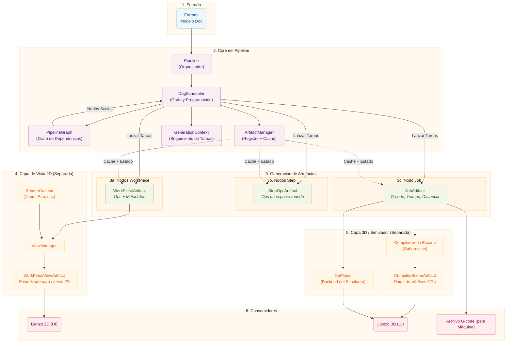

# Arquitectura del Pipeline

Este documento describe la arquitectura del pipeline, que usa un Grafo Acíclico
Dirigido (DAG) para orquestar la generación de artefactos. El pipeline transforma
datos de diseño crudos en salidas finales para visualización y manufactura, con
programación consciente de dependencias y caché eficiente de artefactos.

```mermaid
graph TD
    subgraph Input["1. Entrada"]
        InputNode("Entrada<br/>Modelo Doc")
    end

    subgraph PipelineCore["2. Core del Pipeline"]
        Pipeline["Pipeline<br/>(Orquestador)"]
        DAG["DagScheduler<br/>(Grafo y Programación)"]
        Graph["PipelineGraph<br/>(Grafo de Dependencias)"]
        AM["ArtifactManager<br/>(Registro + Caché)"]
        GC["GenerationContext<br/>(Seguimiento de Tareas)"]
    end

    subgraph ArtifactGen["3. Generación de Artefactos"]
        subgraph WorkPieceNodes["3a. Nodos WorkPiece"]
            WP["WorkPieceArtifact<br/><i>Ops + Metadatos</i>"]
        end

        subgraph StepNodes["3b. Nodos Step"]
            SO["StepOpsArtifact<br/><i>Ops en espacio-mundo</i>"]
        end

        subgraph JobNode["3c. Nodo Job"]
            JA["JobArtifact<br/><i>G-code, Tiempo, Distancia</i>"]
        end
    end

    subgraph View2D["4. Capa de Vista 2D (Separada)"]
        VM["ViewManager"]
        RC["RenderContext<br/>(Zoom, Pan, etc.)"]
        WV["WorkPieceViewArtifact<br/><i>Rasterizado para Lienzo 2D</i>"]
    end

    subgraph View3D["5. Capa 3D / Simulador (Separada)"]
        SC["Compilador de Escena<br/>(Subproceso)"]
        CS["CompiledSceneArtifact<br/><i>Datos de Vértices GPU</i>"]
        OP["OpPlayer<br/>(Backend del Simulador)"]
    end

    subgraph Consumers["6. Consumidores"]
        Vis2D("Lienzo 2D (UI)")
        Vis3D("Lienzo 3D (UI)")
        File("Archivo G-code (para Máquina)")
    end

    InputNode --> Pipeline
    Pipeline --> DAG
    DAG --> Graph
    DAG --> AM
    DAG --> GC

    Graph -->|"Nodos Sucios"| DAG
    DAG -->|"Lanzar Tareas"| WP
    DAG -->|"Lanzar Tareas"| SO
    DAG -->|"Lanzar Tareas"| JA

    AM -.->|"Caché + Estado"| WP
    AM -.->|"Caché + Estado"| SO
    AM -.->|"Caché + Estado"| JA

    WP --> VM
    JA --> SC
    JA --> OP
    JA --> File

    RC --> VM
    VM --> WV
    WV --> Vis2D

    SC --> CS
    CS --> Vis3D
    OP --> Vis3D

    classDef clusterBox fill:#fff3e080,stroke:#ffb74d80,stroke-width:1px,color:#1a1a1a
    classDef inputNode fill:#e1f5fe80,stroke:#03a9f480,color:#0d47a1
    classDef coreNode fill:#f3e5f580,stroke:#9c27b080,color:#4a148c
    classDef artifactNode fill:#e8f5e980,stroke:#4caf5080,color:#1b5e20
    classDef viewNode fill:#fff8e180,stroke:#ffc10780,color:#e65100
    classDef consumerNode fill:#fce4ec80,stroke:#e91e6380,color:#880e4f
    class Input,PipelineCore,ArtifactGen,WorkPieceNodes,StepNodes,JobNode,View2D,View3D,Consumers clusterBox
    class InputNode inputNode
    class Pipeline,DAG,Graph,AM,GC coreNode
    class WP,SO,JA artifactNode
    class VM,RC,WV,SC,CS,OP viewNode
    class Vis2D,Vis3D,File consumerNode
```

# Conceptos Core

## Nodos de Artefacto y el Grafo de Dependencias

El pipeline usa un **Grafo Acíclico Dirigido (DAG)** para modelar artefactos y
sus dependencias. Cada artefacto se representa como un `ArtifactNode` en el
grafo.

### ArtifactNode

Cada nodo contiene:

- **ArtifactKey**: Un identificador único que consiste en un ID y un tipo de
  grupo (`workpiece`, `step`, `job`, o `view`)
- **Dependencias**: Lista de nodos de los que este nodo depende (hijos)
- **Dependientes**: Lista de nodos que dependen de este nodo (padres)

Los nodos no almacenan estado directamente. En su lugar, delegan lecturas y
escrituras de estado al `ArtifactManager`, que mantiene un registro de todos
los artefactos y sus estados.

### Estados de Nodo

Los nodos progresan a través de cinco estados:

| Estado        | Descripción                                                        |
| ------------- | ------------------------------------------------------------------ |
| `DIRTY`       | El artefacto necesita ser (re)generado                             |
| `PROCESSING`  | Una tarea está generando actualmente el artefacto                  |
| `VALID`       | El artefacto está listo y actualizado                              |
| `ERROR`       | La generación falló                                                |
| `CANCELLED`   | La generación fue cancelada; se reintentará si aún se necesita     |

Cuando un nodo se marca como sucio, todos sus dependientes también se marcan
como sucios, propagando la invalidación hacia arriba en el grafo.

### PipelineGraph

El `PipelineGraph` se construye desde el modelo Doc y contiene:

- Un nodo para cada par `(WorkPiece, Step)`
- Un nodo para cada Step
- Un nodo para el Job

Las dependencias se establecen:

- Los Steps dependen de sus nodos de par `(WorkPiece, Step)`
- El Job depende de todos los Steps

## DagScheduler

El `DagScheduler` es el orquestador central del pipeline. Es dueño del
`PipelineGraph` y es responsable de:

1. **Construir el grafo** desde el modelo Doc
2. **Identificar nodos listos** (DIRTY con todas las dependencias VALID)
3. **Disparar lanzamiento de tareas** a través de las etapas apropiadas del
   pipeline
4. **Rastrear estado** a través del proceso de generación
5. **Notificar consumidores** cuando los artefactos están listos

El scheduler trabaja con IDs de generación para rastrear qué artefactos
pertenecen a qué versión del documento, permitiendo reuso de artefactos
válidos a través de generaciones.

Comportamientos clave:

- Cuando el grafo se construye, el scheduler sincroniza estados de nodo con
  el artifact manager para identificar artefactos cacheados que pueden
  reusarse
- Los artefactos de la generación anterior pueden reusarse si permanecen
  válidos
- Las invalidaciones se rastrean incluso antes de reconstruir el grafo y se
  vuelven a aplicar después
- El scheduler delega la creación real de tareas a las etapas pero controla
  **cuándo** se lanzan las tareas basándose en la disponibilidad de
  dependencias

## ArtifactManager

El `ArtifactManager` sirve tanto como caché como fuente única de verdad para
el estado de los artefactos. Este:

- Almacena y recupera handles de artefactos mediante un **registro** (indexado
  por `ArtifactKey` + ID de generación)
- Rastrea estado (`DIRTY`, `VALID`, `ERROR`, etc.) en entradas del registro
- Gestiona conteo de referencias para limpieza de memoria compartida
- Maneja ciclo de vida (creación, retención, liberación, poda)
- Proporciona gestores de contexto para adopción segura de artefactos,
  reporte de finalización, fallo y cancelación

## GenerationContext

Cada ciclo de reconciliación crea un `GenerationContext` que rastrea todas
las tareas activas para esa generación. Asegura que los recursos de memoria
compartida permanezcan válidos hasta que todas las tareas en vuelo de una
generación hayan completado, incluso si una generación más nueva ya ha
comenzado. Cuando un contexto es reemplazado y todas sus tareas finalizan,
libera automáticamente sus recursos.

## Ciclo de Vida de Memoria Compartida

Los artefactos se almacenan en memoria compartida
(`multiprocessing.shared_memory`) para comunicación eficiente entre procesos
worker y el proceso principal. El `ArtifactStore` gestiona el ciclo de vida
de estos bloques de memoria.

### Patrones de Propiedad

**Propiedad Local:** El proceso creador es dueño del handle y lo libera cuando
termina. Este es el patrón más simple.

**Entrega Entre Procesos:** Un worker crea un artefacto, lo envía al proceso
principal via IPC, y transfiere propiedad. El worker "olvida" el handle
(cierra su descriptor de archivo sin desvincular la memoria), mientras el
proceso principal lo "adopta" y se hace responsable de su eventual liberación.

### Detección de Artefactos Obsoletos

El mecanismo `StaleGenerationError` previene que artefactos de generaciones
reemplazadas sean adoptados. Cuando una generación más nueva ha comenzado, el
manager detecta artefactos obsoletos durante la adopción y los descarta
silenciosamente.

## Etapas del Pipeline

Las etapas del pipeline (`WorkPiecePipelineStage`, `StepPipelineStage`,
`JobPipelineStage`) son responsables de la **mecánica** de ejecución de tareas:

- Crean y registran tareas de subproceso mediante el `TaskManager`
- Manejan eventos de tareas (fragmentos progresivos, resultados intermedios)
- Gestionan adopción de artefactos y caché al completar tareas
- Emiten señales para notificar al pipeline de cambios de estado

El **DagScheduler** decide **cuándo** activar cada etapa, pero las etapas
manejan el lanzamiento real de subprocesos, manejo de eventos y adopción de
resultados.

## Estrategia de Invalidación

La invalidación es provocada por cambios al modelo Doc, con diferentes
estrategias dependiendo de qué cambió:

| Tipo de Cambio              | Comportamiento                                                                                                  |
| --------------------------- | --------------------------------------------------------------------------------------------------------------- |
| Geometría/parámetros        | Pares workpiece-step invalidados, en cascada a steps y job                                                      |
| Posición/rotación           | Steps invalidados directamente (en cascada a job); workpieces omitidos a menos que sean sensibles a posición    |
| Cambio de tamaño            | Igual que geometría: cascada completa desde pares workpiece-step hacia arriba                                   |
| Configuración de máquina    | Todos los artefactos forzados a invalidación en todas las generaciones                                          |

Los steps sensibles a posición (ej., aquellos con recorte-a-stock habilitado)
provocan invalidación de workpiece incluso para cambios puros de posición.

# Desglose Detallado

## Entrada

El proceso comienza con el **Modelo Doc**, que contiene:

- **WorkPieces:** Elementos de diseño individuales (SVGs, imágenes) colocados
  en el lienzo
- **Steps:** Instrucciones de procesamiento (Contour, Raster, etc.) con
  ajustes
- **Layers:** Agrupación de workpieces, cada uno con su propio flujo de trabajo

## Core del Pipeline

### Pipeline (Orquestador)

La clase `Pipeline` es el director de alto nivel que:

- Escucha al modelo Doc para cambios mediante señales
- **Agrupa cambios** (200ms de retardo de reconciliación, 50ms de retardo de
  eliminación)
- Coordina con el DagScheduler para disparar regeneración
- Gestiona el estado de procesamiento general y detección de ocupado
- Soporta **pausar/reanudar** para operaciones por lotes
- Soporta **modo manual** (`auto_pipeline=False`) donde el recálculo se
  activa explícitamente en lugar de automáticamente
- Conecta señales entre componentes y las retransmite a los consumidores

### DagScheduler

El `DagScheduler`:

- Construye y mantiene el `PipelineGraph`
- Identifica nodos listos para procesamiento
- Dispara lanzamiento de tareas mediante los métodos `launch_task()` de las
  etapas
- Rastrea transiciones de estado de nodo a través del registro
- Emite señales cuando los artefactos están listos

### ArtifactManager

El `ArtifactManager`:

- Mantiene un **registro** de objetos `LedgerEntry`, cada uno rastreando un
  handle, ID de generación y estado de nodo
- Cachea handles de artefactos en memoria compartida
- Gestiona conteo de referencias para limpieza
- Proporciona búsqueda por ArtifactKey e ID de generación
- Poda generaciones obsoletas para mantener el registro limpio

### GenerationContext

Cada reconciliación crea un nuevo `GenerationContext` que:

- Rastrea tareas activas mediante keys con conteo de referencias
- Es dueño de recursos de memoria compartida para su generación
- Se apaga automáticamente cuando es reemplazado y todas las tareas
  completan

## Generación de Artefactos

### WorkPieceArtifacts

Generados para cada combinación `(WorkPiece, Step)`. Contiene:

- Toolpaths (`Ops`) en el sistema de coordenadas local del workpiece
- Flag de escalabilidad y dimensiones fuente para ops independientes de
  resolución
- Sistema de coordenadas y metadatos de generación

Secuencia de procesamiento:

1. **Productor:** Crea toolpaths crudos (`Ops`) desde los datos del workpiece
2. **Transformadores:** Modificaciones por workpiece aplicadas en fases
   ordenadas (Refinamiento de Geometría → Interrupción de Trayectoria →
   Post Procesamiento)

Los workpieces raster grandes se procesan incrementalmente en fragmentos,
permitiendo retroalimentación visual progresiva durante la generación.

### StepOpsArtifacts

Generados para cada Step, consumiendo todos los WorkPieceArtifacts
relacionados:

- Ops combinadas para todos los workpieces en coordenadas de espacio-mundo
- Transformadores por-step aplicados (Optimize, Multi-Pass, etc.)

### JobArtifact

Generado bajo demanda cuando se necesita G-code, consumiendo todos los
StepOpsArtifacts:

- Código de máquina final (G-code o formato específico del controlador)
- Ops completas para simulación y reproducción
- Estimación de tiempo de alta fidelidad y distancia total
- Ops mapeadas rotacionalmente para vista previa 3D

## Capa de Vista 2D (Separada)

El `ViewManager` está **desacoplado** del pipeline de datos. Maneja el
renderizado para el lienzo 2D basándose en el estado de la UI:

### RenderContext

Contiene los parámetros de vista actuales:

- Píxeles por milímetro (nivel de zoom)
- Offset del viewport (pan)
- Opciones de visualización (mostrar movimientos de viaje, etc.)

### WorkPieceViewArtifacts

El ViewManager crea `WorkPieceViewArtifacts` que:

- Rasterizan WorkPieceArtifacts a espacio de pantalla
- Aplican el RenderContext actual
- Son cacheados y actualizados cuando el contexto o la fuente cambia

### Ciclo de Vida

1. ViewManager rastrea handles de `WorkPieceArtifact` fuente
2. Cuando el contexto de renderizado cambia, ViewManager dispara
   re-renderizado
3. Cuando el artefacto fuente cambia, ViewManager dispara re-renderizado
4. El re-renderizado está limitado por throttling (intervalo de 33ms) y
   concurrencia limitada
5. La composición progresiva de fragmentos proporciona actualizaciones
   visuales incrementales

El ViewManager indexa vistas por `(workpiece_uid, step_uid)` para soportar
visualización de estados intermedios de un workpiece a través de múltiples
steps.

## Capa 3D / Simulador (Separada)

El sistema de visualización 3D y simulación está **desacoplado** del pipeline
de datos, siguiendo un patrón similar al ViewManager. Consiste en:

- Un **Compilador de Escena** que se ejecuta en un subproceso para convertir
  las ops del `JobArtifact` en datos de vértices listos para GPU
- Un **OpPlayer** que reproduce las ops del trabajo para simulación en tiempo
  real de la máquina con controles de reproducción

Ambos consumen el `JobArtifact` producido por la etapa de job del pipeline.

### CompiledSceneArtifact

El Compilador de Escena produce un `CompiledSceneArtifact` que contiene:

- **Capas de vértices:** Buffers de vértices powered/travel/zero-power con
  offsets por comando para revelado progresivo
- **Capas de textura:** Mapas de potencia de líneas de escaneo rasterizados
  para vista previa de grabado
- **Capas de superposición:** Segmentos de potencia de líneas de escaneo para
  resaltado en tiempo real
- Soporte para geometría rotacional (envuelta en cilindro)

### Pipeline de Compilación

1. Canvas3D escucha señales de `job_generation_finished`
2. Cuando un nuevo job está listo, programa la compilación de escena en un
   subproceso
3. El subproceso lee el `JobArtifact` desde memoria compartida y compila las
   ops en datos de vértices GPU
4. La escena compilada se adopta de vuelta en memoria compartida y se sube a
   los renderizadores GPU

### OpPlayer (Backend del Simulador)

El `OpPlayer` recorre las ops del trabajo comando por comando, manteniendo un
`MachineState` que rastrea posición, estado del láser y ejes auxiliares. Esto
impulsa:

- La reproducción del lienzo 3D (revelado progresivo de la trayectoria)
- Posición de la cabeza de la máquina y visualización del haz láser
- Avance por comando para el control deslizante de reproducción

## Consumidores

| Consumidor   | Usa                            | Propósito                                        |
| ------------ | ------------------------------ | ------------------------------------------------ |
| Lienzo 2D    | WorkPieceViewArtifacts         | Renderiza workpieces en espacio de pantalla       |
| Lienzo 3D    | CompiledSceneArtifact          | Renderiza trabajo completo en 3D con reproducción |
| Máquina      | JobArtifact (código de máquina)| Salida de manufactura                             |

# Decisiones Arquitectónicas Clave

1. **Programación basada en DAG:** En lugar de etapas secuenciales, los
   artefactos se generan a medida que sus dependencias se vuelven
   disponibles, permitiendo paralelismo.

2. **Estado basado en registro:** El estado del nodo se rastrea en las
   entradas del registro del ArtifactManager en lugar de en los nodos del
   grafo, proporcionando una fuente única de verdad tanto para estado como
   para almacenamiento de handles.

3. **Separación de Capa de Vista:** Tanto el lienzo 2D (ViewManager) como el
   lienzo 3D (Compilador de Escena) están desacoplados del pipeline de datos.
   Cada uno ejecuta su propio renderizado basado en subprocesos y es impulsado
   por señales del pipeline en lugar de ser parte del DAG.

4. **IDs de Generación:** Los artefactos se rastrean con IDs de generación,
   permitiendo reuso eficiente a través de versiones de documento y detección
   de artefactos obsoletos.

5. **Orquestación Centralizada:** El DagScheduler es el punto único de control
   para programación de tareas; las etapas manejan la mecánica de ejecución.

6. **Aislamiento de GenerationContext:** Cada generación tiene su propio
   contexto, asegurando que los recursos permanezcan vivos hasta que todas las
   tareas en vuelo completen.

7. **Rastreo de Invalidación:** Las keys marcadas como sucias antes de
   reconstruir el grafo se preservan y se vuelven a aplicar después de la
   reconstrucción.

8. **Reconciliación con Debounce:** Los cambios se agrupan con retardos
   configurables para evitar ciclos excesivos del pipeline durante ediciones
   rápidas.
