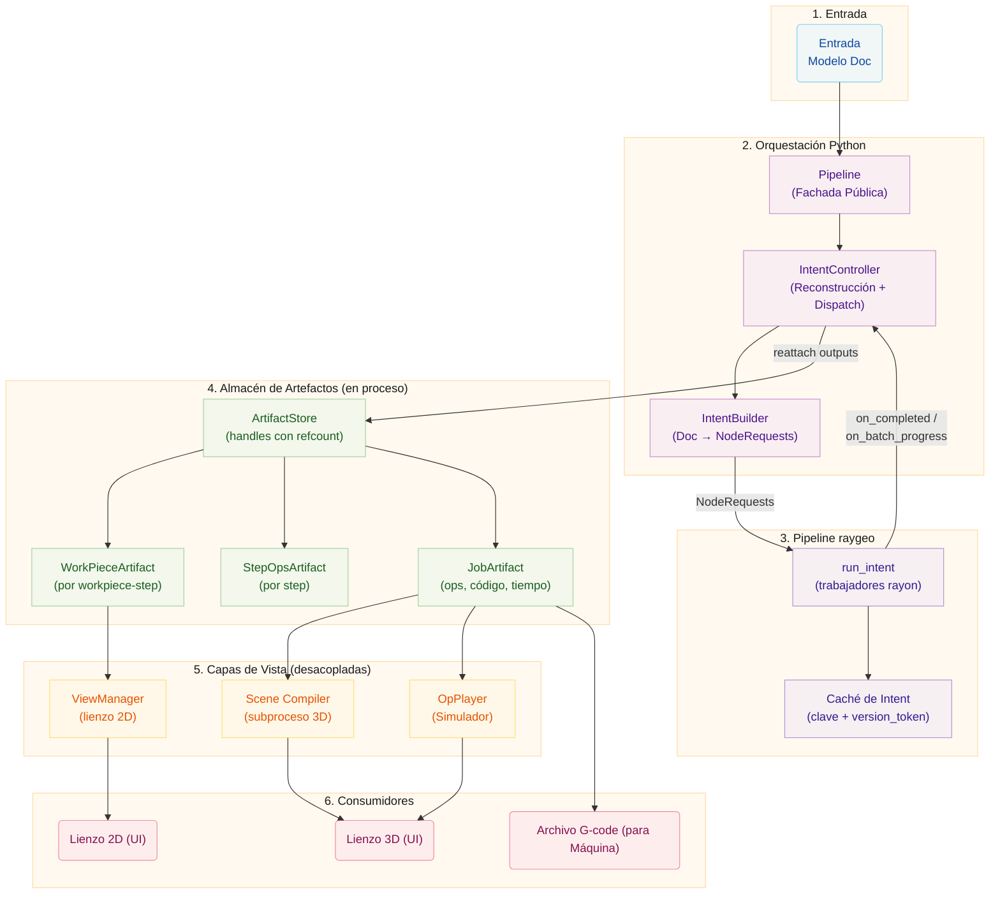

---
description:
  "La pipeline de intenciones de Rayforge: cómo los diseños pasan del modelo Doc a través de
  intenciones raygeo hasta la generación de G-code."
---

# Arquitectura de la Pipeline

Este documento describe la pipeline que convierte un modelo `Doc` en G-code ejecutable por la
máquina. Desde la reescritura 1.9.0, la pipeline se basa en **intenciones raygeo**: una descripción
declarativa del trabajo que debe realizar el lado Rust, junto con una fina capa de orquestación
Python y un almacén de artefactos en proceso con conteo de referencias.

El anterior DAG multiproceso (`DagScheduler`, `PipelineGraph`, `ArtifactManager`,
`GenerationContext`, `WorkPiecePipelineStage`) ha sido eliminado. Este documento describe únicamente
la arquitectura activa.

```mermaid
graph TD
    subgraph Input["1. Entrada"]
        InputNode("Entrada<br/>Modelo Doc")
    end

    subgraph PythonOrchestrator["2. Orquestación Python"]
        Pipeline["Pipeline<br/>(Fachada Pública)"]
        IC["IntentController<br/>(Reconstrucción + Dispatch)"]
        IB["IntentBuilder<br/>(Doc &rarr; NodeRequests)"]
    end

    subgraph Raygeo["3. Pipeline raygeo"]
        RI["run_intent<br/>(trabajadores rayon)"]
        Cache["Caché de Intent<br/>(clave + version_token)"]
    end

    subgraph Artifacts["4. Almacén de Artefactos (en proceso)"]
        Store["ArtifactStore<br/>(handles con refcount)"]
        WP["WorkPieceArtifact<br/>(por workpiece-step)"]
        SO["StepOpsArtifact<br/>(por step)"]
        JA["JobArtifact<br/>(ops, código, tiempo)"]
    end

    subgraph View["5. Capas de Vista (desacopladas)"]
        VM["ViewManager<br/>(lienzo 2D)"]
        SC["Scene Compiler<br/>(subproceso 3D)"]
        OP["OpPlayer<br/>(Simulador)"]
    end

    subgraph Consumers["6. Consumidores"]
        Vis2D("Lienzo 2D (UI)")
        Vis3D("Lienzo 3D (UI)")
        File("Archivo G-code (para Máquina)")
    end

    InputNode --> Pipeline
    Pipeline --> IC
    IC --> IB
    IB -->|"NodeRequests"| RI
    RI -->|"on_completed /<br/>on_batch_progress"| IC
    RI --> Cache
    IC -->|"reattach outputs"| Store
    Store --> WP
    Store --> SO
    Store --> JA

    WP --> VM
    JA --> SC
    JA --> OP
    JA --> File

    VM --> Vis2D
    SC --> Vis3D
    OP --> Vis3D

    classDef clusterBox fill:#fff3e080,stroke:#ffb74d80,stroke-width:1px,color:#1a1a1a
    classDef inputNode fill:#e1f5fe80,stroke:#03a9f480,color:#0d47a1
    classDef pyNode fill:#f3e5f580,stroke:#9c27b080,color:#4a148c
    classDef raygeoNode fill:#ede7f680,stroke:#5e35b180,color:#311b92
    classDef artifactNode fill:#e8f5e980,stroke:#4caf5080,color:#1b5e20
    classDef viewNode fill:#fff8e180,stroke:#ffc10780,color:#e65100
    classDef consumerNode fill:#fce4ec80,stroke:#e91e6380,color:#880e4f
    class Input,PythonOrchestrator,Raygeo,Artifacts,View,Consumers clusterBox
    class InputNode inputNode
    class Pipeline,IC,IB pyNode
    class RI,Cache raygeoNode
    class Store,WP,SO,JA artifactNode
    class VM,SC,OP viewNode
    class Vis2D,Vis3D,File consumerNode
```

# Conceptos Clave

## Pipeline (Fachada Pública)

`rayforge/pipeline/pipeline.py:40` — la clase con la que se comunica el resto de la aplicación.
`DocEditor`, `ViewManager`, widgets de UI y código de prueba deben depender solo de `Pipeline`.
`IntentController` e `IntentBuilder` son detalles de implementación de la fachada y pueden cambiar
sin previo aviso.

`Pipeline` posee la integración con `ArtifactStore`: traduce las salidas crudas de raygeo emitidas
por su `IntentController` interno en handles de artefactos con conteo de referencias que la UI y las
rutas de exportación consumen, y expone la superficie de señales/propiedades que el resto de la
aplicación espera (estado ocupado, pausa/reanudar, recálculo, cambios de máquina).

Señales clave retransmitidas por la fachada:

| Señal                      | Significado                                                             |
| -------------------------- | ----------------------------------------------------------------------- |
| `processing_state_changed` | Transiciones ocupado/inactivo                                           |
| `workpiece_artifact_ready` | Se publicó un handle de `WorkPieceArtifact`                             |
| `job_generation_finished`  | Un handle de `JobArtifact` (G-code + ops + estimaciones) listo          |
| `job_time_updated`         | Estimación de tiempo agregada cambiada durante un rebuild               |
| `data_stale`               | Rebuild solicitado pero actualmente pausado o modo manual               |
| `visual_chunk_available`   | Fragmento de ráster progresivo para actualizaciones incrementales de UI |

## IntentController

`rayforge/pipeline/intent_controller.py:108` — posee un `Intent` de raygeo y el ciclo de vida de
reconstrucción circundante. Escucha las mismas señales de Doc que la pipeline heredada
(`descendant_updated`, `descendant_transform_changed`, `descendant_added`, `descendant_removed`,
`job_assembly_invalidated`) y reconstruye un `Intent` de raygeo cada vez que el documento cambia.

En cada reconstrucción con debounce (200 ms `REBUILD_DEBOUNCE_MS`):

1. Se llama a `IntentBuilder` para producir una lista fresca de objetos `NodeRequest` desde el `Doc`
   actual.
2. La nueva lista se envuelve en un `Intent` de raygeo via `create_intent_from_nodes`.
3. `Intent.update` compara el intent anterior con el nuevo usando el `version_token` por nodo y
   elimina las entradas de caché obsoletas en la `Pipeline` compartida de raygeo.
4. Cuando `dispatch=True`, el nuevo intent también se ejecuta via `run_intent`; el callback
   `on_completed` realiza el filtro de época (descarta resultados cuyo `generation_id` sea anterior
   a la generación actual del controlador) y luego marshalla un reattachment del DOM de vuelta al
   hilo principal de la aplicación a través del gestor de tareas compartido.
5. El callback `on_batch_progress` retransmite el progreso agregado a los oyentes via
   `progress_changed` (marshalled al hilo principal para que los manejadores de señales nunca se
   ejecuten en un trabajador rayon).

El mapa `_key_to_item` del controlador (reconstruido en cada llamada exitosa a
`IntentBuilder.build`) permite que el callback `on_completed` con filtro de época reassigne las
salidas al `WorkPiece` o `Step` original sin volver a recorrer el Doc. Las claves de nodo se
despachan por forma:

| Clave de nodo                   | Reasignado a               | Señal emitida              |
| ------------------------------- | -------------------------- | -------------------------- |
| `workpiece:{wp_uid}:{step_uid}` | El `WorkPiece` propietario | `workpiece_artifact_ready` |
| `step:{step_uid}`               | El `Step` propietario      | `step_artifact_ready`      |
| `job`                           | El `Doc`                   | `job_aggregate_ready`      |
| `job:encode`                    | El `Doc`                   | `job_generation_finished`  |

## IntentBuilder

`rayforge/pipeline/intent_builder.py:133` — recorre un `Doc` y produce una lista plana de objetos
`NodeRequest` con **claves estables** y **tokens de versión deterministas**. El builder no tiene
estado: cada llamada a `build` produce una lista fresca y autocontenida adecuada para envolver en un
`Intent` de raygeo.

### Claves Estables

- `workpiece:{wp_uid}:{step_uid}` — un nodo de cómputo por par workpiece/step.
- `step:{step_uid}` — un nodo agregado por step que concatena las salidas de cómputo de los
  workpieces y aplica transformers por step.
- `job` — un nodo agregado final que vincula todas las salidas de los steps con marcadores a nivel
  de job y parámetros de máquina.
- `job:machinexform` — nodo de cómputo de transformación de máquina que consume las ops en espacio
  mundial del agregado de job y produce ops en espacio de máquina (linealización de curvas, mapeo de
  eje rotatorio, mundo&rarr;máquina, offsets WCS, Z-flip, AXIS_REPLACEMENT).
- `job:encode` — nodo de cómputo de codificador que consume las ops del nodo de transformación de
  máquina y produce el código de máquina (G-code / vértice / textura).

Los formatos de clave están centralizados en `intent_builder.py` para que el productor y el mapa de
reattachment de `IntentController` siempre coincidan.

### Tokens de Versión

La caché de raygeo está indexada solo por clave de nodo; el `version_token` es la única señal de
invalidación. Los tokens son resúmenes SHA-1 de una representación canónica de las entradas que
afectan la salida de un nodo (ver `_hash_int`, `intent_builder.py:1066`):

- **Tokens de cómputo** hashean
  `(geometry_revision, wp_size, step_params, assembler_params, per_workpiece_transformers)`. Para
  ámbitos de step que declaran un transformer sensible a la posición (ver
  `Step.is_position_sensitive`), `transform_revision` del workpiece y la revisión de stock se
  incluyen en el token; de lo contrario se omiten para que los movimientos puros no invaliden los
  resultados de cómputo del workpiece.
- **Tokens de agregado de step** hashean
  `(upstream compute tokens, placements, step_params, per_step/per_workpiece transformers, position_sensitive())`,
  más `stock_rev` cuando el step es sensible a la posición.
- **Token de job** pliega todos los tokens de agregado por step para que cualquier cambio upstream
  (movimiento de workpiece, edición de transformer, cambio de parámetro de step) se propague hasta
  la caché de job/encode.
- **Token de transformación de máquina** pliega el token de job más la identidad de la máquina
  (`supports_curves`, `reverse_z_axis`, configuración WCS, configuración de módulo rotatorio por
  capa).
- **Token de encode** pliega el token de transformación de máquina más la identidad del codificador
  (`driver_name`, `gcode_precision`, extensiones de ejes, ...).

### Construcción de Etapas

Cada `NodeRequest` lleva una `StageSpec` que describe el trabajo que raygeo debe realizar para ese
nodo. El builder produce:

- `StageSpec.Compute` para cada par workpiece/step via
  `Step.build_compute_payload(machine_defaults, workpiece)`, que devuelve un `Part` (geometría
  vectorial o fuente de imagen) más un `ComputePayload` (especificación de ensamblador). Los
  transformers por workpiece (`OverscanTransformer`, `BidirScanOffsetTransformer`, ...) se resuelven
  via `transformer_registry` en pyclasses Rust tipadas `*Spec` y se adjuntan al payload para que la
  etapa de cómputo Rust los aplique después del ensamblaje.
- `StageSpec.Aggregate` para cada step: un `AggregateGroup` por nodo de cómputo de workpiece
  upstream, envuelto por marcadores `WorkpieceStart`/`WorkpieceEnd`, con cada entrada llevando la
  matriz de colocación mundial y el tamaño físico del workpiece como `target_dimensions`. Los
  transformers por step (`MultiPassTransformer`, `Optimize`, ...) se adjuntan a
  `AggregateSpec.transformers` para que la etapa de agregado Rust los aplique después de la
  concatenación. `MachineParams` se completa desde la máquina resuelta para que la estimación de
  tiempo del agregado sea correcta.
- `StageSpec.Aggregate` para el nodo `job`: un `AggregateGroup` por capa envuelto por marcadores
  `LayerStart`/`LayerEnd`, cada uno conteniendo un `AggregateInput` por step visible; todo el
  agregado está envuelto por `JobStart`/`JobEnd`.
- `MachineTransformSpec` para `job:machinexform`: la matriz 4&times;4 mundo&rarr;máquina, offsets
  WCS por defecto y por capa, entradas `RotaryMappingSpec` por capa, bandera de linealización de
  curvas y bandera Z-reverse, empaquetados en una especificación serializable que consume la etapa
  Rust `MachineTransformCompute`.
- `EncodeSpec` para `job:encode`: enruta máquinas Grbl al `GcodeSpec` nativo Rust (compilado
  directamente en un hilo rayon sin cruzar el GIL) y cualquier otra máquina a un `PythonEncoder` que
  envuelve la llamada al codificador específico del driver. El codificador lee ops en espacio de
  máquina del nodo upstream `job:machinexform`.

### Resolución de Stock

`_resolve_stock_geometries` (llamada una vez por `build` y cacheada en el builder) devuelve las
geometrías de límite de stock en espacio mundial que transformers como `CropTransformer` usan para
recortar ops por workpiece al área de trabajo de la máquina o a `StockItem`s explícitos. Las
entradas `StockItem` propiedad del Doc tienen prioridad; el rectángulo del área de trabajo de la
máquina se usa como respaldo solo cuando no existe stock en el Doc.

## Pipeline raygeo & `run_intent`

La `Pipeline` de raygeo (`raygeo.pipeline.execute.Pipeline`) posee la caché que `Intent.update`
invalida. `run_intent` programa los nodos del intent en hilos trabajadores rayon bajo el GIL e
invoca el callback `on_completed` por nodo y `on_batch_progress` para el progreso agregado. El
trabajo pesado (cómputo, ráster, agregado, transformaciones de máquina, codificación) se ejecuta en
hilos raygeo en lugar de subprocesos, que es el cambio principal destacado en CHANGELOG 1.9.0.

## ArtifactStore & Handles de Artefactos

El antiguo `ArtifactStore` de memoria compartida ha sido reemplazado por un almacén en proceso con
conteo de referencias (`rayforge/pipeline/artifact/store.py:29`). Todos los artefactos viven como
objetos Python simples en un diccionario indexado por UUID; los handles llevan el UUID en su campo
`key` más cualquier metadato que necesite el tipo de artefacto. El ciclo de vida se gestiona
mediante conteo de referencias via `ArtifactStore.retain`/`release`.

La fachada `Pipeline` traduce las salidas de raygeo en handles de artefactos en el hilo principal:

| Salida (raygeo)          | Artefacto           | Almacenado bajo tag |
| ------------------------ | ------------------- | ------------------- |
| Ops por workpiece-step   | `WorkPieceArtifact` | `wp`                |
| Ops agregadas por step   | `StepOpsArtifact`   | `step`              |
| Agregado de job + encode | `JobArtifact`       | `job`               |

`JobArtifact` lleva las `Ops` en espacio mundial, distancia total, estimación de tiempo, la
`EncodedOutput` (texto más mapa op&rarr;código de máquina) y — cuando hay módulos rotatorios
configurados — ops mapeadas cinemáticamente para la vista previa 3D.

## IDs de Generación y Filtro de Época

Cada reconstrucción incrementa `IntentController.generation_id`. Cada nodo completado lleva la
generación de la que fue creado. El callback `on_completed` compara el `generation_id` del nodo con
la generación actual del controlador y descarta silenciosamente los resultados obsoletos, por lo que
las salidas antiguas de una reconstrucción anterior nunca se reassignan al DOM.

## Pausa, Reanudar y Modo Manual

- `Pipeline.pause()`/`resume()` incrementa/decrementa un contador de pausa en el controlador.
  Mientras está en pausa, los cambios en el Doc establecen una bandera `data_stale` (y emiten
  `data_stale`) en lugar de programar una reconstrucción; al reanudar, la bandera se limpia y se
  programa una reconstrucción si `auto_rebuild` está habilitado.
- `Pipeline.auto_pipeline=False` (modo manual): el recálculo se activa explícitamente via
  `Pipeline.recalculate()` en lugar de automáticamente en cada cambio del Doc.

## Estrategia de Invalidación

La invalidación es implícita y está impulsada por tokens: cualquier cambio que afecte las entradas
de un nodo hace que el builder produzca un `version_token` diferente para la clave de ese nodo.
`Intent.update` elimina la entrada de caché obsoleta y raygeo reejecuta solo ese nodo (y sus
consumidores descendentes).

| Tipo de Cambio                        | Efecto en los Tokens                                                                                                                                                                                           |
| ------------------------------------- | -------------------------------------------------------------------------------------------------------------------------------------------------------------------------------------------------------------- |
| Geometría / parámetros                | Nuevos tokens de cómputo de workpiece cascada a step, job, machinexform, encode                                                                                                                                |
| Posición / rotación                   | Tokens de cómputo de workpiece sin cambios a menos que el step sea sensible a posición; los tokens de agregado de step siempre cambian debido a las colocaciones plegadas, lo que cascada a job/encode         |
| Cambio de tamaño                      | Igual que geometría: los tokens cascada desde los pares workpiece-step hacia arriba                                                                                                                            |
| Stock items visibles/movidos/añadidos | Afecta `stock_rev` (plegado en tokens de cómputo y agregado de steps sensibles a posición)                                                                                                                     |
| Configuración de máquina              | Todos los tokens `job:machinexform` y `job:encode` cambian; los tokens de cómputo/agregado de step cambian si `kerf_mm`/`cut_speed`/cabezal láser/tolerancia de arco/`supports_curves`/`supports_arcs` cambian |

# Desglose Detallado

## Entrada

El proceso comienza con el **Modelo Doc**, que contiene:

- **WorkPieces:** Elementos de diseño individuales (SVGs, imágenes) colocados en el lienzo
- **Steps:** Instrucciones de procesamiento (Contorno, Ráster, etc.) con configuraciones,
  organizadas en un `Workflow` por capa
- **Layers:** Agrupación de workpieces, cada uno con su propio workflow, WCS y configuración
  rotatoria
- **StockItems:** Límites de stock explícitos opcionales utilizados por transformers sensibles a
  posición (ej. CropTransformer)

## Orquestación Python

### Pipeline (Fachada)

La clase `Pipeline`:

- Escucha los cambios del modelo Doc mediante señales (retransmitidas a través del
  `IntentController`)
- **Debouncea** cambios (retardo de reconciliación de 200 ms)
- Coordina con el `IntentController` para activar la regeneración
- Gestiona el estado general de procesamiento y la detección de ocupado
- Soporta **pausa/reanudar** para operaciones por lotes
- Soporta **modo manual** (`auto_pipeline=False`) donde el recálculo se activa explícitamente
- Conecta señales entre componentes y las retransmite a los consumidores
- Publica handles de artefactos con conteo de referencias en el `ArtifactStore`

### IntentController

El `IntentController`:

- Posee un `Intent` de raygeo y el ciclo de vida de reconstrucción
- Reconstruye un intent fresco en cada cambio de Doc con debounce
- Ejecuta el intent via `run_intent` cuando `dispatch=True`
- Filtra resultados obsoletos por `generation_id` (filtro de época)
- Marshalla los reattachment del DOM al hilo principal a través del gestor de tareas compartido

### IntentBuilder

El `IntentBuilder` no tiene estado; cada llamada a `build` recorre el `Doc` y produce un
`NodeRequest` por par workpiece/step, un agregado por step, y los nodos `job`, `job:machinexform` y
`job:encode`. Véase [Claves Estables](#claves-estables), [Tokens de Versión](#tokens-de-versión) y
[Construcción de Etapas](#construcción-de-etapas) arriba.

## Pipeline raygeo

`run_intent` programa la ejecución de nodos en hilos trabajadores rayon bajo el GIL. La instancia
compartida `RaygeoPipeline` mantiene la caché de nodos indexada por clave de nodo; `Intent.update`
es el único punto de entrada de invalidación. Cómputo, ráster, shrinkwrap, wavefront, contorno,
renderizado de vista y transformación/codificación de máquina se ejecutan todos en hilos raygeo.

## Generación de Artefactos

### WorkPieceArtifacts

Generados para cada combinación `(WorkPiece, Step)`. Contiene:

- Toolpaths (`Ops`) en el sistema de coordenadas local del workpiece
- Bandera de escalabilidad y dimensiones de origen para ops independientes de resolución
- ID de generación

Los workpieces de ráster grandes se procesan incrementalmente en fragmentos (retransmitidos via
`visual_chunk_available`), lo que permite retroalimentación visual progresiva durante la generación.

### StepOpsArtifacts

Generados para cada Step, consumiendo todos los WorkPieceArtifacts relacionados:

- `Ops` combinados para todos los workpieces en coordenadas de espacio mundial
- Transformers por step aplicados (`Optimize`, `MultiPass`, ...)

### JobArtifact

Generado cuando se necesita G-code, consumiendo el agregado `job` y el nodo `job:encode`:

- Código de máquina final (G-code o formato específico del driver) via `EncodedOutput` (texto + mapa
  op&rarr;código de máquina)
- `Ops` en espacio mundial para simulación y reproducción
- Estimación de tiempo de alta fidelidad y distancia total
- Ops mapeadas rotatoriamente para vista previa 3D cuando hay módulos rotatorios configurados

## Capa de Vista 2D (Desacoplada)

El `ViewManager` está desacoplado de la pipeline de datos. Maneja el renderizado para el lienzo 2D
basado en el estado de la UI.

### RenderContext

Contiene los parámetros de vista actuales (píxeles por milímetro, offset del viewport, opciones de
visualización).

### WorkPieceViewArtifacts

El `ViewManager` crea `WorkPieceViewArtifacts` que rasterizan `WorkPieceArtifacts` al espacio de
pantalla, aplican el `RenderContext` actual y se almacenan en caché y se actualizan cuando el
contexto o la fuente cambian. El re-renderizado está limitado (intervalo de 33 ms) y con límite de
concurrencia; la unión progresiva de fragmentos proporciona actualizaciones visuales incrementales.
El `ViewManager` indexa las vistas por `(workpiece_uid, step_uid)` para soportar la visualización de
estados intermedios de un workpiece a través de múltiples steps.

## Capa 3D / Simulador (Desacoplada)

El sistema de visualización y simulación 3D está desacoplado de la pipeline de datos, siguiendo un
patrón similar al `ViewManager`. Consiste en:

- Un **Scene Compiler** que se ejecuta en un subproceso para convertir las ops de `JobArtifact` en
  datos de vértice listos para GPU
- Un **OpPlayer** que reproduce las ops del job para simulación de máquina en tiempo real con
  controles de reproducción

Ambos consumen el `JobArtifact` producido por la pipeline.

### CompiledSceneArtifact

El Scene Compiler produce un `CompiledSceneArtifact` que contiene:

- **Capas de vértice:** Buffers de vértice powered/travel/zero-power con offsets por comando para
  revelación progresiva
- **Capas de textura:** Mapas de potencia de líneas de escaneo rasterizados para vista previa de
  grabado
- **Capas de superposición:** Segmentos de potencia de líneas de escaneo para resaltado en tiempo
  real
- Soporte para geometría rotatoria (envuelta en cilindro)

### Pipeline de Compilación

1. Canvas3D escucha las señales `job_generation_finished`
2. Cuando un nuevo job está listo, programa la compilación de escena en un subproceso
3. El subproceso lee el `JobArtifact` del almacén y compila las ops en datos de vértice para GPU
4. La escena compilada se adopta de vuelta y se carga a los renderizadores GPU

### OpPlayer (Backend del Simulador)

El `OpPlayer` recorre las ops del job comando por comando, manteniendo un `MachineState` que rastrea
la posición, el estado del láser y los ejes auxiliares. Esto impulsa la reproducción del lienzo 3D
(revelación progresiva del toolpath), la visualización de la posición del cabezal de la máquina y el
rayo láser, y el avance por comandos para el control deslizante de reproducción.

## Consumidores

| Consumidor | Usa                          | Propósito                                        |
| ---------- | ---------------------------- | ------------------------------------------------ |
| Lienzo 2D  | WorkPieceViewArtifacts       | Renderiza workpieces en espacio de pantalla      |
| Lienzo 3D  | CompiledSceneArtifact        | Renderiza el job completo en 3D con reproducción |
| Máquina    | JobArtifact (código máquina) | Salida de fabricación                            |

# Decisiones Arquitectónicas Clave

1. **Planificación basada en Intenciones:** En lugar de un DAG Python explícito con planificadores
   residentes en Python, la pipeline declara _qué_ computar (un `Intent` de `NodeRequest`s con
   claves estables y tokens de versión) y deja que `run_intent` de raygeo planifique el trabajo en
   hilos rayon. La invalidación de caché es puramente impulsada por tokens via `Intent.update`.

2. **Fachada + Controlador Interno:** `Pipeline` es la única superficie pública; `IntentController`
   e `IntentBuilder` son detalles de implementación. Esto mantiene estable el contrato público de
   señales/propiedades mientras permite que los detalles internos de orquestación evolucionen.

3. **Almacén de Artefactos en Proceso:** Reemplazar el almacén de memoria compartida multiproceso
   por un diccionario en proceso con conteo de referencias elimina la complejidad de IPC y
   transferencia de propiedad, manteniendo el contrato de handle/ciclo de vida del que dependen la
   UI y las rutas de exportación.

4. **IDs de Generación:** Cada reconstrucción incrementa un ID de generación; cada nodo completado
   lleva su generación de origen. El filtro de época de `on_completed` descarta silenciosamente los
   resultados obsoletos, por lo que las salidas antiguas nunca se reassignan al DOM.

5. **Reattachment en el Hilo Principal:** Los callbacks de raygeo (`on_completed`,
   `on_batch_progress`) se disparan en hilos trabajadores rayon bajo el GIL; el controlador
   marshalla cada callback que toca el DOM al hilo principal de la aplicación a través del gestor de
   tareas compartido, por lo que los manejadores de señales nunca se ejecutan en un trabajador.

6. **Separación de Capas de Vista:** Tanto el lienzo 2D (`ViewManager`) como el lienzo 3D (Scene
   Compiler / OpPlayer) están desacoplados de la pipeline de datos. Cada uno es impulsado por
   señales de la pipeline en lugar de ser parte del intent.

7. **Invalidación Impulsada por Tokens:** No hay una tabla de invalidación explícita. El builder
   produce tokens de versión SHA-1 canónicos; cualquier cambio en la entrada produce un token
   diferente, que `Intent.update` usa para eliminar exactamente las entradas de caché afectadas.

8. **Reconciliación con Debounce:** Los cambios en el Doc se agrupan con un debounce de 200 ms
   (`REBUILD_DEBOUNCE_MS`) para evitar ciclos excesivos de pipeline durante ediciones rápidas.
