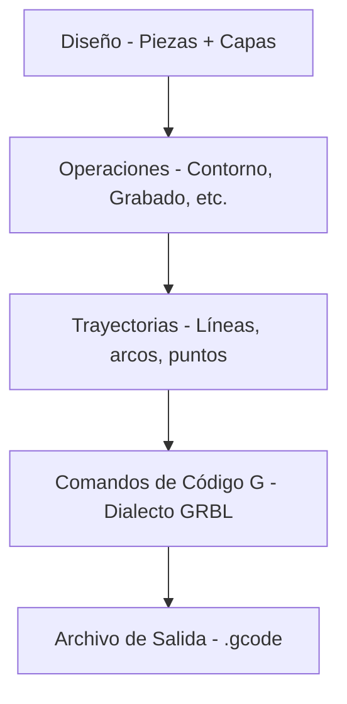

# Fundamentos de Código G

Entender el código G te ayuda a solucionar problemas y personalizar la salida de Rayforge.

## Proceso de Alto Nivel

Rayforge convierte tus diseños en código G a través de un proceso de múltiples pasos:



**Lo que hace Rayforge:**

1. **Analiza tu diseño** - Extrae geometría de las piezas
2. **Aplica operaciones** - Determina trayectorias de corte/grabado
3. **Optimiza trayectorias** - Reordena caminos, minimiza desplazamiento
4. **Genera comandos** - Convierte caminos a código G
5. **Inyecta hooks** - Añade macros definidas por el usuario en puntos especificados
6. **Escribe archivo** - Produce código G completo listo para la máquina

## Ejemplo Simple

Aquí hay una estructura básica de archivo de código G mostrando un corte cuadrado:

```gcode
G21 ;Establecer unidades a mm
G90 ;Posicionamiento absoluto
G54
T0
G0 X95.049 Y104.951 Z0.000
M4 S500
G1 X104.951 Y104.951 Z0.000 F3000
G1 X104.951 Y95.049 Z0.000 F3000
G1 X95.049 Y95.049 Z0.000 F3000
G1 X95.049 Y104.951 Z0.000 F3000
M5
G0 X95.000 Y105.000 Z0.000
M4 S500
G1 X95.000 Y95.000 Z0.000 F3000
G1 X105.000 Y95.000 Z0.000 F3000
G1 X105.000 Y105.000 Z0.000 F3000
G1 X95.000 Y105.000 Z0.000 F3000
M5
M5 ;Asegurar que el láser esté apagado
G0 X0 Y0 ;Volver al origen
```

**Comandos clave:**

| Comando | Descripción |
| ------- | ----------- |
| `G21` | Modo milímetros |
| `G90` | Posicionamiento absoluto |
| `G54` | Seleccionar sistema de coordenadas de trabajo 1 |
| `T0` | Seleccionar herramienta 0 (cabezal láser) |
| `G0` | Movimiento rápido (láser apagado) |
| `G1` | Movimiento de corte (láser encendido) |
| `M4` | Láser encendido (modo de potencia dinámica) |
| `M5` | Láser apagado |
| `S500` | Establecer potencia del láser a 500 (50% para rango 0-1000) |
| `F3000` | Establecer velocidad de avance a 3000 mm/min |

---

## Páginas Relacionadas

- [Dialectos de Código G](../reference/gcode-dialects) - Diferencias de firmware
- [Exportando Código G](../files/exporting) - Ajustes y opciones de exportación
- [Hooks y Macros](../machine/hooks-macros) - Inyección de código G personalizado
