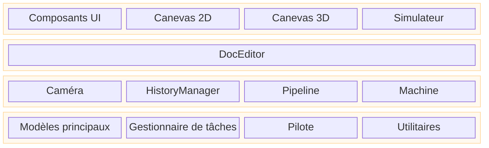

# Architecture de Rayforge

Ce document fournit un aperçu architectural de haut niveau de Rayforge,
expliquant comment les composants majeurs sont liés les uns aux autres. Pour des approfondissements
sur des domaines spécifiques, veuillez vous référer aux documents liés.

## Table des matières

- [Architecture applicative en couches](#architecture-applicative-en-couches)
- [Architecture du code](#architecture-du-code)
- [Architecture du modèle de document](#architecture-du-modèle-de-document)
- [Architecture du pipeline](#architecture-du-pipeline)

---

## Architecture applicative en couches

L'application est structurée en couches logiques, séparant l'interface
utilisateur, la logique applicative et les services principaux. Cela favorise une
séparation claire des préoccupations et clarifie le flux de contrôle

- **Couche UI (Vue)** : Contient tous les éléments visibles par l'utilisateur. Le `Workbench` est
  la zone principale du canevas qui héberge les vues 2D et 3D.
- **Couche Éditeur/Contrôleur** : Le `DocEditor` agit comme le contrôleur central,
  répondant aux événements UI et manipulant les modèles principaux.
- **Couche Principale / Services** : Fournit les services fondamentaux et l'état.
  `Core Models` représente le document, `Tasker` gère les tâches en arrière-plan,
  `Machine` gère la communication avec l'appareil, et `Camera` gère les viewports.

---

## Architecture du code

Rayforge est une application GTK4/Libadwaita avec une architecture modulaire basée sur
un pipeline.

- **`rayforge/core/`** : Modèle de document et gestion de la géométrie.
- **`rayforge/pipeline/`** : Le pipeline de traitement principal pour générer
  les opérations machine à partir du modèle de document.
- **`rayforge/machine/`** : Couche d'interface matérielle, incluant les pilotes
  d'appareil, les protocoles de transport et les modèles machine.
- **`rayforge/doceditor/`** : Le contrôleur principal de l'éditeur de document et son UI.
- **`rayforge/workbench/`** : Le canevas 2D/3D et les systèmes de visualisation.
- **`rayforge/image/`** : Importateurs pour divers formats de fichiers (SVG, DXF, etc.).
- **`rayforge/shared/`** : Utilitaires communs, incluant le `tasker` pour
  la gestion des tâches en arrière-plan.

---

## Architecture du modèle de document

Le modèle de document est un arbre hiérarchique d'objets basé sur le
**Pattern Composite**. Cette structure représente le projet entier de l'utilisateur,
de l'objet racine `Doc` jusqu'aux `WorkPiece` individuels. Il est conçu pour être
réactif et sérialisable.

**[Voir l'Architecture du Modèle de Document pour les détails](./docmodel.md)**

---

## Architecture du pipeline

Le pipeline convertit le modèle de document en G-code exécutable par la machine. Il
s'exécute de manière asynchrone en arrière-plan et utilise un système `Artifact`
en mémoire partagée pour le transfert de données haute performance entre processus. Le pipeline est
composé d'étapes : **Modificateurs → Producteurs → Transformateurs → Encodeurs**.

**[Voir l'Architecture du Pipeline pour les détails](./pipeline.md)**
