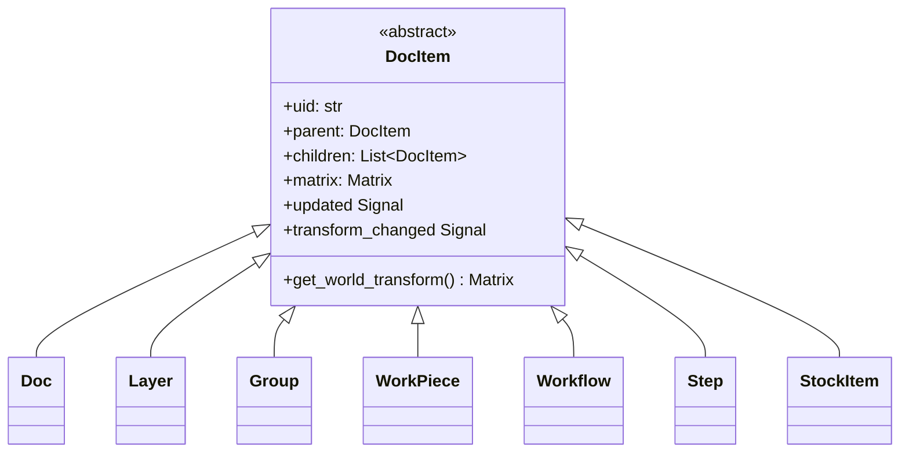
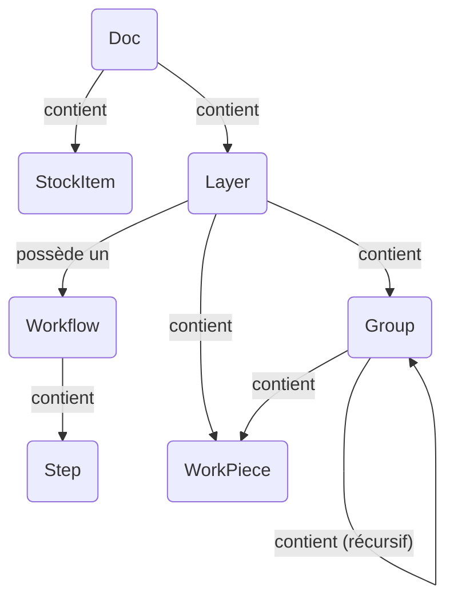

# Architecture du modèle de document

Le modèle de document est la colonne vertébrale de l'application, représentant le
projet utilisateur entier comme un arbre hiérarchique d'objets. Il est conçu pour
être réactif, sérialisable et facilement traversable.

## Aperçu

L'architecture est construite sur le **Pattern de conception Composite**. Une seule
classe de base abstraite, `DocItem`, définit l'interface commune pour tous
les objets qui peuvent exister dans l'arbre du document (par exemple, calques, workpieces,
groupes). Cela permet de traiter uniformément les structures complexes et imbriquées.

Les principes clés du modèle incluent :

- **Structure en arbre :** L'objet `Doc` sert de racine de l'arbre. Chaque
  élément (sauf la racine) a un seul `parent` et peut avoir plusieurs
  `children`.
- **Réactivité :** Le modèle utilise un système signal/slot (`blinker`). Lorsqu'un
  élément est modifié, il émet un signal. Les éléments parents écoutent les
  signaux de leurs enfants et les "remontent" dans l'arbre. Cela permet
  aux composants de haut niveau comme le `Pipeline` d'écouter tout
  changement dans le document en se connectant à un seul signal sur l'objet racine
  `Doc`. Le système suit séparément les changements de contenu et les changements de transformation
  pour des mises à jour efficaces.
- **Hiérarchie de transformation :** Chaque `DocItem` a une transformation locale
  `Matrix`. La position finale, l'échelle et la rotation d'un élément dans le "monde"
  (le canevas principal) est le produit de sa propre matrice locale et des
  matrices monde de tous ses ancêtres.
- **Découplage des données :** Les données visuelles ou brutes d'un `WorkPiece` ne sont pas
  stockées directement en son sein. Au lieu de cela, le `WorkPiece` contient un UID qui
  référence un objet `ImportSource` dans un registre central sur le `Doc`.
  Cela découple la structure du document de la gestion des données,
  rendant le modèle plus léger et flexible.

---

## Héritage de classes

Ce diagramme montre la hiérarchie des classes. Chaque objet qui fait partie de
l'arbre spatial du document hérite de la classe de base abstraite `DocItem`,
gagnant les fonctionnalités principales comme le parentage, les transformations et le bouillonnement
des signaux.

- **`DocItem`** : La fondation abstraite fournissant l'implémentation du pattern composite.
- Toutes les autres classes sont des implémentations concrètes de `DocItem`, chacune avec un
  rôle spécialisé dans la structure du document.

---

## Composition d'objets

Ce diagramme illustre comment les instances des classes sont assemblées pour former
un document complet. Il montre les relations parent-enfant et
les références entre objets.

- Un `Doc` est l'objet de niveau supérieur. Il **contient** un ou plusieurs `Layer` et
  `StockItem`. Il **gère** également un registre de tous les `ImportSource` dans
  le projet.
- Chaque `Layer` **contient** le contenu de l'utilisateur : `WorkPiece` et `Group`.
  Crucialement, un `Layer` **possède aussi un** `Workflow`.
- Un `Workflow` **contient** une liste ordonnée de `Step`, qui définissent le
  processus de fabrication pour ce calque.
- Un `Group` est un conteneur qui peut contenir des `WorkPiece` et d'autres `Group`,
  permettant des transformations imbriquées.
- Un `WorkPiece` est un élément de conception fondamental. Il ne stocke pas ses
  données brutes directement. Au lieu de cela, il **référence** un `ImportSource` via un
  UID. Il **a** également sa propre `Geometry` (données vectorielles) et peut avoir une
  liste de `Tab`.

---

## Descriptions des DocItems

- **`DocItem`** (Abstrait)

  - **Rôle :** La base abstraite pour tous les nœuds de l'arbre.
  - **Propriétés clés :** `uid`, `parent`, `children`, `matrix`, signal `updated`,
    signal `transform_changed`. Fournit la logique principale du pattern composite.

- **`Doc`**

  - **Rôle :** La racine de l'arbre du document.
  - **Propriétés clés :** `children` (Layers, StockItems), `import_sources`
    (un dictionnaire mappant les UIDs aux objets `ImportSource`), `active_layer`.

- **`Layer`**

  - **Rôle :** L'unité organisationnelle principale pour le contenu. Un calque
    associe un groupe de workpieces à un seul workflow de fabrication.
  - **Propriétés clés :** `children` (WorkPieces, Groups, un Workflow),
    `visible`, `stock_item_uid`.

- **`Group`**

  - **Rôle :** Un conteneur pour d'autres `DocItem` (`WorkPiece`, `Group`).
    Permet à une collection d'éléments d'être transformée comme une seule unité.

- **`WorkPiece`**

  - **Rôle :** Représente un seul élément de conception tangible sur le canevas
    (par exemple, un SVG importé).
  - **Propriétés clés :** `vectors` (un objet `Geometry`),
    `import_source_uid`,
    `tabs`, `tabs_enabled`. Ses `vectors` sont normalisés à une boîte 1x1,
    avec toute la mise à l'échelle et le positionnement gérés par sa `matrix` de
    transformation.

- **`Workflow`**

  - **Rôle :** Une séquence ordonnée d'instructions de traitement. Possédé par un
    `Layer`.
  - **Propriétés clés :** `children` (une liste ordonnée de `Step`).

- **`Step`**

  - **Rôle :** Une seule instruction de traitement dans un `Workflow` (par exemple,
    "Coupe Contour" ou "Gravure Raster"). C'est un objet de configuration
    contenant des dictionnaires qui définissent le producteur, les modificateurs et
    les transformateurs à utiliser.

- **`StockItem`**
  - **Rôle :** Représente un morceau de matériel physique dans le document,
    défini par sa propre `geometry` vectorielle. Les `Layer` peuvent être assignés à un
    élément de stock spécifique.
