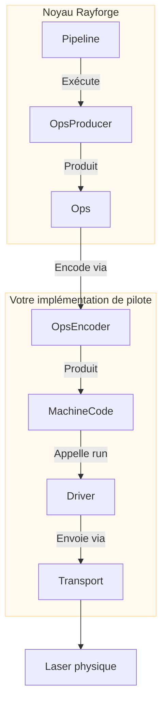

# Guide de développement de pilote

Ce guide fournit un aperçu de haut niveau de la création d'un pilote dans Rayforge
pour ajouter le support de votre découpeur ou graveur laser. En créant un pilote, vous
intégrez le protocole de communication unique et le langage de commandes de votre machine dans
l'écosystème Rayforge.

## Aperçu du pilote

Un pilote est le pont entre la logique principale de Rayforge et votre matériel physique.
Il est responsable de trois tâches principales :

1.  **Gérer la connectivité :** Gérer le protocole de communication de bas niveau
    (Série, WebSocket, HTTP, etc.).
2.  **Exécuter les travaux :** Envoyer le code machine pré-encodé (par exemple, G-code) à
    l'appareil et suivre la progression de l'exécution.
3.  **Rapporter l'état :** Émettre des signaux pour mettre à jour l'interface avec la
    position en temps réel du laser, le statut (`IDLE`, `RUN`) et les messages de journal.

Pour simplifier cela, Rayforge fournit une architecture basée sur des parties composables :



- **`OpsEncoder` :** Traduit les `Ops` dans un langage de commandes spécifique
  (par exemple, G-code). Utilisé à la fois par le Pipeline (pour l'encodage des travaux) et le
  Driver (pour les commandes individuelles comme move_to, home, etc.).
- **`Pipeline` :** Orchestre l'encodage et produit le code machine final.
- **`Transport` :** Gère la connexion et le transfert de données.
- **`Driver` :** Exécute le code machine, gère l'état de l'appareil et communique
  avec l'interface.

Toutes les opérations du pilote sont **asynchrones** pour s'assurer que l'interface utilisateur reste réactive.

## Le langage `Ops`

Rayforge décrit un travail laser comme une séquence d'opérations de haut niveau, stockées dans
un objet `Ops`. C'est le langage universel au sein de Rayforge pour décrire
les mouvements machine, indépendamment de tout matériel spécifique.

| Méthode `Ops`        | Signature                      | Description                          |
| :------------------- | :----------------------------- | :----------------------------------- |
| `move_to`            | `(x, y, z=0.0)`                | Mouvement rapide (sans coupe)        |
| `line_to`            | `(x, y, z=0.0)`                | Mouvement de coupe/gravure           |
| `arc_to`             | `(x, y, i, j, cw=True, z=0.0)` | Mouvement d'arc de coupe/gravure     |
| `set_power`          | `(power)`                      | Définir la puissance laser (0-100%)  |
| `set_cut_speed`      | `(speed)`                      | Définir la vitesse pour les mouvements de coupe (mm/min) |
| `set_travel_speed`   | `(speed)`                      | Définir la vitesse pour les mouvements rapides (mm/min) |
| `enable_air_assist`  | `()`                           | Activer l'assistance air             |
| `disable_air_assist` | `()`                           | Désactiver l'assistance air          |

Votre pilote reçoit du code machine pré-encodé (par exemple, une chaîne G-code) et une
carte d'opérations qui suit quelles commandes de code machine correspondent à quelles
opérations. Le pipeline gère l'encodage des `Ops` en code machine avant d'appeler
la méthode `run()` du pilote.

```python
# Exemple de comment Rayforge construit un objet Ops
ops = Ops()
ops.set_travel_speed(3000)
ops.set_cut_speed(800)
ops.set_power(80)

ops.move_to(10, 10)       # Mouvement rapide vers le point de départ
ops.enable_air_assist()
ops.line_to(50, 10)       # Couper une ligne avec assistance air
ops.disable_air_assist()
ops.line_to(50, 50)       # Couper une ligne sans assistance air
```

## Implémentation du pilote

Tous les pilotes DOIVENT hériter de `rayforge.machine.drivers.Driver`.

```python
from rayforge.machine.driver.driver import Driver

class VotreDriver(Driver):
    label = "Votre Appareil"  # Nom d'affichage dans l'interface
    subtitle = "Description pour les utilisateurs"
    supports_settings = False # Définir True si le pilote peut lire/écrire les paramètres du firmware
```

### Propriétés requises

- `label` : Un nom lisible par l'homme affiché dans l'interface.
- `subtitle` : Une brève description affichée sous le nom.
- `supports_settings` : Un booléen indiquant si le pilote peut lire/écrire les
  paramètres de l'appareil (comme `$$` de GRBL).

### Méthodes requises

Votre classe de pilote **DOIT** implémenter les méthodes suivantes. Notez que la plupart sont **asynchrones** et doivent être définies avec `async def`.

#### Configuration et cycle de vie

- `get_setup_vars() -> VarSet` : **(Méthode de classe)** Retourne un objet `VarSet`
  définissant les paramètres nécessaires pour la connexion (par exemple, adresse IP, port série).
  Rayforge l'utilise pour générer automatiquement le formulaire de configuration dans l'interface.
- `precheck(**kwargs)` : **(Méthode de classe)** Un contrôle statique non bloquant de la
  configuration qui peut être exécuté avant l'instanciation du pilote. Doit lever
  `DriverPrecheckError` en cas d'échec.
- `setup(**kwargs)` : Appelé une fois avec les valeurs du formulaire de configuration. Utilisez ceci
  pour initialiser vos transports et état interne.
- `async def connect()` : Établit et maintient une connexion persistante à
  l'appareil. Cette méthode devrait contenir la logique de reconnexion automatique.
- `async def cleanup()` : Appelé lors de la déconnexion. Devrait fermer toutes
  les connexions et libérer les ressources.

#### Contrôle de l'appareil

- `async def run(machine_code: Any, op_map: MachineCodeOpMap, doc: Doc,
  on_command_done: Optional[Callable[[int], Union[None, Awaitable[None]]]]
  = None)` : La méthode principale pour exécuter un travail. Reçoit du code machine pré-encodé
  (par exemple, chaîne G-code) et un mappage entre les indices d'opération et
  le code machine. Le rappel `on_command_done` est appelé avec l'op_index
  lorsque chaque commande se termine.
- `async def home(axes: Optional[Axis] = None)` : Met la machine à l'origine. Peut mettre à l'origine
  des axes spécifiques ou tous les axes.
- `async def move_to(pos_x: float, pos_y: float)` : Déplace manuellement la tête
  laser vers une coordonnée XY spécifique.
- `async def set_hold(hold: bool = True)` : Met en pause ou reprend le travail actuel.
- `async def cancel()` : Arrête le travail actuel.
- `async def jog(axis: Axis, distance: float, speed: int)` : Déplace la machine
  le long d'un axe spécifique.
- `async def select_tool(tool_number: int)` : Sélectionne un nouvel outil/tête laser par
  son numéro.
- `async def clear_alarm()` : Efface tout état d'alarme actif.

#### Paramètres du firmware (si `supports_settings` est `True`)

- `get_setting_vars() -> List[VarSet]` : Retourne des objets `VarSet` qui définissent
  la structure de la page des paramètres de l'appareil.
- `async def read_settings()` : Lit tous les paramètres de l'appareil et appelle
  `_on_settings_read()` avec le résultat.
- `async def write_setting(key: str, value: Any)` : Écrit un seul paramètre vers
  l'appareil.

### Émettre des signaux

Pour communiquer avec l'interface, votre pilote doit émettre des signaux. Pour assurer une
journalisation appropriée et la sécurité des threads, **vous ne devez pas émettre de signaux directement.** Au lieu de cela,
appelez les méthodes d'aide protégées de la classe de base `Driver`.

- `self._log(message)` : Envoie un message de journal à la console.
- `self._on_state_changed()` : Appelez ceci chaque fois que vous mettez à jour `self.state` pour
  notifier l'interface d'un changement de statut ou de position.
- `self._on_connection_status_changed(status, message)` : Informe l'interface sur
  le statut de la connexion (`CONNECTING`, `CONNECTED`, `ERROR`, etc.).
- `self._on_command_status_changed(status, message)` : Rapporte le statut d'une
  commande envoyée.
- `self._on_settings_read(settings)` : Envoie les paramètres de l'appareil que vous avez lus
  vers l'interface.

## Des questions ?

La meilleure façon d'apprendre est de regarder les pilotes existants dans
`rayforge/machine/driver/`, tels que :

- `grbl.py` - Machines basées sur GRBL
- `grbl_serial.py` - Communication GRBL basée sur série
- `smoothie.py` - Machines basées sur Smoothieboard
- `dummy.py` - Un pilote de test pour le développement

Si vous êtes bloqué, n'hésitez pas à ouvrir un ticket sur GitHub ! Nous sommes heureux d'aider.
