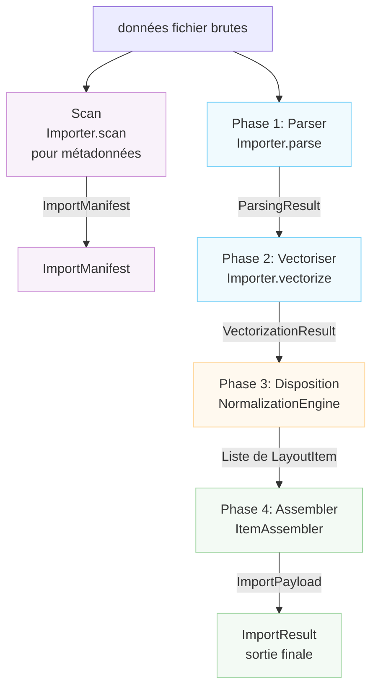

# Architecture de l'importateur

Ce document décrit l'architecture du système d'importation de fichiers de Rayforge,
qui gère la conversion de divers formats de fichiers (SVG, DXF, PNG, PDF, etc.) en
le modèle de document de Rayforge.

## Table des matières

- [Aperçu](#aperçu)
- [Pipeline d'importation](#pipeline-dimportation)
- [Méthode scan](#méthode-scan)
- [Systèmes de coordonnées](#systèmes-de-coordonnées)
- [Classes clés](#classes-clés)
- [Créer un nouvel importateur](#créer-un-nouvel-importateur)

---

## Aperçu

Le système d'importation est construit autour d'un pipeline à quatre phases qui transforme les données de fichier
brutes en objets de document entièrement positionnés. Chaque phase a une responsabilité
spécifique et produit des structures de données bien définies.



---

## Pipeline d'importation

### Phase 1 : Parser

**Méthode :** `Importer.parse()`

Extrait les faits géométriques du fichier incluant les limites, les détails du système de coordonnées
et les informations de calque.

**Sortie :** `ParsingResult`

- `document_bounds` : Taille totale du canevas en Coordonnées Natives
- `native_unit_to_mm` : Facteur de conversion en millimètres
- `is_y_down` : Indicateur d'orientation de l'axe Y
- `layers` : Liste de `LayerGeometry`
- `world_frame_of_reference` : Coordonnées Monde (mm, Y-Haut)
- `background_world_transform` : Matrice pour le positionnement de l'arrière-plan
- `untrimmed_document_bounds` : Référence pour l'inversion Y

**Système de coordonnées :**

- `document_bounds` : Coordonnées Natives (spécifique au fichier)
- `world_frame_of_reference` : Coordonnées Monde (mm, Y-Haut)

---

### Phase 2 : Vectoriser

**Méthode :** `Importer.vectorize()`

Convertit les données analysées en objets `Geometry` vectoriels selon la
`VectorizationSpec`.

**Sortie :** `VectorizationResult`

- `geometries_by_layer` : Géométrie vectorielle par calque (Coordonnées Natives)
- `source_parse_result` : Référence au ParsingResult original
- `fills_by_layer` : Géométrie de remplissage optionnelle (importateur Sketch)

**Système de coordonnées :** Coordonnées Natives (spécifique au fichier)

---

### Phase 3 : Disposition

**Classe :** `NormalizationEngine`

Calcule les matrices de transformation pour mapper les Coordonnées Natives vers les Coordonnées
Monde selon l'intention de l'utilisateur.

**Sortie :** `List[LayoutItem]`

Chaque `LayoutItem` contient :

- `world_matrix` : Normalisé (0-1, Y-Haut) → Monde (mm, Y-Haut)
- `normalization_matrix` : Natif → Normalisé (0-1, Y-Haut)
- `crop_window` : Sous-ensemble du fichier original en Coordonnées Natives
- `layer_id`, `layer_name` : Identification du calque

**Système de coordonnées :**

- Entrée : Coordonnées Natives
- Sortie : Coordonnées Monde (mm, Y-Haut) via l'espace Normalisé intermédiaire

---

### Phase 4 : Assembler

**Classe :** `ItemAssembler`

Instancie les objets de domaine Rayforge (`WorkPiece`, `Layer`) basés sur le
plan de disposition.

**Sortie :** `ImportPayload`

- `source` : Le `SourceAsset`
- `items` : Liste de `DocItem` prêts pour l'insertion
- `sketches` : Liste optionnelle d'objets `Sketch`

**Système de coordonnées :** Tous les DocItems en Coordonnées Monde (mm, Y-Haut)

---

## Méthode scan

**Méthode :** `Importer.scan()`

Un scan léger qui extrait les métadonnées sans traitement complet. Utilisé pour
construire l'interface pour un importateur, incluant la liste de sélection des calques.
Ceci ne fait PAS partie du pipeline d'importation principal exécuté par `get_doc_items()`.

**Sortie :** `ImportManifest`

- `layers` : Liste d'objets `LayerInfo`
- `natural_size_mm` : Dimensions physiques en millimètres (Y-Haut)
- `title` : Titre optionnel du document
- `warnings`, `errors` : Problèmes non critiques découverts

**Système de coordonnées :** Coordonnées Monde (mm, Y-Haut) pour `natural_size_mm`

---

## Systèmes de coordonnées

Le pipeline d'importation gère plusieurs systèmes de coordonnées par une transformation
soigneuse :

### Coordonnées Natives (Entrée)

- Système de coordonnées spécifique au fichier (unités utilisateur SVG, unités DXF, pixels)
- L'orientation de l'axe Y varie selon le format
- Les limites sont absolues dans l'espace de coordonnées du document
- Unités converties en mm via le facteur `native_unit_to_mm`

### Coordonnées Normalisées (Intermédiaire)

- Carré unitaire de (0,0) à (1,1)
- L'axe Y pointe VERS LE HAUT (convention Y-Haut)
- Utilisé comme représentation intermédiaire entre natif et monde

### Coordonnées Monde (Sortie)

- Coordonnées monde physiques en millimètres (mm)
- L'axe Y pointe VERS LE HAUT (convention Y-Haut)
- L'origine (0,0) est en bas à gauche du workpiece
- Toutes les positions sont absolues dans le système de coordonnées monde

### Orientation de l'axe Y

- **Formats Y-Bas** (SVG, images) : Origine en haut à gauche, Y augmente vers le bas
- **Formats Y-Haut** (DXF) : Origine en bas à gauche, Y augmente vers le haut
- Les importateurs doivent définir correctement le flag `is_y_down` dans `ParsingResult`
- Le `NormalizationEngine` gère l'inversion Y pour les sources Y-Bas

---

## Classes clés

### Importer (Classe de base)

Classe de base abstraite définissant l'interface pour tous les importateurs. Les sous-classes doivent
implémenter les méthodes du pipeline et déclarer leurs capacités via l'attribut
`features`.

**Fonctionnalités :**

- `BITMAP_TRACING` : Peut tracer des images raster en vecteurs
- `DIRECT_VECTOR` : Peut extraire la géométrie vectorielle directement
- `LAYER_SELECTION` : Supporte les importations basées sur les calques
- `PROCEDURAL_GENERATION` : Génère du contenu par programmation

### Structures de données

| Classe               | Phase     | Objectif                    |
| -------------------- | --------- | --------------------------- |
| `LayerInfo`          | Scan      | Métadonnées légères de calque |
| `ImportManifest`     | Scan      | Résultat de la phase scan   |
| `LayerGeometry`      | Parse     | Info de calque géométrique  |
| `ParsingResult`      | Parse     | Faits géométriques          |
| `VectorizationResult`| Vectorize | Géométrie vectorielle       |
| `LayoutItem`         | Layout    | Configuration de transformation |
| `ImportPayload`      | Assemble  | Sortie finale               |
| `ImportResult`       | Final     | Wrapper de résultat complet |

### Composants de support

- `NormalizationEngine` : Calculs de disposition Phase 3
- `ItemAssembler` : Création d'objets Phase 4

---

## Créer un nouvel importateur

Pour ajouter le support d'un nouveau format de fichier :

1. **Créez une nouvelle classe d'importateur** qui hérite de `Importer`
2. **Déclarez les fonctionnalités supportées** via l'attribut de classe `features`
3. **Implémentez les méthodes requises** :
   - `scan()` : Extraire les métadonnées rapidement (pour les aperçus UI)
   - `parse()` : Extraire les faits géométriques
   - `vectorize()` : Convertir en géométrie vectorielle
   - `create_source_asset()` : Créer l'actif source
4. **Enregistrez l'importateur** dans `rayforge/image/__init__.py`
5. **Ajoutez les mappages de type MIME et d'extension**

**Exemple :**

```python
from rayforge.image.base_importer import Importer, ImporterFeature
from rayforge.image.structures import (
    ImportManifest,
    ParsingResult,
    VectorizationResult,
)
from rayforge.core.source_asset import SourceAsset

class MyFormatImporter(Importer):
    label = "Mon Format"
    mime_types = ("application/x-myformat",)
    extensions = (".myf",)
    features = {ImporterFeature.DIRECT_VECTOR}

    def scan(self) -> ImportManifest:
        # Extraire les métadonnées sans traitement complet
        return ImportManifest(
            layers=[],
            natural_size_mm=(100.0, 100.0),
        )

    def parse(self) -> Optional[ParsingResult]:
        # Extraire les faits géométriques
        return ParsingResult(
            document_bounds=(0, 0, 100, 100),
            native_unit_to_mm=1.0,
            is_y_down=False,
            layers=[],
            world_frame_of_reference=(0, 0, 100, 100),
            background_world_transform=Matrix.identity(),
        )

    def vectorize(
        self, parse_result: ParsingResult, spec: VectorizationSpec
    ) -> VectorizationResult:
        # Convertir en géométrie vectorielle
        return VectorizationResult(
            geometries_by_layer={None: Geometry()},
            source_parse_result=parse_result,
        )

    def create_source_asset(
        self, parse_result: ParsingResult
    ) -> SourceAsset:
        # Créer l'actif source
        return SourceAsset(
            original_data=self.raw_data,
            metadata={},
        )
```
