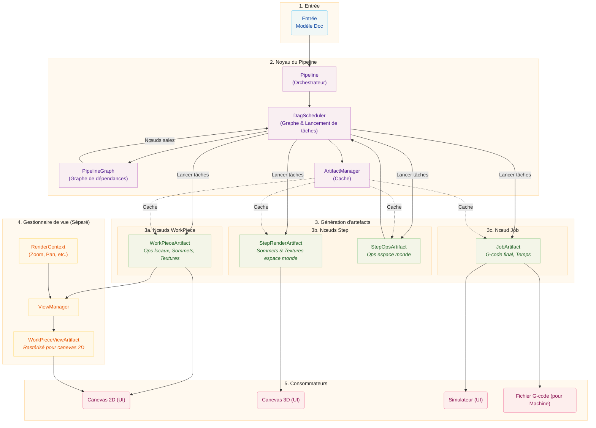

# Architecture du pipeline

Ce document décrit l'architecture du pipeline, qui utilise un Graphe Orienté Acyclique
(DAG) pour orchestrer la génération d'artefacts. Le pipeline transforme les données de
conception brutes en sorties finales pour la visualisation et la fabrication, avec
une planification sensible aux dépendances et une mise en cache efficace des artefacts.

# Concepts de base

## Nœuds d'artefacts et graphe de dépendances

Le pipeline utilise un **Graphe Orienté Acyclique (DAG)** pour modéliser les artefacts et
leurs dépendances. Chaque artefact est représenté comme un `ArtifactNode` dans le
graphe.

### ArtifactNode

Chaque nœud contient :

- **ArtifactKey** : Un identifiant unique consistant en un ID et un type de groupe
  (`workpiece`, `step`, `job`, ou `view`)
- **État** : L'état actuel du cycle de vie du nœud
- **Dépendances** : Liste des nœuds dont ce nœud dépend (enfants)
- **Dépendants** : Liste des nœuds qui dépendent de ce nœud (parents)

### États des nœuds

Les nœuds progressent à travers quatre états :

| État         | Description                                    |
| ------------ | ---------------------------------------------- |
| `DIRTY`      | L'artefact doit être régénéré                  |
| `PROCESSING` | Une tâche génère actuellement l'artefact       |
| `VALID`      | L'artefact est prêt et à jour                  |
| `ERROR`      | La génération a échoué                         |

Lorsqu'un nœud est marqué comme sale, tous ses dépendants sont également marqués sales,
propageant l'invalidation vers le haut du graphe.

### PipelineGraph

Le `PipelineGraph` est construit à partir du modèle Doc et contient :

- Un nœud pour chaque paire `(WorkPiece, Step)`
- Un nœud pour chaque Step
- Un nœud pour le Job

Les dépendances sont établies :

- Les Steps dépendent de leurs nœuds de paire `(WorkPiece, Step)`
- Le Job dépend de toutes les Steps

## DagScheduler

Le `DagScheduler` est l'ordonnanceur central du pipeline. Il possède le
`PipelineGraph` et est responsable de :

1. **Construire le graphe** à partir du modèle Doc
2. **Identifier les nœuds prêts** (DIRTY avec toutes les dépendances VALID)
3. **Lancer les tâches** pour générer les artefacts
4. **Suivre l'état** à travers le processus de génération
5. **Notifier les consommateurs** lorsque les artefacts sont prêts

L'ordonnanceur travaille avec des IDs de génération pour suivre quels artefacts appartiennent à
quelle version du document, permettant la réutilisation d'artefacts valides entre les générations.

Comportements clés :

- Lorsque le graphe est construit, l'ordonnanceur synchronise les états des nœuds avec le
  gestionnaire d'artefacts pour identifier les artefacts en cache qui peuvent être réutilisés
- Les artefacts de la génération précédente peuvent être réutilisés s'ils restent valides
- L'ordonnanceur suit quels IDs de génération ont des tâches en cours pour préserver
  les artefacts pendant les transitions de génération
- Les invalidations sont suivies même avant la reconstruction du graphe et réappliquées après

## ArtifactManager

L'`ArtifactManager` est un gestionnaire de cache pur pour les handles d'artefacts. Il :

- Stocke et récupère les handles d'artefacts
- Gère le comptage de références pour le nettoyage
- Gère le cycle de vie (création, rétention, libération)
- Ne suit PAS l'état (l'état est géré par l'ordonnanceur DAG)

## Cycle de vie de la mémoire partagée

Les artefacts sont stockés en mémoire partagée (`multiprocessing.shared_memory`) pour
une communication inter-processus efficace entre les processus de travail et le processus
principal. L'`ArtifactStore` gère le cycle de vie de ces blocs mémoire.

### Patterns de propriété

**Propriété locale :** Le processus créateur possède le handle et le libère
quand il a terminé. C'est le pattern le plus simple.

**Transfert inter-processus :** Un travailleur crée un artefact, l'envoie au
processus principal via IPC, et transfère la propriété. Le travailleur "oublie" le
handle (ferme son descripteur de fichier sans supprimer la mémoire), tandis que
le processus principal "l'adopte" et devient responsable de sa libération éventuelle.

### Comptage de références

L'`ArtifactStore` maintient des comptes de références pour chaque bloc mémoire partagé.
Plusieurs appelants peuvent `retain()` un handle, et le bloc n'est supprimé
que lorsque le compte atteint zéro. Ceci est utilisé par le `ViewManager` pour
le rendu progressif où plusieurs rappels peuvent accéder au même artefact.

## Étapes du pipeline

Les étapes du pipeline (`WorkPiecePipelineStage`, `StepPipelineStage`,
`JobPipelineStage`) servent maintenant d'interfaces plutôt que de lanceurs de tâches :

- Elles gèrent les demandes d'invalidation de l'interface
- Elles délèguent le lancement de tâches au DagScheduler
- Elles fournissent l'accès aux artefacts en cache
- Elles transmettent les signaux de l'ordonnanceur vers l'interface

## InvalidationScope

L'énumération `InvalidationScope` définit la portée de l'invalidation pour les artefacts
en aval :

| Portée              | Description                                                                                                                                                    |
| ------------------- | -------------------------------------------------------------------------------------------------------------------------------------------------------------- |
| `FULL_REPRODUCTION` | Invalide les workpieces, ce qui se propage aux steps puis au job. Utilisé pour les changements nécessitant une régénération des artefacts (géométrie, paramètres, changements de taille). |
| `STEP_ONLY`         | Invalide les steps directement, ce qui se propage au job. Utilisé pour les changements de transformation de position/rotation uniquement où la géométrie du workpiece reste inchangée.      |

# Détail détaillé

## Entrée

Le processus commence avec le **Modèle Doc**, qui contient :

- **WorkPieces :** Éléments de conception individuels (SVGs, images) placés sur le canevas
- **Steps :** Instructions de traitement (Contour, Raster) avec paramètres

## Noyau du pipeline

### Pipeline (Orchestrateur)

La classe `Pipeline` est le chef d'orchestre de haut niveau qui :

- Écoute les changements du modèle Doc
- Coordonne avec le DagScheduler pour déclencher la régénération
- Gère l'état de traitement global
- Connecte les signaux entre composants

### DagScheduler

Le `DagScheduler` :

- Construit et maintient le `PipelineGraph`
- Identifie les nœuds prêts pour le traitement
- Lance les tâches via le TaskManager
- Suit les transitions d'état des nœuds
- Émet des signaux lorsque les artefacts sont prêts

### ArtifactManager

L'`ArtifactManager` :

- Met en cache les handles d'artefacts en mémoire partagée
- Gère le comptage de références pour le nettoyage
- Fournit la recherche par ArtifactKey et ID de génération

## Génération d'artefacts

### WorkPieceArtifacts

Générés pour chaque combinaison `(WorkPiece, Step)`, contenant :

- Trajets d'outil (`Ops`) dans le système de coordonnées local
- Données de sommets pour les lignes
- Données de texture pour les remplissages raster

Séquence de traitement :

1. **Modificateurs :** (Optionnel) Conditionnement d'image (niveaux de gris, etc.)
2. **Producteur :** Crée les trajets d'outil bruts (`Ops`)
3. **Transformateurs :** Modifications par workpiece (Tabs, Lissage)
4. **Encodeur de sommets :** Crée des données compatibles GPU

### StepArtifacts

Générés pour chaque Step, consommant tous les WorkPieceArtifacts liés :

**StepRenderArtifact :**

- Données combinées de sommets et textures pour tous les workpieces
- Transformées en coordonnées espace-monde
- Optimisées pour le rendu du canevas 3D

**StepOpsArtifact :**

- Ops combinés pour tous les workpieces
- Transformés en coordonnées espace-monde
- Incluent les transformateurs par étape (Optimiser, Multi-Passe)

### JobArtifact

Généré à la demande lorsque le G-code est nécessaire, consommant tous les StepOpsArtifacts :

- G-code final pour le travail entier
- Données complètes de sommets pour la simulation
- Estimation de temps haute fidélité

## ViewManager (Séparé)

Le `ViewManager` est **découplé** du pipeline de données. Il gère le rendu
pour le canevas 2D basé sur l'état de l'interface :

### RenderContext

Contient les paramètres de vue actuels :

- Pixels par millimètre (niveau de zoom)
- Décalage de la fenêtre d'affichage (pan)
- Options d'affichage (afficher les déplacements de déplacement, etc.)

### WorkPieceViewArtifacts

Le ViewManager crée des `WorkPieceViewArtifacts` qui :

- Rastérisent les WorkPieceArtifacts vers l'espace écran
- Appliquent le RenderContext actuel
- Sont mis en cache et mis à jour lorsque le contexte ou la source change

### Cycle de vie

1. Le ViewManager suit les handles `WorkPieceArtifact` sources
2. Lorsque le contexte de rendu change, le ViewManager déclenche un nouveau rendu
3. Lorsque l'artefact source change, le ViewManager déclenche un nouveau rendu
4. La limitation empêche les mises à jour excessives pendant les changements continus

Le ViewManager indexe les vues par `(workpiece_uid, step_uid)` pour supporter
la visualisation des états intermédiaires d'un workpiece à travers plusieurs étapes.

## Consommateurs

| Consommateur  | Utilise                   | Objectif                             |
| ------------- | ------------------------- | ------------------------------------ |
| Canevas 2D    | WorkPieceViewArtifacts    | Rend les workpieces dans l'espace écran |
| Canevas 3D    | StepRenderArtifacts       | Rend l'étape complète dans l'espace monde |
| Simulateur    | JobArtifact               | Simulation précise du trajet machine |
| Machine       | G-code JobArtifact        | Sortie de fabrication                |

# Différences clés par rapport à l'architecture précédente

1. **Ordonnancement basé sur DAG :** Au lieu d'étapes séquentielles, les artefacts sont
   générés lorsque leurs dépendances deviennent disponibles.

2. **Gestion d'état :** L'état des nœuds est suivi dans le graphe DAG, pas dans
   les composants individuels.

3. **Séparation du ViewManager :** Le rendu pour le canevas 2D est maintenant géré
   par un ViewManager séparé, pas comme partie du pipeline de données.

4. **IDs de génération :** Les artefacts sont suivis avec des IDs de génération, permettant
   une réutilisation efficace entre les versions du document.

5. **Orchestration centralisée :** Le DagScheduler est le point unique de
   contrôle pour le lancement de tâches et le suivi d'état.

6. **Gestionnaire de cache pur :** L'ArtifactManager est maintenant un simple cache,
   déléguant toute gestion d'état à l'ordonnanceur DAG.

7. **Suivi d'invalidation :** Les clés marquées sales avant la reconstruction du graphe sont
   préservées et réappliquées après reconstruction.

8. **Détection de travail en attente :** Seuls les nœuds `PROCESSING` comptent comme travail en attente ;
   les nœuds `DIRTY` peuvent avoir des dépendances non satisfaites (par exemple, pas de contexte de vue).
