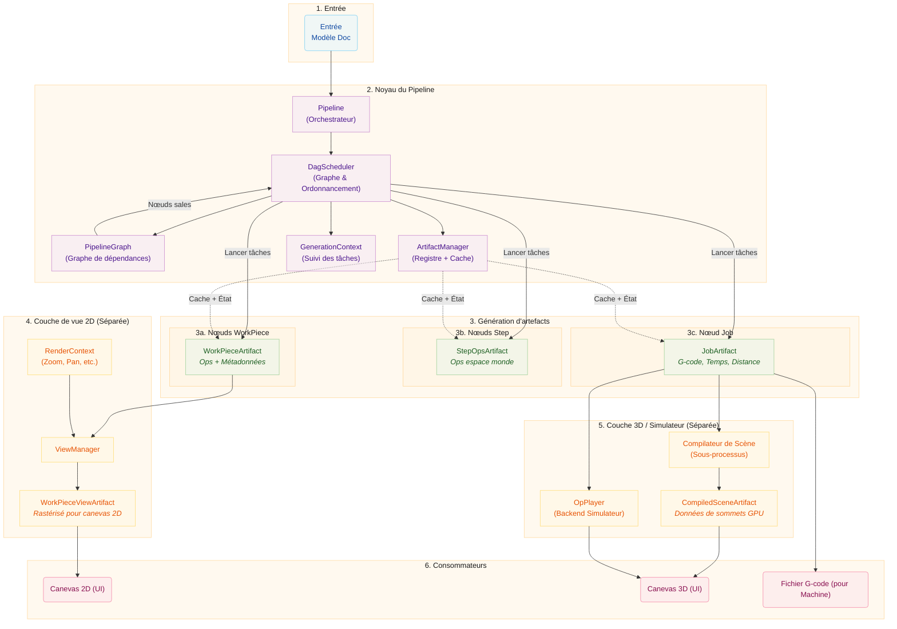

# Architecture du pipeline

Ce document décrit l'architecture du pipeline, qui utilise un Graphe Orienté Acyclique
(DAG) pour orchestrer la génération d'artefacts. Le pipeline transforme les données de
conception brutes en sorties finales pour la visualisation et la fabrication, avec
une planification sensible aux dépendances et une mise en cache efficace des artefacts.

```mermaid
graph TD
    subgraph Input["1. Entrée"]
        InputNode("Entrée<br/>Modèle Doc")
    end

    subgraph PipelineCore["2. Noyau du Pipeline"]
        Pipeline["Pipeline<br/>(Orchestrateur)"]
        DAG["DagScheduler<br/>(Graphe & Ordonnancement)"]
        Graph["PipelineGraph<br/>(Graphe de dépendances)"]
        AM["ArtifactManager<br/>(Registre + Cache)"]
        GC["GenerationContext<br/>(Suivi des tâches)"]
    end

    subgraph ArtifactGen["3. Génération d'artefacts"]
        subgraph WorkPieceNodes["3a. Nœuds WorkPiece"]
            WP["WorkPieceArtifact<br/><i>Ops + Métadonnées</i>"]
        end

        subgraph StepNodes["3b. Nœuds Step"]
            SO["StepOpsArtifact<br/><i>Ops espace monde</i>"]
        end

        subgraph JobNode["3c. Nœud Job"]
            JA["JobArtifact<br/><i>G-code, Temps, Distance</i>"]
        end
    end

    subgraph View2D["4. Couche de vue 2D (Séparée)"]
        VM["ViewManager"]
        RC["RenderContext<br/>(Zoom, Pan, etc.)"]
        WV["WorkPieceViewArtifact<br/><i>Rastérisé pour canevas 2D</i>"]
    end

    subgraph View3D["5. Couche 3D / Simulateur (Séparée)"]
        SC["Compilateur de Scène<br/>(Sous-processus)"]
        CS["CompiledSceneArtifact<br/><i>Données de sommets GPU</i>"]
        OP["OpPlayer<br/>(Backend Simulateur)"]
    end

    subgraph Consumers["6. Consommateurs"]
        Vis2D("Canevas 2D (UI)")
        Vis3D("Canevas 3D (UI)")
        File("Fichier G-code (pour Machine)")
    end

    InputNode --> Pipeline
    Pipeline --> DAG
    DAG --> Graph
    DAG --> AM
    DAG --> GC

    Graph -->|"Nœuds sales"| DAG
    DAG -->|"Lancer tâches"| WP
    DAG -->|"Lancer tâches"| SO
    DAG -->|"Lancer tâches"| JA

    AM -.->|"Cache + État"| WP
    AM -.->|"Cache + État"| SO
    AM -.->|"Cache + État"| JA

    WP --> VM
    JA --> SC
    JA --> OP
    JA --> File

    RC --> VM
    VM --> WV
    WV --> Vis2D

    SC --> CS
    CS --> Vis3D
    OP --> Vis3D

    classDef clusterBox fill:#fff3e080,stroke:#ffb74d80,stroke-width:1px,color:#1a1a1a
    classDef inputNode fill:#e1f5fe80,stroke:#03a9f480,color:#0d47a1
    classDef coreNode fill:#f3e5f580,stroke:#9c27b080,color:#4a148c
    classDef artifactNode fill:#e8f5e980,stroke:#4caf5080,color:#1b5e20
    classDef viewNode fill:#fff8e180,stroke:#ffc10780,color:#e65100
    classDef consumerNode fill:#fce4ec80,stroke:#e91e6380,color:#880e4f
    class Input,PipelineCore,ArtifactGen,WorkPieceNodes,StepNodes,JobNode,View2D,View3D,Consumers clusterBox
    class InputNode inputNode
    class Pipeline,DAG,Graph,AM,GC coreNode
    class WP,SO,JA artifactNode
    class VM,RC,WV,SC,CS,OP viewNode
    class Vis2D,Vis3D,File consumerNode
```

# Concepts de base

## Nœuds d'artefacts et graphe de dépendances

Le pipeline utilise un **Graphe Orienté Acyclique (DAG)** pour modéliser les artefacts et
leurs dépendances. Chaque artefact est représenté comme un `ArtifactNode` dans le
graphe.

### ArtifactNode

Chaque nœud contient :

- **ArtifactKey** : Un identifiant unique consistant en un ID et un type de groupe
  (`workpiece`, `step`, `job`, ou `view`)
- **Dépendances** : Liste des nœuds dont ce nœud dépend (enfants)
- **Dépendants** : Liste des nœuds qui dépendent de ce nœud (parents)

Les nœuds ne stockent pas d'état directement. Au lieu de cela, ils délèguent les
lectures et écritures d'état à l'`ArtifactManager`, qui maintient un registre de
tous les artefacts et de leurs états.

### États des nœuds

Les nœuds progressent à travers cinq états :

| État         | Description                                                      |
| ------------ | ---------------------------------------------------------------- |
| `DIRTY`      | L'artefact doit être (re)généré                                  |
| `PROCESSING` | Une tâche génère actuellement l'artefact                         |
| `VALID`      | L'artefact est prêt et à jour                                    |
| `ERROR`      | La génération a échoué                                           |
| `CANCELLED`  | La génération a été annulée ; sera relancée si toujours nécessaire |

Lorsqu'un nœud est marqué comme sale, tous ses dépendants sont également marqués sales,
propageant l'invalidation vers le haut du graphe.

### PipelineGraph

Le `PipelineGraph` est construit à partir du modèle Doc et contient :

- Un nœud pour chaque paire `(WorkPiece, Step)`
- Un nœud pour chaque Step
- Un nœud pour le Job

Les dépendances sont établies :

- Les Steps dépendent de leurs nœuds de paire `(WorkPiece, Step)`
- Le Job dépend de toutes les Steps

## DagScheduler

Le `DagScheduler` est l'ordonnanceur central du pipeline. Il possède le
`PipelineGraph` et est responsable de :

1. **Construire le graphe** à partir du modèle Doc
2. **Identifier les nœuds prêts** (DIRTY avec toutes les dépendances VALID)
3. **Déclencher les lancements de tâches** via les étapes appropriées du pipeline
4. **Suivre l'état** à travers le processus de génération
5. **Notifier les consommateurs** lorsque les artefacts sont prêts

L'ordonnanceur travaille avec des IDs de génération pour suivre quels artefacts appartiennent à
quelle version du document, permettant la réutilisation d'artefacts valides entre les générations.

Comportements clés :

- Lorsque le graphe est construit, l'ordonnanceur synchronise les états des nœuds avec le
  gestionnaire d'artefacts pour identifier les artefacts en cache qui peuvent être réutilisés
- Les artefacts de la génération précédente peuvent être réutilisés s'ils restent valides
- Les invalidations sont suivies même avant la reconstruction du graphe et réappliquées après
- L'ordonnanceur délègue la création effective des tâches aux étapes mais contrôle
  **quand** les tâches sont lancées en fonction de l'état de préparation des dépendances

## ArtifactManager

L'`ArtifactManager` sert à la fois de cache et de source unique de vérité
pour l'état des artefacts. Il :

- Stocke et récupère les handles d'artefacts via un **registre** (indexé par
  `ArtifactKey` + ID de génération)
- Suit l'état (`DIRTY`, `VALID`, `ERROR`, etc.) dans les entrées du registre
- Gère le comptage de références pour le nettoyage de la mémoire partagée
- Gère le cycle de vie (création, rétention, libération, élagage)
- Fournit des gestionnaires de contexte pour l'adoption sécurisée des artefacts,
  la complétion, les rapports d'échec et d'annulation

## GenerationContext

Chaque cycle de réconciliation crée un `GenerationContext` qui suit toutes
les tâches actives pour cette génération. Il garantit que les ressources en
mémoire partagée restent valides jusqu'à ce que toutes les tâches en cours
pour une génération soient terminées, même si une génération plus récente a
déjà commencé. Lorsqu'un contexte est remplacé et que toutes ses tâches sont
terminées, il libère automatiquement ses ressources.

## Cycle de vie de la mémoire partagée

Les artefacts sont stockés en mémoire partagée (`multiprocessing.shared_memory`) pour
une communication inter-processus efficace entre les processus de travail et le processus
principal. L'`ArtifactStore` gère le cycle de vie de ces blocs mémoire.

### Patterns de propriété

**Propriété locale :** Le processus créateur possède le handle et le libère
lorsqu'il a terminé. C'est le pattern le plus simple.

**Transfert inter-processus :** Un travailleur crée un artefact, l'envoie au
processus principal via IPC, et transfère la propriété. Le travailleur « oublie » le
handle (ferme son descripteur de fichier sans supprimer la mémoire), tandis que
le processus principal « l'adopte » et devient responsable de sa libération éventuelle.

### Détection des artefacts périmés

Le mécanisme `StaleGenerationError` empêche l'adoption d'artefacts provenant de
générations remplacées. Lorsqu'une génération plus récente a commencé, le
gestionnaire détecte les artefacts périmés lors de l'adoption et les ignore silencieusement.

## Étapes du pipeline

Les étapes du pipeline (`WorkPiecePipelineStage`, `StepPipelineStage`,
`JobPipelineStage`) sont responsables de la **mécanique** de l'exécution des tâches :

- Elles créent et enregistrent des tâches de sous-processus via le `TaskManager`
- Elles gèrent les événements de tâche (morceaux progressifs, résultats intermédiaires)
- Elles gèrent l'adoption et la mise en cache des artefacts lors de la complétion des tâches
- Elles émettent des signaux pour notifier le pipeline des changements d'état

Le **DagScheduler** décide **quand** déclencher chaque étape, mais les
étapes gèrent le lancement effectif des sous-processus, la gestion des événements et
l'adoption des résultats.

## Stratégie d'invalidation

L'invalidation est déclenchée par des changements dans le modèle Doc, avec différentes
stratégies selon ce qui a changé :

| Type de changement        | Comportement                                                                                               |
| ------------------------- | ---------------------------------------------------------------------------------------------------------- |
| Géométrie/paramètres      | Paires workpiece-step invalidées, en cascade vers les steps et le job                                      |
| Position/rotation         | Steps invalidées directement (en cascade vers le job) ; workpieces ignorées sauf si sensibles à la position |
| Changement de taille      | Identique à la géométrie : cascade complète des paires workpiece-step vers le haut                          |
| Config machine            | Tous les artefacts sont forcément invalidés à travers toutes les générations                                |

Les steps sensibles à la position (par ex., celles avec le recadrage au stock activé) déclenchent
l'invalidation des workpieces même pour les changements de position purs.

# Détail détaillé

## Entrée

Le processus commence avec le **Modèle Doc**, qui contient :

- **WorkPieces :** Éléments de conception individuels (SVGs, images) placés sur le canevas
- **Steps :** Instructions de traitement (Contour, Raster, etc.) avec paramètres
- **Layers :** Regroupement de workpieces, chacun avec son propre flux de travail

## Noyau du pipeline

### Pipeline (Orchestrateur)

La classe `Pipeline` est le chef d'orchestre de haut niveau qui :

- Écoute les changements du modèle Doc via des signaux
- **Groupe** les changements (délai de réconciliation de 200ms, délai de suppression de 50ms)
- Coordonne avec le DagScheduler pour déclencher la régénération
- Gère l'état de traitement global et la détection d'activité
- Prend en charge **pause/reprise** pour les opérations par lots
- Prend en charge le **mode manuel** (`auto_pipeline=False`) où le recalcul
  est déclenché explicitement plutôt qu'automatiquement
- Connecte les signaux entre les composants et les relaie aux consommateurs

### DagScheduler

Le `DagScheduler` :

- Construit et maintient le `PipelineGraph`
- Identifie les nœuds prêts pour le traitement
- Déclenche les lancements de tâches via les méthodes `launch_task()` des étapes
- Suit les transitions d'état des nœuds via le registre
- Émet des signaux lorsque les artefacts sont prêts

### ArtifactManager

L'`ArtifactManager` :

- Maintient un **registre** d'objets `LedgerEntry`, chacun suivant un handle,
  un ID de génération et un état de nœud
- Met en cache les handles d'artefacts en mémoire partagée
- Gère le comptage de références pour le nettoyage
- Fournit la recherche par ArtifactKey et ID de génération
- Élude les générations obsolètes pour garder le registre propre

### GenerationContext

Chaque réconciliation crée un nouveau `GenerationContext` qui :

- Suit les tâches actives via des clés à comptage de références
- Possède les ressources en mémoire partagée pour sa génération
- S'arrête automatiquement lorsqu'il est remplacé et que toutes les tâches sont terminées

## Génération d'artefacts

### WorkPieceArtifacts

Générés pour chaque combinaison `(WorkPiece, Step)`. Contient :

- Trajets d'outil (`Ops`) dans le système de coordonnées local du workpiece
- Indicateur de scalabilité et dimensions source pour des ops indépendants de la résolution
- Système de coordonnées et métadonnées de génération

Séquence de traitement :

1. **Producteur :** Crée les trajets d'outil bruts (`Ops`) à partir des données du workpiece
2. **Transformateurs :** Modifications par workpiece appliquées dans des phases ordonnées
   (Raffinement de géométrie → Interruption de trajet → Post-traitement)

Les workpieces raster volumineux sont traités incrémentalement par morceaux, permettant
un retour visuel progressif pendant la génération.

### StepOpsArtifacts

Générés pour chaque Step, consommant tous les WorkPieceArtifacts liés :

- Ops combinés pour tous les workpieces en coordonnées espace-monde
- Transformateurs par étape appliqués (Optimiser, Multi-Passe, etc.)

### JobArtifact

Généré à la demande lorsque le G-code est nécessaire, consommant tous les StepOpsArtifacts :

- Code machine final (G-code ou format spécifique au pilote)
- Ops complets pour la simulation et la lecture
- Estimation de temps haute fidélité et distance totale
- Ops mappés rotatifs pour l'aperçu 3D

## Couche de vue 2D (Séparée)

Le `ViewManager` est **découplé** du pipeline de données. Il gère le rendu
pour le canevas 2D en fonction de l'état de l'interface :

### RenderContext

Contient les paramètres de vue actuels :

- Pixels par millimètre (niveau de zoom)
- Décalage de la fenêtre d'affichage (pan)
- Options d'affichage (afficher les déplacements à vide, etc.)

### WorkPieceViewArtifacts

Le ViewManager crée des `WorkPieceViewArtifacts` qui :

- Rastérisent les WorkPieceArtifacts vers l'espace écran
- Appliquent le RenderContext actuel
- Sont mis en cache et mis à jour lorsque le contexte ou la source change

### Cycle de vie

1. Le ViewManager suit les handles `WorkPieceArtifact` sources
2. Lorsque le contexte de rendu change, le ViewManager déclenche un nouveau rendu
3. Lorsque l'artefact source change, le ViewManager déclenche un nouveau rendu
4. Le rendu est limité (intervalle de 33ms) et la concurrence est contrôlée
5. L'assemblage progressif des morceaux fournit des mises à jour visuelles incrémentales

Le ViewManager indexe les vues par `(workpiece_uid, step_uid)` pour supporter
la visualisation des états intermédiaires d'un workpiece à travers plusieurs étapes.

## Couche 3D / Simulateur (Séparée)

Le système de visualisation et de simulation 3D est **découplé** du pipeline
de données, suivant un pattern similaire au ViewManager. Il se compose de :

- Un **Compilateur de Scène** qui s'exécute dans un sous-processus pour convertir les ops
  du `JobArtifact` en données de sommets prêtes pour le GPU
- Un **OpPlayer** qui rejoue les ops du travail pour la simulation machine en temps réel
  avec des contrôles de lecture

Les deux consomment le `JobArtifact` produit par l'étape job du pipeline.

### CompiledSceneArtifact

Le Compilateur de Scène produit un `CompiledSceneArtifact` contenant :

- **Couches de sommets :** Tampons de sommets puissance/déplacement/puissance zéro avec
  des décalages par commande pour la révélation progressive
- **Couches de texture :** Cartes de puissance de lignes de balayage rastérisées pour
  l'aperçu de gravure
- **Couches de superposition :** Segments de puissance de lignes de balayage pour le
  surlignage en temps réel
- Prise en charge de la géométrie rotative (enroulée sur cylindre)

### Pipeline de compilation

1. Le Canvas3D écoute les signaux `job_generation_finished`
2. Lorsqu'un nouveau job est prêt, il planifie la compilation de scène dans un sous-processus
3. Le sous-processus lit le `JobArtifact` depuis la mémoire partagée et compile
   les ops en données de sommets GPU
4. La scène compilée est adoptée dans la mémoire partagée et chargée dans
   les rendus GPU

### OpPlayer (Backend Simulateur)

L'`OpPlayer` parcourt les ops du job commande par commande, maintenant un
`MachineState` qui suit la position, l'état du laser et les axes auxiliaires.
Ceci pilote :

- La lecture du canevas 3D (révélation progressive du trajet d'outil)
- La position de la tête machine et la visualisation du faisceau laser
- L'avance commande par commande pour le curseur de lecture

## Consommateurs

| Consommateur  | Utilise                        | Objectif                                        |
| ------------- | ------------------------------ | ----------------------------------------------- |
| Canevas 2D    | WorkPieceViewArtifacts         | Rend les workpieces dans l'espace écran         |
| Canevas 3D    | CompiledSceneArtifact          | Rend le job complet en 3D avec lecture          |
| Machine       | JobArtifact (code machine)     | Sortie de fabrication                           |

# Décisions architecturales clés

1. **Ordonnancement basé sur DAG :** Au lieu d'étapes séquentielles, les artefacts sont
   générés lorsque leurs dépendances deviennent disponibles, permettant le parallélisme.

2. **État basé sur un registre :** L'état des nœuds est suivi dans les entrées du registre
   de l'ArtifactManager plutôt que dans les nœuds du graphe eux-mêmes, fournissant
   une source unique de vérité pour l'état et le stockage des handles.

3. **Séparation de la couche de vue :** Le canevas 2D (ViewManager) et le canevas 3D
   (Compilateur de Scène) sont tous deux découplés du pipeline de données. Chacun
   exécute son propre rendu basé sur des sous-processus et est piloté par des signaux
   du pipeline plutôt que de faire partie du DAG.

4. **IDs de génération :** Les artefacts sont suivis avec des IDs de génération, permettant
   une réutilisation efficace entre les versions du document et la détection des artefacts périmés.

5. **Orchestration centralisée :** Le DagScheduler est le point unique de
   contrôle pour l'ordonnancement des tâches ; les étapes gèrent la mécanique d'exécution.

6. **Isolation du GenerationContext :** Chaque génération a son propre contexte,
   garantissant que les ressources restent actives jusqu'à ce que toutes les tâches en cours soient terminées.

7. **Suivi d'invalidation :** Les clés marquées sales avant la reconstruction du graphe sont
   préservées et réappliquées après reconstruction.

8. **Réconciliation groupée :** Les changements sont regroupés avec des délais
   configurables pour éviter des cycles de pipeline excessifs lors d'éditions rapides.
