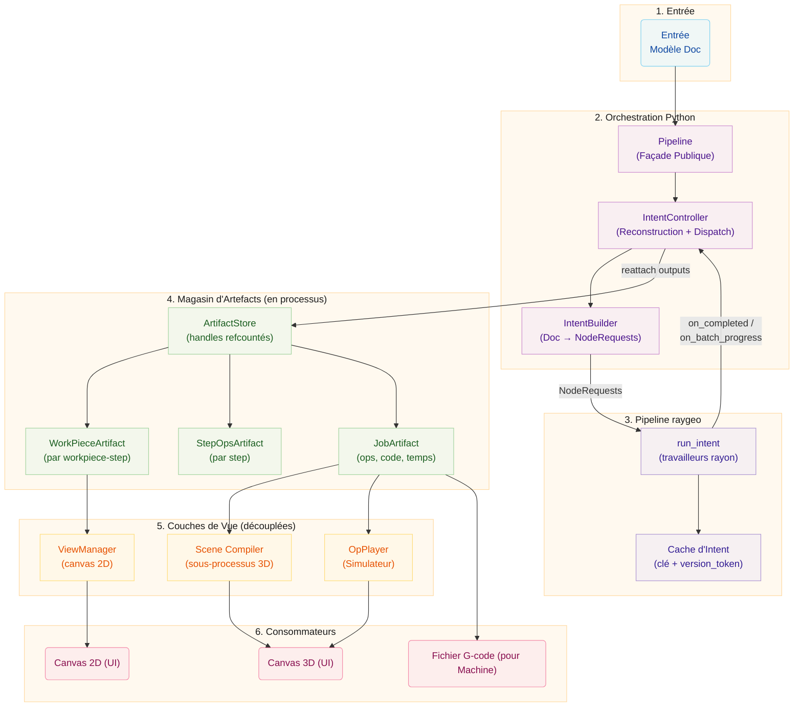

---
description:
  "Le pipeline d'intentions de Rayforge – comment les conceptions passent du modèle Doc via les
  intentions raygeo jusqu'à la génération de G-code."
---

# Architecture du Pipeline

Ce document décrit le pipeline qui transforme un modèle `Doc` en G-code exécutable par une machine.
Depuis la réécriture 1.9.0, le pipeline est construit sur les **intentions raygeo** : une
description déclarative du travail que le côté Rust doit effectuer, couplée à une fine couche
d'orchestration Python et un magasin d'artefacts en processus avec comptage de références.

L'ancien DAG multiprocessus (`DagScheduler`, `PipelineGraph`, `ArtifactManager`,
`GenerationContext`, `WorkPiecePipelineStage`) a été supprimé. Ce document décrit uniquement
l'architecture active.

```mermaid
graph TD
    subgraph Input["1. Entrée"]
        InputNode("Entrée<br/>Modèle Doc")
    end

    subgraph PythonOrchestrator["2. Orchestration Python"]
        Pipeline["Pipeline<br/>(Façade Publique)"]
        IC["IntentController<br/>(Reconstruction + Dispatch)"]
        IB["IntentBuilder<br/>(Doc &rarr; NodeRequests)"]
    end

    subgraph Raygeo["3. Pipeline raygeo"]
        RI["run_intent<br/>(travailleurs rayon)"]
        Cache["Cache d'Intent<br/>(clé + version_token)"]
    end

    subgraph Artifacts["4. Magasin d'Artefacts (en processus)"]
        Store["ArtifactStore<br/>(handles refcountés)"]
        WP["WorkPieceArtifact<br/>(par workpiece-step)"]
        SO["StepOpsArtifact<br/>(par step)"]
        JA["JobArtifact<br/>(ops, code, temps)"]
    end

    subgraph View["5. Couches de Vue (découplées)"]
        VM["ViewManager<br/>(canvas 2D)"]
        SC["Scene Compiler<br/>(sous-processus 3D)"]
        OP["OpPlayer<br/>(Simulateur)"]
    end

    subgraph Consumers["6. Consommateurs"]
        Vis2D("Canvas 2D (UI)")
        Vis3D("Canvas 3D (UI)")
        File("Fichier G-code (pour Machine)")
    end

    InputNode --> Pipeline
    Pipeline --> IC
    IC --> IB
    IB -->|"NodeRequests"| RI
    RI -->|"on_completed /<br/>on_batch_progress"| IC
    RI --> Cache
    IC -->|"reattach outputs"| Store
    Store --> WP
    Store --> SO
    Store --> JA

    WP --> VM
    JA --> SC
    JA --> OP
    JA --> File

    VM --> Vis2D
    SC --> Vis3D
    OP --> Vis3D

    classDef clusterBox fill:#fff3e080,stroke:#ffb74d80,stroke-width:1px,color:#1a1a1a
    classDef inputNode fill:#e1f5fe80,stroke:#03a9f480,color:#0d47a1
    classDef pyNode fill:#f3e5f580,stroke:#9c27b080,color:#4a148c
    classDef raygeoNode fill:#ede7f680,stroke:#5e35b180,color:#311b92
    classDef artifactNode fill:#e8f5e980,stroke:#4caf5080,color:#1b5e20
    classDef viewNode fill:#fff8e180,stroke:#ffc10780,color:#e65100
    classDef consumerNode fill:#fce4ec80,stroke:#e91e6380,color:#880e4f
    class Input,PythonOrchestrator,Raygeo,Artifacts,View,Consumers clusterBox
    class InputNode inputNode
    class Pipeline,IC,IB pyNode
    class RI,Cache raygeoNode
    class Store,WP,SO,JA artifactNode
    class VM,SC,OP viewNode
    class Vis2D,Vis3D,File consumerNode
```

# Concepts Clés

## Pipeline (Façade Publique)

`rayforge/pipeline/pipeline.py:40` — la classe avec laquelle le reste de l'application communique.
`DocEditor`, `ViewManager`, les widgets UI et le code de test ne doivent dépendre que de `Pipeline`.
`IntentController` et `IntentBuilder` sont des détails d'implémentation de la façade et peuvent
changer sans préavis.

`Pipeline` possède l'intégration `ArtifactStore` : elle traduit les sorties brutes de raygeo émises
par son `IntentController` interne en handles d'artefacts refcountés que l'UI et les chemins
d'exportation consomment, et expose la surface de signaux/propriétés que le reste de l'application
attend (état occupé, pause/reprise, recalcul, changements de machine).

Signaux clés relayés par la façade :

| Signal                     | Signification                                                 |
| -------------------------- | ------------------------------------------------------------- |
| `processing_state_changed` | Transitions occupé/inactif                                    |
| `workpiece_artifact_ready` | Un handle `WorkPieceArtifact` a été publié                    |
| `job_generation_finished`  | Un handle `JobArtifact` (G-code + ops + estimations) prêt     |
| `job_time_updated`         | Estimation de temps agrégée modifiée pendant un rebuild       |
| `data_stale`               | Reconstruction demandée mais en pause ou mode manuel          |
| `visual_chunk_available`   | Fragment raster progressif pour mises à jour UI incrémentales |

## IntentController

`rayforge/pipeline/intent_controller.py:108` — possède une `Intent` raygeo et le cycle de vie de
reconstruction associé. Il écoute les mêmes signaux Doc que l'ancien pipeline (`descendant_updated`,
`descendant_transform_changed`, `descendant_added`, `descendant_removed`,
`job_assembly_invalidated`) et reconstruit une `Intent` raygeo à chaque modification du document.

À chaque reconstruction avec debounce (200 ms `REBUILD_DEBOUNCE_MS`) :

1. `IntentBuilder` est appelé pour produire une liste fraîche d'objets `NodeRequest` à partir du
   `Doc` courant.
2. La nouvelle liste est encapsulée dans une `Intent` raygeo via `create_intent_from_nodes`.
3. `Intent.update` compare l'intention précédente avec la nouvelle en utilisant le `version_token`
   par nœud et supprime les entrées de cache obsolètes sur la `Pipeline` raygeo partagée.
4. Quand `dispatch=True`, la nouvelle intention est également exécutée via `run_intent` ; le
   callback `on_completed` effectue le filtre d'époque (élimine les résultats dont le
   `generation_id` est antérieur à la génération actuelle du contrôleur) puis marshalle un
   rattachement DOM vers le thread principal de l'application via le gestionnaire de tâches partagé.
5. Le callback `on_batch_progress` relaye la progression agrégée aux auditeurs via
   `progress_changed` (marshalé vers le thread principal pour que les gestionnaires de signaux ne
   s'exécutent jamais sur un travailleur rayon).

La carte `_key_to_item` du contrôleur (reconstruite à chaque appel réussi à `IntentBuilder.build`)
permet au callback `on_completed` avec filtre d'époque de rattacher les sorties au `WorkPiece` ou
`Step` d'origine sans reparcourir le Doc. Les clés de nœud sont distribuées par forme :

| Clé de nœud                     | Rattaché à                  | Signal émis                |
| ------------------------------- | --------------------------- | -------------------------- |
| `workpiece:{wp_uid}:{step_uid}` | Le `WorkPiece` propriétaire | `workpiece_artifact_ready` |
| `step:{step_uid}`               | Le `Step` propriétaire      | `step_artifact_ready`      |
| `job`                           | Le `Doc`                    | `job_aggregate_ready`      |
| `job:encode`                    | Le `Doc`                    | `job_generation_finished`  |

## IntentBuilder

`rayforge/pipeline/intent_builder.py:133` — parcourt un `Doc` et produit une liste plate d'objets
`NodeRequest` avec **clés stables** et **jetons de version déterministes**. Le builder est sans état
: chaque appel à `build` produit une liste fraîche et autonome adaptée à l'encapsulation dans une
`Intent` raygeo.

### Clés Stables

- `workpiece:{wp_uid}:{step_uid}` — un nœud de calcul par paire workpiece/step.
- `step:{step_uid}` — un nœud d'agrégat par step qui concatène les sorties de calcul des workpieces
  et applique les transformers par step.
- `job` — un nœud d'agrégat final liant toutes les sorties des steps avec des marqueurs de niveau
  job et des paramètres machine.
- `job:machinexform` — nœud de calcul de transformation machine qui consomme les ops en espace monde
  de l'agrégat job et produit des ops en espace machine (linéarisation de courbes, mappage d'axe
  rotatif, monde&rarr;machine, offsets WCS, Z-flip, AXIS_REPLACEMENT).
- `job:encode` — nœud de calcul d'encodeur qui consomme les ops du nœud de transformation machine et
  produit le code machine (G-code / sommet / texture).

Les formats de clé sont centralisés dans `intent_builder.py` pour que le producteur et la carte de
rattachement d'`IntentController` soient toujours en accord.

### Jetons de Version

Le cache raygeo est indexé uniquement par clé de nœud ; le `version_token` est le seul signal
d'invalidation. Les jetons sont des condensés SHA-1 d'une représentation canonique des entrées qui
affectent la sortie d'un nœud (voir `_hash_int`, `intent_builder.py:1066`) :

- **Jetons de calcul** hachent
  `(geometry_revision, wp_size, step_params, assembler_params, per_workpiece_transformers)`. Pour
  les scopes de step déclarant un transformer sensible à la position (voir
  `Step.is_position_sensitive`), `transform_revision` du workpiece et la révision de stock sont
  incluses dans le jeton ; sinon elles sont omises pour que les simples mouvements n'invalident pas
  les résultats de calcul du workpiece.
- **Jetons d'agrégat de step** hachent
  `(upstream compute tokens, placements, step_params, per_step/per_workpiece transformers, position_sensitive())`,
  plus `stock_rev` quand le step est sensible à la position.
- **Jeton job** intègre tous les jetons d'agrégat par step pour que tout changement amont
  (déplacement de workpiece, édition de transformer, modification de paramètre de step) se propage
  jusqu'au cache job/encode.
- **Jeton de transformation machine** intègre le jeton job plus l'identité de la machine
  (`supports_curves`, `reverse_z_axis`, configuration WCS, configuration du module rotatif par
  couche).
- **Jeton d'encode** intègre le jeton de transformation machine plus l'identité de l'encodeur
  (`driver_name`, `gcode_precision`, étendues d'axes, ...).

### Construction des Étapes

Chaque `NodeRequest` porte une `StageSpec` décrivant le travail que raygeo doit effectuer pour ce
nœud. Le builder produit :

- `StageSpec.Compute` pour chaque paire workpiece/step via
  `Step.build_compute_payload(machine_defaults, workpiece)`, qui retourne un `Part` (géométrie
  vectorielle ou source d'image) plus un `ComputePayload` (spécification d'assembleur). Les
  transformers par workpiece (`OverscanTransformer`, `BidirScanOffsetTransformer`, ...) sont résolus
  via `transformer_registry` en pyclasses Rust typées `*Spec` et attachés au payload pour que
  l'étape de calcul Rust les applique après l'assemblage.
- `StageSpec.Aggregate` pour chaque step : un `AggregateGroup` par nœud de calcul workpiece amont,
  entouré de marqueurs `WorkpieceStart`/`WorkpieceEnd`, chaque entrée portant la matrice de
  placement monde et la taille physique du workpiece comme `target_dimensions`. Les transformers par
  step (`MultiPassTransformer`, `Optimize`, ...) sont attachés à `AggregateSpec.transformers` pour
  que l'étape d'agrégat Rust les applique après concaténation. `MachineParams` est peuplé depuis la
  machine résolue pour que l'estimation de temps de l'agrégat soit correcte.
- `StageSpec.Aggregate` pour le nœud `job` : un `AggregateGroup` par couche entouré de marqueurs
  `LayerStart`/`LayerEnd`, chacun contenant un `AggregateInput` par step visible ; l'agrégat entier
  est entouré de `JobStart`/`JobEnd`.
- `MachineTransformSpec` pour `job:machinexform` : la matrice 4&times;4 monde&rarr;machine, les
  offsets WCS par défaut et par couche, les entrées `RotaryMappingSpec` par couche, le drapeau de
  linéarisation de courbes et le drapeau Z-reverse, empaquetés dans une spécification sérialisable
  que l'étape Rust `MachineTransformCompute` consomme.
- `EncodeSpec` pour `job:encode` : achemine les machines Grbl vers le `GcodeSpec` Rust natif
  (compilé directement sur un thread rayon sans traverser le GIL) et toute autre machine vers un
  `PythonEncoder` encapsulant le callable d'encodeur spécifique au driver. L'encodeur lit les ops en
  espace machine depuis le nœud amont `job:machinexform`.

### Résolution de Stock

`_resolve_stock_geometries` (appelée une fois par `build` et mise en cache sur le builder) retourne
les géométries de limite de stock en espace monde que les transformers comme `CropTransformer`
utilisent pour découper les ops par workpiece dans la zone de travail de la machine ou dans des
`StockItem`s explicites. Les entrées `StockItem` appartenant au Doc ont priorité ; le rectangle de
la zone de travail de la machine est utilisé comme solution de repli uniquement quand aucun stock de
Doc n'existe.

## Pipeline raygeo & `run_intent`

La `Pipeline` de raygeo (`raygeo.pipeline.execute.Pipeline`) possède le cache que `Intent.update`
invalide. `run_intent` planifie les nœuds de l'intention sur des threads travailleurs rayon sous le
GIL et invoque le callback `on_completed` par nœud et `on_batch_progress` pour la progression
agrégée. Les travaux lourds (calcul, raster, agrégat, transformations machine, encodage) s'exécutent
dans des threads raygeo au lieu de sous-processus, ce qui est le changement principal mentionné dans
CHANGELOG 1.9.0.

## ArtifactStore & Handles d'Artefacts

L'ancien `ArtifactStore` en mémoire partagée a été remplacé par un magasin en processus avec
comptage de références (`rayforge/pipeline/artifact/store.py:29`). Tous les artefacts vivent comme
des objets Python simples dans un dict indexé par UUID ; les handles portent l'UUID dans leur champ
`key` plus les métadonnées nécessaires au type d'artefact. Le cycle de vie est géré par comptage de
références via `ArtifactStore.retain`/`release`.

La façade `Pipeline` traduit les sorties raygeo en handles d'artefacts sur le thread principal :

| Sortie (raygeo)        | Artefact            | Stocké sous tag |
| ---------------------- | ------------------- | --------------- |
| Ops par workpiece-step | `WorkPieceArtifact` | `wp`            |
| Ops agrégées par step  | `StepOpsArtifact`   | `step`          |
| Agrégat job + encode   | `JobArtifact`       | `job`           |

`JobArtifact` porte les `Ops` en espace monde, la distance totale, l'estimation de temps,
l'`EncodedOutput` (texte plus carte op&rarr;code machine) et — quand des modules rotatifs sont
configurés — des ops mappées cinématiquement pour l'aperçu 3D.

## IDs de Génération & Filtre d'Époque

Chaque reconstruction incrémente `IntentController.generation_id`. Chaque nœud terminé porte la
génération dont il est issu. Le callback `on_completed` compare le `generation_id` du nœud avec la
génération actuelle du contrôleur et supprime silencieusement les résultats obsolètes, de sorte que
les sorties périmées d'une reconstruction antérieure ne soient jamais rattachées au DOM.

## Pause, Reprise & Mode Manuel

- `Pipeline.pause()`/`resume()` incrémente/décrémente un compteur de pause sur le contrôleur.
  Pendant la pause, les modifications du Doc positionnent un drapeau `data_stale` (et émettent
  `data_stale`) au lieu de planifier une reconstruction ; à la reprise, le drapeau est effacé et une
  reconstruction est planifiée si `auto_rebuild` est activé.
- `Pipeline.auto_pipeline=False` (mode manuel) : le recalcul est déclenché explicitement via
  `Pipeline.recalculate()` plutôt qu'automatiquement à chaque modification du Doc.

## Stratégie d'Invalidation

L'invalidation est implicite et pilotée par les jetons : tout changement qui affecte les entrées
d'un nœud amène le builder à produire un `version_token` différent pour la clé de ce nœud.
`Intent.update` supprime l'entrée de cache obsolète et raygeo réexécute uniquement ce nœud (et ses
consommateurs aval).

| Type de Changement                    | Effet sur les Jetons                                                                                                                                                                                    |
| ------------------------------------- | ------------------------------------------------------------------------------------------------------------------------------------------------------------------------------------------------------- |
| Géométrie / paramètres                | Nouveaux jetons de calcul workpiece cascade vers step, job, machinexform, encode                                                                                                                        |
| Position / rotation                   | Jetons de calcul workpiece inchangés sauf si le step est sensible à la position ; les jetons d'agrégat step changent toujours à cause des placements intégrés, ce qui cascade vers job/encode           |
| Changement de taille                  | Comme géométrie : les jetons cascade depuis les paires workpiece-step vers le haut                                                                                                                      |
| Stock items visibles/déplacés/ajoutés | Affecte `stock_rev` (intégré dans les jetons de calcul et d'agrégat des steps sensibles à la position)                                                                                                  |
| Configuration machine                 | Tous les jetons `job:machinexform` et `job:encode` changent ; les jetons de calcul/agrégat step changent si `kerf_mm`/`cut_speed`/tête laser/tolérance d'arc/`supports_curves`/`supports_arcs` changent |

# Ventilation Détaillée

## Entrée

Le processus commence avec le **Modèle Doc**, qui contient :

- **WorkPieces :** Éléments de conception individuels (SVG, images) placés sur le canvas
- **Steps :** Instructions de traitement (Contour, Raster, etc.) avec paramètres, organisées dans un
  `Workflow` par couche
- **Layers :** Regroupement de workpieces, chacun avec son propre workflow, WCS et configuration
  rotative
- **StockItems :** Limites de stock explicites optionnelles utilisées par les transformers sensibles
  à la position (ex. CropTransformer)

## Orchestration Python

### Pipeline (Façade)

La classe `Pipeline` :

- Écoute les modifications du modèle Doc via des signaux (relayés à travers l'`IntentController`)
- **Debounce** les changements (délai de réconciliation de 200 ms)
- Coordonne avec l'`IntentController` pour déclencher la régénération
- Gère l'état global de traitement et la détection d'occupation
- Supporte la **pause/reprise** pour les opérations par lots
- Supporte le **mode manuel** (`auto_pipeline=False`) où le recalcul est déclenché explicitement
- Connecte les signaux entre les composants et les relaie aux consommateurs
- Publie les handles d'artefacts refcountés dans l'`ArtifactStore`

### IntentController

L'`IntentController` :

- Possède une `Intent` raygeo et le cycle de vie de reconstruction
- Reconstruit une intention fraîche à chaque changement de Doc avec debounce
- Exécute l'intention via `run_intent` quand `dispatch=True`
- Filtre les résultats obsolètes par `generation_id` (filtre d'époque)
- Marshalle les rattachements DOM vers le thread principal via le gestionnaire de tâches partagé

### IntentBuilder

L'`IntentBuilder` est sans état ; chaque appel à `build` parcourt le `Doc` et produit un
`NodeRequest` par paire workpiece/step, un agrégat par step, et les nœuds `job`, `job:machinexform`
et `job:encode`. Voir [Clés Stables](#clés-stables), [Jetons de Version](#jetons-de-version) et
[Construction des Étapes](#construction-des-étapes) ci-dessus.

## Pipeline raygeo

`run_intent` planifie l'exécution des nœuds sur des threads travailleurs rayon sous le GIL.
L'instance partagée `RaygeoPipeline` contient le cache de nœuds indexé par clé de nœud ;
`Intent.update` est le seul point d'entrée d'invalidation. Calcul, raster, shrinkwrap, wavefront,
contour, rendu de vue et transformation/encodage machine s'exécutent tous dans des threads raygeo.

## Génération d'Artefacts

### WorkPieceArtifacts

Générés pour chaque combinaison `(WorkPiece, Step)`. Contient :

- Toolpaths (`Ops`) dans le système de coordonnées local du workpiece
- Drapeau d'évolutivité et dimensions source pour les ops indépendantes de la résolution
- ID de génération

Les grands workpieces raster sont traités par incréments en fragments (relayés via
`visual_chunk_available`), permettant un retour visuel progressif pendant la génération.

### StepOpsArtifacts

Générés pour chaque Step, consommant tous les WorkPieceArtifacts associés :

- `Ops` combinés pour tous les workpieces en coordonnées monde
- Transformers par step appliqués (`Optimize`, `MultiPass`, ...)

### JobArtifact

Généré quand du G-code est nécessaire, consommant l'agrégat `job` et le nœud `job:encode` :

- Code machine final (G-code ou format spécifique au driver) via `EncodedOutput` (texte + carte
  op&rarr;code machine)
- `Ops` en espace monde pour simulation et lecture
- Estimation de temps haute fidélité et distance totale
- Ops mappées rotativement pour l'aperçu 3D quand des modules rotatifs sont configurés

## Couche de Vue 2D (Découplée)

Le `ViewManager` est découplé du pipeline de données. Il gère le rendu pour le canvas 2D basé sur
l'état de l'UI.

### RenderContext

Contient les paramètres de vue actuels (pixels par millimètre, décalage du viewport, options
d'affichage).

### WorkPieceViewArtifacts

Le `ViewManager` crée des `WorkPieceViewArtifacts` qui rastérisent les `WorkPieceArtifacts` dans
l'espace écran, appliquent le `RenderContext` actuel, et sont mis en cache et mis à jour quand le
contexte ou la source change. Le re-rendu est limité (intervalle de 33 ms) et à concurrence limitée
; l'assemblage progressif de fragments fournit des mises à jour visuelles incrémentales. Le
`ViewManager` indexe les vues par `(workpiece_uid, step_uid)` pour permettre la visualisation des
états intermédiaires d'un workpiece à travers plusieurs steps.

## Couche 3D / Simulateur (Découplée)

Le système de visualisation et de simulation 3D est découplé du pipeline de données, suivant un
modèle similaire au `ViewManager`. Il se compose :

- D'un **Scene Compiler** qui s'exécute dans un sous-processus pour convertir les ops `JobArtifact`
  en données de sommet prêtes pour le GPU
- D'un **OpPlayer** qui rejoue les ops du job pour une simulation machine en temps réel avec des
  contrôles de lecture

Les deux consomment le `JobArtifact` produit par le pipeline.

### CompiledSceneArtifact

Le Scene Compiler produit un `CompiledSceneArtifact` contenant :

- **Couches de sommets :** Buffers de sommets powered/travel/zero-power avec décalages par commande
  pour révélation progressive
- **Couches de texture :** Cartes de puissance de lignes de balayage rastérisées pour l'aperçu de
  gravure
- **Couches de superposition :** Segments de puissance de lignes de balayage pour surbrillance en
  temps réel
- Support pour la géométrie rotative (enveloppée cylindriquement)

### Pipeline de Compilation

1. Canvas3D écoute les signaux `job_generation_finished`
2. Quand un nouveau job est prêt, il planifie la compilation de scène dans un sous-processus
3. Le sous-processus lit le `JobArtifact` depuis le magasin et compile les ops en données de sommet
   GPU
4. La scène compilée est reprise et téléchargée vers les moteurs de rendu GPU

### OpPlayer (Backend du Simulateur)

L'`OpPlayer` parcourt les ops du job commande par commande, en maintenant un `MachineState` qui suit
la position, l'état du laser et les axes auxiliaires. Cela pilote la lecture du canvas 3D
(révélation progressive du trajet d'outil), la visualisation de la position de la tête de machine et
du faisceau laser, et le pas à pas par commande pour le curseur de lecture.

## Consommateurs

| Consommateur | Utilise                    | But                                       |
| ------------ | -------------------------- | ----------------------------------------- |
| Canvas 2D    | WorkPieceViewArtifacts     | Affiche les workpieces en espace écran    |
| Canvas 3D    | CompiledSceneArtifact      | Affiche le job complet en 3D avec lecture |
| Machine      | JobArtifact (code machine) | Sortie de fabrication                     |

# Décisions Architecturales Clés

1. **Ordonnancement basé sur les Intentions :** Au lieu d'un DAG Python explicite avec des
   ordonnanceurs résidents Python, le pipeline déclare _quoi_ calculer (une `Intent` de
   `NodeRequest`s avec des clés stables et des jetons de version) et laisse `run_intent` de raygeo
   ordonnancer le travail sur des threads rayon. L'invalidation du cache est purement pilotée par
   les jetons via `Intent.update`.

2. **Façade + Contrôleur Interne :** `Pipeline` est la seule surface publique ; `IntentController`
   et `IntentBuilder` sont des détails d'implémentation. Cela maintient le contrat public de
   signaux/propriétés stable tout en permettant aux internes d'orchestration d'évoluer.

3. **Magasin d'Artefacts en Processus :** Le remplacement du magasin multiprocessus en mémoire
   partagée par un dictionnaire en processus avec comptage de références supprime la complexité IPC
   et de transfert de propriété tout en conservant le contrat de handle/cycle de vie sur lequel
   reposent l'UI et les chemins d'exportation.

4. **IDs de Génération :** Chaque reconstruction incrémente un ID de génération ; chaque nœud
   terminé porte sa génération d'origine. Le filtre d'époque de `on_completed` supprime
   silencieusement les résultats obsolètes, de sorte que les sorties périmées ne soient jamais
   rattachées au DOM.

5. **Rattachement sur le Thread Principal :** Les callbacks raygeo (`on_completed`,
   `on_batch_progress`) se déclenchent sur des threads travailleurs rayon sous le GIL ; le
   contrôleur marshalle chaque callback touchant le DOM vers le thread principal de l'application
   via le gestionnaire de tâches partagé, de sorte que les gestionnaires de signaux ne s'exécutent
   jamais sur un travailleur.

6. **Séparation des Couches de Vue :** Le canvas 2D (`ViewManager`) et le canvas 3D (Scene Compiler
   / OpPlayer) sont tous deux découplés du pipeline de données. Chacun est piloté par des signaux du
   pipeline plutôt que de faire partie de l'intention.

7. **Invalidation Pilotée par les Jetons :** Il n'y a pas de table d'invalidation explicite. Le
   builder produit des jetons de version SHA-1 canoniques ; tout changement d'entrée produit un
   jeton différent, qu'`Intent.update` utilise pour supprimer exactement les entrées de cache
   affectées.

8. **Réconciliation avec Debounce :** Les modifications du Doc sont regroupées avec un debounce de
   200 ms (`REBUILD_DEBOUNCE_MS`) pour éviter les cycles excessifs du pipeline pendant les
   modifications rapides.
