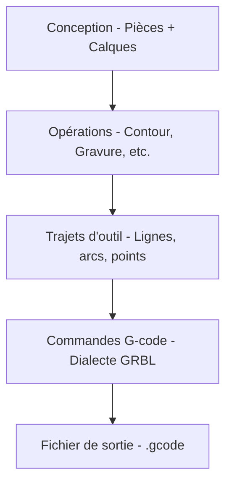

# Les bases du G-code

Comprendre le G-code vous aide à résoudre les problèmes et à personnaliser la sortie de Rayforge.

## Processus général

Rayforge convertit vos conceptions en G-code via un processus en plusieurs étapes :



**Ce que fait Rayforge :**

1. **Analyse votre conception** - Extrait la géométrie des pièces
2. **Applique les opérations** - Détermine les trajets de coupe/gravure
3. **Optimise les trajets d'outil** - Réordonne les trajets, minimise les déplacements
4. **Génère les commandes** - Convertit les trajets en G-code
5. **Injecte les hooks** - Ajoute des macros définies par l'utilisateur aux points spécifiés
6. **Écrit le fichier** - Produit le G-code complet prêt pour la machine

## Exemple simple

Voici une structure de fichier G-code de base montrant une coupe carrée :

```gcode
G21 ;Définir les unités en mm
G90 ;Positionnement absolu
G54
T0
G0 X95.049 Y104.951 Z0.000
M4 S500
G1 X104.951 Y104.951 Z0.000 F3000
G1 X104.951 Y95.049 Z0.000 F3000
G1 X95.049 Y95.049 Z0.000 F3000
G1 X95.049 Y104.951 Z0.000 F3000
M5
G0 X95.000 Y105.000 Z0.000
M4 S500
G1 X95.000 Y95.000 Z0.000 F3000
G1 X105.000 Y95.000 Z0.000 F3000
G1 X105.000 Y105.000 Z0.000 F3000
G1 X95.000 Y105.000 Z0.000 F3000
M5
M5 ;S'assurer que le laser est éteint
G0 X0 Y0 ;Retour à l'origine
```

**Commandes clés :**

| Commande | Description |
| -------- | ----------- |
| `G21` | Mode millimètres |
| `G90` | Positionnement absolu |
| `G54` | Sélectionner le système de coordonnées de travail 1 |
| `T0` | Sélectionner l'outil 0 (tête laser) |
| `G0` | Déplacement rapide (laser éteint) |
| `G1` | Déplacement de coupe (laser allumé) |
| `M4` | Laser allumé (mode puissance dynamique) |
| `M5` | Laser éteint |
| `S500` | Définir la puissance du laser à 500 (50% pour une plage 0-1000) |
| `F3000` | Définir la vitesse d'avance à 3000 mm/min |

---

## Pages connexes

- [Dialectes G-code](../reference/gcode-dialects) - Différences entre firmwares
- [Exporter du G-code](../files/exporting) - Paramètres et options d'exportation
- [Hooks et Macros](../machine/hooks-macros) - Injection de G-code personnalisé
