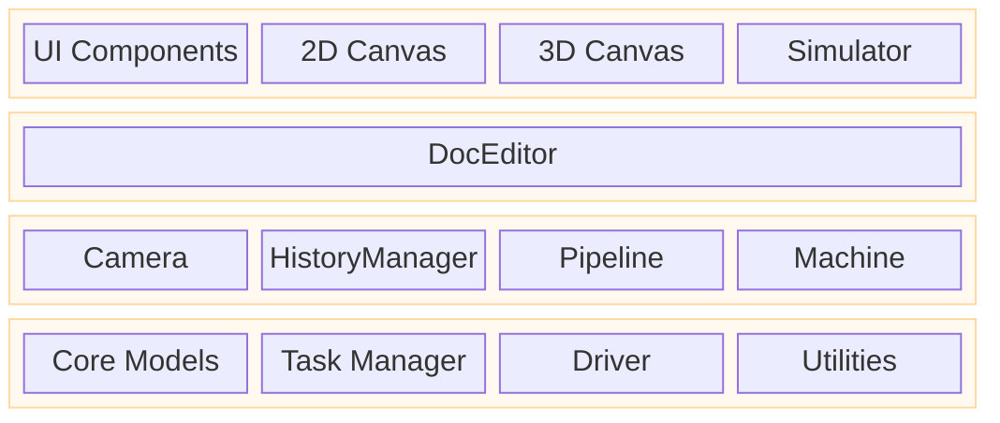

---
description:
  "Rayforge संरचना अवलोकन - एप्लिकेशन संरचना, पाइपलाइन, ड्राइवर प्रणाली, और घटक एक साथ कैसे काम करते
  हैं समझें."
---

# Rayforge संरचना

यह दस्तावेज़ Rayforge का एक उच्च-स्तरीय संरचनात्मक अवलोकन देता है, यह समझाते हुए कि प्रमुख घटक
एक-दूसरे से कैसे संबंधित हैं. विशिष्ट क्षेत्रों में गहराई के लिए कृपया लिंक किए गए दस्तावेज़ देखें.

## विषय सूची

- [स्तरित एप्लिकेशन संरचना](#layered-application-architecture)
- [कोड संरचना](#code-architecture)
- [दस्तावेज़ मॉडल संरचना](#document-model-architecture)
- [पाइपलाइन संरचना](#pipeline-architecture)

---

## स्तरित एप्लिकेशन संरचना {#layered-application-architecture}

एप्लिकेशन तार्किक स्तरों में संरचित है, उपयोगकर्ता इंटरफ़ेस, एप्लिकेशन तर्क, और कोर सेवाओं को अलग
करते हुए. यह चिंताओं का एक साफ़ पृथक्करण बढ़ावा देता है और नियंत्रण के प्रवाह को स्पष्ट करता है

- **UI स्तर (दृश्य)**: सभी उपयोगकर्ता-सामना तत्व रखता है. `Workbench` मुख्य कैनवस क्षेत्र है जो 2D
  और 3D दृश्य होस्ट करता है.
- **एडिटर/नियंत्रक स्तर**: `DocEditor` केंद्रीय नियंत्रक के रूप में काम करता है, UI घटनाओं का
  प्रतिक्रिया देता है और कोर मॉडल संचालित करता है.
- **कोर / सेवा स्तर**: आधारभूत सेवाएँ और अवस्था देता है. `Core Models` दस्तावेज़ दर्शाते हैं,
  `Tasker` पृष्ठभूमि जॉब प्रबंधित करता है, `Machine` डिवाइस संचार संभालता है, और `Camera` व्यूपोर्ट
  प्रबंधित करता है.

---

## कोड संरचना {#code-architecture}

Rayforge एक GTK4/Libadwaita एप्लिकेशन है जिसमें एक मॉड्यूलर, पाइपलाइन-संचालित संरचना है.

- **`rayforge/core/`**: दस्तावेज़ मॉडल और ज्यामिति प्रबंधन.
- **`rayforge/pipeline/`**: दस्तावेज़ मॉडल से मशीन ऑपरेशन जनरेट करने वाली कोर प्रोसेसिंग पाइपलाइन.
- **`rayforge/machine/`**: हार्डवेयर इंटरफ़ेस स्तर, जिसमें डिवाइस ड्राइवर, ट्रांसपोर्ट प्रोटोकॉल, और
  मशीन मॉडल शामिल हैं.
- **`rayforge/doceditor/`**: मुख्य दस्तावेज़ एडिटर नियंत्रक और उसका UI.
- **`rayforge/workbench/`**: 2D/3D कैनवस और विज़ुअलाइज़ेशन प्रणालियाँ.
- **`rayforge/image/`**: विभिन्न फ़ाइल फ़ॉर्मेटों (SVG, DXF आदि) के आयातक.
- **`rayforge/shared/`**: सामान्य उपयोगिताएँ, जिनमें पृष्ठभूमि जॉब प्रबंधन के लिए `tasker` शामिल है.

---

## दस्तावेज़ मॉडल संरचना {#document-model-architecture}

दस्तावेज़ मॉडल **कंपोज़िट पैटर्न** पर आधारित ऑब्जेक्टों का एक पदानुक्रमित वृक्ष है. यह संरचना
उपयोगकर्ता की पूरी परियोजना दर्शाती है, मूल `Doc` ऑब्जेक्ट से लेकर व्यक्तिगत `WorkPiece` तक. इसे
रिएक्टिव और क्रमबद्ध योग्य होने के लिए डिज़ाइन किया गया है.

**[विवरण के लिए दस्तावेज़ मॉडल संरचना देखें](./docmodel.md)**

---

## पाइपलाइन संरचना {#pipeline-architecture}

पाइपलाइन दस्तावेज़ मॉडल को मशीन-निष्पादन योग्य G-code में बदलती है. वह पृष्ठभूमि में अतुल्यकालिक रूप
से चलती है और प्रक्रियाओं के बीच उच्च-प्रदर्शन डेटा ट्रांसफ़र के लिए एक साझा-मेमोरी `Artifact`
प्रणाली उपयोग करती है. पाइपलाइन चरणों से बनी है: **Modifiers → Producers → Transformers →
Encoders**.

**[विवरण के लिए पाइपलाइन संरचना देखें](./pipeline.md)**
