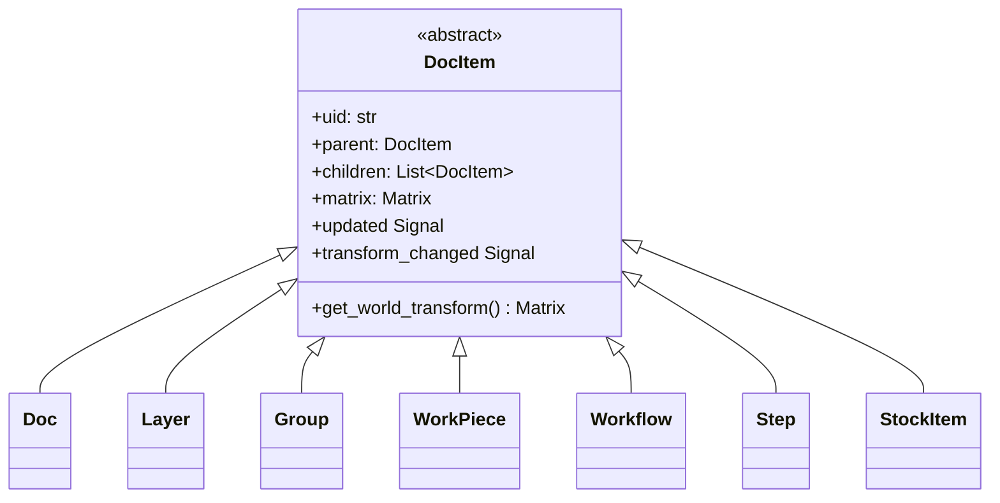
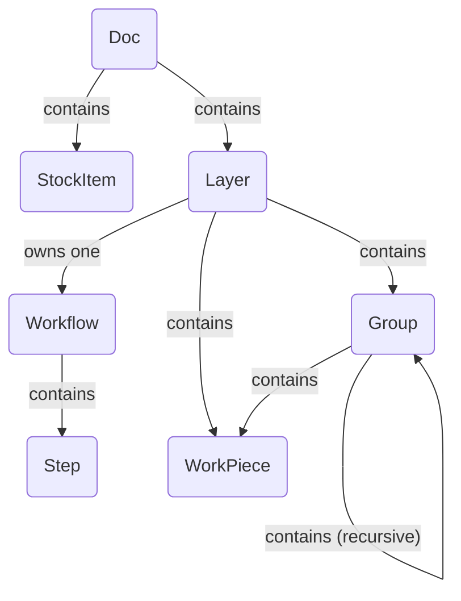

---
description:
  "Rayforge दस्तावेज़ मॉडल - डिज़ाइन, ऑपरेशन, और वर्कपीस एप्लिकेशन में भीतरी रूप से कैसे दर्शाए जाते
  हैं."
---

# दस्तावेज़ मॉडल संरचना

दस्तावेज़ मॉडल एप्लिकेशन की रीढ़ है, पूरे उपयोगकर्ता परियोजना को ऑब्जेक्टों के एक पदानुक्रमित वृक्ष
के रूप में दर्शाता है. इसे रिएक्टिव, क्रमबद्ध योग्य, और आसानी से पार करने योग्य होने के लिए डिज़ाइन
किया गया है.

## अवलोकन

संरचना **कंपोज़िट डिज़ाइन पैटर्न** पर बनी है. एक एकल अमूर्त आधार वर्ग, `DocItem`, दस्तावेज़ वृक्ष
में मौजूद हो सकने वाले सभी ऑब्जेक्टों (जैसे, लेयरें, वर्कपीस, समूह) के लिए सामान्य इंटरफ़ेस परिभाषित
करता है. इससे जटिल, नेस्टेड संरचनाओं को समरूपी रूप से माना जा सकता है.

मॉडल के मुख्य सिद्धांतों में शामिल हैं:

- **वृक्ष संरचना:** `Doc` ऑब्जेक्ट वृक्ष की जड़ के रूप में काम करता है. प्रत्येक आइटम (जड़ के अलावा)
  का एक एकल `parent` होता है और उसके कई `children` हो सकते हैं.
- **रिएक्टिविटी:** मॉडल एक सिग्नल/स्लॉट प्रणाली (`blinker`) उपयोग करता है. कोई आइटम बदलने पर वह
  सिग्नल जारी करता है. जनक आइटम अपने संतानों के सिग्नल सुनते हैं और उन्हें वृक्ष के ऊपर "बुलबुला"
  करते हैं. इससे `Pipeline` जैसे उच्च-स्तरीय घटक मूल `Doc` ऑब्जेक्ट के एक एकल सिग्नल से जुड़कर
  दस्तावेज़ में किसी भी बदलाव के लिए सुन सकते हैं. प्रणाली कुशल अपडेट के लिए सामग्री बदलावों और
  रूपांतरण बदलावों दोनों को अलग-अलग ट्रैक करती है.
- **रूपांतरण पदानुक्रम:** प्रत्येक `DocItem` का एक स्थानीय रूपांतरण `Matrix` होता है. "विश्व" (मुख्य
  कैनवस) में किसी आइटम की अंतिम स्थिति, स्केल, और घूर्णन उसके अपने स्थानीय मैट्रिक्स और उसके सभी
  पूर्वजों के विश्व मैट्रिक्स का गुणनफल होता है.
- **डेटा पृथक्करण:** किसी `WorkPiece` का दृश्य या कच्चा डेटा सीधे उसके भीतर संग्रहीत नहीं होता. इसके
  बजाय, `WorkPiece` एक UID रखता है जो `Doc` पर एकीकृत `assets` रजिस्टरी में एक `SourceAsset`
  ऑब्जेक्ट का संदर्भ देता है. यह दस्तावेज़ संरचना को डेटा प्रबंधन से अलग कर देता है, जिससे मॉडल अधिक
  हल्का और लचीला बन जाता है.

---

## वर्ग वंशावली

यह आरेख वर्ग पदानुक्रम दिखाता है. दस्तावेज़ के स्थानिक वृक्ष का भाग होने वाला हर ऑब्जेक्ट अमूर्त
आधार वर्ग `DocItem` से वंशानुक्रमित होता है, पैतृकता, रूपांतरण, और सिग्नल बुलबुले जैसी कोर
कार्यक्षमताएँ प्राप्त करता है.

- **`DocItem`**: कंपोज़िट पैटर्न कार्यान्वयन देने वाला अमूर्त आधार.
- सभी अन्य वर्ग `DocItem` के ठोस कार्यान्वयन हैं, प्रत्येक की दस्तावेज़ संरचना में एक विशिष्ट भूमिका
  है.

---

## ऑब्जेक्ट संयोजन

यह आरेख दर्शाता है कि पूर्ण दस्तावेज़ बनाने के लिए वर्गों के इंस्टेंस कैसे जोड़े जाते हैं. यह
ऑब्जेक्टों के बीच जनक-संतान संबंध और संदर्भ दिखाता है.

- एक `Doc` शीर्ष-स्तरीय ऑब्जेक्ट है. वह एक या अधिक `Layer` और `StockItem` **रखता** है. वह परियोजना
  के सभी `SourceAsset` युक्त एकीकृत `assets` रजिस्टरी भी **प्रबंधित** करता है.
- प्रत्येक `Layer` उपयोगकर्ता की सामग्री **रखती** है: `WorkPiece` और `Group`. महत्वपूर्ण रूप से, एक
  `Layer` एक `Workflow` भी **रखती** है.
- एक `Workflow` क्रमित `Step` सूची **रखता** है, जो उस लेयर के लिए विनिर्माण प्रक्रिया परिभाषित करते
  हैं.
- एक `Group` एक कंटेनर है जो `WorkPiece` और अन्य `Group` रख सकता है, नेस्टेड रूपांतरणों की अनुमति
  देता है.
- एक `WorkPiece` एक मौलिक डिज़ाइन तत्व है. वह अपना कच्चा डेटा सीधे संग्रहीत नहीं करता. इसके बजाय, वह
  एक UID के माध्यम से एक `SourceAsset` का **संदर्भ** देता है. उसका अपना `Geometry` (वेक्टर डेटा) भी
  **होता** है और `Tab` की एक सूची हो सकती है.

---

## DocItem विवरण

- **`DocItem` (अमूर्त)**
  - **भूमिका:** सभी वृक्ष नोडों का अमूर्त आधार.
  - **मुख्य गुण:** `uid`, `parent`, `children`, `matrix`, `updated` सिग्नल, `transform_changed`
    सिग्नल. कोर कंपोज़िट पैटर्न तर्क प्रदान करता है.

- **`Doc`**
  - **भूमिका:** दस्तावेज़ वृक्ष की जड़.
  - **मुख्य गुण:** `children` (लेयरें, StockItem), `assets` (UID को `SourceAsset` ऑब्जेक्टों से मैप
    करने वाली एकीकृत रजिस्ट्री), `active_layer`.

- **`Layer`**
  - **भूमिका:** सामग्री की प्राथमिक संगठनात्मक इकाई. एक लेयर वर्कपीस के समूह को एक एकल विनिर्माण
    वर्कफ़्लो से जोड़ती है.
  - **मुख्य गुण:** `children` (WorkPiece, Group, एक Workflow), `visible`.

- **`Group`**
  - **भूमिका:** अन्य `DocItem` (`WorkPiece`, `Group`) के लिए एक कंटेनर. आइटमों के संग्रह को एक एकल
    इकाई के रूप में रूपांतरित करने की अनुमति देता है.

- **`WorkPiece`**
  - **भूमिका:** कैनवस पर एक एकल, भौतिक डिज़ाइन तत्व दर्शाता है (जैसे, एक आयातित SVG).
  - **मुख्य गुण:** `vectors` (एक `Geometry` ऑब्जेक्ट), `source_asset_uid`, `tabs`, `tabs_enabled`.
    उसके `vectors` 1x1 बॉक्स तक सामान्यीकृत होते हैं, सारी स्केलिंग और स्थापना उसके रूपांतरण
    `matrix` द्वारा संभाली जाती है.

- **`Workflow`**
  - **भूमिका:** प्रोसेसिंग निर्देशों का एक क्रमित अनुक्रम. एक `Layer` के स्वामित्व में.
  - **मुख्य गुण:** `children` (क्रमित `Step` सूची).

- **`Step`**
  - **भूमिका:** एक `Workflow` के भीतर एक एकल प्रोसेसिंग निर्देश (जैसे, "Contour Cut" या "Raster
    Engrave"). वह एक कॉन्फ़िगरेशन ऑब्जेक्ट है जो उपयोग होने वाले producer, modifiers, और
    transformers परिभाषित करने वाले शब्दकोश रखता है.

- **`StockItem`**
  - **भूमिका:** दस्तावेज़ में भौतिक सामग्री का एक टुकड़ा दर्शाता है, उसके वेक्टर `geometry` द्वारा
    परिभाषित. StockItem दस्तावेज़-स्तरीय आइटम हैं (`Doc` के संतान, `Layer` के साथ) और लेयरों से
    स्वतंत्र रूप से मौजूद रहते हैं.
