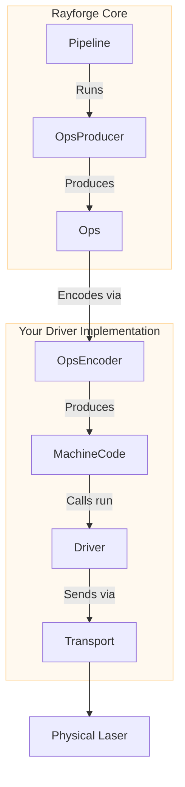

---
description:
  "Rayforge ड्राइवर प्रणाली - लेज़र नियंत्रक ड्राइवर कैसे काम करते हैं, और नए हार्डवेयर के लिए कस्टम
  ड्राइवर कैसे कार्यान्वित करें."
---

# ड्राइवर विकास गाइड

यह गाइड आपके लेज़र कटर या उत्कीर्णक के लिए समर्थन जोड़ने के लिए Rayforge में ड्राइवर बनाने का
उच्च-स्तरीय अवलोकन देती है. ड्राइवर बनाकर, आप अपनी मशीन के अद्वितीय संचार प्रोटोकॉल और कमांड भाषा को
Rayforge पारिस्थितिकी में एकीकृत करते हैं.

## ड्राइवर अवलोकन

ड्राइवर Rayforge के कोर तर्क और आपके भौतिक हार्डवेयर के बीच का पुल है. वह तीन मुख्य कार्यों के लिए
उत्तरदायी है:

1.  **कनेक्टिविटी प्रबंधन:** निम्न-स्तरीय संचार प्रोटोकॉल (सीरियल, WebSocket, HTTP आदि) संभालना.
2.  **जॉब निष्पादित करना:** पूर्व-एन्कोडेड मशीन कोड (जैसे, G-code) डिवाइस को भेजना और निष्पादन
    प्रगति ट्रैक करना.
3.  **अवस्था रिपोर्ट करना:** लेज़र की वास्तविक समय की स्थिति, अवस्था (`IDLE`, `RUN`), और लॉग संदेशों
    के साथ UI अपडेट करने के लिए सिग्नल जारी करना.

इसे सरल बनाने के लिए, Rayforge संरचनीय भागों पर आधारित एक संरचना देता है:



- **`OpsEncoder`:** `Ops` को एक विशिष्ट कमांड भाषा (जैसे, G-code) में अनुवादित करता है. Pipeline
  (जॉब एन्कोडिंग के लिए) और Driver (move_to, home आदि जैसी व्यक्तिगत कमांडों के लिए) दोनों द्वारा
  उपयोग किया जाता है.
- **`Pipeline`:** एन्कोडिंग समन्वयित करती है और अंतिम मशीन कोड उत्पन्न करती है.
- **`Transport`:** कनेक्शन और डेटा ट्रांसफ़र प्रबंधित करता है.
- **`Driver`:** मशीन कोड निष्पादित करता है, डिवाइस अवस्था संभालता है, और UI से संवाद करता है.

उपयोगकर्ता इंटरफ़ेस उत्तरदायी रहे, इसे सुनिश्चित करने के लिए सभी ड्राइवर ऑपरेशन **अतुल्यकालिक** हैं.

## `Ops` भाषा

Rayforge लेज़र जॉब को उच्च-स्तरीय ऑपरेशनों के अनुक्रम के रूप में वर्णित करता है, जो एक `Ops`
ऑब्जेक्ट में संग्रहीत होते हैं. यह किसी भी विशिष्ट हार्डवेयर से स्वतंत्र, मशीन गतियाँ वर्णित करने के
लिए Rayforge के भीतर की सार्वभौमिक भाषा है.

| `Ops` विधि           | हस्ताक्षर                      | विवर्रण                               |
| :------------------- | :----------------------------- | :------------------------------------ |
| `move_to`            | `(x, y, z=0.0)`                | तीव्र गति (कटिंग नहीं)                |
| `line_to`            | `(x, y, z=0.0)`                | कटिंग/उत्कीर्णन गति                   |
| `arc_to`             | `(x, y, i, j, cw=True, z=0.0)` | कटिंग/उत्कीर्णन चाप गति               |
| `set_power`          | `(power)`                      | लेज़र शक्ति सेट करें (0-100%)         |
| `set_cut_speed`      | `(speed)`                      | कटिंग गतियों की गति सेट करें (mm/min) |
| `set_travel_speed`   | `(speed)`                      | तीव्र गतियों की गति सेट करें (mm/min) |
| `enable_air_assist`  | `()`                           | एयर असिस्ट चालू करें                  |
| `disable_air_assist` | `()`                           | एयर असिस्ट बंद करें                   |

आपका ड्राइवर पूर्व-एन्कोडेड मशीन कोड (जैसे, G-code स्ट्रिंग) और एक ऑपरेशन मैप प्राप्त करता है जो
ट्रैक करता है कि कौन से मशीन कोड कमांड किन ऑपरेशनों से संबंधित हैं. ड्राइवर की `run()` विधि कॉल करने
से पहले पाइपलाइन `Ops` को मशीन कोड में एन्कोड करना संभालती है.

```python
# Example of how Rayforge builds an Ops object
ops = Ops()
ops.set_travel_speed(3000)
ops.set_cut_speed(800)
ops.set_power(80)

ops.move_to(10, 10)       # Rapid move to start point
ops.enable_air_assist()
ops.line_to(50, 10)       # Cut a line with air assist
ops.disable_air_assist()
ops.line_to(50, 50)       # Cut a line without air assist
```

## ड्राइवर कार्यान्वयन

सभी ड्राइवरों को `rayforge.machine.driver.driver.Driver` से वंशानुक्रमित होना **आवश्यक** है.

```python
from rayforge.machine.driver.driver import Driver

class YourDriver(Driver):
    label = "Your Device"  # Display name in the UI
    subtitle = "Description for users"
    supports_settings = False # Set True if the driver can read/write firmware settings
```

### आवश्यक गुण

- `label`: UI में दिखाया गया सुगम नाम.
- `subtitle`: नाम के नीचे दिखाया गया संक्षिप्त विवरण.
- `supports_settings`: एक बूलियन जो दर्शाता है कि ड्राइवर डिवाइस सेटिंग्स (GRBL के `$$` जैसी)
  पढ़/लिख सकता है या नहीं.

### आवश्यक विधियाँ

आपके ड्राइवर वर्ग को निम्नलिखित विधियाँ कार्यान्वित करनी **आवश्यक** हैं. ध्यान दें कि अधिकांश
**अतुल्यकालिक** हैं और `async def` से परिभाषित होनी चाहिए.

#### कॉन्फ़िगरेशन और जीवनचक्र

- `get_setup_vars() -> VarSet`: **(वर्ग विधि)** कनेक्शन के लिए चाहिए जाने वाले पैरामीटर (जैसे, IP
  पता, सीरियल पोर्ट) परिभाषित करने वाला एक `VarSet` ऑब्जेक्ट लौटाती है. Rayforge इसका उपयोग UI में
  सेटअप फ़ॉर्म स्वतः जनरेट करने के लिए करता है.
- `precheck(**kwargs)`: **(वर्ग विधि)** ड्राइवर तत्कालीकरण से पहले चलाई जा सकने वाली कॉन्फ़िगरेशन की
  एक गैर-अवरोधक, स्थिर जाँच. विफलता पर `DriverPrecheckError` उठानी चाहिए.
- `setup(**kwargs)`: सेटअप फ़ॉर्म के मानों के साथ एक बार कॉल की जाती है. अपने ट्रांसपोर्ट और भीतरी
  अवस्था आरंभीकृत करने के लिए इसका उपयोग करें.
- `update_settings(**kwargs) -> bool`: वैकल्पिक. मशीन के ड्राइवर सेटअप तर्क संपादित होने पर लेकिन
  ड्राइवर वर्ग अपरिवर्तित रहने पर टियरडाउन/पुनर्निर्माण के स्थान पर कॉल की जाती है. यदि ड्राइवर चल
  रहा कनेक्शन गिराए बिना बदलाव अवशोषित कर सकता है (नए तर्क इंस्टेंस पर संग्रहीत करें; वे बाद के
  ऑपरेशनों या अगले कनेक्शन प्रयास के लिए लागू होते हैं) तो `True` लौटाएँ. पुनर्निर्माण का अनुरोध
  करने के लिए `False` (डिफ़ॉल्ट) लौटाएँ, जो नए तर्कों के साथ ड्राइवर को तोड़कर फिर से बनाता है.
- `async def connect()`: डिवाइस से एक सतत कनेक्शन स्थापित और बनाए रखती है. इस विधि में स्वतः- पुनः
  कनेक्शन तर्क होना चाहिए.
- `async def cleanup()`: डिस्कनेक्ट करते समय कॉल की जाती है. सभी कनेक्शन बंद और संसाधन मुक्त करने
  चाहिए.

#### डिवाइस नियंत्रण

- `async def run(machine_code: Any, op_map: MachineCodeOpMap, doc: Doc, on_command_done: Optional[Callable[[int], Union[None, Awaitable[None]]]] = None)`:
  जॉब निष्पादित करने की कोर विधि. पूर्व-एन्कोडेड मशीन कोड (जैसे, G-code स्ट्रिंग) और ऑपरेशन
  सूचकांकों और मशीन कोड के बीच मैपिंग प्राप्त करती है. प्रत्येक कमांड पूरी होने पर `on_command_done`
  कॉलबैक op_index के साथ कॉल किया जाता है.
- `async def home(axes: Optional[Axis] = None)`: मशीन होम करती है. विशिष्ट अक्ष या सभी अक्ष होम कर
  सकती है.
- `async def move_to(pos_x: float, pos_y: float, pos_z: Optional[float] = None, speed: Optional[float] = None)`:
  लेज़र हेड को मैन्युअल रूप से एक विशिष्ट XY निर्देशांक पर ले जाती है. `pos_z` दिया जाने पर, उसी गति
  में एक पूर्ण Z स्थिति के रूप में लक्षित होता है. `speed` mm/min में है और `None` होने पर ड्राइवर
  डिफ़ॉल्ट पर लौटती है.
- `async def set_hold(hold: bool = True)`: वर्तमान जॉब रोकती या जारी रखती है.
- `async def cancel()`: वर्तमान जॉब रोकती है.
- `async def jog(axis: Axis, distance: float, speed: int)`: मशीन को किसी विशिष्ट अक्ष पर जॉग करती
  है.
- `async def select_tool(tool_number: int)`: नंबर द्वारा नया टूल/लेज़र हेड चुनती है.
- `async def clear_alarm()`: कोई भी सक्रिय अलार्म अवस्था साफ़ करती है.
- `async def run_raw(gcode: str)`: कच्चा G-code स्ट्रिंग सीधे मशीन पर निष्पादित करती है.
- `async def set_wcs_offset(wcs_slot, x, y, z)`: निर्दिष्ट स्लॉट के लिए वर्क निर्देशांक प्रणाली
  ऑफ़सेट सेट करती है.
- `async def read_wcs_offsets()`: मशीन से सभी वर्क निर्देशांक प्रणाली ऑफ़सेट पढ़ती है.
- `async def run_probe_cycle(axis, max_travel, feed_rate)`: निर्दिष्ट अक्ष पर एक प्रोबिंग गति शुरू
  करती है.
- `async def set_power(head, percent)`: किसी विशिष्ट हेड के लिए लेज़र शक्ति प्रतिशत सेट करती है.
- `can_jog(axis) -> bool`: लौटाती है कि दी गई अक्ष के लिए जॉगिंग समर्थित है या नहीं.
- `can_home(axis) -> bool`: लौटाती है कि दी गई अक्ष के लिए होमिंग समर्थित है या नहीं.
- `async def read_parser_state()`: मशीन से सक्रिय G-code मोडल अवस्थाएँ पूछती है.

#### फ़र्मवेयर सेटिंग्स (यदि `supports_settings` `True` हो)

- `get_setting_vars() -> List[VarSet]`: डिवाइस के सेटिंग्स पृष्ठ की संरचना परिभाषित करने वाले
  `VarSet` ऑब्जेक्ट लौटाती है.
- `async def read_settings()`: डिवाइस से सभी सेटिंग्स पढ़ती है और परिणाम के साथ
  `_on_settings_read()` कॉल करती है.
- `async def write_setting(key: str, value: Any)`: एक एकल सेटिंग डिवाइस पर लिखती है.

### सिग्नल जारी करना

UI से संवाद करने के लिए, आपके ड्राइवर को सिग्नल जारी करने होंगे. उचित लॉगिंग और थ्रेड सुरक्षा
सुनिश्चित करने के लिए, **आपको सिग्नल सीधे नहीं जारी करने चाहिए.** इसके बजाय, आधार `Driver` वर्ग की
संरक्षित सहायक विधियाँ कॉल करें.

- `self._log(message)`: कंसोल को एक लॉग संदेश भेजता है.
- `self._on_state_changed()`: अवस्था या स्थिति बदलाव की UI सूचित करने के लिए जब भी आप `self.state`
  अपडेट करें इसे कॉल करें.
- `self._on_connection_status_changed(status, message)`: UI को कनेक्शन स्थिति (`CONNECTING`,
  `CONNECTED`, `ERROR` आदि) के बारे में सूचित करता है.
- `self._on_command_status_changed(status, message)`: भेजी गई कमांड की स्थिति रिपोर्ट करता है.
- `self._on_settings_read(settings)`: आपके द्वारा पढ़ी गई डिवाइस सेटिंग्स वापस UI को भेजता है.
- `self._on_probe_status_changed(status)`: प्रोबिंग चक्र के दौरान प्रोब स्थिति जारी करता है.
- `self._on_wcs_updated()`: वर्क निर्देशांक प्रणाली डेटा अपडेट होने पर जारी करता है.

### गुण

आपका ड्राइवर वैकल्पिक रूप से ये गुण परिभाषित कर सकता है:

- `machine_space_wcs`: मशीन स्थान के लिए उपयोग होने वाला वर्क निर्देशांक प्रणाली पहचानकर्ता (जैसे,
  G53).
- `machine_space_wcs_display_name`: मशीन स्थान WCS का सुगम प्रदर्शन नाम.
- `resource_uri`: इस ड्राइवर द्वारा नियंत्रित भौतिक संसाधन का एक अद्वितीय पहचानकर्ता, जिसका उपयोग तब
  होता है जब कई मशीनें हार्डवेयर साझा कर सकती हों टकराव पहचान के लिए.

### अपवाद

आपका ड्राइवर किसी संसाधन का उपयोग करने की कोशिश करते समय जो पहले से किसी अन्य मशीन इंस्टेंस द्वारा
उपयोग में हो, `ResourceBusyError` उठा सकता है.

## प्रश्न हैं?

सीखने का सर्वोत्तम तरीका है `rayforge/machine/driver/` में मौजूदा ड्राइवर देखना, जैसे:

- `grbl/` - GRBL-आधारित मशीनें (सीरियल, सरल सीरियल, Rust-समर्थित सीरियल, टेलनेट, नेटवर्क)
- `marlin/` - Marlin फ़र्मवेयर-आधारित मशीनें (सीरियल)
- `ruidarpa/` - Ruida Protocol Analyzer के माध्यम से Ruida नियंत्रक (USB, UDP, या TUI RPC)
- `octoprint/` - OctoPrint सर्वर द्वारा संचालित मशीनें
- `smoothie/` - Smoothieboard-आधारित मशीनें
- `dummy.py` - विकास के लिए एक परीक्षण ड्राइवर

यदि आप अटक जाएँ, तो कृपया GitHub पर समस्या खोलने में संकोच न करें! हम मदद के लिए प्रसन्न हैं.
