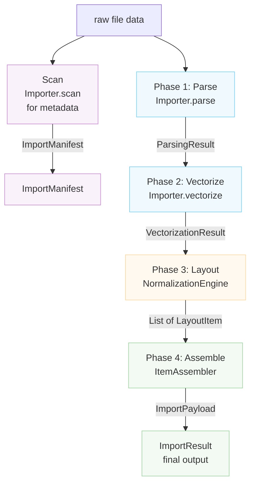

---
description:
  "Rayforge आयातक प्रणाली - फ़ाइल आयातक कैसे काम करते हैं और नए फ़ाइल फ़ॉर्मेटों के लिए समर्थन कैसे
  जोड़ें."
---

# आयातक संरचना

यह दस्तावेज़ Rayforge की फ़ाइल आयात प्रणाली की संरचना वर्णित करता है, जो विभिन्न फ़ाइल फ़ॉर्मेटों
(SVG, DXF, PNG, PDF आदि) को Rayforge के दस्तावेज़ मॉडल में बदलना संभालती है.

## विषय सूची

- [अवलोकन](#overview)
- [आयात पाइपलाइन](#import-pipeline)
- [स्कैन विधि](#scan-method)
- [निर्देशांक प्रणालियाँ](#coordinate-systems)
- [मुख्य वर्ग](#key-classes)
- [नया आयातक बनाना](#creating-a-new-importer)

---

## अवलोकन {#overview}

आयात प्रणाली चार-चरण पाइपलाइन के चारों ओर बनी है जो कच्चे फ़ाइल डेटा को पूरी तरह स्थित दस्तावेज़
ऑब्जेक्टों में बदलती है. प्रत्येक चरण की एक विशिष्ट ज़िम्मेदारी है और अच्छी तरह परिभाषित डेटा
संरचनाएँ उत्पन्न करती है.



---

## आयात पाइपलाइन {#import-pipeline}

### चरण 1: पार्स

**विधि:** `Importer.parse()`

सीमाओं, निर्देशांक प्रणाली विवरण, और लेयर जानकारी सहित फ़ाइल से ज्यामितीय तथ्य निकालती है.

**आउटपुट:** `ParsingResult`

- `document_bounds`: Native निर्देशांकों में कुल कैनवस आकार
- `native_unit_to_mm`: मिलीमीटर के लिए रूपांतरण कारक
- `is_y_down`: Y-अक्ष अभिविन्यास ध्वज
- `layers`: `LayerGeometry` की सूची
- `world_frame_of_reference`: विश्व निर्देशांक (mm, Y-ऊपर)
- `background_world_transform`: पृष्ठभूमि स्थापना के लिए मैट्रिक्स
- `untrimmed_document_bounds`: Y-उलटने का संदर्भ

**निर्देशांक प्रणाली:**

- `document_bounds`: Native निर्देशांक (फ़ाइल-विशिष्ट)
- `world_frame_of_reference`: विश्व निर्देशांक (mm, Y-ऊपर)

---

### चरण 2: वेक्टराइज़ करें

**विधि:** `Importer.vectorize()`

`VectorizationSpec` के अनुसार पार्स किए गए डेटा को वेक्टर `Geometry` ऑब्जेक्टों में बदलती है.

**आउटपुट:** `VectorizationResult`

- `geometries_by_layer`: प्रति लेयर वेक्टर ज्यामिति (Native निर्देशांक)
- `source_parse_result`: मूल ParsingResult का संदर्भ
- `fills_by_layer`: वैकल्पिक भराव ज्यामिति (स्केच आयातक)

**निर्देशांक प्रणाली:** Native निर्देशांक (फ़ाइल-विशिष्ट)

---

### चरण 3: लेआउट

**वर्ग:** `NormalizationEngine`

उपयोगकर्ता इरादे के आधार पर Native निर्देशांकों को विश्व निर्देशांकों से मैप करने वाले रूपांतरण
मैट्रिक्स गणना करता है.

**आउटपुट:** `List[LayoutItem]`

प्रत्येक `LayoutItem` में है:

- `world_matrix`: सामान्यीकृत (0-1, Y-ऊपर) → विश्व (mm, Y-ऊपर)
- `normalization_matrix`: Native → सामान्यीकृत (0-1, Y-ऊपर)
- `crop_window`: Native निर्देशांकों में मूल फ़ाइल का उपसमुच्चय
- `layer_id`, `layer_name`: लेयर पहचान

**निर्देशांक प्रणाली:**

- इनपुट: Native निर्देशांक
- आउटपुट: मध्यवर्ती सामान्यीकृत स्थान द्वारा विश्व निर्देशांक (mm, Y-ऊपर)

---

### चरण 4: असेंबल

**वर्ग:** `ItemAssembler`

लेआउट योजना के आधार पर Rayforge डोमेन ऑब्जेक्ट (`WorkPiece`, `Layer`) तत्कालित करता है.

**आउटपुट:** `ImportPayload`

- `source`: `SourceAsset`
- `items`: सम्मिलन के लिए तैयार `DocItem` की सूची
- `sketches`: वैकल्पिक `Sketch` ऑब्जेक्ट सूची

**निर्देशांक प्रणाली:** सभी DocItem विश्व निर्देशांकों में (mm, Y-ऊपर)

---

## स्कैन विधि {#scan-method}

**विधि:** `Importer.scan()`

एक हल्का स्कैन जो पूर्ण प्रोसेसिंग के बिना मेटाडेटा निकालता है. लेयर चयन सूची सहित आयातक के लिए UI
बनाने के लिए उपयोग होता है. यह `get_doc_items()` द्वारा निष्पादित मुख्य आयात पाइपलाइन का भाग
**नहीं** है.

**आउटपुट:** `ImportManifest`

- `layers`: `LayerInfo` ऑब्जेक्टों की सूची
- `natural_size_mm`: मिलीमीटर में भौतिक विमाएँ (Y-ऊपर)
- `title`: वैकल्पिक दस्तावेज़ शीर्षक
- `warnings`, `errors`: पाई गई गैर-महत्वपूर्ण समस्याएँ

**निर्देशांक प्रणाली:** `natural_size_mm` के लिए विश्व निर्देशांक (mm, Y-ऊपर)

---

## निर्देशांक प्रणालियाँ {#coordinate-systems}

आयात पाइपलाइन सावधानीपूर्वक रूपांतरण द्वारा कई निर्देशांक प्रणालियाँ संभालती है:

### Native निर्देशांक (इनपुट)

- फ़ाइल-विशिष्ट निर्देशांक प्रणाली (SVG उपयोगकर्ता इकाइयाँ, DXF इकाइयाँ, पिक्सेल)
- Y-अक्ष अभिविन्यास फ़ॉर्मेट द्वारा भिन्न होता है
- सीमाएँ दस्तावेज़ के निर्देशांक स्थान में पूर्ण होती हैं
- इकाइयाँ `native_unit_to_mm` कारक द्वारा mm में बदली जाती हैं

### सामान्यीकृत निर्देशांक (मध्यवर्ती)

- (0,0) से (1,1) तक का इकाई वर्ग
- Y-अक्ष ऊपर इंगित करता है (Y-ऊपर परंपरा)
- Native और विश्व के बीच मध्यवर्ती प्रतिनिधित्व के रूप में उपयोग

### विश्व निर्देशांक (आउटपुट)

- मिलीमीटर में भौतिक विश्व निर्देशांक (mm)
- Y-अक्ष ऊपर इंगित करता है (Y-ऊपर परंपरा)
- मूल बिंदु (0,0) वर्कपीस के निचले-बाएँ पर होता है
- सभी स्थितियाँ विश्व निर्देशांक प्रणाली में पूर्ण होती हैं

### Y-अक्ष अभिविन्यास

- **Y-नीचे फ़ॉर्मेट** (SVG, छवियाँ): ऊपरी-बाएँ मूल बिंदु, Y नीचे की ओर बढ़ता है
- **Y-ऊपर फ़ॉर्मेट** (DXF): निचले-बाएँ मूल बिंदु, Y ऊपर की ओर बढ़ता है
- आयातकों को `ParsingResult` में `is_y_down` ध्वज सही ढंग से सेट करना चाहिए
- `NormalizationEngine` Y-नीचे स्रोतों के लिए Y-उलटना संभालता है

---

## मुख्य वर्ग {#key-classes}

### Importer (आधार वर्ग)

सभी आयातकों के लिए इंटरफ़ेस परिभाषित करने वाला अमूर्त आधार वर्ग. उपवर्गों को पाइपलाइन विधियाँ
कार्यान्वित करनी चाहिए और अपनी क्षमताएँ `features` विशेषता द्वारा घोषित करनी चाहिए.

**सुविधाएँ:**

- `BITMAP_TRACING`: रास्टर छवियों को वेक्टर में ट्रेस कर सकता है
- `DIRECT_VECTOR`: वेक्टर ज्यामिति सीधे निकाल सकता है
- `LAYER_SELECTION`: लेयर-आधारित आयात समर्थन करता है
- `PROCEDURAL_GENERATION`: सामग्री प्रोग्रामेटिक रूप से जनरेट करता है

### डेटा संरचनाएँ

| वर्ग                  | चरण        | उद्देश्य               |
| --------------------- | ---------- | ---------------------- |
| `LayerInfo`           | स्कैन      | हल्का लेयर मेटाडेटा    |
| `ImportManifest`      | स्कैन      | स्कैन चरण परिणाम       |
| `LayerGeometry`       | पार्स      | ज्यामितीय लेयर जानकारी |
| `ParsingResult`       | पार्स      | ज्यामितीय तथ्य         |
| `VectorizationResult` | वेक्टराइज़ | वेक्टर ज्यामिति        |
| `LayoutItem`          | लेआउट      | रूपांतरण कॉन्फ़िगरेशन  |
| `ImportPayload`       | असेंबल     | अंतिम आउटपुट           |
| `ImportResult`        | अंतिम      | पूर्ण परिणाम रैपर      |

### सहायक घटक

- `NormalizationEngine`: चरण 3 लेआउट गणनाएँ
- `ItemAssembler`: चरण 4 ऑब्जेक्ट निर्माण

---

## नया आयातक बनाना {#creating-a-new-importer}

किसी नए फ़ाइल फ़ॉर्मेट के लिए समर्थन जोड़ने के लिए:

1. `Importer` से वंशानुक्रमित होने वाला **एक नया आयातक वर्ग बनाएँ**
2. `features` वर्ग विशेषता द्वारा **समर्थित सुविधाएँ घोषित करें**
3. **आवश्यक विधियाँ कार्यान्वित करें**:
   - `scan()`: मेटाडेटा तेज़ी से निकालें (UI पूर्वावलोकनों के लिए)
   - `parse()`: ज्यामितीय तथ्य निकालें
   - `vectorize()`: वेक्टर ज्यामिति में बदलें
   - `create_source_asset()`: स्रोत एसेट बनाएँ
4. आयातक `rayforge/image/__init__.py` में **पंजीकृत करें**
5. **MIME प्रकार और एक्सटेंशन मैपिंग जोड़ें**

**उदाहरण:**

```python
from rayforge.image.base_importer import Importer, ImporterFeature
from rayforge.image.structures import (
    ImportManifest,
    ParsingResult,
    VectorizationResult,
)
from rayforge.core.source_asset import SourceAsset

class MyFormatImporter(Importer):
    label = "My Format"
    mime_types = ("application/x-myformat",)
    extensions = (".myf",)
    features = {ImporterFeature.DIRECT_VECTOR}

    def scan(self) -> ImportManifest:
        # Extract metadata without full processing
        return ImportManifest(
            layers=[],
            natural_size_mm=(100.0, 100.0),
        )

    def parse(self) -> Optional[ParsingResult]:
        # Extract geometric facts
        return ParsingResult(
            document_bounds=(0, 0, 100, 100),
            native_unit_to_mm=1.0,
            is_y_down=False,
            layers=[],
            world_frame_of_reference=(0, 0, 100, 100),
            background_world_transform=Matrix.identity(),
        )

    def vectorize(
        self, parse_result: ParsingResult, spec: VectorizationSpec
    ) -> VectorizationResult:
        # Convert to vector geometry
        return VectorizationResult(
            geometries_by_layer={None: Geometry()},
            source_parse_result=parse_result,
        )

    def create_source_asset(
        self, parse_result: ParsingResult
    ) -> SourceAsset:
        # Create the source asset
        return SourceAsset(
            original_data=self.raw_data,
            metadata={},
        )
```
