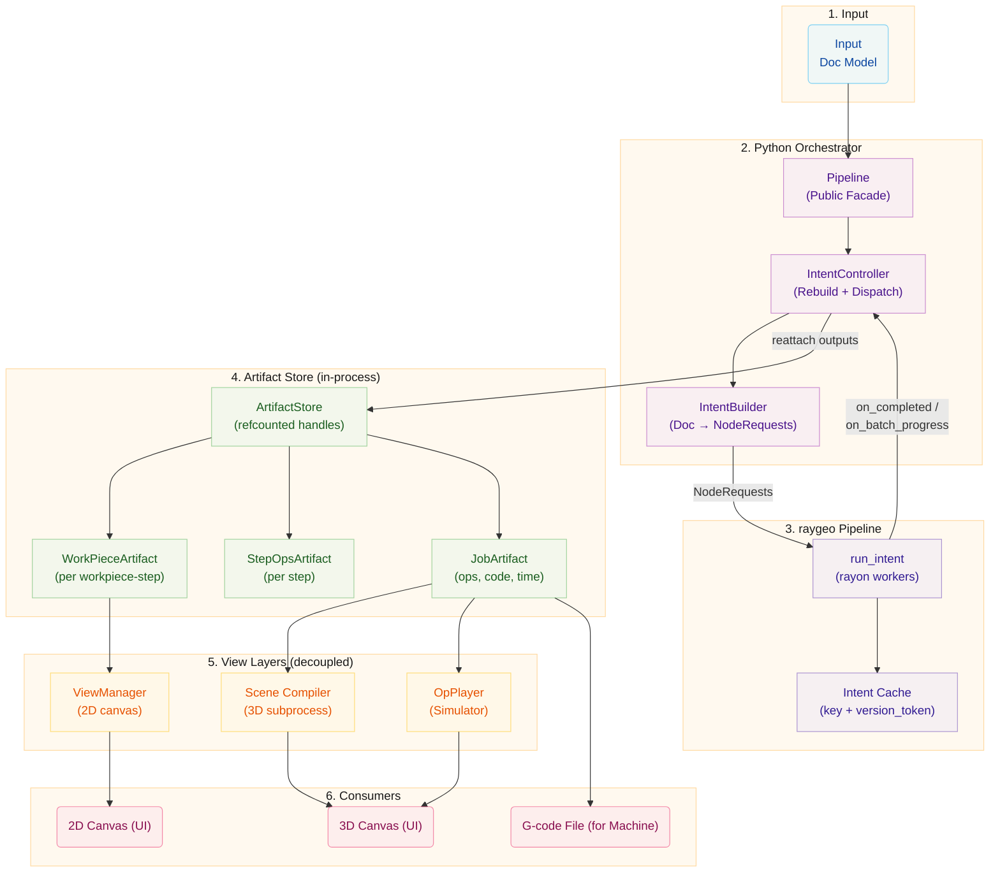

---
description:
  "Rayforge इरादा पाइपलाइन - डिज़ाइन Doc मॉडल से raygeo इरादों के माध्यम से G-code जनरेशन तक कैसे
  चलते हैं."
---

# पाइपलाइन संरचना

यह दस्तावेज़ उस पाइपलाइन का वर्णन करता है जो एक `Doc` मॉडल को मशीन-निष्पादन योग्य G-code में बदलती
है. 1.9.0 पुनर्लेखन के बाद से पाइपलाइन **raygeo इरादों** पर बनी है: उस कार्य का एक घोषणात्मक विवरण
जो Rust पक्ष को करना चाहिए, एक पतले Python समन्वयन स्तर और एक संदर्भ-गणित प्रक्रिया-भीतरी
आर्टिफ़ैक्ट भंडार के साथ जुड़ा.

पिछली मल्टीप्रोसेसिंग DAG (`DagScheduler`, `PipelineGraph`, `ArtifactManager`, `GenerationContext`,
`WorkPiecePipelineStage`) हटा दी गई है. यह दस्तावेज़ केवल लाइव संरचना वर्णित करता है.

# कोर अवधारणाएँ

## Pipeline (सार्वजनिक मुखौटा)

`rayforge/pipeline/pipeline.py:40` — वह वर्ग जिससे एप्लिकेशन का बाकी हिस्सा बात करता है.
`DocEditor`, `ViewManager`, UI विजेट, और परीक्षण कोड केवल `Pipeline` पर निर्भर होने चाहिए.
`IntentController` और `IntentBuilder` मुखौटे के कार्यान्वयन विवरण हैं और बिना सूचना बदल सकते हैं.

`Pipeline` `ArtifactStore` एकीकरण का स्वामी है: वह अपने भीतरी `IntentController` द्वारा जारी किए गए
कच्चे raygeo आउटपुटों को संदर्भ-गणित आर्टिफ़ैक्ट हैंडलों में अनुवादित करता है जिनका उपभोग UI और
निर्यात पथ करते हैं, और वह सिग्नल/गुण सतह उजागर करता है जिसकी एप्लिकेशन का बाकी हिस्सा अपेक्षा करता
है (व्यस्त अवस्था, रोकें/जारी रखें, पुनर्गणना, मशीन बदलाव).

मुखौटे द्वारा अग्रेषित मुख्य सिग्नल:

| सिग्नल                     | अर्थ                                                              |
| -------------------------- | ----------------------------------------------------------------- |
| `processing_state_changed` | व्यस्त/निष्क्रिय संक्रमण                                          |
| `workpiece_artifact_ready` | एक `WorkPieceArtifact` हैंडल प्रकाशित हुआ                         |
| `job_generation_finished`  | एक `JobArtifact` हैंडल (G-code + ops + अनुमान) तैयार              |
| `job_time_updated`         | पुनर्निर्माण के दौरान संकुलित समय अनुमान बदला                     |
| `data_stale`               | पुनर्निर्माण का अनुरोध हुआ लेकिन वर्तमान में रुका या मैन्युअल मोड |
| `visual_chunk_available`   | वृद्धिशील UI अपडेट के लिए क्रमिक रास्टर खंड                       |

## IntentController

`rayforge/pipeline/intent_controller.py:108` — एक raygeo `Intent` और उसके चारों ओर के पुनर्निर्माण
जीवनचक्र का स्वामी. वह उन्हीं बुलबुले वाले Doc सिग्नल सुनता है जिनका उपयोग विरासत पाइपलाइन करती थी
(`descendant_updated`, `descendant_transform_changed`, `descendant_added`, `descendant_removed`,
`job_assembly_invalidated`) और दस्तावेज़ बदलने पर हर बार एक raygeo `Intent` पुनर्निर्मित करता है.

प्रत्येक डिबाउंस किए गए पुनर्निर्माण पर (200 ms `REBUILD_DEBOUNCE_MS`):

1. `IntentBuilder` को वर्तमान `Doc` से `NodeRequest` ऑब्जेक्टों की एक ताज़ा सूची उत्पन्न करने के लिए
   कॉल किया जाता है.
2. नई सूची `create_intent_from_nodes` द्वारा एक raygeo `Intent` में लिपटी जाती है.
3. `Intent.update` `version_token` प्रति नोड का उपयोग करके पिछले इरादे को नए से भेद करता है और साझा
   raygeo `Pipeline` पर किसी भी पुराने कैश प्रविष्टि निष्कासित करता है.
4. `dispatch=True` होने पर नया इरादा `run_intent` द्वारा भी निष्पादित होता है; `on_completed` कॉलबैक
   युग फ़िल्टर करता है (उन परिणामों को छोड़ते हुए जिनका `generation_id` नियंत्रक की वर्तमान पीढ़ी से
   पुराना है) और फिर साझा कार्य मैनेजर के माध्यम से एप्लिकेशन मुख्य थ्रेड पर एक DOM पुनः बाँधने का
   प्रबंधन करता है.
5. `on_batch_progress` कॉलबैक `progress_changed` द्वारा श्रोताओं को संकुलित प्रगति अग्रेषित करता है
   (मुख्य थ्रेड पर प्रबंधित, ताकि सिग्नल हैंडलर कभी rayon कार्यकर्ता पर न चलें).

नियंत्रक का `\_key_to_item` मैप (हर सफल `IntentBuilder.build` कॉल पर पुनर्निर्मित) `on_completed`
युग-फ़िल्टर किए गए कॉलबैक को Doc दोबारा चलाए बिना आउटपुट उत्पत्ति `WorkPiece` या `Step` पर पुनः
बाँधने देता है. नोड कुंजियाँ आकार द्वारा प्रेषित होती हैं:

| नोड कुंजी                       | पुनः बाँधा जाता है | जारी होने वाला सिग्नल      |
| ------------------------------- | ------------------ | -------------------------- |
| `workpiece:{wp_uid}:{step_uid}` | स्वामी `WorkPiece` | `workpiece_artifact_ready` |
| `step:{step_uid}`               | स्वामी `Step`      | `step_artifact_ready`      |
| `job`                           | `Doc`              | `job_aggregate_ready`      |
| `job:encode`                    | `Doc`              | `job_generation_finished`  |

## IntentBuilder

`rayforge/pipeline/intent_builder.py:133` — एक `Doc` पर चलकर **स्थिर कुंजियों** और **नियतात्मक
संस्करण टोकनों** वाली `NodeRequest` ऑब्जेक्टों की एक सपाट सूची उत्पन्न करता है. बिल्डर राज्यहीन है:
`build` का प्रत्येक कॉल एक ताज़ा, स्वयं-पूर्ण सूची उत्पन्न करता है जिसे raygeo `Intent` में लपेटने
के लिए उपयुक्त है.

### स्थिर कुंजियाँ {#stable-keys}

- `workpiece:{wp_uid}:{step_uid}` — प्रति वर्कपीस/स्टेप जोड़ी एक गणना नोड.
- `step:{step_uid}` — प्रति स्टेप एक संकुलित नोड जो वर्कपीस गणना आउटपुट जोड़ता है और प्रति-स्टेप
  ट्रांसफ़ॉर्मर लागू करता है.
- `job` — एक अंतिम संकुलित नोड जो सभी स्टेप आउटपुट को जॉब-स्तरीय मार्करों और मशीन पैरामीटरों के साथ
  जोड़ता है.
- `job:machinexform` — मशीन-रूपांतरण गणना नोड जो जॉब संकुल के विश्व-स्थान ops का उपभोग करके
  मशीन-स्थान ops उत्पन्न करता है (वक्र रैखिकीकरण, रोटरी अक्ष मैपिंग, विश्व→मशीन, WCS ऑफ़सेट,
  Z-फ़्लिप, AXIS_REPLACEMENT).
- `job:encode` — एन्कोडर गणना नोड जो मशीन-रूपांतरण नोड के ops का उपभोग करके मशीन कोड उत्पन्न करता है
  (G-code / vertex / टेक्स्चर).

कुंजी फ़ॉर्मेट `intent_builder.py` में केंद्रीकृत हैं ताकि उत्पादक और `IntentController` पुनः बाँधने
का मैप हमेशा सहमत रहें.

### संस्करण टोकन {#version-tokens}

raygeo का कैश केवल नोड कुंजी द्वारा कुंजीबद्ध है; `version_token` एकमात्र अमान्यीकरण सिग्नल है. टोकन
उन इनपुटों के एक कैनोनिकल प्रतिनिधित्व के SHA-1 डाइजेस्ट हैं जो किसी नोड के आउटपुट को प्रभावित करते
हैं (`_hash_int`, `intent_builder.py:1066` देखें):

- **गणना टोकन** हैश करते हैं
  `(geometry_revision, wp_size, step_params, assembler_params, per_workpiece_transformers)`. स्थिति-
  संवेदी ट्रांसफ़ॉर्मर घोषित करने वाले स्टेप स्कोपों के लिए (`Step.is_position_sensitive` देखें),
  वर्कपीस का `transform_revision` और स्टॉक संशोधन टोकन में जुड़ते हैं; अन्यथा उन्हें छोड़ दिया जाता
  है ताकि शुद्ध गतियाँ वर्कपीस गणना परिणाम अमान्य न करें.
- **स्टेप संकुल टोकन** हैश करते हैं
  `(अपस्ट्रीम गणना टोकन, स्थापनाएँ, step_params, प्रति-स्टेप/प्रति-वर्कपीस ट्रांसफ़ॉर्मर, position_sensitive())`,
  साथ में `stock_rev` जब स्टेप स्थिति-संवेदी हो.
- **जॉब टोकन** सभी प्रति-स्टेप संकुल टोकन जोड़ता है ताकि कोई भी अपस्ट्रीम बदलाव (वर्कपीस गति,
  ट्रांसफ़ॉर्मर संपादन, स्टेप पैरामीटर बदलाव) जॉब/एन्कोड कैश तक फैले.
- **मशीन-रूपांतरण टोकन** जॉब टोकन और मशीन पहचान जोड़ता है (`supports_curves`, `reverse_z_axis`, WCS
  कॉन्फ़िग, प्रति लेयर रोटरी मॉड्यूल कॉन्फ़िग).
- **एन्कोड टोकन** मशीन-रूपांतरण टोकन और एन्कोडर पहचान जोड़ता है (`driver_name`, `gcode_precision`,
  अक्ष विस्तार, ...).

### चरण निर्माण {#stage-construction}

प्रत्येक `NodeRequest` एक `StageSpec` ले जाता है जो वर्णित करता है कि raygeo उस नोड के लिए कौन सा
काम करे. बिल्डर उत्पन्न करता है:

- प्रत्येक वर्कपीस/स्टेप जोड़ी के लिए `StageSpec.Compute`
  `Step.build_compute_payload(machine_defaults, workpiece)` के माध्यम से, जो एक `Part` (वेक्टर
  ज्यामिति या छवि स्रोत) और एक `ComputePayload` (एसेंबलर विनिर्देश) लौटाता है. प्रति-वर्कपीस
  ट्रांसफ़ॉर्मर (`OverscanTransformer`, `BidirScanOffsetTransformer`, ...) `transformer_registry`
  द्वारा टाइप किए गए Rust `*Spec` pyclass में हल किए जाते हैं और पेलोड से जुड़ते हैं ताकि Rust गणना
  चरण उन्हें असेंबली के बाद लागू करे.
- प्रत्येक स्टेप के लिए `StageSpec.Aggregate`: प्रत्येक अपस्ट्रीम वर्कपीस गणना नोड के लिए एक
  `AggregateGroup`, `WorkpieceStart` / `WorkpieceEnd` मार्करों से लिपटा, जिसमें प्रत्येक इनपुट
  वर्कपीस की विश्व स्थापना मैट्रिक्स और भौतिक आकार को `target_dimensions` के रूप में ले जाता है.
  प्रति-स्टेप ट्रांसफ़ॉर्मर (`MultiPassTransformer`, `Optimize`, ...) `AggregateSpec.transformers`
  से जुड़ते हैं ताकि Rust संकुल चरण उन्हें संयोजन के बाद लागू करे. संकुल का समय अनुमान सही हो, इसके
  लिए `MachineParams` हल की गई मशीन से भरा जाता है.
- `job` नोड के लिए `StageSpec.Aggregate`: `LayerStart` / `LayerEnd` मार्करों से लिपटी प्रति लेयर एक
  `AggregateGroup`, जिसमें प्रति दिखाई देने वाला स्टेप एक `AggregateInput` हो; पूरा संकुल `JobStart`
  / `JobEnd` से लिपटा होता है.
- `job:machinexform` के लिए `MachineTransformSpec`: विश्व→मशीन 4×4 मैट्रिक्स, डिफ़ॉल्ट और प्रति-लेयर
  WCS ऑफ़सेट, प्रति-लेयर `RotaryMappingSpec` प्रविष्टियाँ, वक्र-रैखिकीकरण ध्वज, और Z-उलट ध्वज, एक
  क्रमबद्ध योग्य विनिर्देश में पैक किए गए जिसका उपभोग Rust `MachineTransformCompute` चरण करता है.
- `job:encode` के लिए `EncodeSpec`: Grbl मशीनों को नेटिव Rust `GcodeSpec` की ओर मार्गदर्शित करता है
  (GIL को पार किए बिना सीधे rayon थ्रेड पर कंपाइल) और हर अन्य मशीन को ड्राइवर-विशिष्ट एन्कोडर
  callable लपेटने वाले एक `PythonEncoder` की ओर. एन्कोडर अपस्ट्रीम `job:machinexform` नोड से
  मशीन-स्थान ops पढ़ता है.

### स्टॉक हल

`_resolve_stock_geometries` (प्रति `build` एक बार कॉल और बिल्डर पर कैश) वे विश्व-स्थान स्टॉक सीमा
ज्यामिति लौटाता है जिनका उपयोग `CropTransformer` जैसे ट्रांसफ़ॉर्मर प्रति-वर्कपीस ops को मशीन के
कार्य क्षेत्र या स्पष्ट `StockItem` तक काटने के लिए करते हैं. Doc-स्वामित्व `StockItem` प्रविष्टियाँ
प्राथमिकता लेती हैं; मशीन कार्यक्षेत्र आयत केवल तब फ़ॉलबैक के रूप में उपयोग होता है जब कोई doc स्टॉक
मौजूद न हो.

## raygeo पाइपलाइन और `run_intent`

raygeo की `Pipeline` (`raygeo.pipeline.execute.Pipeline`) उस कैश का स्वामी है जिसे `Intent.update`
निष्कासित करता है. `run_intent` इरादे के नोड GIL के अंतर्गत rayon कार्यकर्ता थ्रेडों पर निर्धारित
करता है और प्रति नोड `on_completed` कॉलबैक और संकुल प्रगति के लिए `on_batch_progress` लागू करता है.
भारी कार्य (गणना, रास्टर, संकुलन, मशीन रूपांतरण, एन्कोडिंग) सबप्रोसेस के बजाय raygeo थ्रेडों में
चलता है, जो CHANGELOG 1.9.0 में उल्लिखित मुख्य बदलाव है.

## ArtifactStore और आर्टिफ़ैक्ट हैंडल

विरासत साझा-मेमोरी `ArtifactStore` को एक प्रक्रिया-भीतरी, संदर्भ-गणित भंडार
(`rayforge/pipeline/artifact/store.py:29`) द्वारा बदल दिया गया है. सभी आर्टिफ़ैक्ट एक UUID द्वारा
कुंजीबद्ध शब्दकोश में सादे Python ऑब्जेक्टों के रूप में रहते हैं; हैंडल अपने `key` फ़ील्ड में UUID
रखते हैं साथ में कोई भी मेटाडेटा जिसकी आर्टिफ़ैक्ट प्रकार को आवश्यकता है. जीवनचक्र संदर्भ गणना के
माध्यम से `ArtifactStore.retain` / `release` द्वारा प्रबंधित होता है.

`Pipeline` मुखौटा raygeo आउटपुटों को मुख्य थ्रेड पर आर्टिफ़ैक्ट हैंडलों में अनुवादित करता है:

| आउटपुट (raygeo)         | आर्टिफ़ैक्ट         | टैग के अंतर्गत संग्रहीत |
| ----------------------- | ------------------- | ----------------------- |
| प्रति वर्कपीस-स्टेप ops | `WorkPieceArtifact` | `wp`                    |
| प्रति स्टेप संकुलित ops | `StepOpsArtifact`   | `step`                  |
| जॉब संकुल + एन्कोड      | `JobArtifact`       | `job`                   |

`JobArtifact` विश्व-स्थान `Ops`, कुल दूरी, समय अनुमान, `EncodedOutput` (टेक्स्ट और op→मशीन-कोड मैप),
और — जब रोटरी मॉड्यूल कॉन्फ़िगर हों — 3D पूर्वावलोकन के लिए गतिकीय रूप से मैप किए गए ops ले जाता है.

## जनरेशन ID और युग फ़िल्टरिंग

प्रत्येक पुनर्निर्माण `IntentController.generation_id` बढ़ाता है. प्रत्येक पूर्ण नोड वह पीढ़ी ले
जाता है जिससे वह उत्पन्न हुआ. `on_completed` कॉलबैक नोड के `generation_id` की तुलना नियंत्रक की
वर्तमान पीढ़ी से करता है और अधिगृहीत परिणाम चुपचाप छोड़ देता है, इसलिए किसी पिछले पुनर्निर्माण के
पुराने आउटपुट कभी DOM से फिर नहीं जुड़ते.

## रोकें, जारी रखें और मैन्युअल मोड

- `Pipeline.pause()` / `resume()` नियंत्रक पर एक रोक काउंटर बढ़ाते/घटाते हैं. रुके होने पर, doc
  बदलाव `data_stale` ध्वज सेट करते हैं (और `data_stale` जारी करते हैं) पुनर्निर्माण निर्धारित करने
  के बजाय; जारी रखने पर ध्वज साफ़ होता है और `auto_rebuild` सक्षम होने पर एक पुनर्निर्माण निर्धारित
  होता है.
- `Pipeline.auto_pipeline=False` (मैन्युअल मोड): पुनर्गणना हर doc बदलाव पर स्वतः होने के बजाय स्पष्ट
  रूप से `Pipeline.recalculate()` द्वारा ट्रिगर होती है.

## अमान्यीकरण रणनीति

अमान्यीकरण अंतर्निहित और टोकन-संचालित है: कोई भी बदलाव जो किसी नोड के इनपुटों को प्रभावित करता है,
बिल्डर को उस नोड की कुंजी के लिए एक भिन्न `version_token` उत्पन्न करने का कारण बनता है.
`Intent.update` पुरानी कैश प्रविष्टि निष्कासित करता है और raygeo केवल उसी नोड (और उसके डाउनस्ट्रीम
उपभोक्ताओं) को फिर से निष्पादित करता है.

| बदलाव प्रकार                       | टोकन पर प्रभाव                                                                                                                                                                            |
| ---------------------------------- | ----------------------------------------------------------------------------------------------------------------------------------------------------------------------------------------- |
| ज्यामिति / पैरामीटर                | नए वर्कपीस गणना टोकन स्टेप, जॉब, machinexform, एन्कोड तक कैस्केड होते हैं                                                                                                                 |
| स्थिति / घूर्णन                    | वर्कपीस गणना टोकन अपरिवर्तित जब तक स्टेप स्थिति-संवेदी न हो; स्टेप संकुल टोकन जुड़ी स्थापनाओं के कारण हमेशा बदलते हैं, जो जॉब/एन्कोड तक कैस्केड होता है                                   |
| आकार बदलाव                         | ज्यामिति जैसा ही: टोकन वर्कपीस-स्टेप जोड़ियों से ऊपर कैस्केड होते हैं                                                                                                                     |
| स्टॉक आइटम दिखाई दें/खिसकें/जुड़ें | `stock_rev` को प्रभावित करता है (स्थिति-संवेदी स्टेपों के गणना और संकुल टोकन में जुड़ा)                                                                                                   |
| मशीन कॉन्फ़िग                      | `job:machinexform` और `job:encode` टोकन सभी बदलते हैं; स्टेप गणना/संकुल टोकन बदलते हैं यदि `kerf_mm` / `cut_speed` / लेज़र हेड / चाप सहनशीलता / supports_curves / supports_arcs बदलते हैं |

# विस्तृत विभाजन

## इनपुट

प्रक्रिया **Doc मॉडल** से शुरू होती है, जिसमें है:

- **वर्कपीस:** कैनवस पर रखे व्यक्तिगत डिज़ाइन तत्व (SVG, छवियाँ)
- **स्टेप:** सेटिंग्स के साथ प्रोसेसिंग निर्देश (Contour, Raster आदि), एक प्रति-लेयर `Workflow` में
  व्यवस्थित
- **लेयरें:** वर्कपीस का समूहन, प्रत्येक का अपना वर्कफ़्लो, WCS और रोटरी कॉन्फ़िग
- **StockItem:** वैकल्पिक स्पष्ट स्टॉक सीमाएँ जिनका उपयोग स्थिति-संवेदी ट्रांसफ़ॉर्मर करते हैं (जैसे
  CropTransformer)

## Python समन्वयक

### Pipeline (मुखौटा)

`Pipeline` वर्ग:

- सिग्नल द्वारा Doc मॉडल को बदलावों के लिए सुनता है (`IntentController` के माध्यम से अग्रेषित)
- बदलावों को **डिबाउंस** करता है (200 ms समाधान विलंब)
- पुनर्जनन ट्रिगर करने के लिए `IntentController` के साथ समन्वय करता है
- समग्र प्रोसेसिंग अवस्था और व्यस्तता पहचान प्रबंधित करता है
- बैच ऑपरेशनों के लिए **रोकें/जारी रखें** का समर्थन करता है
- **मैन्युअल मोड** (`auto_pipeline=False`) का समर्थन करता है जहाँ पुनर्गणना स्पष्ट रूप से ट्रिगर
  होती है
- घटकों के बीच सिग्नल जोड़ता और उपभोक्ताओं को अग्रेषित करता है
- संदर्भ-गणित आर्टिफ़ैक्ट हैंडल `ArtifactStore` में प्रकाशित करता है

### IntentController

`IntentController`:

- एक raygeo `Intent` और उसके चारों ओर के पुनर्निर्माण जीवनचक्र का स्वामी है
- हर डिबाउंस किए गए doc बदलाव पर एक ताज़ा इरादा पुनर्निर्मित करता है
- `dispatch=True` होने पर इरादे को `run_intent` द्वारा निष्पादित करता है
- अधिगृहीत परिणाम `generation_id` द्वारा फ़िल्टर करता है (युग फ़िल्टर)
- साझा कार्य मैनेजर के माध्यम से DOM पुनः बाँधने को मुख्य थ्रेड पर प्रबंधित करता है

### IntentBuilder

`IntentBuilder` राज्यहीन है; प्रत्येक `build` कॉल `Doc` पर चलकर प्रति वर्कपीस/स्टेप जोड़ी एक
`NodeRequest`, प्रति स्टेप एक संकुल, और `job`, `job:machinexform`, और `job:encode` नोड उत्पन्न करती
है. ऊपर [स्थिर कुंजियाँ](#stable-keys), [संस्करण टोकन](#version-tokens), और
[चरण निर्माण](#stage-construction) देखें.

## raygeo पाइपलाइन

`run_intent` नोड निष्पादन GIL के अंतर्गत rayon कार्यकर्ता थ्रेडों पर निर्धारित करता है. साझा
`RaygeoPipeline` इंस्टेंस नोड कुंजी द्वारा कुंजीबद्ध नोड कैश रखता है; `Intent.update` एकमात्र
अमान्यीकरण प्रवेश बिंदु है. गणना, रास्टर, श्रिंकरैप, वेवफ़्रंट, कॉन्टूर, दृश्य रेंडरिंग, और
मशीन-रूपांतरण/एन्कोडिंग सभी raygeo थ्रेडों में चलते हैं.

## आर्टिफ़ैक्ट जनरेशन

### WorkPieceArtifacts

प्रत्येक `(WorkPiece, Step)` संयोजन के लिए जनरेट होते हैं. इनमें है:

- वर्कपीस की स्थानीय निर्देशांक प्रणाली में टूलपाथ (`Ops`)
- रेज़ोल्यूशन-स्वतंत्र ops के लिए स्केल योग्यता ध्वज और स्रोत विमाएँ
- जनरेशन ID

बड़े रास्टर वर्कपीस खंडों में क्रमिक रूप से प्रोसेस होते हैं (`visual_chunk_available` द्वारा
अग्रेषित), जिससे जनरेशन के दौरान क्रमिक दृश्य प्रतिक्रिया संभव होती है.

### StepOpsArtifacts

प्रत्येक स्टेप के लिए जनरेट होते हैं, सभी संबंधित WorkPieceArtifacts का उपभोग करते हुए:

- विश्व-स्थान निर्देशांकों में सभी वर्कपीस के लिए संयुक्त `Ops`
- लागू प्रति-स्टेप ट्रांसफ़ॉर्मर (`Optimize`, `MultiPass`, ...)

### JobArtifact

जब G-code चाहिए तब जनरेट होता है, `job` संकुल और `job:encode` नोड का उपभोग करते हुए:

- अंतिम मशीन कोड (G-code या ड्राइवर-विशिष्ट फ़ॉर्मेट) `EncodedOutput` द्वारा (टेक्स्ट + op→मशीन-कोड
  मैप)
- सिमुलेशन और प्लेबैक के लिए विश्व-स्थान `Ops`
- उच्च-निष्ठा समय अनुमान और कुल दूरी
- रोटरी मॉड्यूल कॉन्फ़िगर होने पर 3D पूर्वावलोकन के लिए रोटरी-मैप किए गए ops

## 2D दृश्य स्तर (पृथक)

`ViewManager` डेटा पाइपलाइन से पृथक है. वह UI अवस्था के आधार पर 2D कैनवस के लिए रेंडरिंग संभालता है.

### RenderContext

वर्तमान दृश्य पैरामीटर रखता है (प्रति मिलीमीटर पिक्सेल, व्यूपोर्ट ऑफ़सेट, प्रदर्शन विकल्प).

### WorkPieceViewArtifacts

`ViewManager` `WorkPieceViewArtifacts` बनाता है जो `WorkPieceArtifacts` को स्क्रीन स्थान में
रास्टराइज़ करते हैं, वर्तमान `RenderContext` लागू करते हैं, और संदर्भ या स्रोत बदलने पर कैश और अपडेट
होते हैं. पुनः रेंडरिंग थ्रॉटल की जाती है (33 ms अंतराल) और समवर्तिता-सीमित है; क्रमिक खंड सिलाई
वृद्धिशील दृश्य अपडेट देती है. `ViewManager` दृश्यों को `(workpiece_uid, step_uid)` द्वारा अनुक्रमित
करता है ताकि कई स्टेपों में वर्कपीस की मध्यवर्ती अवस्थाएँ विज़ुअलाइज़ की जा सकें.

## 3D / सिमुलेटर स्तर (पृथक)

3D विज़ुअलाइज़ेशन और सिमुलेशन प्रणाली डेटा पाइपलाइन से पृथक है, `ViewManager` जैसे समान पैटर्न का
पालन करते हुए. इसमें शामिल है:

- एक **दृश्य कंपाइलर** जो `JobArtifact` ops को GPU-तैयार वर्टेक्स डेटा में बदलने के लिए सबप्रोसेस
  में चलता है
- एक **OpPlayer** जो प्लेबैक नियंत्रणों के साथ वास्तविक समय की मशीन सिमुलेशन के लिए जॉब के ops पुनः
  चलाता है

दोनों पाइपलाइन द्वारा उत्पन्न `JobArtifact` का उपभोग करते हैं.

### CompiledSceneArtifact

दृश्य कंपाइलर एक `CompiledSceneArtifact` उत्पन्न करता है जिसमें है:

- **वर्टेक्स स्तर:** क्रमिक प्रकट के लिए प्रति-कमांड ऑफ़सेट के साथ शक्ति/ट्रैवल/शून्य-शक्ति वर्टेक्स
  बफ़र
- **टेक्स्चर स्तर:** उत्कीर्णन पूर्वावलोकन के लिए रास्टराइज़्ड स्कैनलाइन शक्ति मैप
- **ओवरले स्तर:** वास्तविक समय हाइलाइट के लिए स्कैनलाइन शक्ति खंड
- रोटरी (बेलन-लिपटी) ज्यामिति के लिए समर्थन

### कंपाइलेशन पाइपलाइन

1. Canvas3D `job_generation_finished` सिग्नल के लिए सुनता है
2. नया जॉब तैयार होने पर, वह दृश्य कंपाइलेशन सबप्रोसेस में निर्धारित करता है
3. सबप्रोसेस भंडार से `JobArtifact` पढ़ता है और ops को GPU वर्टेक्स डेटा में कंपाइल करता है
4. कंपाइल किया गया दृश्य वापस अपनाया जाता है और GPU रेंडररों पर अपलोड होता है

### OpPlayer (सिमुलेटर बैकएंड)

`OpPlayer` जॉब के ops को कमांड-दर-कमांड पार करता है, एक `MachineState` बनाए रखते हुए जो स्थिति,
लेज़र अवस्था, और सहायक अक्ष ट्रैक करता है. यह 3D कैनवस प्लेबैक (टूलपाथ का क्रमिक प्रकट), मशीन हेड
स्थिति और लेज़र बीम विज़ुअलाइज़ेशन, और प्लेबैक स्लाइडर के लिए प्रति-कमांड स्टेपिंग संचालित करता है.

## उपभोक्ता

| उपभोक्ता | उपयोग करता है          | उद्देश्य                                      |
| -------- | ---------------------- | --------------------------------------------- |
| 2D कैनवस | WorkPieceViewArtifacts | वर्कपीस स्क्रीन स्थान में रेंडर करता है       |
| 3D कैनवस | CompiledSceneArtifact  | पूर्ण जॉब प्लेबैक के साथ 3D में रेंडर करता है |
| मशीन     | JobArtifact (मशीन कोड) | विनिर्माण आउटपुट                              |

# मुख्य संरचनात्मक निर्णय

1. **इरादा-आधारित निर्धारण:** Python-निवासी निर्धारकों वाली स्पष्ट Python DAG के बजाय, पाइपलाइन
   घोषणा करती है कि _क्या_ गणना करनी है (स्थिर कुंजियों और संस्करण टोकनों वाले `NodeRequest` का एक
   `Intent`) और raygeo के `run_intent` को rayon थ्रेडों पर कार्य निर्धारित करने देती है. कैश
   अमान्यीकरण पूरी तरह `Intent.update` द्वारा टोकन-संचालित है.

2. **मुखौटा + भीतरी नियंत्रक:** `Pipeline` एकमात्र सार्वजनिक सतह है; `IntentController` और
   `IntentBuilder` कार्यान्वयन विवरण हैं. इससे सार्वजनिक सिग्नल/गुण अनुबंध स्थिर रहता है जबकि
   समन्वयन भीतरी भाग विकसित हो सकते हैं.

3. **प्रक्रिया-भीतरी आर्टिफ़ैक्ट भंडार:** मल्टीप्रोसेसिंग साझा-मेमोरी भंडार को एक संदर्भ-गणित
   प्रक्रिया-भीतरी शब्दकोश से बदलने से IPC और स्वामित्व-हस्तांतरण जटिलता हट जाती है जबकि
   हैंडल/जीवनचक्र अनुबंध बना रहता है जिस पर UI और निर्यात पथ निर्भर करते हैं.

4. **जनरेशन ID:** प्रत्येक पुनर्निर्माण एक जनरेशन ID बढ़ाता है; प्रत्येक पूर्ण नोड अपनी उत्पत्ति
   पीढ़ी ले जाता है. `on_completed` युग फ़िल्टर अधिगृहीत परिणाम चुपचाप छोड़ देता है, इसलिए पुराने
   आउटपुट कभी DOM से फिर नहीं जुड़ते.

5. **मुख्य-थ्रेड पुनः बाँधना:** raygeo कॉलबैक (`on_completed`, `on_batch_progress`) GIL के अंतर्गत
   rayon कार्यकर्ता थ्रेडों पर चलते हैं; नियंत्रक हर DOM-छूने वाले कॉलबैक को साझा कार्य मैनेजर के
   माध्यम से एप्लिकेशन मुख्य थ्रेड पर प्रबंधित करता है, इसलिए सिग्नल हैंडलर कभी कार्यकर्ता पर नहीं
   चलते.

6. **दृश्य स्तर पृथक्करण:** 2D कैनवस (`ViewManager`) और 3D कैनवस (दृश्य कंपाइलर / OpPlayer) दोनों
   डेटा पाइपलाइन से पृथक हैं. प्रत्येक पाइपलाइन सिग्नलों द्वारा संचालित होता है, इरादे का भाग होने
   के बजाय.

7. **टोकन-संचालित अमान्यीकरण:** कोई स्पष्ट अमान्यीकरण तालिका नहीं है. बिल्डर कैनोनिकल SHA-1 संस्करण
   टोकन उत्पन्न करता है; कोई भी इनपुट बदलाव एक भिन्न टोकन उत्पन्न करता है, जिसका उपयोग
   `Intent.update` ठीक प्रभावित कैश प्रविष्टियाँ निष्कासित करने के लिए करता है.

8. **डिबाउंस किया गया समाधान:** तीव्र संपादनों के दौरान अत्यधिक पाइपलाइन चक्रों से बचने के लिए doc
   बदलावों को 200 ms डिबाउंस (`REBUILD_DEBOUNCE_MS`) के साथ बैच किया जाता है.
