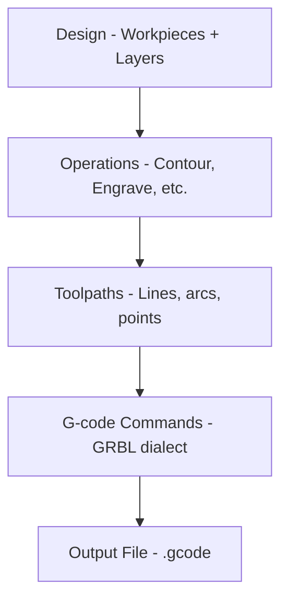

---
description:
  "लेज़र कटिंग के लिए G-code बुनियादी बातें. अपने लेज़र कटर या उत्कीर्णक को नियंत्रित करने के लिए
  Rayforge द्वारा जनरेट किए गए G-code कमांड समझें."
---

# G-code बुनियादी बातें

G-code समझने से आपको समस्याओं का निवारण करने और Rayforge आउटपुट अनुकूलित करने में मदद मिलती है.

## उच्च-स्तरीय प्रक्रिया

Rayforge आपके डिज़ाइनों को बहु-चरण प्रक्रिया से G-code में बदलता है:



**Rayforge क्या करता है:**

1. **आपका डिज़ाइन विश्लेषण करता है** - वर्कपीस से ज्यामिति निकालता है
2. **ऑपरेशन लागू करता है** - कट/उत्कीर्णन पाथ निर्धारित करता है
3. **टूलपाथ अनुकूलित करता है** - पाथ पुनर्व्यवस्थित करता है, ट्रैवल न्यूनतम करता है
4. **कमांड जनरेट करता है** - पाथ को G-code में बदलता है
5. **हुक जोड़ता है** - निर्दिष्ट बिंदुओं पर उपयोगकर्ता-परिभाषित मैक्रो जोड़ता है
6. **फ़ाइल लिखता है** - मशीन के लिए तैयार पूर्ण G-code आउटपुट करता है

## सरल उदाहरण

यहाँ एक वर्ग कट दिखाने वाली एक बुनियादी G-code फ़ाइल संरचना है:

```gcode
G21 ;Set units to mm
G90 ;Absolute positioning
G54
T0
G0 X95.049 Y104.951 Z0.000
M4 S500
G1 X104.951 Y104.951 Z0.000 F3000
G1 X104.951 Y95.049 Z0.000 F3000
G1 X95.049 Y95.049 Z0.000 F3000
G1 X95.049 Y104.951 Z0.000 F3000
M5
G0 X95.000 Y105.000 Z0.000
M4 S500
G1 X95.000 Y95.000 Z0.000 F3000
G1 X105.000 Y95.000 Z0.000 F3000
G1 X105.000 Y105.000 Z0.000 F3000
G1 X95.000 Y105.000 Z0.000 F3000
M5
M5 ;Ensure laser is off
G0 X0 Y0 ;Return to origin
```

**मुख्य कमांड:**

| कमांड   | विवरण                                             |
| ------- | ------------------------------------------------- |
| `G21`   | मिलीमीटर मोड                                      |
| `G90`   | पूर्ण स्थितिनिर्धारण                              |
| `G54`   | वर्क निर्देशांक प्रणाली 1 चुनें                   |
| `T0`    | टूल 0 चुनें (लेज़र हेड)                           |
| `G0`    | तीव्र गति (लेज़र बंद)                             |
| `G1`    | कट गति (लेज़र चालू)                               |
| `M4`    | लेज़र चालू (डायनामिक पावर मोड)                    |
| `M5`    | लेज़र बंद                                         |
| `S500`  | लेज़र शक्ति 500 सेट करें (0-1000 सीमा के लिए 50%) |
| `F3000` | फ़ीड दर 3000 mm/min सेट करें                      |

---

## संबंधित पृष्ठ

- [G-code डायलेक्ट](../reference/gcode-dialects.md) - फ़र्मवेयर अंतर
- [G-code निर्यात](../files/exporting.md) - निर्यात सेटिंग्स और विकल्प
- [हुक और मैक्रो](../machine/hooks-macros.md) - कस्टम G-code इंजेक्शन
