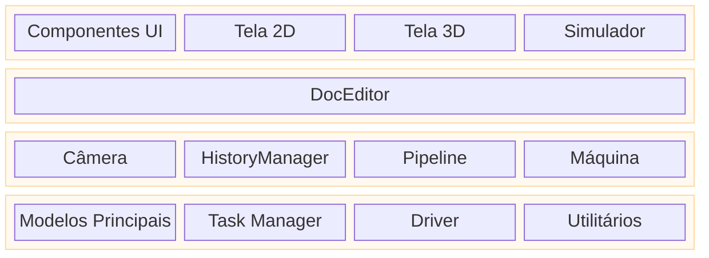

# Arquitetura do Rayforge

Este documento fornece uma visão geral de alto nível da arquitetura do Rayforge,
explicando como os principais componentes se relacionam entre si. Para mergulhos
profundos em áreas específicas, consulte os documentos vinculados.

## Índice

- [Arquitetura de Aplicação em Camadas](#arquitetura-de-aplicação-em-camadas)
- [Arquitetura de Código](#arquitetura-de-código)
- [Arquitetura do Modelo de Documento](#arquitetura-do-modelo-de-documento)
- [Arquitetura do Pipeline](#arquitetura-do-pipeline)

---

## Arquitetura de Aplicação em Camadas

A aplicação é estruturada em camadas lógicas, separando a interface
de usuário, lógica de aplicação e serviços principais. Isso promove uma separação
limpa de responsabilidades e esclarece o fluxo de controle

- **Camada UI (Visualização)**: Contém todos os elementos voltados ao usuário. O `Workbench` é
  a área principal da tela que hospeda as visualizações 2D e 3D.
- **Camada Editor/Controlador**: O `DocEditor` atua como o controlador central,
  respondendo a eventos de UI e manipulando os modelos principais.
- **Camada Principal / Serviços**: Fornece serviços fundamentais e estado.
  `Modelos Principais` representam o documento, `Tasker` gerencia trabalhos em segundo plano,
  `Máquina` lida com comunicação de dispositivo, e `Câmera` gerencia viewports.

---

## Arquitetura de Código

O Rayforge é uma aplicação GTK4/Libadwaita com uma arquitetura modular baseada em pipeline.

- **`rayforge/core/`**: Modelo de documento e manipulação de geometria.
- **`rayforge/pipeline/`**: O pipeline de processamento principal para gerar
  operações de máquina a partir do modelo de documento.
- **`rayforge/machine/`**: Camada de interface de hardware, incluindo drivers
  de dispositivo, protocolos de transporte e modelos de máquina.
- **`rayforge/doceditor/`**: O controlador principal do editor de documento e sua UI.
- **`rayforge/workbench/`**: A tela 2D/3D e sistemas de visualização.
- **`rayforge/image/`**: Importadores para vários formatos de arquivo (SVG, DXF, etc.).
- **`rayforge/shared/`**: Utilitários comuns, incluindo o `tasker` para
  gerenciamento de trabalhos em segundo plano.

---

## Arquitetura do Modelo de Documento

O modelo de documento é uma árvore hierárquica de objetos baseada no
**Padrão Composite**. Esta estrutura representa todo o projeto do usuário,
do objeto `Doc` raiz até os `WorkPiece`s individuais. É projetado para ser
reativo e serializável.

**[Veja Arquitetura do Modelo de Documento para detalhes](./docmodel.md)**

---

## Arquitetura do Pipeline

O pipeline converte o modelo de documento em G-code executável pela máquina. Ele
roda de forma assíncrona em segundo plano e usa um sistema de `Artifact`
de memória compartilhada para transferência de dados de alto desempenho entre processos. O pipeline é
composto de estágios: **Modificadores → Produtores → Transformadores → Codificadores**.

**[Veja Arquitetura do Pipeline para detalhes](./pipeline.md)**
