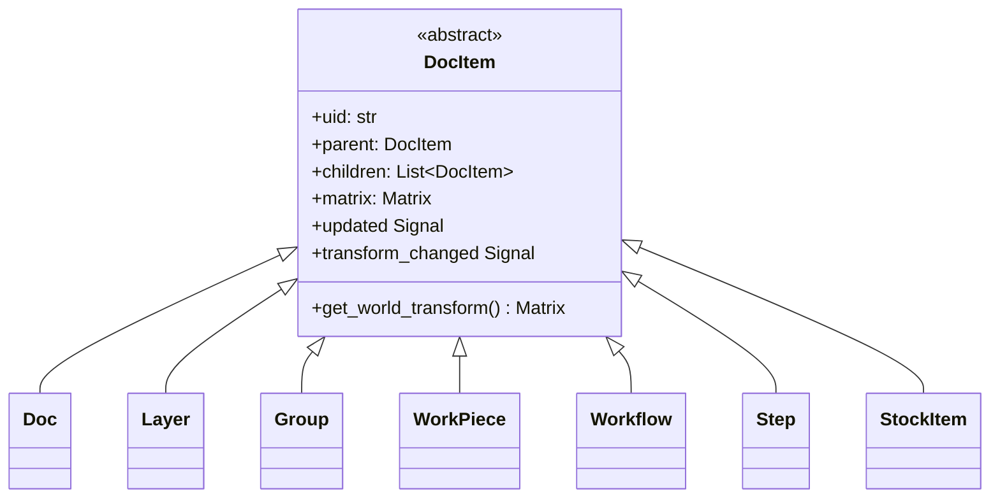
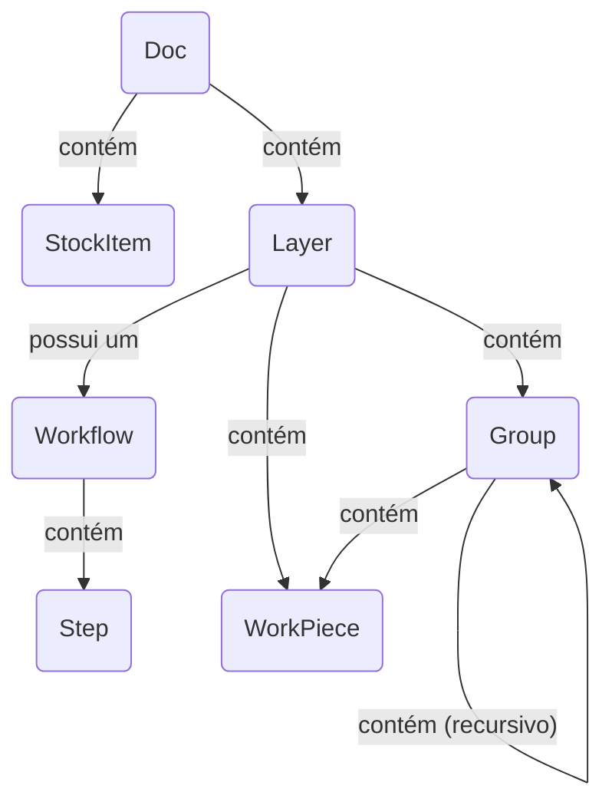

# Arquitetura do Modelo de Documento

O modelo de documento é a espinha dorsal da aplicação, representando o
projeto inteiro do usuário como uma árvore hierárquica de objetos. É projetado para
ser reativo, serializável e facilmente percorrível.

## Visão Geral

A arquitetura é construída sobre o **padrão de design Composite**. Uma única
classe base abstrata, `DocItem`, define a interface comum para todos
os objetos que podem existir na árvore do documento (ex.: camadas, workpieces,
grupos). Isso permite que estruturas complexas e aninhadas sejam tratadas uniformemente.

Princípios principais do modelo incluem:

- **Estrutura de Árvore:** O objeto `Doc` serve como raiz da árvore. Cada
  item (exceto a raiz) tem um único `parent` e pode ter múltiplos
  `children`.
- **Reatividade:** O modelo usa um sistema de signal/slot (`blinker`). Quando um
  item é alterado, ele emite um sinal. Itens pai escutam os
  sinais de seus filhos e os "borbulham para cima" na árvore. Isso permite
  componentes de alto nível como o `Pipeline` escutarem qualquer
  mudança no documento conectando-se a um único sinal no objeto `Doc`
  raiz. O sistema rastreia tanto mudanças de conteúdo quanto mudanças de transformação
  separadamente para atualizações eficientes.
- **Hierarquia de Transformação:** Cada `DocItem` tem uma transformação local
  `Matrix`. A posição final, escala e rotação de um item no "mundo"
  (a tela principal) é o produto de sua própria matriz local e as
  matrizes mundiais de todos os seus ancestrais.
- **Desacoplamento de Dados:** Os dados visuais ou brutos para um `WorkPiece` não são
  armazenados diretamente nele. Em vez disso, o `WorkPiece` mantém um UID que
  referencia um objeto `ImportSource` em um registro central no `Doc`.
  Isso desacopla a estrutura do documento do gerenciamento de dados,
  tornando o modelo mais leve e flexível.

---

## Herança de Classes

Este diagrama mostra a hierarquia de classes. Todo objeto que faz parte da
árvore espacial do documento herda da classe base abstrata `DocItem`,
ganhando funcionalidades principais como parentesco, transformações e sinal
de borbulhamento.

- **`DocItem`**: A fundação abstrata fornecendo a implementação do padrão composite.
- Todas as outras classes são implementações concretas de `DocItem`, cada uma com um
  papel especializado na estrutura do documento.

---

## Composição de Objetos

Este diagrama ilustra como instâncias das classes são montadas para formar
um documento completo. Mostra os relacionamentos pai-filho e
referências entre objetos.

- Um `Doc` é o objeto de nível superior. Ele **contém** um ou mais `Layer`s e
  `StockItem`s. Ele também **gerencia** um registro de todos os `ImportSource`s no
  projeto.
- Cada `Layer` **contém** o conteúdo do usuário: `WorkPiece`s e `Group`s.
  Crucialmente, uma `Layer` também **possui um** `Workflow`.
- Um `Workflow` **contém** uma lista ordenada de `Step`s, que definem o
  processo de manufatura para aquela camada.
- Um `Group` é um contêiner que pode conter `WorkPiece`s e outros `Group`s,
  permitindo transformações aninhadas.
- Um `WorkPiece` é um elemento de design fundamental. Ele não armazena seus
  dados brutos diretamente. Em vez disso, ele **referencia** um `ImportSource` via um
  UID. Ele também **tem** sua própria `Geometry` (dados vetoriais) e pode ter uma
  lista de `Tab`s.

---

## Descrições dos DocItems

- **`DocItem` (Abstrato)**

  - **Função:** A base abstrata para todos os nós da árvore.
  - **Propriedades Principais:** `uid`, `parent`, `children`, `matrix`, sinal
    `updated`, sinal `transform_changed`. Fornece a lógica principal do padrão
    composite.

- **`Doc`**

  - **Função:** A raiz da árvore do documento.
  - **Propriedades Principais:** `children` (Layers, StockItems), `import_sources`
    (um dicionário mapeando UIDs para objetos `ImportSource`), `active_layer`.

- **`Layer`**

  - **Função:** A unidade organizacional primária para conteúdo. Uma camada
    associa um grupo de workpieces a um único workflow de manufatura.
  - **Propriedades Principais:** `children` (WorkPieces, Groups, um Workflow),
    `visible`, `stock_item_uid`.

- **`Group`**

  - **Função:** Um contêiner para outros `DocItem`s (`WorkPiece`, `Group`).
    Permite que uma coleção de itens seja transformada como uma única unidade.

- **`WorkPiece`**

  - **Função:** Representa um único elemento de design tangível na tela
    (ex.: um SVG importado).
  - **Propriedades Principais:** `vectors` (um objeto `Geometry`),
    `import_source_uid`,
    `tabs`, `tabs_enabled`. Seus `vectors` são normalizados para uma caixa 1x1,
    com todo escalonamento e posicionamento tratados por sua matriz de transformação
    `matrix`.

- **`Workflow`**

  - **Função:** Uma sequência ordenada de instruções de processamento. Possuído por uma
    `Layer`.
  - **Propriedades Principais:** `children` (uma lista ordenada de `Step`s).

- **`Step`**

  - **Função:** Uma única instrução de processamento dentro de um `Workflow` (ex.,
    "Corte de Contorno" ou "Gravação Raster"). É um objeto de configuração
    contendo dicionários que definem o produtor, modificadores e
    transformadores a serem usados.

- **`StockItem`**
  - **Função:** Representa uma peça de material físico no documento,
    definida por sua própria `geometry` vetorial. `Layer`s podem ser atribuídas a um
    item de estoque específico.
