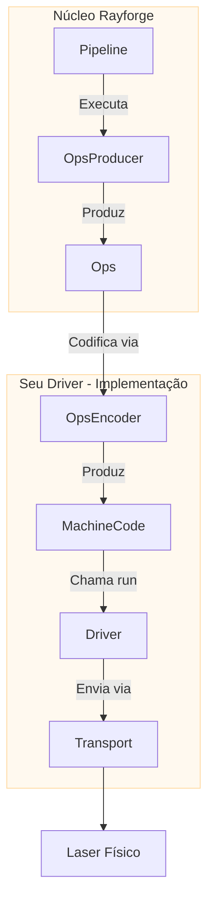

# Guia de Desenvolvimento de Driver

Este guia fornece uma visão geral de alto nível de como criar um driver no Rayforge
para adicionar suporte ao seu cortador ou gravador a laser. Ao criar um driver, você
integra o protocolo de comunicação único e linguagem de comandos da sua máquina no
ecossistema Rayforge.

## Visão Geral do Driver

Um driver é a ponte entre a lógica principal do Rayforge e seu hardware físico.
Ele é responsável por três tarefas principais:

1.  **Gerenciar Conectividade:** Lidar com o protocolo de comunicação de baixo nível
    (Serial, WebSocket, HTTP, etc.).
2.  **Executar Trabalhos:** Enviar código de máquina pré-codificado (ex.: G-code) para o
    dispositivo e rastrear progresso da execução.
3.  **Reportar Estado:** Emitir sinais para atualizar a UI com a posição do laser em
    tempo real, status (`IDLE`, `RUN`) e mensagens de log.

Para simplificar isso, o Rayforge fornece uma arquitetura baseada em partes componíveis:



- **`OpsEncoder`:** Traduz `Ops` para uma linguagem de comandos específica
  (ex.: G-code). Usado tanto pelo Pipeline (para codificação de trabalho) quanto pelo
  Driver (para comandos individuais como move_to, home, etc.).
- **`Pipeline`:** Orquestra codificação e produz código de máquina final.
- **`Transport`:** Gerencia a conexão e transferência de dados.
- **`Driver`:** Executa código de máquina, lida com estado do dispositivo e comunica
  com a UI.

Todas as operações do driver são **assíncronas** para garantir que a interface do usuário permaneça responsiva.

## A Linguagem `Ops`

O Rayforge descreve um trabalho a laser como uma sequência de operações de alto nível, armazenadas em
um objeto `Ops`. Esta é a linguagem universal dentro do Rayforge para descrever
movimentos de máquina, independente de qualquer hardware específico.

| Método `Ops`         | Assinatura                      | Descrição                          |
| :------------------- | :----------------------------- | :----------------------------------- |
| `move_to`            | `(x, y, z=0.0)`                | Movimento rápido (sem corte)          |
| `line_to`            | `(x, y, z=0.0)`                | Movimento de corte/gravação           |
| `arc_to`             | `(x, y, i, j, cw=True, z=0.0)` | Movimento de arco de corte/gravação       |
| `set_power`          | `(power)`                      | Define potência do laser (0-100%)             |
| `set_cut_speed`      | `(speed)`                      | Define velocidade para movimentos de corte (mm/min) |
| `set_travel_speed`   | `(speed)`                      | Define velocidade para movimentos rápidos (mm/min)   |
| `enable_air_assist`  | `()`                           | Liga assistente de ar                   |
| `disable_air_assist` | `()`                           | Desliga assistente de ar                  |

Seu driver recebe código de máquina pré-codificado (ex.: uma string G-code) e um
mapa de operações que rastreia quais comandos de código de máquina correspondem a quais
operações. O pipeline lida com a codificação de `Ops` para código de máquina antes de chamar
o método `run()` do driver.

```python
# Exemplo de como o Rayforge constrói um objeto Ops
ops = Ops()
ops.set_travel_speed(3000)
ops.set_cut_speed(800)
ops.set_power(80)

ops.move_to(10, 10)       # Movimento rápido para ponto inicial
ops.enable_air_assist()
ops.line_to(50, 10)       # Corta uma linha com assistente de ar
ops.disable_air_assist()
ops.line_to(50, 50)       # Corta uma linha sem assistente de ar
```

## Implementação do Driver

Todos os drivers DEVEM herdar de `rayforge.machine.drivers.Driver`.

```python
from rayforge.machine.driver.driver import Driver

class SeuDriver(Driver):
    label = "Seu Dispositivo"  # Nome de exibição na UI
    subtitle = "Descrição para usuários"
    supports_settings = False # Defina True se o driver pode ler/escrever configurações de firmware
```

### Propriedades Obrigatórias

- `label`: Um nome legível para humanos mostrado na UI.
- `subtitle`: Uma breve descrição mostrada abaixo do nome.
- `supports_settings`: Um booleano indicando se o driver pode ler/escrever
  configurações do dispositivo (como `$$` do GRBL).

### Métodos Obrigatórios

Sua classe de driver **DEVE** implementar os seguintes métodos. Note que a maioria são **assíncronos** e devem ser definidos com `async def`.

#### Configuração e Ciclo de Vida

- `get_setup_vars() -> VarSet`: **(Método de Classe)** Retorna um objeto `VarSet`
  definindo os parâmetros necessários para conexão (ex.: endereço IP, porta serial).
  O Rayforge usa isso para gerar automaticamente o formulário de configuração na UI.
- `precheck(**kwargs)`: **(Método de Classe)** Uma verificação estática e não-bloqueante da
  configuração que pode ser executada antes da instanciação do driver. Deve lançar
  `DriverPrecheckError` em caso de falha.
- `setup(**kwargs)`: Chamado uma vez com os valores do formulário de configuração. Use isso
  para inicializar seus transportes e estado interno.
- `async def connect()`: Estabelece e mantém uma conexão persistente com
  o dispositivo. Este método deve conter lógica de reconexão automática.
- `async def cleanup()`: Chamado ao desconectar. Deve fechar todas
  as conexões e liberar recursos.

#### Controle de Dispositivo

- `async def run(machine_code: Any, op_map: MachineCodeOpMap, doc: Doc,
  on_command_done: Optional[Callable[[int], Union[None, Awaitable[None]]]]
  = None)`: O método principal para executar um trabalho. Recebe código de máquina
  pré-codificado (ex.: string G-code) e um mapeamento entre índices de operação e
  código de máquina. O callback `on_command_done` é chamado com o op_index
  quando cada comando completa.
- `async def home(axes: Optional[Axis] = None)`: Faz home da máquina. Pode fazer home
  de eixos específicos ou todos os eixos.
- `async def move_to(pos_x: float, pos_y: float)`: Move manualmente a cabeça
  do laser para uma coordenada XY específica.
- `async def set_hold(hold: bool = True)`: Pausa ou retoma o trabalho atual.
- `async def cancel()`: Para o trabalho atual.
- `async def jog(axis: Axis, distance: float, speed: int)`: Move a máquina
  ao longo de um eixo específico.
- `async def select_tool(tool_number: int)`: Seleciona uma nova ferramenta/cabeça de laser por
  seu número.
- `async def clear_alarm()`: Limpa qualquer estado de alarme ativo.

#### Configurações de Firmware (se `supports_settings` for `True`)

- `get_setting_vars() -> List[VarSet]`: Retorna objetos `VarSet` que definem
  a estrutura da página de configurações do dispositivo.
- `async def read_settings()`: Lê todas as configurações do dispositivo e chama
  `_on_settings_read()` com o resultado.
- `async def write_setting(key: str, value: Any)`: Escreve uma única configuração no
  dispositivo.

### Emitindo Sinais

Para comunicar com a UI, seu driver deve emitir sinais. Para garantir logging
adequado e segurança de thread, **você não deve emitir sinais diretamente.** Em vez disso,
chame os métodos auxiliares protegidos da classe base `Driver`.

- `self._log(message)`: Envia uma mensagem de log para o console.
- `self._on_state_changed()`: Chame isso sempre que você atualizar `self.state` para
  notificar a UI de uma mudança de status ou posição.
- `self._on_connection_status_changed(status, message)`: Informa a UI sobre
  o status da conexão (`CONNECTING`, `CONNECTED`, `ERROR`, etc.).
- `self._on_command_status_changed(status, message)`: Reporta o status de um
  comando enviado.
- `self._on_settings_read(settings)`: Envia as configurações do dispositivo que você leu
  de volta para a UI.

## Tem Perguntas?

A melhor forma de aprender é olhar os drivers existentes em
`rayforge/machine/driver/`, como:

- `grbl.py` - Máquinas baseadas em GRBL
- `grbl_serial.py` - Comunicação GRBL baseada em serial
- `smoothie.py` - Máquinas baseadas em Smoothieboard
- `dummy.py` - Um driver de teste para desenvolvimento

Se você travar, por favor não hesite em abrir uma issue no GitHub! Ficaremos felizes em ajudar.
