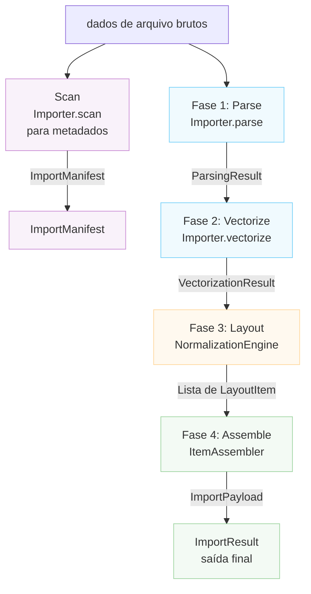

# Arquitetura do Importador

Este documento descreve a arquitetura do sistema de importação de arquivos do Rayforge,
que lida com a conversão de vários formatos de arquivo (SVG, DXF, PNG, PDF, etc.) em
o modelo de documento do Rayforge.

## Índice

- [Visão Geral](#visão-geral)
- [Pipeline de Importação](#pipeline-de-importação)
- [Método Scan](#método-scan)
- [Sistemas de Coordenadas](#sistemas-de-coordenadas)
- [Classes Principais](#classes-principais)
- [Criando um Novo Importador](#criando-um-novo-importador)

---

## Visão Geral

O sistema de importação é construído em torno de um pipeline de quatro fases que transforma dados
de arquivo brutos em objetos de documento totalmente posicionados. Cada fase tem uma
responsabilidade específica e produz estruturas de dados bem definidas.



---

## Pipeline de Importação

### Fase 1: Parse

**Método:** `Importer.parse()`

Extrai fatos geométricos do arquivo incluindo limites, detalhes do sistema de
coordenadas e informações de camadas.

**Saída:** `ParsingResult`

- `document_bounds`: Tamanho total da tela em Coordenadas Nativas
- `native_unit_to_mm`: Fator de conversão para milímetros
- `is_y_down`: Flag de orientação do eixo Y
- `layers`: Lista de `LayerGeometry`
- `world_frame_of_reference`: Coordenadas Mundiais (mm, Y-Up)
- `background_world_transform`: Matriz para posicionamento de fundo
- `untrimmed_document_bounds`: Referência para inversão-Y

**Sistema de Coordenadas:**

- `document_bounds`: Coordenadas Nativas (específico do arquivo)
- `world_frame_of_reference`: Coordenadas Mundiais (mm, Y-Up)

---

### Fase 2: Vectorize

**Método:** `Importer.vectorize()`

Converte dados analisados em objetos `Geometry` vetoriais de acordo com a
`VectorizationSpec`.

**Saída:** `VectorizationResult`

- `geometries_by_layer`: Geometria vetorial por camada (Coordenadas Nativas)
- `source_parse_result`: Referência ao ParsingResult original
- `fills_by_layer`: Geometria de preenchimento opcional (importador Sketch)

**Sistema de Coordenadas:** Coordenadas Nativas (específico do arquivo)

---

### Fase 3: Layout

**Classe:** `NormalizationEngine`

Calcula matrizes de transformação para mapear Coordenadas Nativas para Coordenadas
Mundiais com base na intenção do usuário.

**Saída:** `List[LayoutItem]`

Cada `LayoutItem` contém:

- `world_matrix`: Normalizado (0-1, Y-Up) → Mundial (mm, Y-Up)
- `normalization_matrix`: Nativo → Normalizado (0-1, Y-Up)
- `crop_window`: Subconjunto do arquivo original em Coordenadas Nativas
- `layer_id`, `layer_name`: Identificação da camada

**Sistema de Coordenadas:**

- Entrada: Coordenadas Nativas
- Saída: Coordenadas Mundiais (mm, Y-Up) via espaço Normalizado intermediário

---

### Fase 4: Assemble

**Classe:** `ItemAssembler`

Instancia objetos de domínio do Rayforge (`WorkPiece`, `Layer`) com base no
plano de layout.

**Saída:** `ImportPayload`

- `source`: O `SourceAsset`
- `items`: Lista de `DocItem` prontos para inserção
- `sketches`: Lista opcional de objetos `Sketch`

**Sistema de Coordenadas:** Todos DocItems em Coordenadas Mundiais (mm, Y-Up)

---

## Método Scan

**Método:** `Importer.scan()`

Um scan leve que extrai metadados sem processamento completo. Usado para
construir a UI para um importador, incluindo lista de seleção de camadas.
Isso NÃO é parte do pipeline principal de importação executado por `get_doc_items()`.

**Saída:** `ImportManifest`

- `layers`: Lista de objetos `LayerInfo`
- `natural_size_mm`: Dimensões físicas em milímetros (Y-Up)
- `title`: Título opcional do documento
- `warnings`, `errors`: Problemas não críticos descobertos

**Sistema de Coordenadas:** Coordenadas Mundiais (mm, Y-Up) para `natural_size_mm`

---

## Sistemas de Coordenadas

O pipeline de importação lida com múltiplos sistemas de coordenadas através de transformação
cuidadosa:

### Coordenadas Nativas (Entrada)

- Sistema de coordenadas específico do arquivo (unidades de usuário SVG, unidades DXF, pixels)
- Orientação do eixo Y varia por formato
- Limites são absolutos dentro do espaço de coordenadas do documento
- Unidades convertidas para mm via fator `native_unit_to_mm`

### Coordenadas Normalizadas (Intermediário)

- Quadrado unitário de (0,0) a (1,1)
- Eixo Y aponta PARA CIMA (convenção Y-Up)
- Usado como representação intermediária entre nativo e mundial

### Coordenadas Mundiais (Saída)

- Coordenadas físicas do mundo em milímetros (mm)
- Eixo Y aponta PARA CIMA (convenção Y-Up)
- Origem (0,0) está no canto inferior esquerdo da peça de trabalho
- Todas as posições são absolutas no sistema de coordenadas mundial

### Orientação do Eixo Y

- **Formatos Y-Down** (SVG, imagens): Origem no canto superior esquerdo, Y aumenta para baixo
- **Formatos Y-Up** (DXF): Origem no canto inferior esquerdo, Y aumenta para cima
- Importadores devem definir a flag `is_y_down` corretamente em `ParsingResult`
- `NormalizationEngine` lida com inversão-Y para fontes Y-Down

---

## Classes Principais

### Importer (Classe Base)

Classe base abstrata definindo a interface para todos os importadores. Subclasses devem
implementar os métodos do pipeline e declarar suas capacidades via atributo
`features`.

**Recursos:**

- `BITMAP_TRACING`: Pode rastrear imagens raster para vetores
- `DIRECT_VECTOR`: Pode extrair geometria vetorial diretamente
- `LAYER_SELECTION`: Suporta importações baseadas em camadas
- `PROCEDURAL_GENERATION`: Gera conteúdo programaticamente

### Estruturas de Dados

| Classe                 | Fase     | Propósito                    |
| --------------------- | --------- | -------------------------- |
| `LayerInfo`           | Scan      | Metadados de camada leves |
| `ImportManifest`      | Scan      | Resultado da fase de scan          |
| `LayerGeometry`       | Parse     | Informação de camada geométrica       |
| `ParsingResult`       | Parse     | Fatos geométricos            |
| `VectorizationResult` | Vectorize | Geometria vetorial            |
| `LayoutItem`          | Layout    | Configuração de transformação      |
| `ImportPayload`       | Assemble  | Saída final               |
| `ImportResult`        | Final     | Wrapper de resultado completo    |

### Componentes de Suporte

- `NormalizationEngine`: Cálculos de layout da Fase 3
- `ItemAssembler`: Criação de objetos da Fase 4

---

## Criando um Novo Importador

Para adicionar suporte a um novo formato de arquivo:

1. **Crie uma nova classe importadora** que herde de `Importer`
2. **Declare recursos suportados** via atributo de classe `features`
3. **Implemente os métodos obrigatórios**:
   - `scan()`: Extrai metadados rapidamente (para previews na UI)
   - `parse()`: Extrai fatos geométricos
   - `vectorize()`: Converte para geometria vetorial
   - `create_source_asset()`: Cria o asset de origem
4. **Registre o importador** em `rayforge/image/__init__.py`
5. **Adicione mapeamentos de tipo MIME e extensão**

**Exemplo:**

```python
from rayforge.image.base_importer import Importer, ImporterFeature
from rayforge.image.structures import (
    ImportManifest,
    ParsingResult,
    VectorizationResult,
)
from rayforge.core.source_asset import SourceAsset

class MeuFormatoImporter(Importer):
    label = "Meu Formato"
    mime_types = ("application/x-meuformato",)
    extensions = (".mft",)
    features = {ImporterFeature.DIRECT_VECTOR}

    def scan(self) -> ImportManifest:
        # Extrai metadados sem processamento completo
        return ImportManifest(
            layers=[],
            natural_size_mm=(100.0, 100.0),
        )

    def parse(self) -> Optional[ParsingResult]:
        # Extrai fatos geométricos
        return ParsingResult(
            document_bounds=(0, 0, 100, 100),
            native_unit_to_mm=1.0,
            is_y_down=False,
            layers=[],
            world_frame_of_reference=(0, 0, 100, 100),
            background_world_transform=Matrix.identity(),
        )

    def vectorize(
        self, parse_result: ParsingResult, spec: VectorizationSpec
    ) -> VectorizationResult:
        # Converte para geometria vetorial
        return VectorizationResult(
            geometries_by_layer={None: Geometry()},
            source_parse_result=parse_result,
        )

    def create_source_asset(
        self, parse_result: ParsingResult
    ) -> SourceAsset:
        # Cria o asset de origem
        return SourceAsset(
            original_data=self.raw_data,
            metadata={},
        )
```
