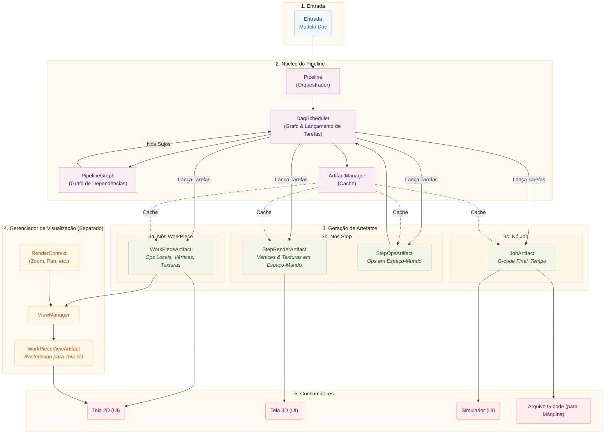

# Arquitetura do Pipeline

Este documento descreve a arquitetura do pipeline, que usa um Grafo Acíclico
Direcionado (DAG) para orquestrar a geração de artefatos. O pipeline transforma dados
de design brutos em saídas finais para visualização e manufatura, com
agendamento consciente de dependências e cache eficiente de artefatos.

# Conceitos Principais

## Nós de Artefato e o Grafo de Dependências

O pipeline usa um **Grafo Acíclico Direcionado (DAG)** para modelar artefatos e
suas dependências. Cada artefato é representado como um `ArtifactNode` no
grafo.

### ArtifactNode

Cada nó contém:

- **ArtifactKey**: Um identificador único consistindo de um ID e um tipo de grupo
  (`workpiece`, `step`, `job`, ou `view`)
- **Estado**: O estado atual do ciclo de vida do nó
- **Dependências**: Lista de nós dos quais este nó depende (filhos)
- **Dependentes**: Lista de nós que dependem deste nó (pais)

### Estados dos Nós

Os nós progridem por quatro estados:

| Estado        | Descrição                                 |
| ------------ | ------------------------------------------- |
| `DIRTY`      | O artefato precisa ser regenerado        |
| `PROCESSING` | Uma tarefa está gerando o artefato atual |
| `VALID`      | O artefato está pronto e atualizado        |
| `ERROR`      | A geração falhou                           |

Quando um nó é marcado como sujo, todos os seus dependentes também são marcados como sujos,
propagando invalidação pelo grafo.

### PipelineGraph

O `PipelineGraph` é construído a partir do modelo Doc e contém:

- Um nó para cada par `(WorkPiece, Step)`
- Um nó para cada Step
- Um nó para o Job

Dependências são estabelecidas:

- Steps dependem de seus nós de par `(WorkPiece, Step)`
- Job depende de todos os Steps

## DagScheduler

O `DagScheduler` é o orquestrador central do pipeline. Ele possui o
`PipelineGraph` e é responsável por:

1. **Construir o grafo** a partir do modelo Doc
2. **Identificar nós prontos** (DIRTY com todas as dependências VALID)
3. **Lançar tarefas** para gerar artefatos
4. **Rastrear estado** através do processo de geração
5. **Notificar consumidores** quando artefatos estão prontos

O agendador funciona com IDs de geração para rastrear quais artefatos pertencem a
qual versão do documento, permitindo reuso de artefatos válidos entre gerações.

Comportamentos principais:

- Quando o grafo é construído, o agendador sincroniza estados dos nós com o
  gerenciador de artefatos para identificar artefatos em cache que podem ser reusados
- Artefatos da geração anterior podem ser reusados se permanecerem válidos
- O agendador rastreia quais IDs de geração têm tarefas rodando para preservar
  artefatos durante transições de geração
- Invalidações são rastreadas mesmo antes da reconstrução do grafo e reaplicadas depois

## ArtifactManager

O `ArtifactManager` é um gerenciador de cache puro para handles de artefatos. Ele:

- Armazena e recupera handles de artefatos
- Gerencia contagem de referências para limpeza
- Lida com ciclo de vida (criação, retenção, liberação)
- NÃO rastreia estado (estado é gerenciado pelo agendador DAG)

## Ciclo de Vida da Memória Compartilhada

Artefatos são armazenados em memória compartilhada (`multiprocessing.shared_memory`) para
comunicação inter-processo eficiente entre processos worker e o processo
principal. O `ArtifactStore` gerencia o ciclo de vida desses blocos de memória.

### Padrões de Propriedade

**Propriedade Local:** O processo criador possui o handle e o libera
quando termina. Este é o padrão mais simples.

**Transferência Inter-Processo:** Um worker cria um artefato, envia para o
processo principal via IPC, e transfere propriedade. O worker "esquece" o
handle (fecha seu descritor de arquivo sem desvincular a memória), enquanto
o processo principal o "adota" e se torna responsável pela eventual liberação.

### Contagem de Referências

O `ArtifactStore` mantém contagens de referências para cada bloco de memória compartilhada.
Múltiplos chamadores podem fazer `retain()` de um handle, e o bloco só é desvinculado
quando a contagem chega a zero. Isso é usado pelo `ViewManager` para
renderização progressiva onde múltiplos callbacks podem acessar o mesmo artefato.

## Estágios do Pipeline

Os estágios do pipeline (`WorkPiecePipelineStage`, `StepPipelineStage`,
`JobPipelineStage`) agora servem como interfaces em vez de lançadores de tarefas:

- Eles lidam com requisições de invalidação da UI
- Eles delegam lançamento de tarefas ao DagScheduler
- Eles fornecem acesso a artefatos em cache
- Eles encaminham sinais do agendador para a UI

## InvalidationScope

O enum `InvalidationScope` define o escopo de invalidação para artefatos
downstream:

| Escopo               | Descrição                                                                                                                                                    |
| ------------------- | -------------------------------------------------------------------------------------------------------------------------------------------------------------- |
| `FULL_REPRODUCTION` | Invalida workpieces, que se propaga para steps e depois para o job. Usado para mudanças que requerem regeneração de artefatos (geometria, parâmetros, mudanças de tamanho). |
| `STEP_ONLY`         | Invalida steps diretamente, que se propaga para o job. Usado para mudanças de transformação apenas de posição/rotação onde a geometria do workpiece permanece inalterada.           |

# Análise Detalhada

## Entrada

O processo começa com o **Modelo Doc**, que contém:

- **WorkPieces:** Elementos de design individuais (SVGs, imagens) colocados na tela
- **Steps:** Instruções de processamento (Contorno, Raster) com configurações

## Núcleo do Pipeline

### Pipeline (Orquestrador)

A classe `Pipeline` é o condutor de alto nível que:

- Escuta o modelo Doc por mudanças
- Coordena com o DagScheduler para disparar regeneração
- Gerencia o estado geral de processamento
- Conecta sinais entre componentes

### DagScheduler

O `DagScheduler`:

- Constrói e mantém o `PipelineGraph`
- Identifica nós prontos para processamento
- Lança tarefas via TaskManager
- Rastreia transições de estado dos nós
- Emite sinais quando artefatos estão prontos

### ArtifactManager

O `ArtifactManager`:

- Faz cache de handles de artefatos em memória compartilhada
- Gerencia contagem de referências para limpeza
- Fornece busca por ArtifactKey e ID de geração

## Geração de Artefatos

### WorkPieceArtifacts

Gerados para cada combinação `(WorkPiece, Step)`, contendo:

- Toolpaths (`Ops`) no sistema de coordenadas local
- Dados de vértices para linhas
- Dados de textura para preenchimentos raster

Sequência de processamento:

1. **Modificadores:** (Opcional) Condicionamento de imagem (escala de cinza, etc.)
2. **Produtor:** Cria toolpaths brutos (`Ops`)
3. **Transformadores:** Modificações por workpiece (Abas, Suavização)
4. **Codificador de Vértices:** Cria dados amigáveis para GPU

### StepArtifacts

Gerados para cada Step, consumindo todos os WorkPieceArtifacts relacionados:

**StepRenderArtifact:

- Dados combinados de vértices e textura para todos os workpieces
- Transformados para coordenadas de espaço-mundo
- Otimizados para renderização na tela 3D

**StepOpsArtifact:

- Ops combinados para todos os workpieces
- Transformados para coordenadas de espaço-mundo
- Inclui transformadores por-step (Otimização, Multi-Pass)

### JobArtifact

Gerado sob demanda quando G-code é necessário, consumindo todos os StepOpsArtifacts:

- G-code final para todo o trabalho
- Dados completos de vértices para simulação
- Estimativa de tempo de alta fidelidade

## ViewManager (Separado)

O `ViewManager` é **desacoplado** do pipeline de dados. Ele lida com renderização
para a tela 2D com base no estado da UI:

### RenderContext

Contém os parâmetros atuais de visualização:

- Pixels por milímetro (nível de zoom)
- Deslocamento do viewport (pan)
- Opções de exibição (mostrar movimentos de deslocamento, etc.)

### WorkPieceViewArtifacts

O ViewManager cria `WorkPieceViewArtifacts` que:

- Rasterizam WorkPieceArtifacts para espaço de tela
- Aplicam o RenderContext atual
- São cacheados e atualizados quando contexto ou fonte muda

### Ciclo de Vida

1. ViewManager rastreia handles de `WorkPieceArtifact` fonte
2. Quando contexto de renderização muda, ViewManager dispara re-renderização
3. Quando artefato fonte muda, ViewManager dispara re-renderização
4. Throttling previne atualizações excessivas durante mudanças contínuas

O ViewManager indexa views por `(workpiece_uid, step_uid)` para suportar
visualização de estados intermediários de um workpiece através de múltiplos steps.

## Consumidores

| Consumidor  | Usa                   | Propósito                             |
| --------- | ---------------------- | ----------------------------------- |
| Tela 2D | WorkPieceViewArtifacts | Renderiza workpieces em espaço de tela  |
| Tela 3D | StepRenderArtifacts    | Renderiza step completo em espaço-mundo    |
| Simulador | JobArtifact            | Simulação precisa do caminho da máquina |
| Máquina   | G-code JobArtifact     | Saída de manufatura                |

# Principais Diferenças da Arquitetura Anterior

1. **Agendamento baseado em DAG:** Em vez de estágios sequenciais, artefatos são
   gerados conforme suas dependências ficam disponíveis.

2. **Gerenciamento de Estado:** O estado do nó é rastreado no grafo DAG, não em
   componentes individuais.

3. **Separação do ViewManager:** Renderização para a tela 2D agora é tratada
   por um ViewManager separado, não como parte do pipeline de dados.

4. **IDs de Geração:** Artefatos são rastreados com IDs de geração, permitindo
   reuso eficiente entre versões de documento.

5. **Orquestração Centralizada:** O DagScheduler é o ponto único de
   controle para lançamento de tarefas e rastreamento de estado.

6. **Gerenciador de Cache Puro:** O ArtifactManager agora é um cache simples,
   delegando todo gerenciamento de estado ao agendador DAG.

7. **Rastreamento de Invalidação:** Chaves marcadas como sujas antes da reconstrução do grafo são
   preservadas e reaplicadas após a reconstrução.

8. **Detecção de Trabalho Pendente:** Apenas nós `PROCESSING` contam como trabalho pendente;
   nós `DIRTY` podem ter dependências não satisfeitas (ex.: sem contexto de visualização).
