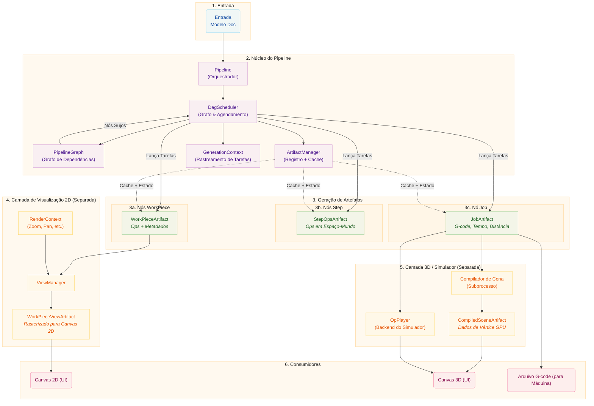

# Arquitetura do Pipeline

Este documento descreve a arquitetura do pipeline, que usa um Grafo Acíclico
Direcionado (DAG) para orquestrar a geração de artefatos. O pipeline transforma dados
de design brutos em saídas finais para visualização e manufatura, com
agendamento consciente de dependências e cache eficiente de artefatos.

```mermaid
graph TD
    subgraph Input["1. Entrada"]
        InputNode("Entrada<br/>Modelo Doc")
    end

    subgraph PipelineCore["2. Núcleo do Pipeline"]
        Pipeline["Pipeline<br/>(Orquestrador)"]
        DAG["DagScheduler<br/>(Grafo & Agendamento)"]
        Graph["PipelineGraph<br/>(Grafo de Dependências)"]
        AM["ArtifactManager<br/>(Registro + Cache)"]
        GC["GenerationContext<br/>(Rastreamento de Tarefas)"]
    end

    subgraph ArtifactGen["3. Geração de Artefatos"]
        subgraph WorkPieceNodes["3a. Nós WorkPiece"]
            WP["WorkPieceArtifact<br/><i>Ops + Metadados</i>"]
        end

        subgraph StepNodes["3b. Nós Step"]
            SO["StepOpsArtifact<br/><i>Ops em Espaço-Mundo</i>"]
        end

        subgraph JobNode["3c. Nó Job"]
            JA["JobArtifact<br/><i>G-code, Tempo, Distância</i>"]
        end
    end

    subgraph View2D["4. Camada de Visualização 2D (Separada)"]
        VM["ViewManager"]
        RC["RenderContext<br/>(Zoom, Pan, etc.)"]
        WV["WorkPieceViewArtifact<br/><i>Rasterizado para Canvas 2D</i>"]
    end

    subgraph View3D["5. Camada 3D / Simulador (Separada)"]
        SC["Compilador de Cena<br/>(Subprocesso)"]
        CS["CompiledSceneArtifact<br/><i>Dados de Vértice GPU</i>"]
        OP["OpPlayer<br/>(Backend do Simulador)"]
    end

    subgraph Consumers["6. Consumidores"]
        Vis2D("Canvas 2D (UI)")
        Vis3D("Canvas 3D (UI)")
        File("Arquivo G-code (para Máquina)")
    end

    InputNode --> Pipeline
    Pipeline --> DAG
    DAG --> Graph
    DAG --> AM
    DAG --> GC

    Graph -->|"Nós Sujos"| DAG
    DAG -->|"Lança Tarefas"| WP
    DAG -->|"Lança Tarefas"| SO
    DAG -->|"Lança Tarefas"| JA

    AM -.->|"Cache + Estado"| WP
    AM -.->|"Cache + Estado"| SO
    AM -.->|"Cache + Estado"| JA

    WP --> VM
    JA --> SC
    JA --> OP
    JA --> File

    RC --> VM
    VM --> WV
    WV --> Vis2D

    SC --> CS
    CS --> Vis3D
    OP --> Vis3D

    classDef clusterBox fill:#fff3e080,stroke:#ffb74d80,stroke-width:1px,color:#1a1a1a
    classDef inputNode fill:#e1f5fe80,stroke:#03a9f480,color:#0d47a1
    classDef coreNode fill:#f3e5f580,stroke:#9c27b080,color:#4a148c
    classDef artifactNode fill:#e8f5e980,stroke:#4caf5080,color:#1b5e20
    classDef viewNode fill:#fff8e180,stroke:#ffc10780,color:#e65100
    classDef consumerNode fill:#fce4ec80,stroke:#e91e6380,color:#880e4f
    class Input,PipelineCore,ArtifactGen,WorkPieceNodes,StepNodes,JobNode,View2D,View3D,Consumers clusterBox
    class InputNode inputNode
    class Pipeline,DAG,Graph,AM,GC coreNode
    class WP,SO,JA artifactNode
    class VM,RC,WV,SC,CS,OP viewNode
    class Vis2D,Vis3D,File consumerNode
```

# Conceitos Principais

## Nós de Artefato e o Grafo de Dependências

O pipeline usa um **Grafo Acíclico Direcionado (DAG)** para modelar artefatos e
suas dependências. Cada artefato é representado como um `ArtifactNode` no
grafo.

### ArtifactNode

Cada nó contém:

- **ArtifactKey**: Um identificador único consistindo de um ID e um tipo de grupo
  (`workpiece`, `step`, `job`, ou `view`)
- **Dependências**: Lista de nós dos quais este nó depende (filhos)
- **Dependentes**: Lista de nós que dependem deste nó (pais)

Os nós não armazenam estado diretamente. Em vez disso, delegam leituras e
escritas de estado ao `ArtifactManager`, que mantém um registro de todos os
artefatos e seus estados.

### Estados dos Nós

Os nós progridem por cinco estados:

| Estado        | Descrição                                                      |
| ------------ | -------------------------------------------------------------- |
| `DIRTY`      | O artefato precisa ser (re)gerado                              |
| `PROCESSING` | Uma tarefa está gerando o artefato atual                       |
| `VALID`      | O artefato está pronto e atualizado                            |
| `ERROR`      | A geração falhou                                               |
| `CANCELLED`  | A geração foi cancelada; será repetida se ainda for necessário |

Quando um nó é marcado como sujo, todos os seus dependentes também são marcados como sujos,
propagando invalidação pelo grafo.

### PipelineGraph

O `PipelineGraph` é construído a partir do modelo Doc e contém:

- Um nó para cada par `(WorkPiece, Step)`
- Um nó para cada Step
- Um nó para o Job

Dependências são estabelecidas:

- Steps dependem de seus nós de par `(WorkPiece, Step)`
- Job depende de todos os Steps

## DagScheduler

O `DagScheduler` é o orquestrador central do pipeline. Ele possui o
`PipelineGraph` e é responsável por:

1. **Construir o grafo** a partir do modelo Doc
2. **Identificar nós prontos** (DIRTY com todas as dependências VALID)
3. **Disparar o lançamento de tarefas** através dos estágios de pipeline apropriados
4. **Rastrear estado** através do processo de geração
5. **Notificar consumidores** quando artefatos estão prontos

O agendador funciona com IDs de geração para rastrear quais artefatos pertencem a
qual versão do documento, permitindo reuso de artefatos válidos entre gerações.

Comportamentos principais:

- Quando o grafo é construído, o agendador sincroniza estados dos nós com o
  gerenciador de artefatos para identificar artefatos em cache que podem ser reusados
- Artefatos da geração anterior podem ser reusados se permanecerem válidos
- Invalidações são rastreadas mesmo antes da reconstrução do grafo e reaplicadas depois
- O agendador delega a criação real de tarefas aos estágios, mas controla
  **quando** as tarefas são lançadas com base na prontidão das dependências

## ArtifactManager

O `ArtifactManager` serve tanto como cache quanto como fonte única de verdade
para o estado dos artefatos. Ele:

- Armazena e recupera handles de artefatos através de um **registro** (indexado por
  `ArtifactKey` + ID de geração)
- Rastreia estado (`DIRTY`, `VALID`, `ERROR`, etc.) nas entradas do registro
- Gerencia contagem de referências para limpeza de memória compartilhada
- Lida com ciclo de vida (criação, retenção, liberação, limpeza)
- Fornece gerenciadores de contexto para adoção segura de artefatos, relatório
  de conclusão, falha e cancelamento

## GenerationContext

Cada ciclo de reconciliação cria um `GenerationContext` que rastreia todas as
tarefas ativas para aquela geração. Ele garante que os recursos de memória
compartilhada permaneçam válidos até que todas as tarefas em andamento de uma
geração tenham sido concluídas, mesmo que uma nova geração já tenha iniciado.
Quando um contexto é substituído e todas as suas tarefas terminam, ele libera
automaticamente seus recursos.

## Ciclo de Vida da Memória Compartilhada

Artefatos são armazenados em memória compartilhada (`multiprocessing.shared_memory`) para
comunicação inter-processo eficiente entre processos worker e o processo
principal. O `ArtifactStore` gerencia o ciclo de vida desses blocos de memória.

### Padrões de Propriedade

**Propriedade Local:** O processo criador possui o handle e o libera
quando termina. Este é o padrão mais simples.

**Transferência Inter-Processo:** Um worker cria um artefato, envia para o
processo principal via IPC, e transfere propriedade. O worker "esquece" o
handle (fecha seu descritor de arquivo sem desvincular a memória), enquanto
o processo principal o "adota" e se torna responsável pela eventual liberação.

### Detecção de Artefatos Obsoletos

O mecanismo `StaleGenerationError` impede que artefatos de gerações
substituídas sejam adotados. Quando uma nova geração é iniciada, o
gerenciador detecta artefatos obsoletos durante a adoção e os descarta
silenciosamente.

## Estágios do Pipeline

Os estágios do pipeline (`WorkPiecePipelineStage`, `StepPipelineStage`,
`JobPipelineStage`) são responsáveis pela **mecânica** de execução das tarefas:

- Eles criam e registram tarefas de subprocesso via `TaskManager`
- Eles lidam com eventos de tarefas (blocos progressivos, resultados intermediários)
- Eles gerenciam adoção e cache de artefatos após a conclusão da tarefa
- Eles emitem sinais para notificar o pipeline sobre mudanças de estado

O **DagScheduler** decide **quando** acionar cada estágio, mas os
estágios lidam com a geração real de subprocessos, tratamento de eventos e
adoção de resultados.

## Estratégia de Invalidação

A invalidação é acionada por mudanças no modelo Doc, com diferentes
estratégias dependendo do que mudou:

| Tipo de Mudança          | Comportamento                                                                                                    |
| ------------------------ | ---------------------------------------------------------------------------------------------------------------- |
| Geometria/parâmetros     | Pares workpiece-step são invalidados, propagando para steps e job                                               |
| Posição/rotação          | Steps invalidados diretamente (propagando para o job); workpieces ignorados a menos que sejam sensíveis à posição |
| Mudança de tamanho       | O mesmo que geometria: propagação completa dos pares workpiece-step para cima                                    |
| Configuração da máquina  | Todos os artefatos são invalidados à força em todas as gerações                                                 |

Steps sensíveis à posição (ex.: aqueles com recorte-para-área-de-trabalho ativado) acionam
invalidação do workpiece mesmo para mudanças puras de posição.

# Análise Detalhada

## Entrada

O processo começa com o **Modelo Doc**, que contém:

- **WorkPieces:** Elementos de design individuais (SVGs, imagens) colocados na tela
- **Steps:** Instruções de processamento (Contorno, Raster, etc.) com configurações
- **Layers:** Agrupamento de workpieces, cada um com seu próprio fluxo de trabalho

## Núcleo do Pipeline

### Pipeline (Orquestrador)

A classe `Pipeline` é o condutor de alto nível que:

- Escuta o modelo Doc por mudanças via sinais
- **Agrupa mudanças** (atraso de reconciliação de 200ms, atraso de remoção de 50ms)
- Coordena com o DagScheduler para disparar regeneração
- Gerencia o estado geral de processamento e detecção de ocupação
- Suporta **pausa/retomada** para operações em lote
- Suporta **modo manual** (`auto_pipeline=False`) onde o recálculo
  é acionado explicitamente em vez de automaticamente
- Conecta sinais entre componentes e os retransmite aos consumidores

### DagScheduler

O `DagScheduler`:

- Constrói e mantém o `PipelineGraph`
- Identifica nós prontos para processamento
- Aciona o lançamento de tarefas via métodos `launch_task()` dos estágios
- Rastreia transições de estado dos nós através do registro
- Emite sinais quando artefatos estão prontos

### ArtifactManager

O `ArtifactManager`:

- Mantém um **registro** de objetos `LedgerEntry`, cada um rastreando um handle,
  ID de geração e estado do nó
- Faz cache de handles de artefatos em memória compartilhada
- Gerencia contagem de referências para limpeza
- Fornece busca por ArtifactKey e ID de geração
- Remove gerações obsoletas para manter o registro limpo

### GenerationContext

Cada reconciliação cria um novo `GenerationContext` que:

- Rastreia tarefas ativas via chaves com contagem de referências
- Possui recursos de memória compartilhada para sua geração
- Desliga automaticamente quando substituído e todas as tarefas são concluídas

## Geração de Artefatos

### WorkPieceArtifacts

Gerados para cada combinação `(WorkPiece, Step)`. Contém:

- Toolpaths (`Ops`) no sistema de coordenadas local do workpiece
- Flag de escalabilidade e dimensões da fonte para ops independentes de resolução
- Sistema de coordenadas e metadados de geração

Sequência de processamento:

1. **Produtor:** Cria toolpaths brutos (`Ops`) a partir dos dados do workpiece
2. **Transformadores:** Modificações por workpiece aplicadas em fases ordenadas
   (Refinamento de Geometria → Interrupção de Caminho → Pós-Processamento)

Workpieces raster grandes são processados incrementalmente em blocos, permitindo
feedback visual progressivo durante a geração.

### StepOpsArtifacts

Gerados para cada Step, consumindo todos os WorkPieceArtifacts relacionados:

- Ops combinados para todos os workpieces em coordenadas de espaço-mundo
- Transformadores por-step aplicados (Otimização, Multi-Pass, etc.)

### JobArtifact

Gerado sob demanda quando G-code é necessário, consumindo todos os StepOpsArtifacts:

- Código de máquina final (G-code ou formato específico do driver)
- Ops completos para simulação e reprodução
- Estimativa de tempo de alta fidelidade e distância total
- Ops mapeados para rotativo para visualização 3D

## Camada de Visualização 2D (Separada)

O `ViewManager` é **desacoplado** do pipeline de dados. Ele lida com renderização
para o canvas 2D com base no estado da UI:

### RenderContext

Contém os parâmetros atuais de visualização:

- Pixels por milímetro (nível de zoom)
- Deslocamento do viewport (pan)
- Opções de exibição (mostrar movimentos de deslocamento, etc.)

### WorkPieceViewArtifacts

O ViewManager cria `WorkPieceViewArtifacts` que:

- Rasterizam WorkPieceArtifacts para espaço de tela
- Aplicam o RenderContext atual
- São cacheados e atualizados quando contexto ou fonte muda

### Ciclo de Vida

1. ViewManager rastreia handles de `WorkPieceArtifact` fonte
2. Quando contexto de renderização muda, ViewManager dispara re-renderização
3. Quando artefato fonte muda, ViewManager dispara re-renderização
4. A re-renderização é limitada (intervalo de 33ms) e com limite de concorrência
5. Montagem progressiva de blocos fornece atualizações visuais incrementais

O ViewManager indexa views por `(workpiece_uid, step_uid)` para suportar
visualização de estados intermediários de um workpiece através de múltiplos steps.

## Camada 3D / Simulador (Separada)

O sistema de visualização 3D e simulação é **desacoplado** do pipeline de dados,
seguindo um padrão semelhante ao ViewManager. Ele consiste em:

- Um **Compilador de Cena** que roda em um subprocesso para converter as ops
  do `JobArtifact` em dados de vértice prontos para GPU
- Um **OpPlayer** que reproduz as ops do trabalho para simulação em tempo real
  da máquina com controles de reprodução

Ambos consomem o `JobArtifact` produzido pelo estágio de job do pipeline.

### CompiledSceneArtifact

O Compilador de Cena produz um `CompiledSceneArtifact` contendo:

- **Camadas de vértice:** Buffers de vértice ligado/deslocado/zero-power com
  deslocamentos por comando para revelação progressiva
- **Camadas de textura:** Mapas de potência de linhas de varredura rasterizados para
  visualização de gravação
- **Camadas de sobreposição:** Segmentos de potência de linhas de varredura para
  destaque em tempo real
- Suporte para geometria rotativa (envolvida em cilindro)

### Pipeline de Compilação

1. Canvas3D escuta sinais de `job_generation_finished`
2. Quando um novo job está pronto, agenda a compilação de cena em um subprocesso
3. O subprocesso lê o `JobArtifact` da memória compartilhada e compila
   as ops em dados de vértice GPU
4. A cena compilada é adotada de volta à memória compartilhada e enviada para
   renderizadores GPU

### OpPlayer (Backend do Simulador)

O `OpPlayer` percorre as ops do trabalho comando por comando, mantendo um
`MachineState` que rastreia posição, estado do laser e eixos auxiliares.
Isso dirige:

- A reprodução do canvas 3D (revelação progressiva do toolpath)
- A posição da cabeça da máquina e visualização do feixe do laser
- Avanço por comando para o controle deslizante de reprodução

## Consumidores

| Consumidor   | Usa                            | Propósito                                           |
| ------------ | ------------------------------ | --------------------------------------------------- |
| Canvas 2D    | WorkPieceViewArtifacts         | Renderiza workpieces em espaço de tela              |
| Canvas 3D    | CompiledSceneArtifact          | Renderiza job completo em 3D com reprodução         |
| Máquina      | JobArtifact (código de máquina) | Saída de manufatura                                 |

# Decisões Arquiteturais Principais

1. **Agendamento baseado em DAG:** Em vez de estágios sequenciais, artefatos são
   gerados conforme suas dependências ficam disponíveis, permitindo paralelismo.

2. **Estado baseado em registro:** O estado do nó é rastreado nas entradas do
   registro do ArtifactManager em vez de nos próprios nós do grafo, fornecendo
   uma fonte única de verdade tanto para estado quanto para armazenamento de handles.

3. **Separação da Camada de Visualização:** Tanto o canvas 2D (ViewManager) quanto o
   canvas 3D (Compilador de Cena) são desacoplados do pipeline de dados. Cada um
   executa sua própria renderização baseada em subprocesso e é acionado por sinais
   do pipeline em vez de fazer parte do DAG.

4. **IDs de Geração:** Artefatos são rastreados com IDs de geração, permitindo
   reuso eficiente entre versões de documento e detecção de artefatos obsoletos.

5. **Orquestração Centralizada:** O DagScheduler é o ponto único de
   controle para agendamento de tarefas; os estágios lidam com a mecânica de execução.

6. **Isolamento do GenerationContext:** Cada geração tem seu próprio contexto,
   garantindo que os recursos permaneçam vivos até que todas as tarefas em andamento
   sejam concluídas.

7. **Rastreamento de Invalidação:** Chaves marcadas como sujas antes da reconstrução do grafo são
   preservadas e reaplicadas após a reconstrução.

8. **Reconciliação com Debounce:** Mudanças são agrupadas com atrasos configuráveis
   para evitar ciclos excessivos do pipeline durante edições rápidas.
