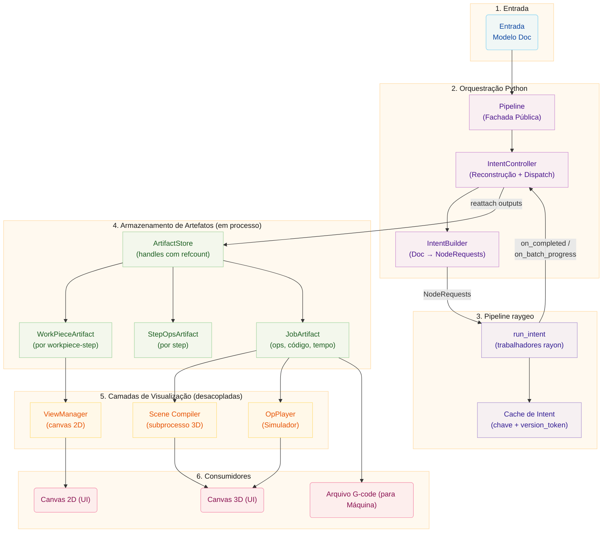

---
description:
  "O pipeline de intenções do Rayforge – como os designs passam do modelo Doc através de intenções
  raygeo para a geração de G-code."
---

# Arquitetura do Pipeline

Este documento descreve o pipeline que transforma um modelo `Doc` em G-code executável por máquina.
Desde a reescrita 1.9.0, o pipeline é construído sobre **intenções raygeo**: uma descrição
declarativa do trabalho que o lado Rust deve executar, acoplada a uma fina camada de orquestração
Python e um armazenamento de artefatos em processo com contagem de referências.

O anterior DAG multiprocesso (`DagScheduler`, `PipelineGraph`, `ArtifactManager`,
`GenerationContext`, `WorkPiecePipelineStage`) foi removido. Este documento descreve apenas a
arquitetura ativa.

```mermaid
graph TD
    subgraph Input["1. Entrada"]
        InputNode("Entrada<br/>Modelo Doc")
    end

    subgraph PythonOrchestrator["2. Orquestração Python"]
        Pipeline["Pipeline<br/>(Fachada Pública)"]
        IC["IntentController<br/>(Reconstrução + Dispatch)"]
        IB["IntentBuilder<br/>(Doc &rarr; NodeRequests)"]
    end

    subgraph Raygeo["3. Pipeline raygeo"]
        RI["run_intent<br/>(trabalhadores rayon)"]
        Cache["Cache de Intent<br/>(chave + version_token)"]
    end

    subgraph Artifacts["4. Armazenamento de Artefatos (em processo)"]
        Store["ArtifactStore<br/>(handles com refcount)"]
        WP["WorkPieceArtifact<br/>(por workpiece-step)"]
        SO["StepOpsArtifact<br/>(por step)"]
        JA["JobArtifact<br/>(ops, código, tempo)"]
    end

    subgraph View["5. Camadas de Visualização (desacopladas)"]
        VM["ViewManager<br/>(canvas 2D)"]
        SC["Scene Compiler<br/>(subprocesso 3D)"]
        OP["OpPlayer<br/>(Simulador)"]
    end

    subgraph Consumers["6. Consumidores"]
        Vis2D("Canvas 2D (UI)")
        Vis3D("Canvas 3D (UI)")
        File("Arquivo G-code (para Máquina)")
    end

    InputNode --> Pipeline
    Pipeline --> IC
    IC --> IB
    IB -->|"NodeRequests"| RI
    RI -->|"on_completed /<br/>on_batch_progress"| IC
    RI --> Cache
    IC -->|"reattach outputs"| Store
    Store --> WP
    Store --> SO
    Store --> JA

    WP --> VM
    JA --> SC
    JA --> OP
    JA --> File

    VM --> Vis2D
    SC --> Vis3D
    OP --> Vis3D

    classDef clusterBox fill:#fff3e080,stroke:#ffb74d80,stroke-width:1px,color:#1a1a1a
    classDef inputNode fill:#e1f5fe80,stroke:#03a9f480,color:#0d47a1
    classDef pyNode fill:#f3e5f580,stroke:#9c27b080,color:#4a148c
    classDef raygeoNode fill:#ede7f680,stroke:#5e35b180,color:#311b92
    classDef artifactNode fill:#e8f5e980,stroke:#4caf5080,color:#1b5e20
    classDef viewNode fill:#fff8e180,stroke:#ffc10780,color:#e65100
    classDef consumerNode fill:#fce4ec80,stroke:#e91e6380,color:#880e4f
    class Input,PythonOrchestrator,Raygeo,Artifacts,View,Consumers clusterBox
    class InputNode inputNode
    class Pipeline,IC,IB pyNode
    class RI,Cache raygeoNode
    class Store,WP,SO,JA artifactNode
    class VM,SC,OP viewNode
    class Vis2D,Vis3D,File consumerNode
```

# Conceitos Principais

## Pipeline (Fachada Pública)

`rayforge/pipeline/pipeline.py:40` — a classe com a qual o resto da aplicação se comunica.
`DocEditor`, `ViewManager`, widgets de UI e código de teste devem depender apenas de `Pipeline`.
`IntentController` e `IntentBuilder` são detalhes de implementação da fachada e podem mudar sem
aviso prévio.

`Pipeline` possui a integração com `ArtifactStore`: traduz as saídas cruas do raygeo emitidas por
seu `IntentController` interno em handles de artefatos com contagem de referências que a UI e os
caminhos de exportação consomem, e expõe a superfície de sinais/propriedades que o resto da
aplicação espera (estado ocupado, pausa/retomar, recálculo, mudanças de máquina).

Sinais chave retransmitidos pela fachada:

| Sinal                      | Significado                                                          |
| -------------------------- | -------------------------------------------------------------------- |
| `processing_state_changed` | Transições ocupado/inativo                                           |
| `workpiece_artifact_ready` | Um handle de `WorkPieceArtifact` foi publicado                       |
| `job_generation_finished`  | Um handle de `JobArtifact` (G-code + ops + estimativas) pronto       |
| `job_time_updated`         | Estimativa de tempo agregada alterada durante um rebuild             |
| `data_stale`               | Reconstrução solicitada mas pausada ou modo manual                   |
| `visual_chunk_available`   | Fragmento de raster progressivo para atualizações incrementais de UI |

## IntentController

`rayforge/pipeline/intent_controller.py:108` — possui uma `Intent` do raygeo e o ciclo de vida de
reconstrução ao redor. Ele escuta os mesmos sinais de Doc que o pipeline legado usava
(`descendant_updated`, `descendant_transform_changed`, `descendant_added`, `descendant_removed`,
`job_assembly_invalidated`) e reconstrói uma `Intent` raygeo sempre que o documento muda.

Em cada reconstrução com debounce (200 ms `REBUILD_DEBOUNCE_MS`):

1. `IntentBuilder` é chamado para produzir uma lista fresca de objetos `NodeRequest` a partir do
   `Doc` atual.
2. A nova lista é encapsulada em uma `Intent` raygeo via `create_intent_from_nodes`.
3. `Intent.update` compara a intenção anterior com a nova usando o `version_token` por nó e remove
   entradas de cache obsoletas na `Pipeline` raygeo compartilhada.
4. Quando `dispatch=True`, a nova intenção também é executada via `run_intent`; o callback
   `on_completed` realiza o filtro de época (descarta resultados cujo `generation_id` seja anterior
   à geração atual do controlador) e então marshalla um reattachment do DOM de volta à thread
   principal da aplicação através do gerenciador de tarefas compartilhado.
5. O callback `on_batch_progress` retransmite o progresso agregado aos ouvintes via
   `progress_changed` (marshalled para a thread principal para que os manipuladores de sinais nunca
   executem em um trabalhador rayon).

O mapa `_key_to_item` do controlador (reconstruído a cada chamada bem- sucedida a
`IntentBuilder.build`) permite que o callback `on_completed` com filtro de época reassocie as saídas
ao `WorkPiece` ou `Step` original sem percorrer novamente o Doc. As chaves de nó são despachadas por
forma:

| Chave de nó                     | Reassociado a              | Sinal emitido              |
| ------------------------------- | -------------------------- | -------------------------- |
| `workpiece:{wp_uid}:{step_uid}` | O `WorkPiece` proprietário | `workpiece_artifact_ready` |
| `step:{step_uid}`               | O `Step` proprietário      | `step_artifact_ready`      |
| `job`                           | O `Doc`                    | `job_aggregate_ready`      |
| `job:encode`                    | O `Doc`                    | `job_generation_finished`  |

## IntentBuilder

`rayforge/pipeline/intent_builder.py:133` — percorre um `Doc` e produz uma lista plana de objetos
`NodeRequest` com **chaves estáveis** e **tokens de versão determinísticos**. O builder não tem
estado: cada chamada a `build` produz uma lista fresca e autocontida adequada para encapsular em uma
`Intent` raygeo.

### Chaves Estáveis

- `workpiece:{wp_uid}:{step_uid}` — um nó de computação por par workpiece/step.
- `step:{step_uid}` — um nó agregado por step que concatena as saídas de computação dos workpieces e
  aplica transformers por step.
- `job` — um nó agregado final ligando todas as saídas dos steps com marcadores de nível de job e
  parâmetros de máquina.
- `job:machinexform` — nó de computação de transformação de máquina que consome as ops em espaço
  mundial do agregado de job e produz ops em espaço de máquina (linearização de curvas, mapeamento
  de eixo rotatório, mundo&rarr;máquina, offsets WCS, Z-flip, AXIS_REPLACEMENT).
- `job:encode` — nó de computação de codificador que consome as ops do nó de transformação de
  máquina e produz o código de máquina (G-code / vértice / textura).

Os formatos de chave estão centralizados em `intent_builder.py` para que o produtor e o mapa de
reattachment do `IntentController` sempre concordem.

### Tokens de Versão

O cache do raygeo é indexado apenas por chave de nó; o `version_token` é o único sinal de
invalidação. Tokens são resumos SHA-1 de uma representação canônica das entradas que afetam a saída
de um nó (ver `_hash_int`, `intent_builder.py:1066`):

- **Tokens de computação** hasheiam
  `(geometry_revision, wp_size, step_params, assembler_params, per_workpiece_transformers)`. Para
  escopos de step que declaram um transformer sensível à posição (ver `Step.is_position_sensitive`),
  `transform_revision` do workpiece e a revisão de stock são incluídas no token; caso contrário, são
  omitidas para que movimentos puros não invalidem resultados de computação do workpiece.
- **Tokens de agregado de step** hasheiam
  `(upstream compute tokens, placements, step_params, per_step/per_workpiece transformers, position_sensitive())`,
  mais `stock_rev` quando o step é sensível à posição.
- **Token de job** incorpora todos os tokens de agregado por step para que qualquer mudança upstream
  (movimento de workpiece, edição de transformer, alteração de parâmetro de step) se propague até o
  cache de job/encode.
- **Token de transformação de máquina** incorpora o token de job mais a identidade da máquina
  (`supports_curves`, `reverse_z_axis`, configuração WCS, configuração de módulo rotatório por
  camada).
- **Token de encode** incorpora o token de transformação de máquina mais a identidade do codificador
  (`driver_name`, `gcode_precision`, extensões de eixos, ...).

### Construção de Estágios

Cada `NodeRequest` carrega uma `StageSpec` descrevendo o trabalho que o raygeo deve realizar para
aquele nó. O builder produz:

- `StageSpec.Compute` para cada par workpiece/step via
  `Step.build_compute_payload(machine_defaults, workpiece)`, que retorna um `Part` (geometria
  vetorial ou fonte de imagem) mais um `ComputePayload` (especificação de montador). Os transformers
  por workpiece (`OverscanTransformer`, `BidirScanOffsetTransformer`, ...) são resolvidos via
  `transformer_registry` em pyclasses Rust tipadas `*Spec` e anexados ao payload para que o estágio
  de computação Rust os aplique após a montagem.
- `StageSpec.Aggregate` para cada step: um `AggregateGroup` por nó de computação de workpiece
  upstream, envolto por marcadores `WorkpieceStart`/`WorkpieceEnd`, com cada entrada carregando a
  matriz de colocação mundial e o tamanho físico do workpiece como `target_dimensions`. Transformers
  por step (`MultiPassTransformer`, `Optimize`, ...) são anexados a `AggregateSpec.transformers`
  para que o estágio de agregação Rust os aplique após a concatenação. `MachineParams` é populado a
  partir da máquina resolvida para que a estimativa de tempo do agregado seja correta.
- `StageSpec.Aggregate` para o nó `job`: um `AggregateGroup` por camada envolto por marcadores
  `LayerStart`/`LayerEnd`, cada um contendo um `AggregateInput` por step visível; todo o agregado é
  envolto por `JobStart`/`JobEnd`.
- `MachineTransformSpec` para `job:machinexform`: a matriz 4&times;4 mundo&rarr;máquina, offsets WCS
  padrão e por camada, entradas `RotaryMappingSpec` por camada, sinalizador de linearização de
  curvas e sinalizador Z-reverse, empacotados em uma especificação serializável que o estágio Rust
  `MachineTransformCompute` consome.
- `EncodeSpec` para `job:encode`: roteia máquinas Grbl para o `GcodeSpec` Rust nativo (compilado
  diretamente em uma thread rayon sem cruzar o GIL) e qualquer outra máquina para um `PythonEncoder`
  encapsulando o callable de codificador específico do driver. O codificador lê ops em espaço de
  máquina do nó upstream `job:machinexform`.

### Resolução de Stock

`_resolve_stock_geometries` (chamada uma vez por `build` e cacheada no builder) retorna as
geometrias de limite de stock em espaço mundial que transformers como `CropTransformer` usam para
recortar ops por workpiece na área de trabalho da máquina ou em `StockItem`s explícitos. Entradas
`StockItem` pertencentes ao Doc têm prioridade; o retângulo da área de trabalho da máquina é usado
como fallback apenas quando não existe stock no Doc.

## Pipeline raygeo & `run_intent`

A `Pipeline` do raygeo (`raygeo.pipeline.execute.Pipeline`) possui o cache que `Intent.update`
invalida. `run_intent` agenda os nós da intenção em threads trabalhadores rayon sob o GIL e invoca o
callback `on_completed` por nó e `on_batch_progress` para progresso agregado. Trabalho pesado
(computação, raster, agregação, transformações de máquina, codificação) executa em threads raygeo em
vez de subprocessos, que é a mudança principal destacada no CHANGELOG 1.9.0.

## ArtifactStore & Handles de Artefatos

O antigo `ArtifactStore` de memória compartilhada foi substituído por um armazenamento em processo
com contagem de referências (`rayforge/pipeline/artifact/store.py:29`). Todos os artefatos vivem
como objetos Python simples em um dicionário indexado por UUID; handles carregam o UUID em seu campo
`key` mais quaisquer metadados que o tipo de artefato necessite. O ciclo de vida é gerenciado por
contagem de referências via `ArtifactStore.retain`/`release`.

A fachada `Pipeline` traduz as saídas raygeo em handles de artefatos na thread principal:

| Saída (raygeo)           | Artefato            | Armazenado sob tag |
| ------------------------ | ------------------- | ------------------ |
| Ops por workpiece-step   | `WorkPieceArtifact` | `wp`               |
| Ops agregadas por step   | `StepOpsArtifact`   | `step`             |
| Agregado de job + encode | `JobArtifact`       | `job`              |

`JobArtifact` carrega as `Ops` em espaço mundial, distância total, estimativa de tempo, o
`EncodedOutput` (texto mais mapa op&rarr;código de máquina) e — quando módulos rotatórios estão
configurados — ops mapeadas cinematicamente para a pré-visualização 3D.

## IDs de Geração & Filtro de Época

Cada reconstrução incrementa `IntentController.generation_id`. Cada nó completado carrega a geração
da qual foi criado. O callback `on_completed` compara o `generation_id` do nó com a geração atual do
controlador e descarta silenciosamente resultados obsoletos, para que saídas antigas de uma
reconstrução anterior nunca sejam reassociadas ao DOM.

## Pausa, Retomar & Modo Manual

- `Pipeline.pause()`/`resume()` incrementa/decrementa um contador de pausa no controlador. Enquanto
  pausado, mudanças no Doc definem uma bandeira `data_stale` (e emitem `data_stale`) em vez de
  agendar uma reconstrução; ao retomar, a bandeira é limpa e uma reconstrução é agendada se
  `auto_rebuild` estiver habilitado.
- `Pipeline.auto_pipeline=False` (modo manual): o recálculo é acionado explicitamente via
  `Pipeline.recalculate()` em vez de automaticamente a cada mudança no Doc.

## Estratégia de Invalidação

A invalidação é implícita e orientada a tokens: qualquer mudança que afete as entradas de um nó faz
o builder produzir um `version_token` diferente para a chave daquele nó. `Intent.update` remove a
entrada de cache obsoleta e o raygeo reexecuta apenas aquele nó (e seus consumidores downstream).

| Tipo de Mudança                          | Efeito nos Tokens                                                                                                                                                                                          |
| ---------------------------------------- | ---------------------------------------------------------------------------------------------------------------------------------------------------------------------------------------------------------- |
| Geometria / parâmetros                   | Novos tokens de computação de workpiece cascateiam para step, job, machinexform, encode                                                                                                                    |
| Posição / rotação                        | Tokens de computação de workpiece inalterados a menos que o step seja sensível à posição; tokens de agregado de step sempre mudam devido a posicionamentos incorporados, o que cascateia para job/encode   |
| Mudança de tamanho                       | Igual à geometria: tokens cascateiam dos pares workpiece-step para cima                                                                                                                                    |
| Stock items visíveis/movidos/adicionados | Afeta `stock_rev` (incorporado nos tokens de computação e agregado de steps sensíveis à posição)                                                                                                           |
| Configuração de máquina                  | Todos os tokens `job:machinexform` e `job:encode` mudam; tokens de computação/agregado de step mudam se `kerf_mm`/`cut_speed`/cabeçalho laser/tolerância de arco/`supports_curves`/`supports_arcs` mudarem |

# Detalhamento

## Entrada

O processo começa com o **Modelo Doc**, que contém:

- **WorkPieces:** Elementos de design individuais (SVGs, imagens) colocados no canvas
- **Steps:** Instruções de processamento (Contorno, Raster, etc.) com configurações, organizadas em
  um `Workflow` por camada
- **Layers:** Agrupamento de workpieces, cada um com seu próprio workflow, WCS e configuração
  rotatória
- **StockItems:** Limites de stock explícitos opcionais usados por transformers sensíveis à posição
  (ex. CropTransformer)

## Orquestração Python

### Pipeline (Fachada)

A classe `Pipeline`:

- Escuta mudanças no modelo Doc através de sinais (retransmitidos através do `IntentController`)
- **Debounceia** mudanças (atraso de reconciliação de 200 ms)
- Coordena com o `IntentController` para acionar a regeneração
- Gerencia o estado geral de processamento e a detecção de ocupado
- Suporta **pausa/retomar** para operações em lote
- Suporta **modo manual** (`auto_pipeline=False`) onde o recálculo é acionado explicitamente
- Conecta sinais entre componentes e os retransmite aos consumidores
- Publica handles de artefatos com contagem de referências no `ArtifactStore`

### IntentController

O `IntentController`:

- Possui uma `Intent` raygeo e o ciclo de vida de reconstrução
- Reconstrói uma intenção fresca a cada mudança de Doc com debounce
- Executa a intenção via `run_intent` quando `dispatch=True`
- Filtra resultados obsoletos por `generation_id` (filtro de época)
- Marshalla reattachments do DOM para a thread principal através do gerenciador de tarefas
  compartilhado

### IntentBuilder

O `IntentBuilder` não tem estado; cada chamada a `build` percorre o `Doc` e produz um `NodeRequest`
por par workpiece/step, um agregado por step, e os nós `job`, `job:machinexform` e `job:encode`.
Veja [Chaves Estáveis](#chaves-estáveis), [Tokens de Versão](#tokens-de-versão) e
[Construção de Estágios](#construção-de-estágios) acima.

## Pipeline raygeo

`run_intent` agenda a execução de nós em threads trabalhadores rayon sob o GIL. A instância
compartilhada `RaygeoPipeline` mantém o cache de nós indexado por chave de nó; `Intent.update` é o
único ponto de entrada de invalidação. Computação, raster, shrinkwrap, wavefront, contorno,
renderização de visualização e transformação/codificação de máquina executam todos em threads
raygeo.

## Geração de Artefatos

### WorkPieceArtifacts

Gerados para cada combinação `(WorkPiece, Step)`. Contém:

- Toolpaths (`Ops`) no sistema de coordenadas local do workpiece
- Bandeira de escalabilidade e dimensões de origem para ops independentes de resolução
- ID de geração

Workpieces de raster grandes são processados incrementalmente em fragmentos (retransmitidos via
`visual_chunk_available`), permitindo feedback visual progressivo durante a geração.

### StepOpsArtifacts

Gerados para cada Step, consumindo todos os WorkPieceArtifacts relacionados:

- `Ops` combinados para todos os workpieces em coordenadas de espaço mundial
- Transformers por step aplicados (`Optimize`, `MultiPass`, ...)

### JobArtifact

Gerado quando G-code é necessário, consumindo o agregado `job` e o nó `job:encode`:

- Código de máquina final (G-code ou formato específico do driver) via `EncodedOutput` (texto + mapa
  op&rarr;código de máquina)
- `Ops` em espaço mundial para simulação e reprodução
- Estimativa de tempo de alta fidelidade e distância total
- Ops mapeadas rotatoriamente para pré-visualização 3D quando módulos rotatórios estão configurados

## Camada de Visualização 2D (Desacoplada)

O `ViewManager` está desacoplado do pipeline de dados. Ele gerencia a renderização para o canvas 2D
baseado no estado da UI.

### RenderContext

Contém os parâmetros de visualização atuais (pixels por milímetro, offset do viewport, opções de
exibição).

### WorkPieceViewArtifacts

O `ViewManager` cria `WorkPieceViewArtifacts` que rasterizam `WorkPieceArtifacts` para o espaço de
tela, aplicam o `RenderContext` atual e são armazenados em cache e atualizados quando o contexto ou
a fonte mudam. A re-renderização é limitada (intervalo de 33 ms) e com limite de concorrência; a
junção progressiva de fragmentos fornece atualizações visuais incrementais. O `ViewManager` indexa
vistas por `(workpiece_uid, step_uid)` para suportar a visualização de estados intermediários de um
workpiece através de múltiplos steps.

## Camada 3D / Simulador (Desacoplada)

O sistema de visualização e simulação 3D está desacoplado do pipeline de dados, seguindo um padrão
similar ao `ViewManager`. Consiste em:

- Um **Scene Compiler** que executa em um subprocesso para converter ops `JobArtifact` em dados de
  vértice prontos para GPU
- Um **OpPlayer** que reproduz as ops do job para simulação de máquina em tempo real com controles
  de reprodução

Ambos consomem o `JobArtifact` produzido pelo pipeline.

### CompiledSceneArtifact

O Scene Compiler produz um `CompiledSceneArtifact` contendo:

- **Camadas de vértice:** Buffers de vértice powered/travel/zero-power com offsets por comando para
  revelação progressiva
- **Camadas de textura:** Mapas de potência de linhas de varredura rasterizados para
  pré-visualização de gravação
- **Camadas de sobreposição:** Segmentos de potência de linhas de varredura para destaque em tempo
  real
- Suporte para geometria rotatória (envolta em cilindro)

### Pipeline de Compilação

1. Canvas3D escuta sinais `job_generation_finished`
2. Quando um novo job está pronto, ele agenda a compilação de cena em um subprocesso
3. O subprocesso lê o `JobArtifact` do armazenamento e compila as ops em dados de vértice para GPU
4. A cena compilada é adotada de volta e enviada para os renderizadores GPU

### OpPlayer (Backend do Simulador)

O `OpPlayer` percorre as ops do job comando por comando, mantendo um `MachineState` que rastreia
posição, estado do laser e eixos auxiliares. Isso impulsiona a reprodução do canvas 3D (revelação
progressiva do toolpath), a visualização da posição da cabeça da máquina e do feixe de laser, e o
avanço por comando para o controle deslizante de reprodução.

## Consumidores

| Consumidor | Usa                          | Propósito                                     |
| ---------- | ---------------------------- | --------------------------------------------- |
| Canvas 2D  | WorkPieceViewArtifacts       | Renderiza workpieces no espaço da tela        |
| Canvas 3D  | CompiledSceneArtifact        | Renderiza o job completo em 3D com reprodução |
| Máquina    | JobArtifact (código máquina) | Saída de fabricação                           |

# Decisões Arquiteturais Chave

1. **Agendamento Baseado em Intenções:** Em vez de um DAG Python explícito com agendadores
   residentes em Python, o pipeline declara _o que_ computar (uma `Intent` de `NodeRequest`s com
   chaves estáveis e tokens de versão) e deixa `run_intent` do raygeo agendar o trabalho em threads
   rayon. A invalidação de cache é puramente orientada a tokens via `Intent.update`.

2. **Fachada + Controlador Interno:** `Pipeline` é a única superfície pública; `IntentController` e
   `IntentBuilder` são detalhes de implementação. Isso mantém o contrato público de
   sinais/propriedades estável enquanto permite que os detalhes internos de orquestração evoluam.

3. **Armazenamento de Artefatos em Processo:** Substituir o armazenamento de memória compartilhada
   multiprocesso por um dicionário em processo com contagem de referências remove a complexidade de
   IPC e transferência de propriedade, mantendo o contrato de handle/ciclo de vida do qual a UI e os
   caminhos de exportação dependem.

4. **IDs de Geração:** Cada reconstrução incrementa um ID de geração; cada nó completado carrega sua
   geração de origem. O filtro de época de `on_completed` descarta silenciosamente resultados
   obsoletos, para que saídas antigas nunca sejam reassociadas ao DOM.

5. **Reattachment na Thread Principal:** Os callbacks raygeo (`on_completed`, `on_batch_progress`)
   disparam em threads trabalhadores rayon sob o GIL; o controlador marshalla cada callback que toca
   o DOM para a thread principal da aplicação através do gerenciador de tarefas compartilhado, para
   que os manipuladores de sinais nunca executem em um trabalhador.

6. **Separação das Camadas de Visualização:** Tanto o canvas 2D (`ViewManager`) quanto o canvas 3D
   (Scene Compiler / OpPlayer) estão desacoplados do pipeline de dados. Cada um é orientado por
   sinais do pipeline em vez de fazer parte da intenção.

7. **Invalidação Orientada a Tokens:** Não há uma tabela de invalidação explícita. O builder produz
   tokens de versão SHA-1 canônicos; qualquer mudança de entrada produz um token diferente, que
   `Intent.update` usa para remover exatamente as entradas de cache afetadas.

8. **Reconciliação com Debounce:** Mudanças no Doc são agrupadas com um debounce de 200 ms
   (`REBUILD_DEBOUNCE_MS`) para evitar ciclos excessivos de pipeline durante edições rápidas.
