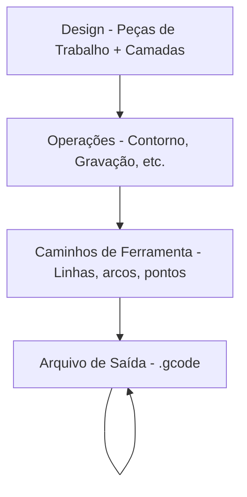

# Noções Básicas de G-code

Entender G-code ajuda a solucionar problemas e personalizar a saída do Rayforge.

## Processo de Alto Nível

O Rayforge converte seus designs em G-code através de um processo de múltiplas etapas:



**O que o Rayforge faz:**

1. **Analisa seu design** - Extrai geometria das peças de trabalho
2. **Aplica operações** - Determina caminhos de corte/gravação
3. **Otimiza caminhos de ferramenta** - Reordena caminhos, minimiza deslocamento
4. **Gera comandos** - Converte caminhos em G-code
5. **Injeta hooks** - Adiciona macros definidas pelo usuário nos pontos especificados
6. **Escreve arquivo** - Produz G-code completo pronto para a máquina

## Exemplo Simples

Aqui está uma estrutura básica de arquivo G-code mostrando um corte quadrado:

```gcode
G21 ;Define unidades para mm
G90 ;Posicionamento absoluto
G54
T0
G0 X95.049 Y104.951 Z0.000
M4 S500
G1 X104.951 Y104.951 Z0.000 F3000
G1 X104.951 Y95.049 Z0.000 F3000
G1 X95.049 Y95.049 Z0.000 F3000
G1 X95.049 Y104.951 Z0.000 F3000
M5
G0 X95.000 Y105.000 Z0.000
M4 S500
G1 X95.000 Y95.000 Z0.000 F3000
G1 X105.000 Y95.000 Z0.000 F3000
G1 X105.000 Y105.000 Z0.000 F3000
G1 X95.000 Y105.000 Z0.000 F3000
M5
M5 ;Garante que o laser está desligado
G0 X0 Y0 ;Retorna à origem
```

**Comandos principais:**

| Comando | Descrição |
| ------- | ----------- |
| `G21` | Modo milímetros |
| `G90` | Posicionamento absoluto |
| `G54` | Seleciona sistema de coordenadas de trabalho 1 |
| `T0` | Seleciona ferramenta 0 (cabeça do laser) |
| `G0` | Movimento rápido (laser desligado) |
| `G1` | Movimento de corte (laser ligado) |
| `M4` | Laser ligado (modo de potência dinâmica) |
| `M5` | Laser desligado |
| `S500` | Define potência do laser para 500 (50% para intervalo 0-1000) |
| `F3000` | Define taxa de avanço para 3000 mm/min |

---

## Páginas Relacionadas

- [Dialeto G-code](../reference/gcode-dialects) - Diferenças de firmware
- [Exportando G-code](../files/exporting) - Configurações e opções de exportação
- [Hooks & Macros](../machine/hooks-macros) - Injeção de G-code personalizado
