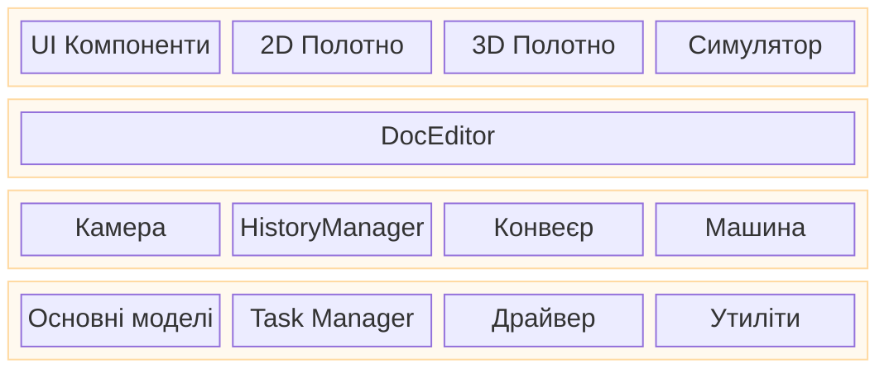

# Архітектура Rayforge

Цей документ надає високорівневий огляд архітектури Rayforge,
пояснюючи, як основні компоненти пов'язані між собою. Для глибокого вивчення
конкретних областей, будь ласка, звертайтеся до пов'язаних документів.

## Зміст

- [Багатошарова архітектура додатку](#багатошарова-архітектура-додатку)
- [Архітектура коду](#архітектура-коду)
- [Архітектура моделі документа](#архітектура-моделі-документа)
- [Архітектура конвеєра](#архітектура-конвеєра)

---

## Багатошарова архітектура додатку

Додаток структурований у логічні шари, розділяючи користувацький
інтерфейс, логіку додатку та основні сервіси. Це сприяє чистому
розділенню відповідальності та уточнює потік керування

- **Шар UI (Вигляд)**: Містить всі елементи, орієнтовані на користувача. `Workbench` -
  основна область полотна, яка містить 2D та 3D вигляди.
- **Шар редактора/контролера**: `DocEditor` діє як центральний
  контролер, реагуючи на події UI та маніпулюючи основними моделями.
- **Шар ядра / сервісів**: Надає фундаментальні сервіси та стан.
  `Core Models` представляють документ, `Tasker` керує фоновими завданнями,
  `Machine` обробляє комунікацію з пристроєм, а `Camera` керує видовими портами.

---

## Архітектура коду

Rayforge - це GTK4/Libadwaita додаток з модульною, конвеєрною
архітектурою.

- **`rayforge/core/`**: Модель документа та обробка геометрії.
- **`rayforge/pipeline/`**: Основний обробний конвеєр для генерації
  машинних операцій з моделі документа.
- **`rayforge/machine/`**: Шар інтерфейсу обладнання, включаючи драйвери
  пристроїв, транспортні протоколи та моделі машин.
- **`rayforge/doceditor/`**: Головний контролер редактора документа та його UI.
- **`rayforge/workbench/`**: 2D/3D полотно та системи візуалізації.
- **`rayforge/image/`**: Імпортери для різних форматів файлів (SVG, DXF тощо.).
- **`rayforge/shared/`**: Загальні утиліти, включаючи `tasker` для
  керування фоновими завданнями.

---

## Архітектура моделі документа

Модель документа - це ієрархічне дерево об'єктів, засноване на
**Патерні Composite**. Ця структура представляє весь проект користувача,
від кореневого об'єкта `Doc` до окремих `WorkPiece`. Вона розроблена щоб бути
реактивною та серіалізованою.

**[Див. Архітектура моделі документа для деталей](./docmodel.md)**

---

## Архітектура конвеєра

Конвеєр конвертує модель документа в машинний G-code. Він
працює асинхронно у фоні та використовує систему `Artifact`
з спільною пам'яттю для високоефективної передачі даних між процесами. Конвеєр
складається зі стадій: **Модифікатори → Продюсери → Трансформери → Енкодери**.

**[Див. Архітектуру конвеєра для деталей](./pipeline.md)**
