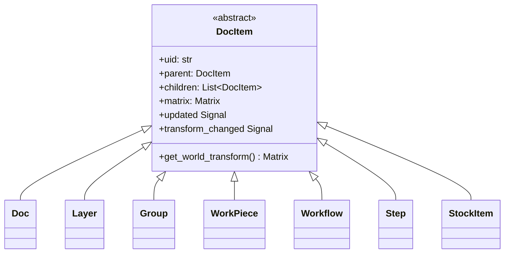
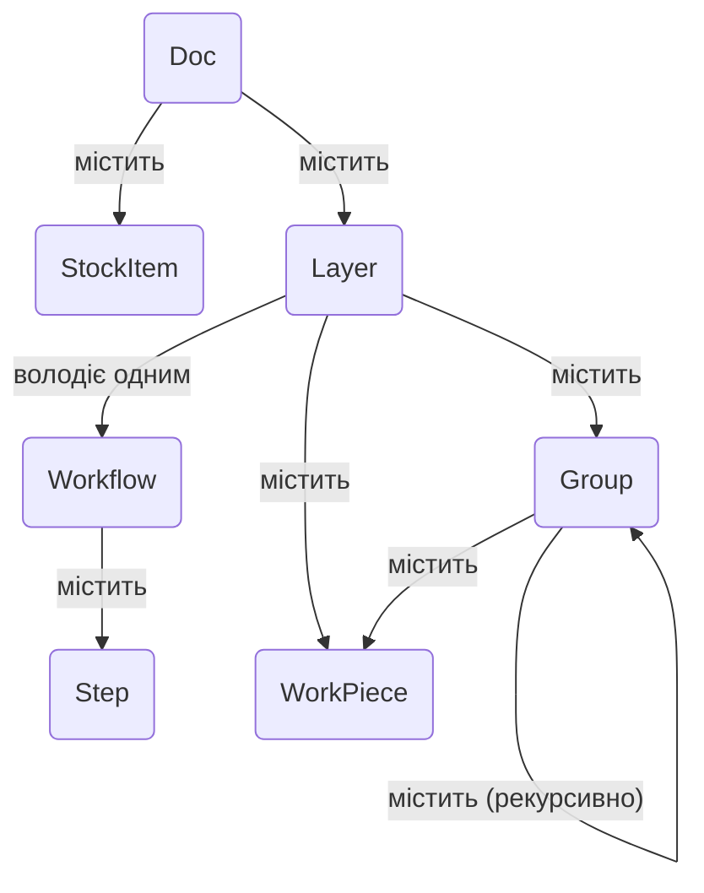

# Архітектура моделі документа

Модель документа - це хребет додатку, що представляє
весь проект користувача як ієрархічне дерево об'єктів. Вона розроблена щоб бути
реактивною, серіалізованою та легко прохідною.

## Огляд

Архітектура побудована на **Патерні Composite**. Один
абстрактний базовий клас, `DocItem`, визначає загальний інтерфейс для всіх
об'єктів, які можуть існувати в дереві документа (наприклад, шари, деталі,
групи). Це дозволяє складним, вкладеним структурам оброблятися однорідно.

Ключові принципи моделі включають:

- **Структура дерева:** Об'єкт `Doc` служить коренем дерева. Кожен
  елемент (окрім кореня) має одного `parent` і може мати кілька
  `children`.
- **Реактивність:** Модель використовує систему сигналів/слотів (`blinker`). Коли
  елемент змінюється, він видає сигнал. Батьківські елементи слухають сигнали своїх
  нащадків і "піднімають їх вгору" по дереву. Це дозволяє
  високорівневим компонентам, як `Pipeline`, слухати будь-яку
  зміну в документі, підключаючись до одного сигналу на кореневому
  об'єкті `Doc`. Система відстежує як зміни вмісту, так і зміни
  трансформації окремо для ефективних оновлень.
- **Ієрархія трансформацій:** Кожен `DocItem` має локальну трансформацію
  `Matrix`. Кінцева позиція, масштаб та обертання елемента у "світі"
  (головне полотно) є добутком його власної локальної матриці та
  світових матриць всіх його предків.
- **Роз'єднання даних:** Візуальні або сирі дані для `WorkPiece` не
  зберігаються безпосередньо в ньому. Замість цього `WorkPiece` містить UID, що
  посилається на об'єкт `ImportSource` у центральному реєстрі на `Doc`.
  Це роз'єднує структуру документа від керування даними,
  роблячи модель більш легкою та гнучкою.

---

## Успадкування класів

Ця діаграма показує ієрархію класів. Кожен об'єкт, що є частиною
просторового дерева документа, успадковується від абстрактного базового класу `DocItem`,
отримуючи основні функціональності як батьківство, трансформації та спливання
сигналів.

- **`DocItem`**: Абстрактний фундамент, що забезпечує реалізацію
  патерну composite.
- Всі інші класи є конкретними реалізаціями `DocItem`, кожен з
  спеціалізованою роллю в структурі документа.

---

## Композиція об'єктів

Ця діаграма ілюструє, як екземпляри класів збираються щоб сформувати
повний документ. Вона показує батьківсько-дочірні відносини та
посилання між об'єктами.

- `Doc` - це об'єкт верхнього рівня. Він **містить** один або кілька `Layer` та
  `StockItem`. Він також **керує** реєстром всіх `ImportSource` у
  проекті.
- Кожен `Layer` **містить** контент користувача: `WorkPiece` та `Group`.
  Важливо, `Layer` також **володіє одним** `Workflow`.
- `Workflow` **містить** впорядкований список `Step`, які визначають
  виробничий процес для цього шару.
- `Group` - це контейнер, який може містити `WorkPiece` та інші `Group`,
  дозволяючи вкладені трансформації.
- `WorkPiece` - це фундаментальний елемент дизайну. Він не зберігає свої
  сирі дані безпосередньо. Замість цього він **посилається** на `ImportSource` через
  UID. Він також **має** власну `Geometry` (векторні дані) і може мати
  список `Tab`.

---

## Описи DocItem

- **`DocItem` (Абстрактний)**

  - **Роль:** Абстрактна база для всіх вузлів дерева.
  - **Ключові властивості:** `uid`, `parent`, `children`, `matrix`, `updated`
    сигнал, `transform_changed` сигнал. Надає основну логіку
    патерну composite.

- **`Doc`**

  - **Роль:** Корінь дерева документа.
  - **Ключові властивості:** `children` (Layers, StockItems), `import_sources`
    (словник, що відображає UID на об'єкти `ImportSource`), `active_layer`.

- **`Layer`**

  - **Роль:** Первинна організаційна одиниця для контенту. Шар
    асоціює групу деталей з одним виробничим
    робочим процесом.
  - **Ключові властивості:** `children` (WorkPieces, Groups, one Workflow),
    `visible`, `stock_item_uid`.

- **`Group`**

  - **Роль:** Контейнер для інших `DocItem` (`WorkPiece`, `Group`).
    Дозволяє колекції елементів трансформуватися як єдине ціле.

- **`WorkPiece`**

  - **Роль:** Представляє окремий, матеріальний елемент дизайну на полотні
    (наприклад, імпортований SVG).
  - **Ключові властивості:** `vectors` (об'єкт `Geometry`),
    `import_source_uid`,
    `tabs`, `tabs_enabled`. Його `vectors` нормалізовані до блоку 1x1,
    з усім масштабуванням та позиціонуванням, що обробляється його матрицею
    трансформації.

- **`Workflow`**

  - **Роль:** Впорядкована послідовність інструкцій обробки. Належить
    `Layer`.
  - **Ключові властивості:** `children` (впорядкований список `Step`).

- **`Step`**

  - **Роль:** Окрема інструкція обробки в `Workflow` (наприклад,
    "Contour Cut" або "Raster Engrave"). Це об'єкт конфігурації,
    що містить словники, які визначають продюсер, модифікатори та
    трансформери для використання.

- **`StockItem`**
  - **Роль:** Представляє шматок фізичного матеріалу в документі,
    визначений власною векторною `geometry`. `Layer` можуть бути призначені до
    конкретного елемента заготовки.
