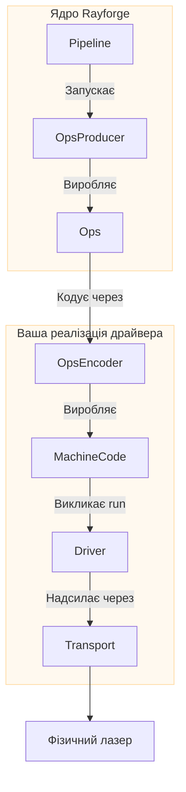

# Посібник з розробки драйверів

Цей посібник надає високорівневий огляд того, як створити драйвер у Rayforge
для додавання підтримки вашого лазерного різака або гравера. Створюючи драйвер, ви
інтегруєте унікальний протокол комунікації та мову команд вашої машини в
екосистему Rayforge.

## Огляд драйвера

Драйвер - це міст між основною логікою Rayforge та вашим фізичним обладнанням.
Він відповідає за три основні завдання:

1.  **Керування підключенням:** Обробка низькорівневого протоколу комунікації
    (Serial, WebSocket, HTTP тощо.).
2.  **Виконання завдань:** Надсилання попередньо закодованого машинного коду (наприклад, G-code) на
    пристрій та відстеження прогресу виконання.
3.  **Звітність про стан:** Емісія сигналів для оновлення UI реальною
    позицією лазера, статусом (`IDLE`, `RUN`) та лог-повідомленнями.

Щоб спростити це, Rayforge надає архітектуру на основі компонуемых частин:



- **`OpsEncoder`:** Перекладає `Ops` у специфічну мову команд
  (наприклад, G-code). Використовується як конвеєром (для кодування завдань), так і
  драйвером (для окремих команд як move_to, home тощо.).
- **`Pipeline`:** Оркеструє кодування та виробляє фінальний машинний код.
- **`Transport`:** Керує з'єднанням та передачею даних.
- **`Driver`:** Виконує машинний код, обробляє стан пристрою та комунікує
  з UI.

Всі операції драйвера є **асинхронними** щоб забезпечити відгуковість користувацького інтерфейсу.

## Мова `Ops`

Rayforge описує лазерне завдання як послідовність високорівневих операцій, збережених у
об'єкті `Ops`. Це універсальна мова в Rayforge для опису
машинних переміщень, незалежно від конкретного обладнання.

| Метод `Ops`         | Сигнатура                      | Опис                          |
| :------------------- | :----------------------------- | :----------------------------------- |
| `move_to`            | `(x, y, z=0.0)`                | Швидке переміщення (без різання)          |
| `line_to`            | `(x, y, z=0.0)`                | Переміщення різання/гравірування           |
| `arc_to`             | `(x, y, i, j, cw=True, z=0.0)` | Переміщення дуги різання/гравірування       |
| `set_power`          | `(power)`                      | Встановити потужність лазера (0-100%)             |
| `set_cut_speed`      | `(speed)`                      | Встановити швидкість для переміщень різання (мм/хв) |
| `set_travel_speed`   | `(speed)`                      | Встановити швидкість для швидких переміщень (мм/хв)   |
| `enable_air_assist`  | `()`                           | Увімкнути повітряний помічник                   |
| `disable_air_assist` | `()`                           | Вимкнути повітряний помічник                  |

Ваш драйвер отримує попередньо закодований машинний код (наприклад, рядок G-code) та
мапу операцій, яка відстежує, які команди машинного коду відповідають яким
операціям. Конвеєр обробляє кодування `Ops` у машинний код перед викликом
методу `run()` драйвера.

```python
# Приклад того, як Rayforge будує об'єкт Ops
ops = Ops()
ops.set_travel_speed(3000)
ops.set_cut_speed(800)
ops.set_power(80)

ops.move_to(10, 10)       # Швидке переміщення до стартової точки
ops.enable_air_assist()
ops.line_to(50, 10)       # Різати лінію з повітряним помічником
ops.disable_air_assist()
ops.line_to(50, 50)       # Різати лінію без повітряного помічника
```

## Реалізація драйвера

Всі драйвери ПОВИННІ успадковуватися від `rayforge.machine.drivers.Driver`.

```python
from rayforge.machine.driver.driver import Driver

class YourDriver(Driver):
    label = "Ваш пристрій"  # Відображуване ім'я в UI
    subtitle = "Опис для користувачів"
    supports_settings = False # Встановіть True якщо драйвер може читати/записувати налаштування прошивки
```

### Обов'язкові властивості

- `label`: Зрозуміла для людини назва, що показується в UI.
- `subtitle`: Короткий опис, що показується під назвою.
- `supports_settings`: Булеве значення, що вказує, чи може драйвер читати/записувати налаштування
  пристрою (як `$$` у GRBL).

### Обов'язкові методи

Ваш клас драйвера **ПОВИНЕН** реалізувати наступні методи. Зверніть увагу, що більшість є **асинхронними** і повинні бути визначені з `async def`.

#### Конфігурація та життєвий цикл

- `get_setup_vars() -> VarSet`: **(Метод класу)** Повертає об'єкт `VarSet`
  що визначає параметри, необхідні для з'єднання (наприклад, IP-адреса, послідовний порт).
  Rayforge використовує це для автоматичної генерації форми налаштування в UI.
- `precheck(**kwargs)`: **(Метод класу)** Неблокуюча, статична перевірка
  конфігурації, яка може бути виконана перед інстанціюванням драйвера. Має піднімати
  `DriverPrecheckError` при невдачі.
- `setup(**kwargs)`: Викликається один раз зі значеннями з форми налаштування. Використовуйте це
  для ініціалізації ваших транспортів та внутрішнього стану.
- `async def connect()`: Встановлює та підтримує постійне з'єднання з
  пристроєм. Цей метод має містити логіку автовідновлення з'єднання.
- `async def cleanup()`: Викликається при відключенні. Має закрити всі
  з'єднання та звільнити ресурси.

#### Керування пристроєм

- `async def run(machine_code: Any, op_map: MachineCodeOpMap, doc: Doc,
  on_command_done: Optional[Callable[[int], Union[None, Awaitable[None]]]]
  = None)`: Основний метод для виконання завдання. Отримує попередньо закодований машинний
  код (наприклад, рядок G-code) та відображення між індексами операцій та
  машинним кодом. Зворотний виклик `on_command_done` викликається з op_index
  коли кожна команда завершується.
- `async def home(axes: Optional[Axis] = None)`: Виконує homing машини. Може робити homing
  конкретні осі або всі осі.
- `async def move_to(pos_x: float, pos_y: float)`: Вручну переміщує лазерну
  головку у конкретну XY координату.
- `async def set_hold(hold: bool = True)`: Призупиняє або відновлює поточне завдання.
- `async def cancel()`: Зупиняє поточне завдання.
- `async def jog(axis: Axis, distance: float, speed: int)`: Виконує jog машини
  вздовж конкретної осі.
- `async def select_tool(tool_number: int)`: Вибирає новий інструмент/лазерну головку за
  її номером.
- `async def clear_alarm()`: Очищає будь-який активний стан аварії.

#### Налаштування прошивки (якщо `supports_settings` є `True`)

- `get_setting_vars() -> List[VarSet]`: Повертає об'єкти `VarSet`, що визначають
  структуру сторінки налаштувань пристрою.
- `async def read_settings()`: Зчитує всі налаштування з пристрою та викликає
  `_on_settings_read()` з результатом.
- `async def write_setting(key: str, value: Any)`: Записує одне налаштування на
  пристрій.

### Емісія сигналів

Для комунікації з UI ваш драйвер має видавати сигнали. Щоб забезпечити належне
логування та потокобезпечність, **ви не повинні видавати сигнали напряму.** Замість цього,
 Викликайте захищені допоміжні методи з базового класу `Driver`.

- `self._log(message)`: Надсилає лог-повідомлення до консолі.
- `self._on_state_changed()`: Викличте це щоразу, коли ви оновлюєте `self.state` щоб
  повідомити UI про зміну статусу або позиції.
- `self._on_connection_status_changed(status, message)`: Інформує UI про
  статус підключення (`CONNECTING`, `CONNECTED`, `ERROR` тощо.).
- `self._on_command_status_changed(status, message)`: Повідомляє статус
  надісланої команди.
- `self._on_settings_read(settings)`: Надсилає налаштування пристрою, які ви зчитали,
  назад до UI.

## Є питання?

Найкращий спосіб навчитися - подивитися на існуючі драйвери в
`rayforge/machine/driver/`, такі як:

- `grbl.py` - Машини на базі GRBL
- `grbl_serial.py` - Послідовна комунікація GRBL
- `smoothie.py` - Машини на базі Smoothieboard
- `dummy.py` - Тестовий драйвер для розробки

Якщо застрягли, будь ласка, не соромтеся відкрити issue на GitHub! Ми з радістю допоможемо.
