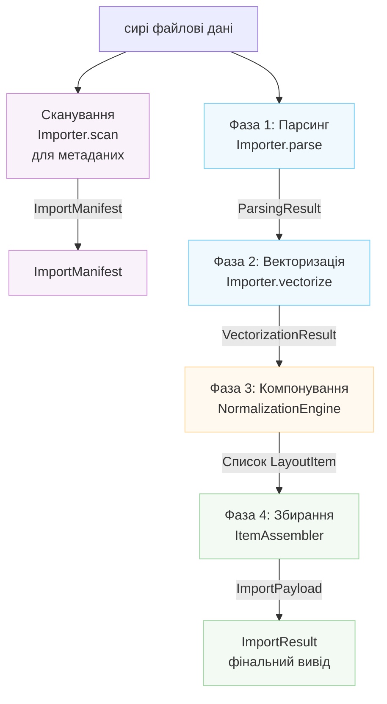

# Архітектура імпортера

Цей документ описує архітектуру системи імпорту файлів Rayforge,
яка обробляє конвертацію різних форматів файлів (SVG, DXF, PNG, PDF тощо.) в
модель документа Rayforge.

## Зміст

- [Огляд](#огляд)
- [Конвеєр імпорту](#конвеєр-імпорту)
- [Метод сканування](#метод-сканування)
- [Системи координат](#системи-координат)
- [Ключові класи](#ключові-класи)
- [Створення нового імпортера](#створення-нового-імпортера)

---

## Огляд

Система імпорту побудована навколо чотирифазного конвеєра, який трансформує сирі файлові
дані у повністю позиціоновані об'єкти документа. Кожна фаза має специфічну
відповідальність і виробляє чітко визначені структури даних.



---

## Конвеєр імпорту

### Фаза 1: Парсинг

**Метод:** `Importer.parse()`

Витягує геометричні факти з файлу, включаючи межі, деталі системи координат
та інформацію про шари.

**Вивід:** `ParsingResult`

- `document_bounds`: Загальний розмір полотна у Нативних координатах
- `native_unit_to_mm`: Коефіцієнт конвертації в міліметри
- `is_y_down`: Прапорець орієнтації осі Y
- `layers`: Список `LayerGeometry`
- `world_frame_of_reference`: Світові координати (мм, Y-Up)
- `background_world_transform`: Матриця для позиціонування фону
- `untrimmed_document_bounds`: Довідник для Y-інверсії

**Система координат:**

- `document_bounds`: Нативні координати (специфічні для файлу)
- `world_frame_of_reference`: Світові координати (мм, Y-Up)

---

### Фаза 2: Векторизація

**Метод:** `Importer.vectorize()`

Конвертує пропарсені дані у векторні об'єкти `Geometry` відповідно до
`VectorizationSpec`.

**Вивід:** `VectorizationResult`

- `geometries_by_layer`: Векторна геометрія на шар (Нативні координати)
- `source_parse_result`: Посилання на оригінальний ParsingResult
- `fills_by_layer`: Опціональна геометрія заливки (імпортер ескізів)

**Система координат:** Нативні координати (специфічні для файлу)

---

### Фаза 3: Компонування

**Клас:** `NormalizationEngine`

Розраховує матриці трансформації для відображення Нативних координат у Світові
координати на основі наміру користувача.

**Вивід:** `List[LayoutItem]`

Кожен `LayoutItem` містить:

- `world_matrix`: Нормалізована (0-1, Y-Up) → Світ (мм, Y-Up)
- `normalization_matrix`: Нативна → Нормалізована (0-1, Y-Up)
- `crop_window`: Підмножина оригінального файлу в Нативних координатах
- `layer_id`, `layer_name`: Ідентифікація шару

**Система координат:**

- Вхід: Нативні координати
- Вихід: Світові координати (мм, Y-Up) через проміжний Нормалізований простір

---

### Фаза 4: Збирання

**Клас:** `ItemAssembler`

Інстанціює доменні об'єкти Rayforge (`WorkPiece`, `Layer`) на основі
плану компонування.

**Вивід:** `ImportPayload`

- `source`: `SourceAsset`
- `items`: Список `DocItem` готовий для вставки
- `sketches`: Опціональний список об'єктів `Sketch`

**Система координат:** Всі DocItems у Світових координатах (мм, Y-Up)

---

## Метод сканування

**Метод:** `Importer.scan()`

Легковесне сканування, яке витягує метадані без повної обробки. Використовується для
побудови UI для імпортера, включаючи список вибору шарів.
Це НЕ є частиною основного конвеєра імпорту, що виконується `get_doc_items()`.

**Вивід:** `ImportManifest`

- `layers`: Список об'єктів `LayerInfo`
- `natural_size_mm`: Фізичні розміри в міліметрах (Y-Up)
- `title`: Опціональна назва документа
- `warnings`, `errors`: Некритичні виявлені проблеми

**Система координат:** Світові координати (мм, Y-Up) для `natural_size_mm`

---

## Системи координат

Конвеєр імпорту обробляє кілька систем координат через ретельну
трансформацію:

### Нативні координати (Вхід)

- Специфічна для файлу система координат (одиниці користувача SVG, одиниці DXF, пікселі)
- Орієнтація осі Y варіюється залежно від формату
- Межі є абсолютними в координатному просторі документа
- Одиниці конвертуються в мм через коефіцієнт `native_unit_to_mm`

### Нормалізовані координати (Проміжні)

- Одиничний квадрат від (0,0) до (1,1)
- Вісь Y вказує ВГОРУ (конвенція Y-Up)
- Використовується як проміжне представлення між нативним та світовим

### Світові координати (Вихід)

- Фізичні світові координати в міліметрах (мм)
- Вісь Y вказує ВГОРУ (конвенція Y-Up)
- Початок (0,0) знаходиться в нижньому лівому куті деталі
- Всі позиції є абсолютними в світовій системі координат

### Орієнтація осі Y

- **Формати Y-Down** (SVG, зображення): Початок у верхньому лівому куті, Y збільшується вниз
- **Формати Y-Up** (DXF): Початок у нижньому лівому куті, Y збільшується вгору
- Імпортери мають правильно встановлювати прапорець `is_y_down` у `ParsingResult`
- `NormalizationEngine` обробляє Y-інверсію для джерел Y-Down

---

## Ключові класи

### Importer (Базовий клас)

Абстрактний базовий клас, що визначає інтерфейс для всіх імпортерів. Підкласи мають
реалізувати методи конвеєра та оголосити свої можливості через
атрибут `features`.

**Можливості:**

- `BITMAP_TRACING`: Може трасувати растрові зображення у вектори
- `DIRECT_VECTOR`: Може витягувати векторну геометрію напряму
- `LAYER_SELECTION`: Підтримує імпорт на основі шарів
- `PROCEDURAL_GENERATION`: Генерує контент програмно

### Структури даних

| Клас                 | Фаза     | Призначення                    |
| --------------------- | --------- | -------------------------- |
| `LayerInfo`           | Сканування      | Легковажні метадані шару |
| `ImportManifest`      | Сканування      | Результат фази сканування          |
| `LayerGeometry`       | Парсинг     | Геометрична інформація шару       |
| `ParsingResult`       | Парсинг     | Геометричні факти            |
| `VectorizationResult` | Векторизація | Векторна геометрія            |
| `LayoutItem`          | Компонування    | Конфігурація трансформації      |
| `ImportPayload`       | Збирання  | Фінальний вивід               |
| `ImportResult`        | Фінальний     | Обгортка повного результату        |

### Допоміжні компоненти

- `NormalizationEngine`: Розрахунки компонування фази 3
- `ItemAssembler`: Створення об'єктів фази 4

---

## Створення нового імпортера

Щоб додати підтримку нового формату файлу:

1. **Створіть новий клас імпортера**, що успадковується від `Importer`
2. **Оголосіть підтримувані можливості** через атрибут класу `features`
3. **Реалізуйте необхідні методи**:
    - `scan()`: Швидко витягти метадані (для попередніх переглядів UI)
    - `parse()`: Витягти геометричні факти
    - `vectorize()`: Конвертувати у векторну геометрію
    - `create_source_asset()`: Створити вихідний актив
4. **Зареєструйте імпортер** в `rayforge/image/__init__.py`
5. **Додайте відображення MIME-типів та розширень**

**Приклад:**

```python
from rayforge.image.base_importer import Importer, ImporterFeature
from rayforge.image.structures import (
    ImportManifest,
    ParsingResult,
    VectorizationResult,
)
from rayforge.core.source_asset import SourceAsset

class MyFormatImporter(Importer):
    label = "Мій формат"
    mime_types = ("application/x-myformat",)
    extensions = (".myf",)
    features = {ImporterFeature.DIRECT_VECTOR}

    def scan(self) -> ImportManifest:
        # Витягти метадані без повної обробки
        return ImportManifest(
            layers=[],
            natural_size_mm=(100.0, 100.0),
        )

    def parse(self) -> Optional[ParsingResult]:
        # Витягти геометричні факти
        return ParsingResult(
            document_bounds=(0, 0, 100, 100),
            native_unit_to_mm=1.0,
            is_y_down=False,
            layers=[],
            world_frame_of_reference=(0, 0, 100, 100),
            background_world_transform=Matrix.identity(),
        )

    def vectorize(
        self, parse_result: ParsingResult, spec: VectorizationSpec
    ) -> VectorizationResult:
        # Конвертувати у векторну геометрію
        return VectorizationResult(
            geometries_by_layer={None: Geometry()},
            source_parse_result=parse_result,
        )

    def create_source_asset(
        self, parse_result: ParsingResult
    ) -> SourceAsset:
        # Створити вихідний актив
        return SourceAsset(
            original_data=self.raw_data,
            metadata={},
        )
```
