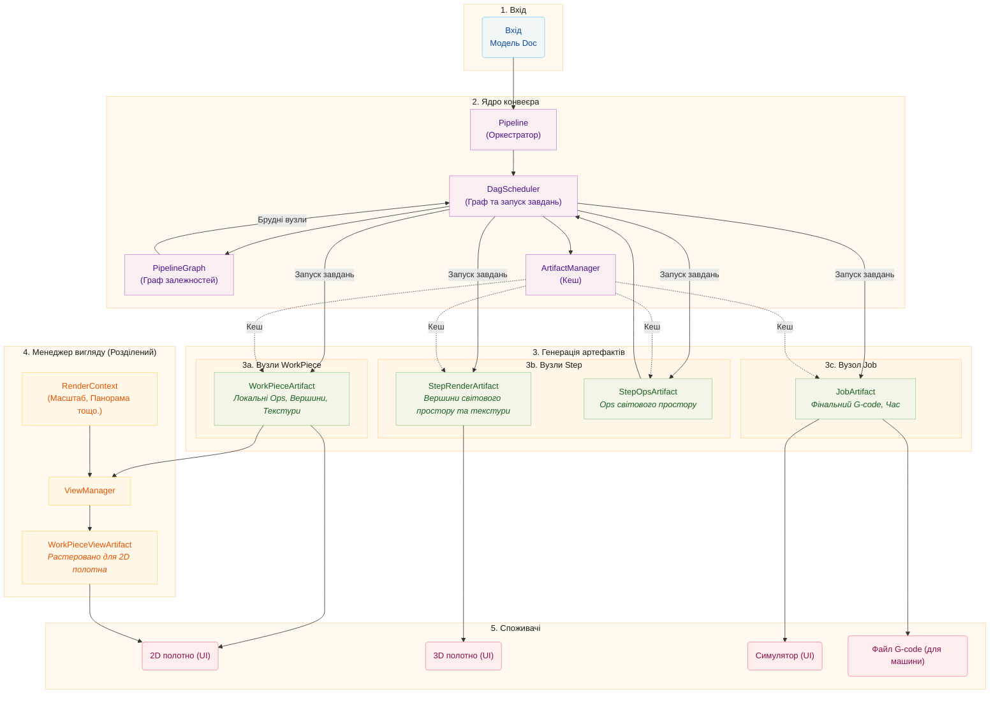

# Архітектура конвеєра

Цей документ описує архітектуру конвеєра, яка використовує орієнтований ациклічний
граф (DAG) для оркестрації генерації артефактів. Конвеєр трансформує сирі
дані дизайну у фінальні виходи для візуалізації та виробництва, з
плануванням залежностей та ефективним кешуванням артефактів.

# Основні концепції

## Вузли артефактів та граф залежностей

Конвеєр використовує **орієнтований ациклічний граф (DAG)** для моделювання артефактів та
їхніх залежностей. Кожен артефакт представлений як `ArtifactNode` у
графі.

### ArtifactNode

Кожен вузол містить:

- **ArtifactKey**: Унікальний ідентифікатор, що складається з ID та типу групи
  (`workpiece`, `step`, `job` або `view`)
- **Стан**: Поточний стан життєвого циклу вузла
- **Залежності**: Список вузлів, від яких залежить цей вузол (нащадки)
- **Залежні**: Список вузлів, що залежать від цього вузла (предки)

### Стани вузлів

Вузли проходять через чотири стани:

| Стан        | Опис                                 |
| ------------ | ------------------------------------------- |
| `DIRTY`      | Артефакт потребує регенерації        |
| `PROCESSING` | Завдання наразі генерує артефакт |
| `VALID`      | Артефакт готовий та актуальний        |
| `ERROR`      | Генерація не вдалася                           |

Коли вузол позначається як брудний, всі його залежні також позначаються брудними,
поширюючи інвалідацію вгору по графу.

### PipelineGraph

`PipelineGraph` будується з моделі Doc і містить:

- Один вузол для кожної пари `(WorkPiece, Step)`
- Один вузол для кожного Step
- Один вузол для Job

Залежності встановлюються:

- Steps залежать від вузлів пар `(WorkPiece, Step)`
- Job залежить від всіх Steps

## DagScheduler

`DagScheduler` - це центральний оркестратор конвеєра. Він володіє
`PipelineGraph` і відповідає за:

1. **Побудову графа** з моделі Doc
2. **Виявлення готових вузлів** (DIRTY з усіма VALID залежностями)
3. **Запуск завдань** для генерації артефактів
4. **Відстеження стану** через процес генерації
5. **Повідомлення споживачів** коли артефакти готові

Планувальник працює з ID генерацій щоб відстежувати, які артефакти належать
до якої версії документа, дозволяючи повторне використання дійсних артефактів між генераціями.

Ключова поведінка:

- Коли граф побудовано, планувальник синхронізує стани вузлів з
  менеджером артефактів щоб виявити кешовані артефакти, які можна повторно використати
- Артефакти з попередньої генерації можуть бути повторно використані, якщо вони залишаються дійсними
- Планувальник відстежує, які ID генерацій мають запущені завдання щоб зберегти
  артефакти під час переходів генерацій
- Інвалідації відстежуються навіть перед перебудовою графа і повторно застосовуються після

## ArtifactManager

`ArtifactManager` - це чистий менеджер кешу для дескрипторів артефактів. Він:

- Зберігає та отримує дескриптори артефактів
- Керує підрахунком посилань для очищення
- Обробляє життєвий цикл (створення, утримання, звільнення)
- НЕ відстежує стан (станом керує планувальник DAG)

## Життєвий цикл спільної пам'яті

Артефакти зберігаються у спільній пам'яті (`multiprocessing.shared_memory`) для
ефективної міжпроцесної комунікації між робочими процесами та основним
процесом. `ArtifactStore` керує життєвим циклом цих блоків пам'яті.

### Патерни володіння

**Локальне володіння:** Створюючий процес володіє дескриптором і звільняє його
коли завершено. Це найпростіший патерн.

**Передача між процесами:** Робочий створює артефакт, надсилає його до
основного процесу через IPC, і передає володіння. Робочий "забуває"
дескриптор (закриває його файловий дескриптор без відключення пам'яті), тоді як
основний процес "усиновлює" його і стає відповідальним за кінцеве звільнення.

### Підрахунок посилань

`ArtifactStore` підтримує підрахунок посилань для кожного блоку спільної пам'яті.
Кілька викликівців можуть `retain()` дескриптор, і блок відключається
лише коли лічильник досягає нуля. Це використовується `ViewManager` для
прогресивного рендерингу, де кілька зворотних викликів можуть отримувати доступ до одного й того ж артефакту.

## Стадії конвеєра

Стадії конвеєра (`WorkPiecePipelineStage`, `StepPipelineStage`,
`JobPipelineStage`) тепер служать інтерфейсами, а не запускавчами завдань:

- Вони обробляють запити інвалідації від UI
- Вони делегують запуск завдань DagScheduler
- Вони надають доступ до кешованих артефактів
- Вони пересилають сигнали від планувальника до UI

## InvalidationScope

Енум `InvalidationScope` визначає область інвалідації для downstream
артефактів:

| Область               | Опис                                                                                                                                                    |
| ------------------- | -------------------------------------------------------------------------------------------------------------------------------------------------------------- |
| `FULL_REPRODUCTION` | Інвалідує деталі, що каскадує до кроків, а потім до завдання. Використовується для змін, що потребують регенерації артефактів (геометрія, параметри, зміни розміру). |
| `STEP_ONLY`         | Інвалідує кроки напряму, що каскадує до завдання. Використовується для змін трансформації лише позиція/обертання, де геометрія деталі залишається незмінною.           |

# Детальний розбір

## Вхід

Процес починається з **Моделі Doc**, яка містить:

- **WorkPieces:** Окремі елементи дизайну (SVG, зображення) розміщені на полотні
- **Steps:** Інструкції обробки (Contour, Raster) з налаштуваннями

## Ядро конвеєра

### Pipeline (Оркестратор)

Клас `Pipeline` - це високорівневий диригент, який:

- Слухає модель Doc на зміни
- Координує з DagScheduler для тригера регенерації
- Керує загальним станом обробки
- З'єднує сигнали між компонентами

### DagScheduler

`DagScheduler`:

- Будує та підтримує `PipelineGraph`
- Виявляє вузли, готові до обробки
- Запускає завдання через TaskManager
- Відстежує переходи станів вузлів
- Емітує сигнали коли артефакти готові

### ArtifactManager

`ArtifactManager`:

- Кешує дескриптори артефактів у спільній пам'яті
- Керує підрахунком посилань для очищення
- Надає пошук за ArtifactKey та ID генерації

## Генерація артефактів

### WorkPieceArtifacts

Генеруються для кожної комбінації `(WorkPiece, Step)`, містять:

- Інструментальні шляхи (`Ops`) у локальній системі координат
- Дані вершин для ліній
- Дані текстур для растрових заливок

Послідовність обробки:

1. **Модифікатори:** (Опціонально) Кондиціонування зображення (градації сірого тощо.)
2. **Продюсер:** Створює сирі інструментальні шляхи (`Ops`)
3. **Трансформери:** Модифікації на рівні деталі (Tabs, Smooth)
4. **Енкодер вершин:** Створює GPU-friendly дані

### StepArtifacts

Генеруються для кожного Step, споживаючи всі пов'язані WorkPieceArtifacts:

**StepRenderArtifact:

- Комбіновані дані вершин та текстур для всіх деталей
- Трансформовані в координати світового простору
- Оптимізовані для рендерингу 3D полотна

**StepOpsArtifact:

- Комбіновані Ops для всіх деталей
- Трансформовані в координати світового простору
- Включають трансформери на рівні кроку (Optimize, Multi-Pass)

### JobArtifact

Генерується за запитом коли потрібен G-code, споживаючи всі StepOpsArtifacts:

- Фінальний G-code для всього завдання
- Повні дані вершин для симуляції
- Високоточна оцінка часу

## ViewManager (Розділений)

`ViewManager` **розв'язаний** з конвеєра даних. Він обробляє рендеринг
для 2D полотна на основі стану UI:

### RenderContext

Містить поточні параметри вигляду:

- Пікселів на міліметр (рівень масштабування)
- Зсув вікна перегляду (панорама)
- Опції відображення (показувати холості переміщення тощо.)

### WorkPieceViewArtifacts

ViewManager створює `WorkPieceViewArtifacts`, які:

- Растеризують WorkPieceArtifacts у простір екрану
- Застосовують поточний RenderContext
- Кешуються та оновлюються коли контекст або джерело змінюється

### Життєвий цикл

1. ViewManager відстежує дескриптори вихідних `WorkPieceArtifact`
2. Коли контекст рендерингу змінюється, ViewManager тригерить повторний рендеринг
3. Коли вихідний артефакт змінюється, ViewManager тригерить повторний рендеринг
4. Дроселювання запобігає надмірним оновленням під час безперервних змін

ViewManager індексує вигляди за `(workpiece_uid, step_uid)` щоб підтримувати
візуалізацію проміжних станів деталі через кілька кроків.

## Споживачі

| Споживач  | Використовує                   | Призначення                             |
| --------- | ---------------------- | ----------------------------------- |
| 2D полотно | WorkPieceViewArtifacts | Рендерить деталі у просторі екрану  |
| 3D полотно | StepRenderArtifacts    | Рендерить повний крок у світовому просторі    |
| Симулятор | JobArtifact            | Точна симуляція машинного шляху |
| Машина   | JobArtifact G-code     | Виробничий вивід                |

# Ключові відмінності від попередньої архітектури

1. **Планування на основі DAG:** Замість послідовних стадій, артефакти
   генеруються коли їхні залежності стають доступними.

2. **Керування станом:** Стан вузла відстежується в графі DAG, не в
   окремих компонентах.

3. **Розділення ViewManager:** Рендеринг для 2D полотна тепер обробляється
   окремим ViewManager, не як частина конвеєра даних.

4. **ID генерацій:** Артефакти відстежуються з ID генерацій, дозволяючи
   ефективне повторне використання між версіями документа.

5. **Централізована оркестрація:** DagScheduler - єдина точка
   контролю для запуску завдань та відстеження стану.

6. **Чистий менеджер кешу:** ArtifactManager тепер простий кеш,
   делегуючи все керування станом планувальнику DAG.

7. **Відстеження інвалідації:** Ключі, позначені брудними перед перебудовою графа,
   зберігаються і повторно застосовуються після перебудови.

8. **Виявлення очікуваної роботи:** Тільки вузли `PROCESSING` рахуються як очікувана робота;
   вузли `DIRTY` можуть мати незадоволені залежності (наприклад, немає контексту вигляду).
